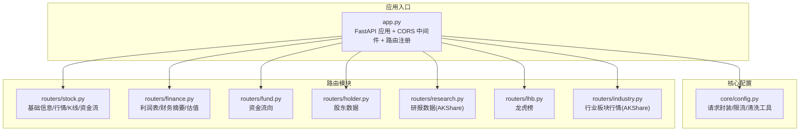
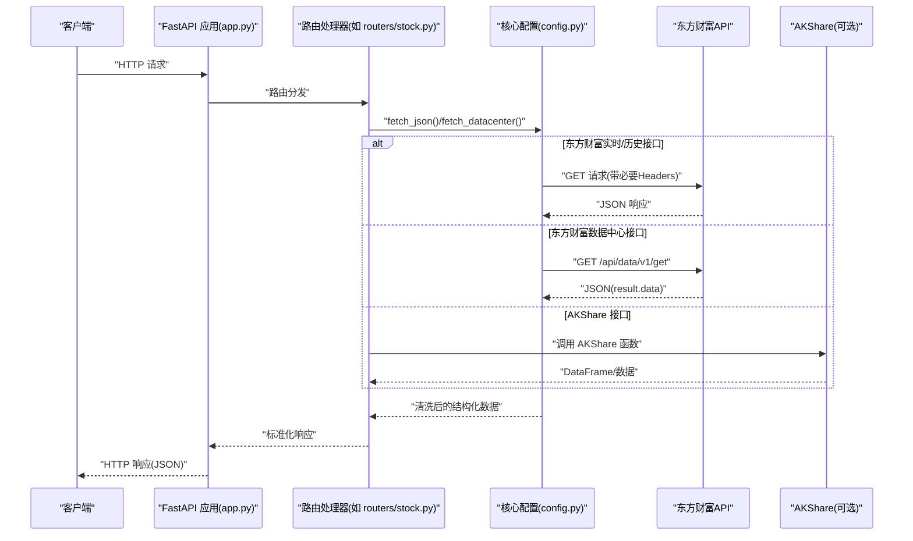
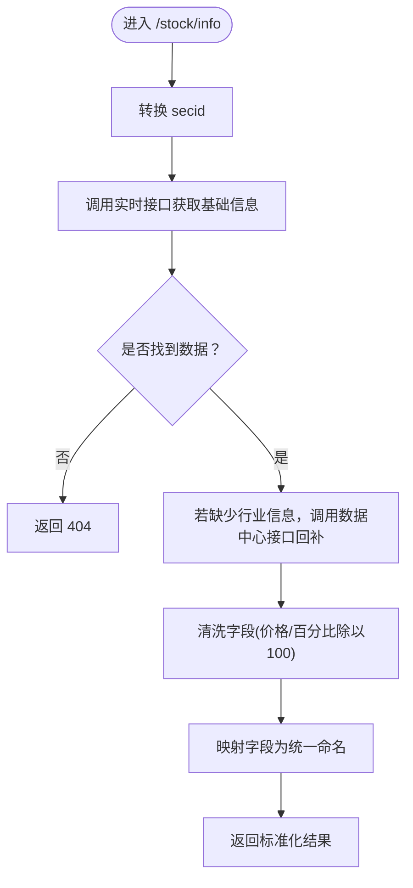
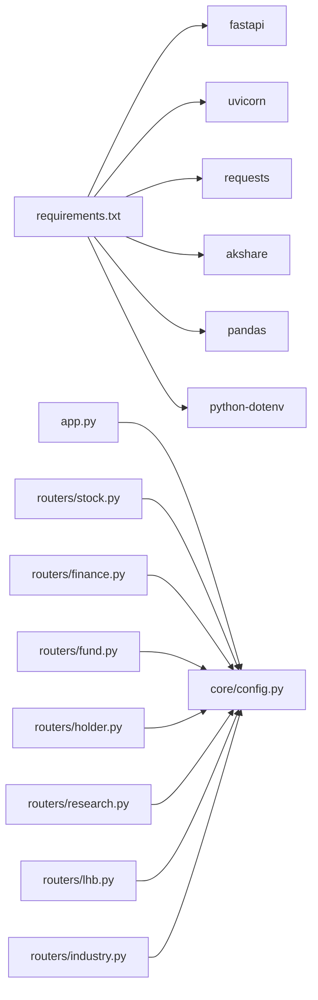

# 数据获取器详解

<cite>
**本文引用的文件**
- [app.py](file://data-fetcher/app.py)
- [config.py](file://data-fetcher/core/config.py)
- [stock.py](file://data-fetcher/routers/stock.py)
- [finance.py](file://data-fetcher/routers/finance.py)
- [fund.py](file://data-fetcher/routers/fund.py)
- [holder.py](file://data-fetcher/routers/holder.py)
- [research.py](file://data-fetcher/routers/research.py)
- [lhb.py](file://data-fetcher/routers/lhb.py)
- [industry.py](file://data-fetcher/routers/industry.py)
- [requirements.txt](file://data-fetcher/requirements.txt)
- [test_stock_router.py](file://data-fetcher/tests/test_stock_router.py)
- [test_routers.py](file://data-fetcher/tests/test_routers.py)
- [test_config.py](file://data-fetcher/tests/test_config.py)
- [data-fetcher.md](file://system-planner/data-fetcher.md)
- [api-design.md](file://system-planner/api-design.md)
</cite>

## 目录
1. [简介](#简介)
2. [项目结构](#项目结构)
3. [核心组件](#核心组件)
4. [架构总览](#架构总览)
5. [详细组件分析](#详细组件分析)
6. [依赖分析](#依赖分析)
7. [性能考虑](#性能考虑)
8. [故障排查指南](#故障排查指南)
9. [结论](#结论)
10. [附录](#附录)

## 简介
本文件面向Python数据获取器（FastAPI服务）的完整技术文档，聚焦于：
- FastAPI服务的架构设计与路由组织模式
- 中间件配置策略（CORS）
- 与东方财富API及AKShare的数据交互流程
- 数据转换与清洗策略
- 配置管理、连接池与超时处理
- 完整数据获取流程（请求接收→API调用→数据返回）
- 错误处理机制、重试策略与性能优化方案

## 项目结构
数据获取器采用“应用入口 + 核心配置 + 路由模块”的分层组织方式，路由按业务域划分，核心配置提供HTTP请求封装、限流与数据清洗工具。

图表来源
- [app.py:1-31](file://data-fetcher/app.py#L1-L31)
- [config.py:1-121](file://data-fetcher/core/config.py#L1-L121)
- [stock.py:1-246](file://data-fetcher/routers/stock.py#L1-L246)
- [finance.py:1-148](file://data-fetcher/routers/finance.py#L1-L148)
- [fund.py:1-49](file://data-fetcher/routers/fund.py#L1-L49)
- [holder.py:1-41](file://data-fetcher/routers/holder.py#L1-L41)
- [research.py:1-63](file://data-fetcher/routers/research.py#L1-L63)
- [lhb.py:1-57](file://data-fetcher/routers/lhb.py#L1-L57)
- [industry.py:1-59](file://data-fetcher/routers/industry.py#L1-L59)

章节来源
- [app.py:1-31](file://data-fetcher/app.py#L1-L31)
- [requirements.txt:1-7](file://data-fetcher/requirements.txt#L1-L7)

## 核心组件
- 应用入口与中间件
  - 使用FastAPI创建应用实例，启用CORS跨域中间件，允许任意来源/方法/头。
  - 注册多个业务路由标签，便于统一管理与文档生成。
- 核心配置模块
  - 统一HTTP请求头（必需Referer），避免被东方财富断连。
  - 请求限流：全局锁+时间戳控制，确保请求间隔≥500ms。
  - 数据清洗工具：安全除以100、浮点/整型转换与空值处理。
  - 通用JSON获取函数：带指数退避重试（RemoteDisconnected）与固定次数重试（超时）。
  - 东方财富数据中心API封装：统一参数构建与结果提取。
- 路由模块
  - 按领域拆分：股票、财务、资金流、股东、研报、龙虎榜、行业板块。
  - 统一异常处理：对外抛出HTTP 404/503，保证服务稳定性。

章节来源
- [app.py:1-31](file://data-fetcher/app.py#L1-L31)
- [config.py:1-121](file://data-fetcher/core/config.py#L1-L121)
- [stock.py:1-246](file://data-fetcher/routers/stock.py#L1-L246)
- [finance.py:1-148](file://data-fetcher/routers/finance.py#L1-L148)
- [fund.py:1-49](file://data-fetcher/routers/fund.py#L1-L49)
- [holder.py:1-41](file://data-fetcher/routers/holder.py#L1-L41)
- [research.py:1-63](file://data-fetcher/routers/research.py#L1-L63)
- [lhb.py:1-57](file://data-fetcher/routers/lhb.py#L1-L57)
- [industry.py:1-59](file://data-fetcher/routers/industry.py#L1-L59)

## 架构总览
下图展示了从客户端请求到外部数据源的完整调用链路与数据转换过程。

图表来源
- [app.py:1-31](file://data-fetcher/app.py#L1-L31)
- [config.py:80-121](file://data-fetcher/core/config.py#L80-L121)
- [stock.py:14-246](file://data-fetcher/routers/stock.py#L14-L246)
- [finance.py:14-148](file://data-fetcher/routers/finance.py#L14-L148)
- [fund.py:9-49](file://data-fetcher/routers/fund.py#L9-L49)
- [holder.py:9-41](file://data-fetcher/routers/holder.py#L9-L41)
- [research.py:9-63](file://data-fetcher/routers/research.py#L9-L63)
- [lhb.py:9-57](file://data-fetcher/routers/lhb.py#L9-L57)
- [industry.py:9-59](file://data-fetcher/routers/industry.py#L9-L59)

## 详细组件分析

### 应用入口与中间件
- CORS中间件：允许任意来源、方法与头，便于前后端分离与跨域调试。
- 路由注册：按业务域注册，统一打上标签，利于API文档与治理。
- 健康检查：提供/health端点，返回服务状态。

章节来源
- [app.py:1-31](file://data-fetcher/app.py#L1-L31)

### 核心配置模块
- 请求头与限流
  - 必需Referer头，否则被东方财富断连。
  - 全局锁+上次请求时间戳，确保请求间隔≥500ms。
- 数据清洗工具
  - 安全除以100：处理价格/百分比字段（如f43、f162等）。
  - 安全浮点/整型转换：空值、异常值返回None，保留精度。
- 通用请求与重试
  - fetch_json：统一超时、状态码检查；对RemoteDisconnected进行指数退避重试，对Timeout进行固定等待重试。
  - fetch_datacenter：构建数据中心API参数，提取result.data。
- secid转换：根据股票代码首字符自动拼接为1.x或0.x格式。

章节来源
- [config.py:8-121](file://data-fetcher/core/config.py#L8-L121)

### 股票路由（stock）
- 接口职责
  - /stock/info：个股基本信息，必要时回补行业信息。
  - /stock/quote：实时行情。
  - /stock/kline：历史K线，支持日/周/月周期与复权参数。
  - /stock/intraday：分时K线。
  - /stock/quotes/batch：批量行情，限制最多20只。
- 数据转换
  - 将东方财富字段映射为统一命名，价格/百分比字段统一除以100。
  - K线/分时数据按固定字段集解析并清洗。
- 异常处理
  - 外部接口异常统一返回HTTP 503；未找到返回404。

图表来源
- [stock.py:14-72](file://data-fetcher/routers/stock.py#L14-L72)
- [config.py:31-78](file://data-fetcher/core/config.py#L31-L78)

章节来源
- [stock.py:14-246](file://data-fetcher/routers/stock.py#L14-L246)

### 财务路由（finance）
- 接口职责
  - /stock/income：利润表（RPT_DMSK_FN_INCOME）。
  - /stock/financial：财务摘要（AKShare 新浪源），横向表转纵向。
  - /stock/valuation：估值（RPT_VALUEANALYSIS_DET）。
- 数据转换
  - 日期规范化（YYYY-MM-DD）。
  - 财务摘要字段映射，保留中文指标名与英文字段名对应关系。
  - 估值字段清洗与标准化。
- 异常处理
  - 外部接口异常统一返回HTTP 503。

章节来源
- [finance.py:14-148](file://data-fetcher/routers/finance.py#L14-L148)

### 资金流路由（fund）
- 接口职责
  - /stock/fund-flow：资金流向（日K线维度），支持limit。
- 数据转换
  - 解析字段序列，清洗主力/大单/中单/小单净流入与占比。
- 异常处理
  - 外部接口异常统一返回HTTP 503。

章节来源
- [fund.py:9-49](file://data-fetcher/routers/fund.py#L9-L49)

### 股东路由（holder）
- 接口职责
  - /stock/holders：股东人数与持股变动（RPT_F10_EH_HOLDERNUM）。
- 数据转换
  - 日期规范化；比例字段可能需除以100，留待后续验证。
- 异常处理
  - 外部接口异常统一返回HTTP 503。

章节来源
- [holder.py:9-41](file://data-fetcher/routers/holder.py#L9-L41)

### 研报路由（research）
- 接口职责
  - /stock/research：研报列表（AKShare 东方财富源）。
- 数据转换
  - 提取标题、评级、机构、日期、行业、PDF链接；尝试解析EPS/PE预测字段。
- 异常处理
  - 外部接口异常统一返回HTTP 503。

章节来源
- [research.py:9-63](file://data-fetcher/routers/research.py#L9-L63)

### 龙虎榜路由（lhb）
- 接口职责
  - /stock/lhb：指定日期范围与可选股票的龙虎榜明细。
- 数据转换
  - 日期规范化；字段映射为统一命名。
- 异常处理
  - 外部接口异常统一返回HTTP 503。

章节来源
- [lhb.py:9-57](file://data-fetcher/routers/lhb.py#L9-L57)

### 行业板块路由（industry）
- 接口职责
  - /industry/board-info：行业板块行情（AKShare 东方财富源）。
- 数据转换
  - 解析最新价、涨跌幅、主力净流入、换手率等字段。
- 异常处理
  - 外部接口异常统一返回HTTP 503。

章节来源
- [industry.py:9-59](file://data-fetcher/routers/industry.py#L9-L59)

## 依赖分析
- 运行时依赖
  - fastapi、uvicorn：Web框架与ASGI服务器。
  - requests：HTTP客户端。
  - akshare、pandas：数据获取与表格处理。
  - python-dotenv：环境变量加载（如需）。
- 内部依赖关系
  - 各路由模块依赖core/config.py提供的请求封装与清洗工具。
  - 部分路由依赖AKShare（财务摘要、研报、行业板块）。

图表来源
- [requirements.txt:1-7](file://data-fetcher/requirements.txt#L1-L7)
- [app.py:1-31](file://data-fetcher/app.py#L1-L31)
- [config.py:1-121](file://data-fetcher/core/config.py#L1-L121)
- [stock.py:1-246](file://data-fetcher/routers/stock.py#L1-L246)
- [finance.py:1-148](file://data-fetcher/routers/finance.py#L1-L148)
- [fund.py:1-49](file://data-fetcher/routers/fund.py#L1-L49)
- [holder.py:1-41](file://data-fetcher/routers/holder.py#L1-L41)
- [research.py:1-63](file://data-fetcher/routers/research.py#L1-L63)
- [lhb.py:1-57](file://data-fetcher/routers/lhb.py#L1-L57)
- [industry.py:1-59](file://data-fetcher/routers/industry.py#L1-L59)

章节来源
- [requirements.txt:1-7](file://data-fetcher/requirements.txt#L1-L7)

## 性能考虑
- 限流与并发
  - 请求间最小间隔500ms，同一时刻仅1个请求排队，避免被东方财富限流或封禁。
- 超时与重试
  - fetch_json统一超时15秒；对RemoteDisconnected进行指数退避重试（最多2次），对Timeout等待2秒后重试。
- 批量请求
  - 批量行情限制最多20只，避免一次性触发过多限流。
- 数据转换成本
  - 字符串分割与字段映射为O(n)遍历，建议在路由层按需解析，减少不必要的计算。
- 缓存策略（参考系统规划）
  - 实时行情10秒、K线5分钟、分时行情不缓存、资金流向10分钟等，可在上游服务引入缓存以降低请求压力。

章节来源
- [config.py:80-100](file://data-fetcher/core/config.py#L80-L100)
- [stock.py:217-218](file://data-fetcher/routers/stock.py#L217-L218)
- [data-fetcher.md:24-321](file://system-planner/data-fetcher.md#L24-L321)

## 故障排查指南
- 常见问题定位
  - 404：外部接口未返回数据或股票代码无效。
  - 503：外部接口超时/断开/不可用。
  - CORS问题：浏览器跨域失败，确认CORS中间件已启用。
- 关键检查点
  - 请求头Referer缺失会导致断连，确保使用统一HEADERS。
  - 限流不足：批量请求过快会触发限流，需遵守500ms间隔。
  - 字段精度：价格/百分比字段需除以100，避免显示异常。
- 测试覆盖
  - 单元测试覆盖成功路径、空数据、服务错误与批量跳过失败场景。
  - 配置工具测试覆盖to_secid、safe_div100、safe_float、safe_int等边界情况。

章节来源
- [test_stock_router.py:35-185](file://data-fetcher/tests/test_stock_router.py#L35-L185)
- [test_routers.py:11-183](file://data-fetcher/tests/test_routers.py#L11-L183)
- [test_config.py:7-86](file://data-fetcher/tests/test_config.py#L7-L86)
- [config.py:8-121](file://data-fetcher/core/config.py#L8-L121)

## 结论
本数据获取器以FastAPI为核心，通过统一的请求封装、严格的限流与数据清洗策略，实现了对东方财富与AKShare数据的稳定接入。路由按领域清晰拆分，异常处理与重试机制保障了服务可用性。结合系统规划中的缓存策略与上游服务集成，可进一步提升整体性能与可靠性。

## 附录
- 接口清单与行为参考（来自系统规划）
  - 个股基本信息、实时行情、K线、分时、批量行情、资金流向、利润表、财务摘要、股东数据、研报、估值、龙虎榜、行业板块行情等。
- 启动与运行
  - 在data-fetcher目录安装依赖后启动，服务监听5001端口。

章节来源
- [data-fetcher.md:31-289](file://system-planner/data-fetcher.md#L31-L289)
- [api-design.md:1-688](file://system-planner/api-design.md#L1-L688)