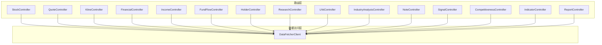
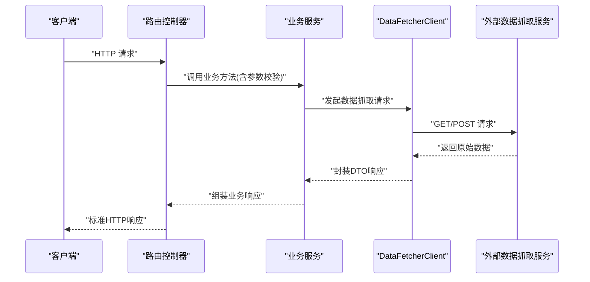
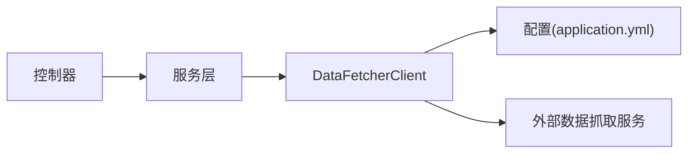

# 路由系统设计

<cite>
**本文引用的文件**
- [StockController.java](file://backend/src/main/java/com/stock/controller/StockController.java)
- [QuoteController.java](file://backend/src/main/java/com/stock/controller/QuoteController.java)
- [KlineController.java](file://backend/src/main/java/com/stock/controller/KlineController.java)
- [FinancialController.java](file://backend/src/main/java/com/stock/controller/FinancialController.java)
- [IncomeController.java](file://backend/src/main/java/com/stock/controller/IncomeController.java)
- [FundFlowController.java](file://backend/src/main/java/com/stock/controller/FundFlowController.java)
- [HolderController.java](file://backend/src/main/java/com/stock/controller/HolderController.java)
- [ResearchController.java](file://backend/src/main/java/com/stock/controller/ResearchController.java)
- [LhbController.java](file://backend/src/main/java/com/stock/controller/LhbController.java)
- [IndustryAnalysisController.java](file://backend/src/main/java/com/stock/controller/IndustryAnalysisController.java)
- [NoteController.java](file://backend/src/main/java/com/stock/controller/NoteController.java)
- [SignalController.java](file://backend/src/main/java/com/stock/controller/SignalController.java)
- [CompetitivenessController.java](file://backend/src/main/java/com/stock/controller/CompetitivenessController.java)
- [IndicatorController.java](file://backend/src/main/java/com/stock/controller/IndicatorController.java)
- [ReportController.java](file://backend/src/main/java/com/stock/controller/ReportController.java)
- [DataFetcherClient.java](file://backend/src/main/java/com/stock/client/DataFetcherClient.java)
- [application.yml](file://backend/src/main/resources/application.yml)
</cite>

## 目录
1. [引言](#引言)
2. [项目结构](#项目结构)
3. [核心组件](#核心组件)
4. [架构总览](#架构总览)
5. [详细组件分析](#详细组件分析)
6. [依赖分析](#依赖分析)
7. [性能考虑](#性能考虑)
8. [故障排查指南](#故障排查指南)
9. [结论](#结论)
10. [附录](#附录)

## 引言
本文件系统性梳理后端路由层的设计与实现，覆盖股票行情、财务、资金流、股东结构、研究报告、龙虎榜、行业分析等模块的端点定义、参数处理、数据验证与响应标准化，并给出扩展与新增功能的流程建议。所有接口均采用REST风格，路径统一前缀为/api/v1，部分模块支持批量查询或报表导出。

## 项目结构
后端采用Spring Boot工程，路由控制器位于controller包下，每个业务域一个控制器类；数据获取通过DataFetcherClient封装调用独立的数据抓取服务；配置位于application.yml中，包含数据抓取服务地址等关键参数。

**图表来源**
- [StockController.java:17-56](file://backend/src/main/java/com/stock/controller/StockController.java#L17-L56)
- [QuoteController.java:8-27](file://backend/src/main/java/com/stock/controller/QuoteController.java#L8-L27)
- [KlineController.java:10-35](file://backend/src/main/java/com/stock/controller/KlineController.java#L10-L35)
- [FinancialController.java:7-22](file://backend/src/main/java/com/stock/controller/FinancialController.java#L7-L22)
- [IncomeController.java:7-22](file://backend/src/main/java/com/stock/controller/IncomeController.java#L7-L22)
- [FundFlowController.java:10-26](file://backend/src/main/java/com/stock/controller/FundFlowController.java#L10-L26)
- [HolderController.java:7-22](file://backend/src/main/java/com/stock/controller/HolderController.java#L7-L22)
- [ResearchController.java:8-28](file://backend/src/main/java/com/stock/controller/ResearchController.java#L8-L28)
- [LhbController.java:7-23](file://backend/src/main/java/com/stock/controller/LhbController.java#L7-L23)
- [IndustryAnalysisController.java:9-29](file://backend/src/main/java/com/stock/controller/IndustryAnalysisController.java#L9-L29)
- [NoteController.java:14-50](file://backend/src/main/java/com/stock/controller/NoteController.java#L14-L50)
- [SignalController.java:9-29](file://backend/src/main/java/com/stock/controller/SignalController.java#L9-L29)
- [CompetitivenessController.java:9-29](file://backend/src/main/java/com/stock/controller/CompetitivenessController.java#L9-L29)
- [IndicatorController.java:15-47](file://backend/src/main/java/com/stock/controller/IndicatorController.java#L15-L47)
- [ReportController.java:9-26](file://backend/src/main/java/com/stock/controller/ReportController.java#L9-L26)
- [DataFetcherClient.java:14-125](file://backend/src/main/java/com/stock/client/DataFetcherClient.java#L14-L125)

**章节来源**
- [StockController.java:17-56](file://backend/src/main/java/com/stock/controller/StockController.java#L17-L56)
- [application.yml](file://backend/src/main/resources/application.yml)

## 核心组件
- 股票基础信息与初始化状态：提供新增、删除、列表、详情及初始化状态查询。
- 行情与K线：支持按周期、日期范围、复权因子获取日K与分时数据。
- 财务与利润：按限制条数获取财务与利润数据。
- 资金流向：按起止日期查询个股资金流。
- 股东结构：按限制条数查询股东数据。
- 研究报告：支持分页查询研报与评级汇总。
- 龙虎榜：按日期范围与可选代码查询。
- 行业分析：支持读取与保存行业分析内容。
- 笔记与信号：提供笔记的增删改查与信号列表与标记已读。
- 技术指标：按开始日期查询多周期技术指标序列。
- 报表导出：导出HTML格式的个股报告。

**章节来源**
- [StockController.java:29-55](file://backend/src/main/java/com/stock/controller/StockController.java#L29-L55)
- [QuoteController.java:18-26](file://backend/src/main/java/com/stock/controller/QuoteController.java#L18-L26)
- [KlineController.java:20-34](file://backend/src/main/java/com/stock/controller/KlineController.java#L20-L34)
- [FinancialController.java:17-21](file://backend/src/main/java/com/stock/controller/FinancialController.java#L17-L21)
- [IncomeController.java:17-21](file://backend/src/main/java/com/stock/controller/IncomeController.java#L17-L21)
- [FundFlowController.java:20-25](file://backend/src/main/java/com/stock/controller/FundFlowController.java#L20-L25)
- [HolderController.java:17-21](file://backend/src/main/java/com/stock/controller/HolderController.java#L17-L21)
- [ResearchController.java:18-27](file://backend/src/main/java/com/stock/controller/ResearchController.java#L18-L27)
- [LhbController.java:17-22](file://backend/src/main/java/com/stock/controller/LhbController.java#L17-L22)
- [IndustryAnalysisController.java:19-28](file://backend/src/main/java/com/stock/controller/IndustryAnalysisController.java#L19-L28)
- [NoteController.java:24-49](file://backend/src/main/java/com/stock/controller/NoteController.java#L24-L49)
- [SignalController.java:19-28](file://backend/src/main/java/com/stock/controller/SignalController.java#L19-L28)
- [IndicatorController.java:27-46](file://backend/src/main/java/com/stock/controller/IndicatorController.java#L27-L46)
- [ReportController.java:19-25](file://backend/src/main/java/com/stock/controller/ReportController.java#L19-L25)

## 架构总览
路由层通过注解驱动的REST控制器暴露端点，控制器依赖对应的服务层完成业务逻辑，最终通过DataFetcherClient调用外部数据抓取服务获取原始数据。控制器负责参数解析、数据验证、异常处理与响应标准化。

**图表来源**
- [DataFetcherClient.java:26-99](file://backend/src/main/java/com/stock/client/DataFetcherClient.java#L26-L99)
- [StockController.java:29-55](file://backend/src/main/java/com/stock/controller/StockController.java#L29-L55)
- [QuoteController.java:18-26](file://backend/src/main/java/com/stock/controller/QuoteController.java#L18-L26)

## 详细组件分析

### 股票数据路由（StockController）
- 功能：管理股票实体，提供新增、删除、列表、详情与初始化状态查询。
- 关键端点
  - POST /api/v1/stocks：新增股票，返回创建资源。
  - DELETE /api/v1/stocks/{id}：删除股票。
  - GET /api/v1/stocks：列出股票列表项。
  - GET /api/v1/stocks/{id}：获取单只股票详情。
  - GET /api/v1/stocks/{id}/init-status：查询初始化状态。
- 参数与验证
  - 新增使用请求体对象进行参数校验。
  - 路径参数使用Long类型。
- 响应标准化
  - 成功新增返回201与实体响应。
  - 删除返回204。
  - 列表与详情返回对应DTO集合或对象。

**章节来源**
- [StockController.java:29-55](file://backend/src/main/java/com/stock/controller/StockController.java#L29-L55)

### 行情数据路由（QuoteController）
- 功能：获取单只股票实时行情与批量刷新。
- 关键端点
  - GET /api/v1/quotes/{stockId}：获取指定股票行情。
  - POST /api/v1/quotes/refresh：刷新全部行情。
- 参数与验证
  - 路径参数stockId为Long。
  - 刷新端点无参数。
- 响应标准化
  - 返回标准化行情响应对象。

**章节来源**
- [QuoteController.java:18-26](file://backend/src/main/java/com/stock/controller/QuoteController.java#L18-L26)

### K线数据路由（KlineController）
- 功能：获取日K与分时数据，支持周期、日期范围与复权因子。
- 关键端点
  - GET /api/v1/stocks/{stockId}/kline：日K数据。
  - GET /api/v1/stocks/{stockId}/kline/intraday：分时数据。
- 查询参数
  - 日K：period（默认daily）、startDate、endDate、adjust（默认qfq）。
  - 分时：period（默认1）、date（可选）。
- 数据验证
  - 日期参数使用ISO日期格式自动绑定。
- 响应标准化
  - 返回K线响应对象。

**章节来源**
- [KlineController.java:20-34](file://backend/src/main/java/com/stock/controller/KlineController.java#L20-L34)

### 财务数据路由（FinancialController）
- 功能：获取财务数据，支持限制返回条数。
- 关键端点
  - GET /api/v1/stocks/{stockId}/financial：财务数据。
- 查询参数
  - limit（默认8）。
- 响应标准化
  - 返回财务响应对象。

**章节来源**
- [FinancialController.java:17-21](file://backend/src/main/java/com/stock/controller/FinancialController.java#L17-L21)

### 利润数据路由（IncomeController）
- 功能：获取利润数据，支持限制返回条数。
- 关键端点
  - GET /api/v1/stocks/{stockId}/income：利润数据。
- 查询参数
  - limit（默认8）。
- 响应标准化
  - 返回利润响应对象。

**章节来源**
- [IncomeController.java:17-21](file://backend/src/main/java/com/stock/controller/IncomeController.java#L17-L21)

### 资金流向路由（FundFlowController）
- 功能：按日期范围查询个股资金流。
- 关键端点
  - GET /api/v1/stocks/{stockId}/fund-flow：资金流。
- 查询参数
  - startDate、endDate（ISO日期，可选）。
- 数据验证
  - 使用日期格式化注解自动转换。
- 响应标准化
  - 返回资金流响应对象。

**章节来源**
- [FundFlowController.java:20-25](file://backend/src/main/java/com/stock/controller/FundFlowController.java#L20-L25)

### 股东结构路由（HolderController）
- 功能：按限制条数查询股东数据。
- 关键端点
  - GET /api/v1/stocks/{stockId}/holders：股东数据。
- 查询参数
  - limit（默认8）。
- 响应标准化
  - 返回股东响应对象。

**章节来源**
- [HolderController.java:17-21](file://backend/src/main/java/com/stock/controller/HolderController.java#L17-L21)

### 研究报告路由（ResearchController）
- 功能：查询研究报告与评级汇总。
- 关键端点
  - GET /api/v1/stocks/{stockId}/research：研报列表。
  - GET /api/v1/stocks/{stockId}/research/rating-summary：评级汇总。
- 查询参数
  - limit（默认10）。
- 响应标准化
  - 返回研报响应对象与评级汇总对象。

**章节来源**
- [ResearchController.java:18-27](file://backend/src/main/java/com/stock/controller/ResearchController.java#L18-L27)

### 龙虎榜数据路由（LhbController）
- 功能：按日期范围与可选代码查询龙虎榜。
- 关键端点
  - GET /api/v1/lhb：龙虎榜数据。
- 查询参数
  - startDate、endDate（必填）、code（可选）。
- 响应标准化
  - 返回龙虎榜响应对象。

**章节来源**
- [LhbController.java:17-22](file://backend/src/main/java/com/stock/controller/LhbController.java#L17-L22)

### 行业分析路由（IndustryAnalysisController）
- 功能：读取与保存行业分析内容。
- 关键端点
  - GET /api/v1/stocks/{stockId}/industry-analysis：读取。
  - PUT /api/v1/stocks/{stockId}/industry-analysis：保存。
- 请求体
  - 保存使用请求对象进行参数校验。
- 响应标准化
  - 返回行业分析响应对象。

**章节来源**
- [IndustryAnalysisController.java:19-28](file://backend/src/main/java/com/stock/controller/IndustryAnalysisController.java#L19-L28)

### 笔记与信号路由（NoteController、SignalController）
- 笔记
  - GET /api/v1/stocks/{stockId}/notes：列表，支持分类过滤。
  - POST /api/v1/stocks/{stockId}/notes：创建。
  - PUT /api/v1/stocks/{stockId}/notes/{id}：更新。
  - DELETE /api/v1/stocks/{stockId}/notes/{id}：删除。
- 信号
  - GET /api/v1/signals：列表，支持按股票与类型过滤。
  - PUT /api/v1/signals/{id}/read：标记已读。
- 参数与验证
  - 路径参数与请求体均进行校验。
- 响应标准化
  - 创建返回201与新建对象；其余返回相应对象或204。

**章节来源**
- [NoteController.java:24-49](file://backend/src/main/java/com/stock/controller/NoteController.java#L24-L49)
- [SignalController.java:19-28](file://backend/src/main/java/com/stock/controller/SignalController.java#L19-L28)

### 技术指标路由（IndicatorController）
- 功能：按开始日期查询技术指标序列。
- 关键端点
  - GET /api/v1/stocks/{stockId}/indicators：技术指标。
- 查询参数
  - startDate（ISO日期，可选，默认近6个月）。
- 数据验证
  - 若股票不存在抛出业务异常。
- 响应标准化
  - 返回指标响应对象（包含指标序列）。

**章节来源**
- [IndicatorController.java:27-46](file://backend/src/main/java/com/stock/controller/IndicatorController.java#L27-L46)

### 报表导出路由（ReportController）
- 功能：导出HTML格式的个股报告。
- 关键端点
  - GET /api/v1/stocks/{stockId}/report：导出报告。
- 响应标准化
  - 返回HTML内容并设置下载头。

**章节来源**
- [ReportController.java:19-25](file://backend/src/main/java/com/stock/controller/ReportController.java#L19-L25)

## 依赖分析
- 控制器到服务层：各控制器通过构造注入依赖对应服务，职责清晰。
- 服务层到外部数据源：通过DataFetcherClient统一调用数据抓取服务，便于替换与测试。
- 外部数据源：通过配置文件中的URL进行集中管理。

**图表来源**
- [DataFetcherClient.java:19-20](file://backend/src/main/java/com/stock/client/DataFetcherClient.java#L19-L20)
- [application.yml](file://backend/src/main/resources/application.yml)

**章节来源**
- [DataFetcherClient.java:19-20](file://backend/src/main/java/com/stock/client/DataFetcherClient.java#L19-L20)
- [application.yml](file://backend/src/main/resources/application.yml)

## 性能考虑
- 批量查询优化：行情批量接口减少网络往返。
- 限制返回条数：财务、利润、股东、研报等接口默认限制数量，避免大结果集。
- 日期范围控制：资金流与K线支持日期范围，建议前端传入合理区间。
- 缓存策略：可在服务层引入缓存以降低重复查询成本（建议）。
- 并发与限流：对外部数据抓取服务增加超时与重试策略（建议）。

## 故障排查指南
- 参数错误
  - 检查日期参数格式是否符合ISO。
  - 确认必填参数是否缺失。
- 股票不存在
  - 技术指标路由在股票不存在时会抛出异常，需先确认股票ID。
- 外部服务异常
  - DataFetcherClient对抓取异常进行包装，检查服务可用性与网络连通性。
- 响应为空
  - 某些接口可能返回空结果，需在前端做空态处理。

**章节来源**
- [IndicatorController.java:30-32](file://backend/src/main/java/com/stock/controller/IndicatorController.java#L30-L32)
- [DataFetcherClient.java:112-124](file://backend/src/main/java/com/stock/client/DataFetcherClient.java#L112-L124)

## 结论
该路由系统以清晰的REST设计与模块化控制器实现，覆盖了股票交易系统的核心数据域。通过统一的参数校验、响应标准化与外部数据抓取客户端，保证了接口的一致性与可维护性。建议后续在服务层引入缓存与限流机制，进一步提升性能与稳定性。

## 附录

### 路由参数处理与数据验证清单
- 路径参数：Long类型，如stockId、id。
- 查询参数：支持默认值与日期格式化，如limit、period、startDate、endDate、adjust、date。
- 请求体：使用校验注解确保字段完整性，如新增股票、保存行业分析、笔记创建与更新。

**章节来源**
- [KlineController.java:21-26](file://backend/src/main/java/com/stock/controller/KlineController.java#L21-L26)
- [FinancialController.java:18-20](file://backend/src/main/java/com/stock/controller/FinancialController.java#L18-L20)
- [IndustryAnalysisController.java:25-27](file://backend/src/main/java/com/stock/controller/IndustryAnalysisController.java#L25-L27)
- [NoteController.java:31-41](file://backend/src/main/java/com/stock/controller/NoteController.java#L31-L41)

### 响应格式标准化
- 统一使用DTO封装响应，避免直接暴露实体。
- 成功新增返回201，删除成功返回204，其余返回200与数据对象。
- 导出接口设置合适的Content-Type与下载头。

**章节来源**
- [StockController.java:33-39](file://backend/src/main/java/com/stock/controller/StockController.java#L33-L39)
- [ReportController.java:22-24](file://backend/src/main/java/com/stock/controller/ReportController.java#L22-L24)

### 路由扩展指南与新功能添加流程
- 新增控制器
  - 在controller包下创建新控制器类，标注@RestController与@RequestMapping。
  - 定义端点方法，使用@RequestParam/@RequestBody/@PathVariable进行参数绑定。
  - 在方法内调用服务层方法，返回标准化DTO。
- 新增服务
  - 在service包下创建服务类，注入所需仓库或客户端。
  - 实现业务逻辑，必要时调用DataFetcherClient获取外部数据。
- 新增DTO
  - 在dto.response包下定义响应DTO，在dto.fetcher包下定义抓取响应DTO。
- 更新配置
  - 如需新增外部服务地址，修改application.yml并注入到客户端。
- 测试与验证
  - 编写单元测试与集成测试，覆盖正常与异常场景。
- 文档与发布
  - 更新API文档，进行灰度发布与监控。

**章节来源**
- [DataFetcherClient.java:14-24](file://backend/src/main/java/com/stock/client/DataFetcherClient.java#L14-L24)
- [application.yml](file://backend/src/main/resources/application.yml)