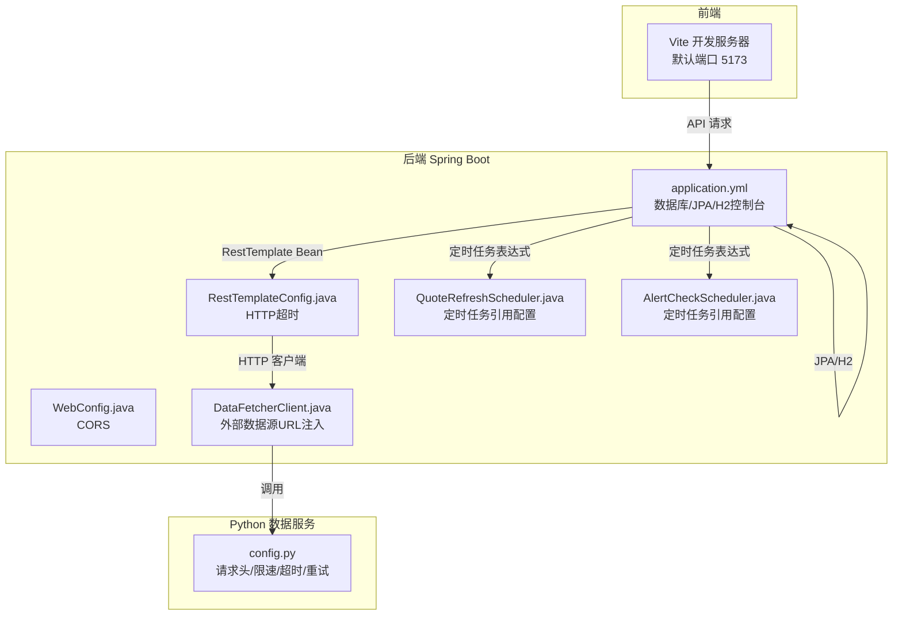
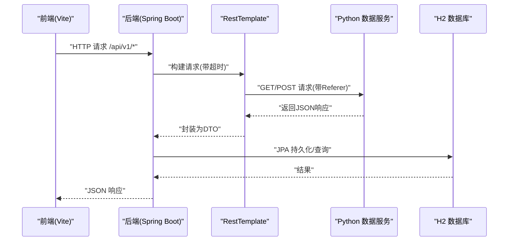
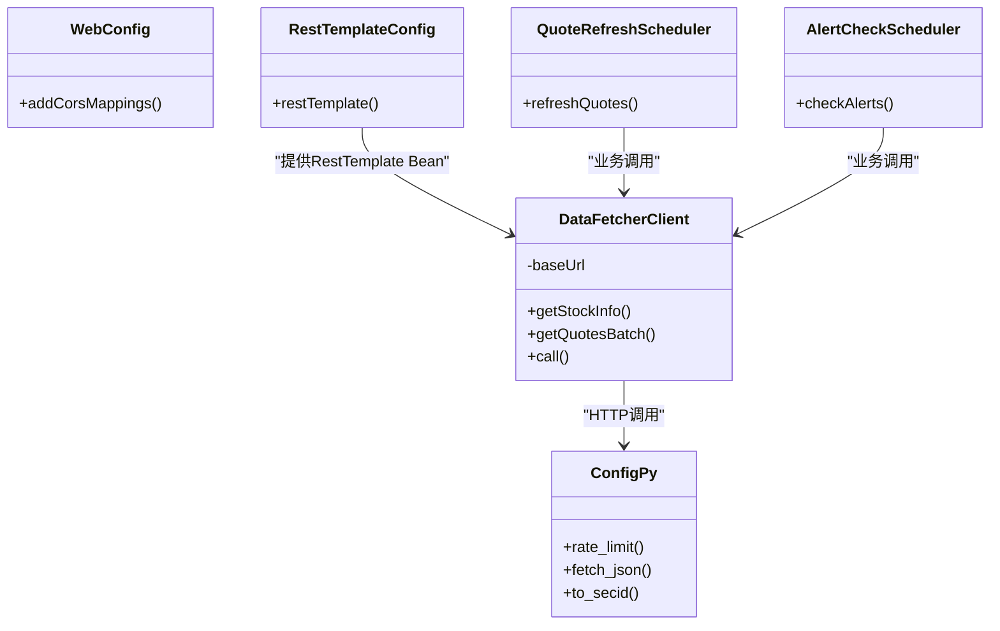

# 配置管理

<cite>
**本文引用的文件**
- [application.yml](file://backend/src/main/resources/application.yml)
- [application.yml（测试）](file://backend/src/test/resources/application.yml)
- [DataFetcherClient.java](file://backend/src/main/java/com/stock/client/DataFetcherClient.java)
- [RestTemplateConfig.java](file://backend/src/main/java/com/stock/config/RestTemplateConfig.java)
- [WebConfig.java](file://backend/src/main/java/com/stock/config/WebConfig.java)
- [QuoteRefreshScheduler.java](file://backend/src/main/java/com/stock/scheduler/QuoteRefreshScheduler.java)
- [AlertCheckScheduler.java](file://backend/src/main/java/com/stock/scheduler/AlertCheckScheduler.java)
- [config.py](file://data-fetcher/core/config.py)
- [test_config.py](file://data-fetcher/tests/test_config.py)
- [pom.xml](file://backend/pom.xml)
- [detailed-design.md](file://system-planner/detailed-design.md)
- [SKILL.md](file://system-planner/SKILL.md)
</cite>

## 目录
1. [简介](#简介)
2. [项目结构](#项目结构)
3. [核心组件](#核心组件)
4. [架构总览](#架构总览)
5. [详细组件分析](#详细组件分析)
6. [依赖关系分析](#依赖关系分析)
7. [性能考量](#性能考量)
8. [故障排查指南](#故障排查指南)
9. [结论](#结论)
10. [附录：配置模板与部署指南](#附录配置模板与部署指南)

## 简介
本文件系统性梳理该股票交易系统的配置管理，覆盖后端 Spring Boot 应用的环境配置、数据库连接配置、API 端点配置、超时设置、并发限制、调度器配置、CORS 跨域策略、以及 Python 数据服务的配置要点。同时给出生产环境最佳实践、安全配置考虑、性能调优建议，并提供可直接套用的配置模板与部署步骤。

## 项目结构
系统由三部分组成：
- 后端 Spring Boot 应用（Java），负责业务逻辑、API 提供、定时任务、数据库访问与异常处理。
- Python 数据服务（Flask/FastAPI），负责对接第三方行情与财务数据源。
- 前端 Vue 应用（Vite），负责用户界面与交互。

配置主要分布在以下位置：
- 后端主配置：application.yml
- 测试配置：application.yml（测试资源）
- 后端 Java 配置类：WebConfig、RestTemplateConfig
- 定时任务：基于 application.yml 中的 cron 表达式
- Python 数据服务：核心配置与工具函数

图表来源
- [application.yml:1-28](file://backend/src/main/resources/application.yml#L1-L28)
- [WebConfig.java:1-15](file://backend/src/main/java/com/stock/config/WebConfig.java#L1-L15)
- [RestTemplateConfig.java:1-18](file://backend/src/main/java/com/stock/config/RestTemplateConfig.java#L1-L18)
- [DataFetcherClient.java:1-126](file://backend/src/main/java/com/stock/client/DataFetcherClient.java#L1-L126)
- [QuoteRefreshScheduler.java:1-34](file://backend/src/main/java/com/stock/scheduler/QuoteRefreshScheduler.java#L1-L34)
- [AlertCheckScheduler.java:1-37](file://backend/src/main/java/com/stock/scheduler/AlertCheckScheduler.java#L1-L37)
- [config.py:1-121](file://data-fetcher/core/config.py#L1-L121)

章节来源
- [application.yml:1-28](file://backend/src/main/resources/application.yml#L1-L28)
- [application.yml（测试）:1-27](file://backend/src/test/resources/application.yml#L1-L27)
- [WebConfig.java:1-15](file://backend/src/main/java/com/stock/config/WebConfig.java#L1-L15)
- [RestTemplateConfig.java:1-18](file://backend/src/main/java/com/stock/config/RestTemplateConfig.java#L1-L18)
- [DataFetcherClient.java:1-126](file://backend/src/main/java/com/stock/client/DataFetcherClient.java#L1-L126)
- [QuoteRefreshScheduler.java:1-34](file://backend/src/main/java/com/stock/scheduler/QuoteRefreshScheduler.java#L1-L34)
- [AlertCheckScheduler.java:1-37](file://backend/src/main/java/com/stock/scheduler/AlertCheckScheduler.java#L1-L37)
- [config.py:1-121](file://data-fetcher/core/config.py#L1-L121)

## 核心组件
- 环境与端口：后端监听端口在 server.port，默认 8080；H2 控制台启用且路径为 /h2-console。
- 数据库连接：使用 H2 文件数据库（开发）或内存数据库（测试），驱动类名固定为 H2 Driver。
- JPA/Hibernate：自动更新 DDL，格式化 SQL 输出。
- 外部数据源：通过 stock.data-fetcher.url 注入，超时时间来自 stock.data-fetcher.timeout。
- HTTP 客户端：RestTemplate 的连接超时与读超时分别设置为 5 秒与 15 秒。
- 定时任务：四个任务的 cron 表达式均来自 application.yml 的 stock.scheduler.* 键。
- CORS：仅开放 /api/v1/** 路径，允许本地前端开发服务器访问。
- Python 数据服务：请求头包含 Referer，最小请求间隔 500ms，请求超时 15 秒，支持有限重试。

章节来源
- [application.yml:1-28](file://backend/src/main/resources/application.yml#L1-L28)
- [application.yml（测试）:1-27](file://backend/src/test/resources/application.yml#L1-L27)
- [RestTemplateConfig.java:1-18](file://backend/src/main/java/com/stock/config/RestTemplateConfig.java#L1-L18)
- [WebConfig.java:1-15](file://backend/src/main/java/com/stock/config/WebConfig.java#L1-L15)
- [DataFetcherClient.java:1-126](file://backend/src/main/java/com/stock/client/DataFetcherClient.java#L1-L126)
- [config.py:1-121](file://data-fetcher/core/config.py#L1-L121)

## 架构总览
下图展示配置如何影响系统行为：后端通过 RestTemplate 访问 Python 数据服务，定时任务按配置的 cron 表达式执行，CORS 仅允许前端开发服务器访问 API。

图表来源
- [WebConfig.java:1-15](file://backend/src/main/java/com/stock/config/WebConfig.java#L1-L15)
- [RestTemplateConfig.java:1-18](file://backend/src/main/java/com/stock/config/RestTemplateConfig.java#L1-L18)
- [DataFetcherClient.java:1-126](file://backend/src/main/java/com/stock/client/DataFetcherClient.java#L1-L126)
- [application.yml:1-28](file://backend/src/main/resources/application.yml#L1-L28)
- [config.py:1-121](file://data-fetcher/core/config.py#L1-L121)

## 详细组件分析

### 后端配置文件（application.yml）
- server.port：后端监听端口。
- spring.datasource：数据库连接配置，H2 Driver 固定。
- spring.jpa.hibernate.ddl-auto：开发环境使用 update，测试环境使用 create-drop。
- spring.jpa.properties.hibernate.format_sql：格式化 SQL 输出，便于调试。
- h2.console.enabled/h2.console.path：H2 控制台开关与访问路径。
- stock.data-fetcher.url：外部数据服务地址。
- stock.data-fetcher.timeout：外部数据服务超时（毫秒）。
- stock.scheduler.*：定时任务的 cron 表达式，分别用于行情刷新、K线同步、资金流同步、告警检查。

章节来源
- [application.yml:1-28](file://backend/src/main/resources/application.yml#L1-L28)
- [application.yml（测试）:1-27](file://backend/src/test/resources/application.yml#L1-L27)

### CORS 配置（WebConfig.java）
- 仅开放 /api/v1/** 路径，允许来源 http://localhost:5173，方法包括 GET/POST/PUT/DELETE，允许所有请求头。
- 生产环境建议限定具体来源域名，避免通配符。

章节来源
- [WebConfig.java:1-15](file://backend/src/main/java/com/stock/config/WebConfig.java#L1-L15)

### HTTP 客户端超时配置（RestTemplateConfig.java）
- connectTimeout：建立连接的超时时间为 5 秒。
- readTimeout：读取响应的超时时间为 15 秒。
- 该配置直接影响 DataFetcherClient 的调用行为。

章节来源
- [RestTemplateConfig.java:1-18](file://backend/src/main/java/com/stock/config/RestTemplateConfig.java#L1-L18)

### 外部数据源客户端（DataFetcherClient.java）
- 通过 @Value 注入 stock.data-fetcher.url，拼接各接口路径发起请求。
- 统一异常包装：当返回空或底层异常时，抛出 DataFetchException。
- 支持批量请求与多类型数据接口。

章节来源
- [DataFetcherClient.java:1-126](file://backend/src/main/java/com/stock/client/DataFetcherClient.java#L1-L126)

### 定时任务配置与实现
- 配置：stock.scheduler.quote-refresh-cron、stock.scheduler.kline-sync-cron、stock.scheduler.fund-flow-sync-cron、stock.scheduler.alert-check-cron。
- 实现：QuoteRefreshScheduler、AlertCheckScheduler 分别读取配置并执行任务。
- 建议：生产环境 cron 表达式需结合业务窗口与数据源可用性进行调整。

章节来源
- [application.yml:23-27](file://backend/src/main/resources/application.yml#L23-L27)
- [QuoteRefreshScheduler.java:1-34](file://backend/src/main/java/com/stock/scheduler/QuoteRefreshScheduler.java#L1-L34)
- [AlertCheckScheduler.java:1-37](file://backend/src/main/java/com/stock/scheduler/AlertCheckScheduler.java#L1-L37)

### Python 数据服务配置（config.py）
- 请求头：必须包含 Referer，否则目标站点可能拒绝。
- 限速：最小请求间隔 500ms，使用线程锁保证全局串行。
- 超时与重试：单次请求超时 15 秒，支持有限次数重试。
- 工具函数：安全转换数值、生成 secid、从数据中心接口抓取数据。

章节来源
- [config.py:1-121](file://data-fetcher/core/config.py#L1-L121)

### 测试配置（application.yml）
- 使用内存数据库（jdbc:h2:mem:testdb），便于快速测试。
- 关闭 H2 控制台，简化测试环境。
- 将 stock.data-fetcher.timeout 缩短为 5 秒，便于测试超时场景。

章节来源
- [application.yml（测试）:1-27](file://backend/src/test/resources/application.yml#L1-L27)

## 依赖关系分析
- WebConfig 与 RestTemplateConfig 作为 Spring 配置类被容器加载。
- DataFetcherClient 依赖 RestTemplate Bean，进而受 RestTemplateConfig 的超时设置影响。
- 定时任务组件通过 @Scheduled 读取 application.yml 中的 cron 表达式。
- Python 数据服务的 config.py 与后端无直接依赖，但通过 HTTP 协议耦合。

图表来源
- [WebConfig.java:1-15](file://backend/src/main/java/com/stock/config/WebConfig.java#L1-L15)
- [RestTemplateConfig.java:1-18](file://backend/src/main/java/com/stock/config/RestTemplateConfig.java#L1-L18)
- [DataFetcherClient.java:1-126](file://backend/src/main/java/com/stock/client/DataFetcherClient.java#L1-L126)
- [QuoteRefreshScheduler.java:1-34](file://backend/src/main/java/com/stock/scheduler/QuoteRefreshScheduler.java#L1-L34)
- [AlertCheckScheduler.java:1-37](file://backend/src/main/java/com/stock/scheduler/AlertCheckScheduler.java#L1-L37)
- [config.py:1-121](file://data-fetcher/core/config.py#L1-L121)

## 性能考量
- HTTP 超时：后端 RestTemplate 的连接与读取超时分别为 5 秒与 15 秒，建议根据网络状况与数据源稳定性适当调整。
- Python 限速：最小请求间隔 500ms，避免对第三方数据源造成压力。
- 数据库：开发使用文件型 H2，测试使用内存 H2；生产建议迁移到关系型数据库（如 PostgreSQL/MySQL），并开启连接池与慢查询日志。
- 定时任务：cron 表达式需避开数据源维护窗口，避免高峰时段集中拉取。
- 并发限制：当前未见显式的线程池或连接池配置，建议在生产环境引入连接池与限流策略。

章节来源
- [RestTemplateConfig.java:1-18](file://backend/src/main/java/com/stock/config/RestTemplateConfig.java#L1-L18)
- [config.py:1-121](file://data-fetcher/core/config.py#L1-L121)
- [application.yml:1-28](file://backend/src/main/resources/application.yml#L1-L28)

## 故障排查指南
- 外部数据源超时：检查 stock.data-fetcher.timeout 与 Python 层的 EASTMONEY_TIMEOUT 设置，确认网络连通性。
- CORS 错误：确认前端访问地址与 allowedOrigins 匹配，生产环境避免使用通配符。
- 定时任务不执行：核对 cron 表达式是否正确，以及是否启用了 @EnableScheduling。
- 数据库连接失败：确认 spring.datasource.url 与 driver-class-name 正确，H2 控制台路径与权限。
- 异常统一处理：DataFetchException 会被全局异常处理器映射为 503，便于前端识别服务不可用。

章节来源
- [DataFetcherClient.java:1-126](file://backend/src/main/java/com/stock/client/DataFetcherClient.java#L1-L126)
- [WebConfig.java:1-15](file://backend/src/main/java/com/stock/config/WebConfig.java#L1-L15)
- [application.yml:1-28](file://backend/src/main/resources/application.yml#L1-L28)

## 结论
该系统采用 YAML 配置与 Spring 配置类相结合的方式，实现了清晰的环境隔离（开发/测试）、明确的超时与限速策略、以及可扩展的定时任务调度。生产环境建议进一步完善数据库连接池、CORS 白名单、定时任务窗口规划与监控告警，以提升稳定性与安全性。

## 附录：配置模板与部署指南

### 后端配置模板（application.yml）
- 通用键位参考：
  - server.port
  - spring.datasource.url/driver-class-name
  - spring.jpa.hibernate.ddl-auto
  - spring.jpa.properties.hibernate.format_sql
  - h2.console.enabled/h2.console.path
  - stock.data-fetcher.url
  - stock.data-fetcher.timeout
  - stock.scheduler.quote-refresh-cron
  - stock.scheduler.kline-sync-cron
  - stock.scheduler.fund-flow-sync-cron
  - stock.scheduler.alert-check-cron

章节来源
- [application.yml:1-28](file://backend/src/main/resources/application.yml#L1-L28)
- [application.yml（测试）:1-27](file://backend/src/test/resources/application.yml#L1-L27)

### Python 数据服务配置模板（环境变量）
- DATA_FETCHER_PORT：数据服务监听端口
- EASTMONEY_TIMEOUT：请求超时秒数
- EASTMONEY_RETRY：最大重试次数
- EASTMONEY_DELAY：请求间隔秒数
- AKSHARE_TIMEOUT：其他数据源超时秒数

章节来源
- [SKILL.md:463-471](file://system-planner/SKILL.md#L463-L471)

### 部署指南
- 前置条件
  - Java 17+
  - Python 3.9+
  - Node.js 18+

- 启动顺序
  1) 启动 Python 数据服务：安装依赖后启动，等待 http://localhost:5001 就绪。
  2) 启动 Spring Boot 后端：等待 http://localhost:8080 就绪。
  3) 启动 Vue 前端：等待 http://localhost:5173 就绪。

章节来源
- [SKILL.md:483-510](file://system-planner/SKILL.md#L483-L510)

### 生产环境最佳实践
- 数据库：使用关系型数据库（PostgreSQL/MySQL），开启连接池、慢查询日志与备份策略。
- CORS：限定具体来源域名，避免通配符。
- 定时任务：根据业务窗口与数据源可用性调整 cron 表达式，增加幂等与去重逻辑。
- 超时与重试：结合监控指标动态调整超时与重试策略，避免雪崩效应。
- 安全：启用 HTTPS、敏感信息使用环境变量或密钥管理服务、定期轮换密钥。
- 监控：接入 APM/日志/告警，关注延迟、错误率与资源占用。

章节来源
- [detailed-design.md:436-510](file://system-planner/detailed-design.md#L436-L510)