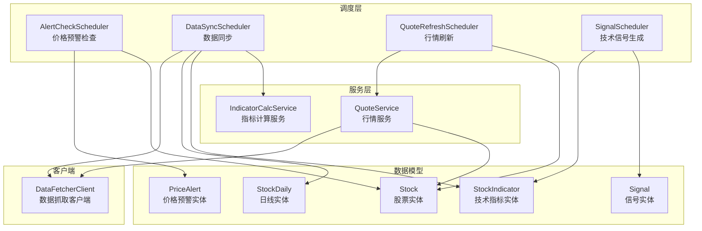
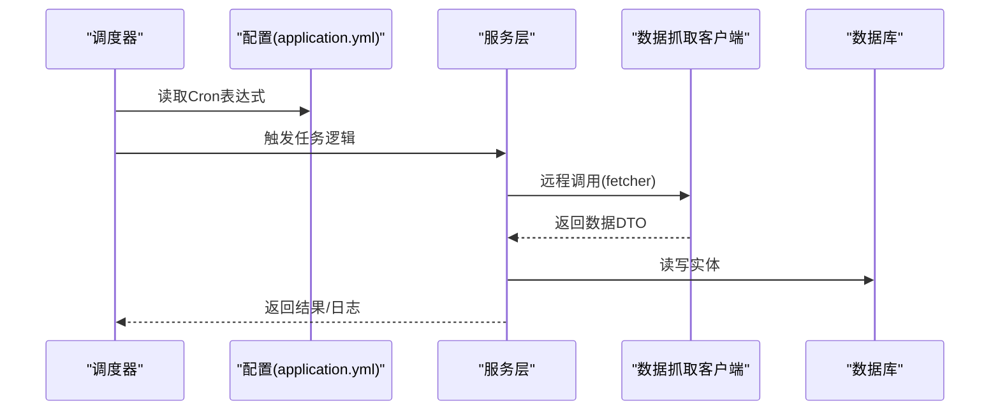
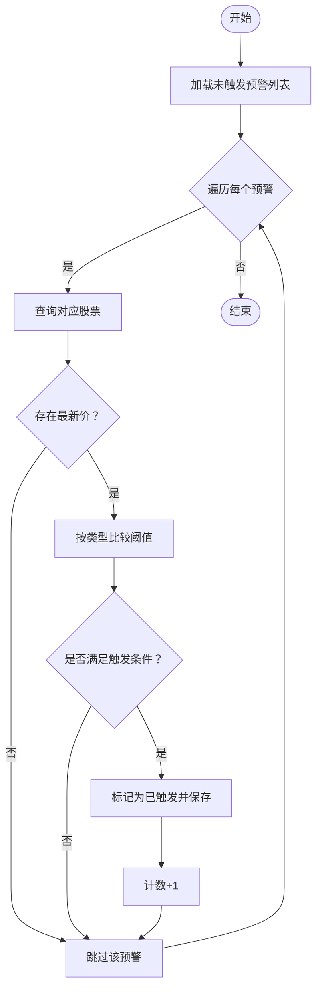
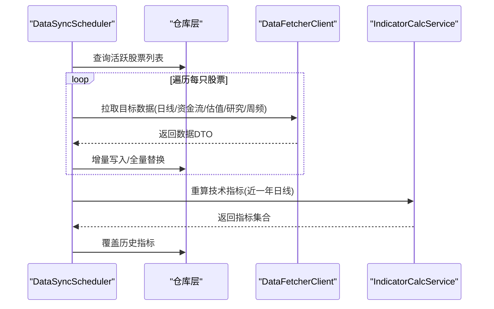
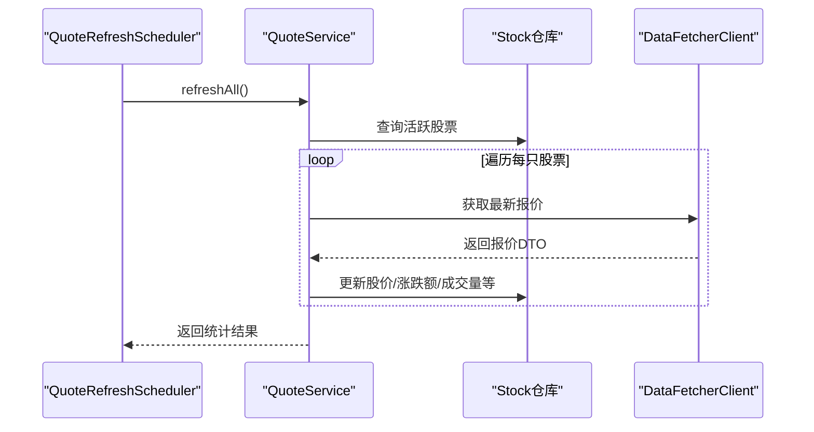
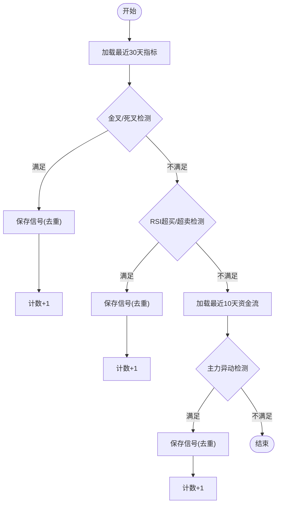
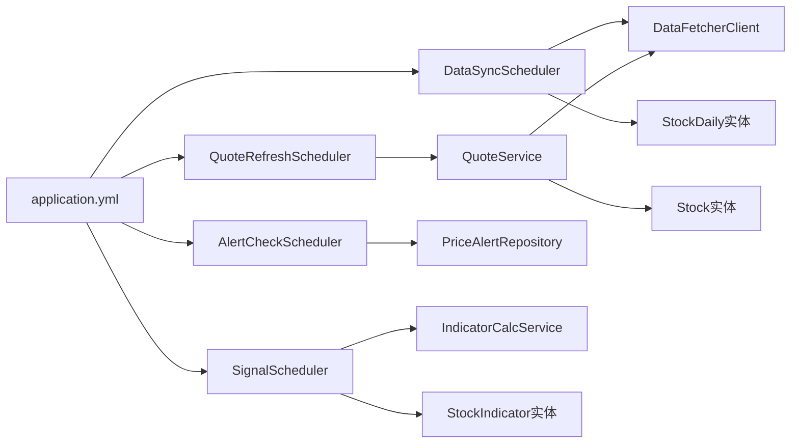

# 实时监控系统

<cite>
**本文引用的文件**
- [AlertCheckScheduler.java](file://backend/src/main/java/com/stock/scheduler/AlertCheckScheduler.java)
- [DataSyncScheduler.java](file://backend/src/main/java/com/stock/scheduler/DataSyncScheduler.java)
- [QuoteRefreshScheduler.java](file://backend/src/main/java/com/stock/scheduler/QuoteRefreshScheduler.java)
- [SignalScheduler.java](file://backend/src/main/java/com/stock/scheduler/SignalScheduler.java)
- [application.yml](file://backend/src/main/resources/application.yml)
- [QuoteService.java](file://backend/src/main/java/com/stock/service/QuoteService.java)
- [DataFetcherClient.java](file://backend/src/main/java/com/stock/client/DataFetcherClient.java)
- [Stock.java](file://backend/src/main/java/com/stock/entity/Stock.java)
- [PriceAlert.java](file://backend/src/main/java/com/stock/entity/PriceAlert.java)
- [StockDaily.java](file://backend/src/main/java/com/stock/entity/StockDaily.java)
- [StockIndicator.java](file://backend/src/main/java/com/stock/entity/StockIndicator.java)
- [Signal.java](file://backend/src/main/java/com/stock/entity/Signal.java)
- [PriceAlertRepository.java](file://backend/src/main/java/com/stock/repository/PriceAlertRepository.java)
- [IndicatorCalcService.java](file://backend/src/main/java/com/stock/service/IndicatorCalcService.java)
- [QuoteDataResponse.java](file://backend/src/main/java/com/stock/dto/fetcher/QuoteDataResponse.java)
- [DataFetchException.java](file://backend/src/main/java/com/stock/exception/DataFetchException.java)
</cite>

## 目录
1. [简介](#简介)
2. [项目结构](#项目结构)
3. [核心组件](#核心组件)
4. [架构总览](#架构总览)
5. [详细组件分析](#详细组件分析)
6. [依赖分析](#依赖分析)
7. [性能考虑](#性能考虑)
8. [故障排查指南](#故障排查指南)
9. [结论](#结论)
10. [附录](#附录)

## 简介
本文件面向实时监控系统中的定时任务调度器，系统性阐述以下调度器的设计与实现：
- AlertCheckScheduler：价格预警检查
- DataSyncScheduler：数据同步（日线、资金流、估值研究、周频财务等）
- QuoteRefreshScheduler：行情刷新
- SignalScheduler：技术信号生成

内容涵盖 Cron 表达式配置、任务执行策略、并发控制机制、配置参数、性能优化建议、故障恢复机制，并提供任务执行流程图与监控指标说明。

## 项目结构
调度器位于后端模块的 scheduler 包中，配合服务层、客户端、实体与仓库层协同工作。配置集中在 application.yml 中，通过占位符注入到各调度器的 @Scheduled 注解中。

图表来源
- [AlertCheckScheduler.java:1-52](file://backend/src/main/java/com/stock/scheduler/AlertCheckScheduler.java#L1-L52)
- [DataSyncScheduler.java:1-238](file://backend/src/main/java/com/stock/scheduler/DataSyncScheduler.java#L1-L238)
- [QuoteRefreshScheduler.java:1-35](file://backend/src/main/java/com/stock/scheduler/QuoteRefreshScheduler.java#L1-L35)
- [SignalScheduler.java:1-125](file://backend/src/main/java/com/stock/scheduler/SignalScheduler.java#L1-L125)
- [QuoteService.java:1-98](file://backend/src/main/java/com/stock/service/QuoteService.java#L1-L98)
- [IndicatorCalcService.java:1-210](file://backend/src/main/java/com/stock/service/IndicatorCalcService.java#L1-L210)
- [DataFetcherClient.java:1-126](file://backend/src/main/java/com/stock/client/DataFetcherClient.java#L1-L126)
- [Stock.java:1-86](file://backend/src/main/java/com/stock/entity/Stock.java#L1-L86)
- [PriceAlert.java:1-37](file://backend/src/main/java/com/stock/entity/PriceAlert.java#L1-L37)
- [StockDaily.java:1-60](file://backend/src/main/java/com/stock/entity/StockDaily.java#L1-L60)
- [StockIndicator.java:1-72](file://backend/src/main/java/com/stock/entity/StockIndicator.java#L1-L72)
- [Signal.java:1-36](file://backend/src/main/java/com/stock/entity/Signal.java#L1-L36)

章节来源
- [application.yml:1-28](file://backend/src/main/resources/application.yml#L1-L28)

## 核心组件
- AlertCheckScheduler：基于数据库未触发的预警记录，按最新股价与阈值比较，触发后更新状态；使用事务注解保证一致性。
- DataSyncScheduler：分多个子任务完成日线、资金流、估值研究、周频财务与股东数据的增量同步，并在完成后重算技术指标。
- QuoteRefreshScheduler：调用 QuoteService 批量刷新所有活跃股票的行情，记录成功/失败统计。
- SignalScheduler：基于最近 30 天的技术指标与最近 10 天的资金流，检测金叉死叉、RSI 超买超卖、主力异动等信号并去重保存。

章节来源
- [AlertCheckScheduler.java:26-50](file://backend/src/main/java/com/stock/scheduler/AlertCheckScheduler.java#L26-L50)
- [DataSyncScheduler.java:54-236](file://backend/src/main/java/com/stock/scheduler/DataSyncScheduler.java#L54-L236)
- [QuoteRefreshScheduler.java:24-33](file://backend/src/main/java/com/stock/scheduler/QuoteRefreshScheduler.java#L24-L33)
- [SignalScheduler.java:39-108](file://backend/src/main/java/com/stock/scheduler/SignalScheduler.java#L39-L108)

## 架构总览
调度器通过 Spring 的 @Scheduled 基于 Cron 表达式驱动，统一由应用配置管理。数据来源主要来自 DataFetcherClient，服务层负责业务编排，实体与仓库层负责持久化。

图表来源
- [application.yml:23-28](file://backend/src/main/resources/application.yml#L23-L28)
- [DataFetcherClient.java:31-93](file://backend/src/main/java/com/stock/client/DataFetcherClient.java#L31-L93)
- [QuoteService.java:64-96](file://backend/src/main/java/com/stock/service/QuoteService.java#L64-L96)

## 详细组件分析

### AlertCheckScheduler（价格预警检查）
- 触发条件：Cron 表达式由配置项提供，工作日 9:00-11:59 和 13:00-15:59 每分钟检查一次。
- 执行策略：
  - 查询所有未触发的 PriceAlert
  - 遍历每个预警，查询对应 Stock 的最新价格
  - 根据预警类型（高于/低于）与阈值比较决定是否触发
  - 触发后更新数据库标记并记录计数
- 并发控制：单实例单线程执行，Spring 默认调度器串行执行；若需并行可在任务间增加随机抖动或外部队列。
- 错误处理：忽略缺失股票或无最新价的情况，继续下一个；日志记录触发数量。

图表来源
- [AlertCheckScheduler.java:28-50](file://backend/src/main/java/com/stock/scheduler/AlertCheckScheduler.java#L28-L50)
- [PriceAlertRepository.java:13](file://backend/src/main/java/com/stock/repository/PriceAlertRepository.java#L13)

章节来源
- [AlertCheckScheduler.java:26-50](file://backend/src/main/java/com/stock/scheduler/AlertCheckScheduler.java#L26-L50)
- [application.yml:27](file://backend/src/main/resources/application.yml#L27)

### DataSyncScheduler（数据同步）
- 触发策略与任务划分：
  - 日线同步：工作日 15:30 执行，按股票增量拉取日线数据并入库。
  - 资金流同步：工作日 16:00 执行，增量拉取最近 3 个月资金流。
  - 日常数据同步（估值、研究）：工作日 18:00 执行，分别更新估值字段与去重保存研究报告。
  - 周频数据同步：每周日 16:00 执行，删除旧后全量写入利润表、财务指标与股东数据。
  - 技术指标重算：工作日 15:45 执行，基于近一年日线重新计算并覆盖历史指标。
- 执行细节：
  - 对每只活跃股票查询最大交易日，从次日开始增量同步，避免重复。
  - 每个远程调用之间加入短暂休眠以降低接口压力。
  - 异常捕获并记录，不影响其他股票处理。
- 并发控制：单线程顺序处理，避免并发写冲突；如需加速可拆分为多实例或多分区任务。
- 错误处理：捕获异常并记录警告日志，继续处理下一只股票。

图表来源
- [DataSyncScheduler.java:54-236](file://backend/src/main/java/com/stock/scheduler/DataSyncScheduler.java#L54-L236)
- [DataFetcherClient.java:31-93](file://backend/src/main/java/com/stock/client/DataFetcherClient.java#L31-L93)
- [IndicatorCalcService.java:15-63](file://backend/src/main/java/com/stock/service/IndicatorCalcService.java#L15-L63)

章节来源
- [DataSyncScheduler.java:54-236](file://backend/src/main/java/com/stock/scheduler/DataSyncScheduler.java#L54-L236)
- [application.yml:24-27](file://backend/src/main/resources/application.yml#L24-L27)

### QuoteRefreshScheduler（行情刷新）
- 触发策略：Cron 表达式由配置项提供，工作日 9:00-11:59 和 13:00-15:59 每隔 5 分钟执行。
- 执行策略：调用 QuoteService.refreshAll() 刷新所有活跃股票的行情，返回成功/失败计数与明细。
- 并发控制：单实例单线程；若需提升吞吐，可引入批量分片或外部消息队列。
- 错误处理：捕获异常并记录错误日志，避免中断整个刷新流程。

图表来源
- [QuoteRefreshScheduler.java:24-33](file://backend/src/main/java/com/stock/scheduler/QuoteRefreshScheduler.java#L24-L33)
- [QuoteService.java:64-96](file://backend/src/main/java/com/stock/service/QuoteService.java#L64-L96)
- [DataFetcherClient.java:43-46](file://backend/src/main/java/com/stock/client/DataFetcherClient.java#L43-L46)

章节来源
- [QuoteRefreshScheduler.java:24-33](file://backend/src/main/java/com/stock/scheduler/QuoteRefreshScheduler.java#L24-L33)
- [application.yml:24](file://backend/src/main/resources/application.yml#L24)

### SignalScheduler（技术信号生成）
- 触发策略：工作日 15:50 执行。
- 执行策略：
  - 读取最近 30 天的 StockIndicator，检测金叉/死叉与 RSI 超买/超卖信号。
  - 读取最近 10 天的 StockFundFlow，检测主力净流入/出幅度超过均值 2 倍的信号。
  - 去重保存：同股票、同类型、同交易日不重复写入。
- 并发控制：单线程顺序处理；如需扩展可按股票分片。
- 错误处理：捕获异常并记录警告日志，继续处理下只股票。

图表来源
- [SignalScheduler.java:41-108](file://backend/src/main/java/com/stock/scheduler/SignalScheduler.java#L41-L108)
- [Signal.java:24-34](file://backend/src/main/java/com/stock/entity/Signal.java#L24-L34)

章节来源
- [SignalScheduler.java:39-108](file://backend/src/main/java/com/stock/scheduler/SignalScheduler.java#L39-L108)

## 依赖分析
- 配置依赖：application.yml 提供所有调度器的 Cron 表达式占位符，集中管理执行节奏。
- 服务依赖：QuoteRefreshScheduler 依赖 QuoteService；DataSyncScheduler 依赖 DataFetcherClient 与 IndicatorCalcService；SignalScheduler 依赖多个仓库与实体。
- 数据依赖：各调度器均依赖 Stock 实体及对应的仓库；AlertCheckScheduler 依赖 PriceAlert；SignalScheduler 依赖 StockIndicator 与 StockFundFlow。

图表来源
- [application.yml:23-28](file://backend/src/main/resources/application.yml#L23-L28)
- [AlertCheckScheduler.java:18-24](file://backend/src/main/java/com/stock/scheduler/AlertCheckScheduler.java#L18-L24)
- [DataSyncScheduler.java:21-52](file://backend/src/main/java/com/stock/scheduler/DataSyncScheduler.java#L21-L52)
- [QuoteRefreshScheduler.java:16-22](file://backend/src/main/java/com/stock/scheduler/QuoteRefreshScheduler.java#L16-L22)
- [SignalScheduler.java:24-37](file://backend/src/main/java/com/stock/scheduler/SignalScheduler.java#L24-L37)

章节来源
- [application.yml:23-28](file://backend/src/main/resources/application.yml#L23-L28)

## 性能考虑
- 批量与分片
  - 当前调度器均为单线程顺序处理，适合中小规模股票池。若需提升吞吐，可将股票列表分片，交由多个实例或线程并行处理。
- 请求节流
  - DataSyncScheduler 在每次远程调用后添加短暂休眠，减少上游限流风险；建议根据上游响应时间动态调整。
- 缓存与去重
  - QuoteRefreshScheduler 已通过 QuoteService 统一刷新并返回统计；SignalScheduler 已实现按股票+类型+日期去重。
- 指标计算成本
  - IndicatorCalcService 计算 MA/RSI/KDJ/BOLL/MACD 等，时间复杂度与数据长度线性相关；建议仅对新增日线进行增量重算，避免全量重算。
- 数据库写入
  - 使用 saveAll/saveAll 覆盖写入，注意索引与唯一约束（如 stock_daily 与 stock_indicator 的唯一约束）以避免重复插入导致的性能损耗。

[本节为通用性能建议，无需特定文件引用]

## 故障排查指南
- 常见问题
  - 远程接口不可用：DataFetcherClient 将抛出 DataFetchException，调度器捕获并记录警告日志。检查 fetcher 地址与网络连通性。
  - 股票代码缺失或无最新价：AlertCheckScheduler 会跳过；SignalScheduler 会记录警告日志。确认 Stock 数据完整性。
  - 数据重复或冲突：StockDaily/StockIndicator 的唯一约束避免重复；如出现异常，检查唯一键冲突与数据清洗逻辑。
- 排查步骤
  - 查看对应调度器的日志输出，定位失败股票与具体异常信息。
  - 检查 application.yml 中 Cron 表达式是否符合预期。
  - 验证 DataFetcherClient 的基础地址与超时设置。
- 建议
  - 为每个调度器增加健康检查端点与告警规则。
  - 对关键任务增加幂等与补偿机制（如重试、人工干预）。

章节来源
- [DataFetchException.java:1-6](file://backend/src/main/java/com/stock/exception/DataFetchException.java#L1-L6)
- [DataFetcherClient.java:112-124](file://backend/src/main/java/com/stock/client/DataFetcherClient.java#L112-L124)
- [StockDaily.java:15-17](file://backend/src/main/java/com/stock/entity/StockDaily.java#L15-L17)
- [StockIndicator.java:15-17](file://backend/src/main/java/com/stock/entity/StockIndicator.java#L15-L17)

## 结论
本系统通过集中配置的 Cron 表达式驱动四大调度器，形成“行情刷新—数据同步—指标计算—信号生成—预警检查”的完整链路。当前实现简洁可靠，具备良好的可维护性；在业务规模扩大时，可通过分片、缓存与异步化进一步提升性能与稳定性。

[本节为总结性内容，无需特定文件引用]

## 附录

### Cron 表达式配置清单
- 行情刷新：每 5 分钟（工作日 9:00-11:59, 13:00-15:59）
- 日线同步：工作日 15:30
- 资金流同步：工作日 16:00
- 日常数据同步（估值/研究）：工作日 18:00
- 周频数据同步（利润/财务/股东）：每周日 16:00
- 技术指标重算：工作日 15:45
- 价格预警检查：每分钟（工作日 9:00-11:59, 13:00-15:59）

章节来源
- [application.yml:23-28](file://backend/src/main/resources/application.yml#L23-L28)
- [DataSyncScheduler.java:54](file://backend/src/main/java/com/stock/scheduler/DataSyncScheduler.java#L54)
- [DataSyncScheduler.java:84](file://backend/src/main/java/com/stock/scheduler/DataSyncScheduler.java#L84)
- [DataSyncScheduler.java:119](file://backend/src/main/java/com/stock/scheduler/DataSyncScheduler.java#L119)
- [DataSyncScheduler.java:163](file://backend/src/main/java/com/stock/scheduler/DataSyncScheduler.java#L163)
- [DataSyncScheduler.java:216](file://backend/src/main/java/com/stock/scheduler/DataSyncScheduler.java#L216)
- [SignalScheduler.java:39](file://backend/src/main/java/com/stock/scheduler/SignalScheduler.java#L39)
- [AlertCheckScheduler.java:26](file://backend/src/main/java/com/stock/scheduler/AlertCheckScheduler.java#L26)

### 监控指标建议
- 调度器执行时延与成功率
- 单次任务处理的股票数量与失败率
- 远程接口调用耗时与错误码分布
- 数据库写入条数与唯一键冲突次数
- 技术指标计算耗时与缓存命中率

[本节为通用监控建议，无需特定文件引用]