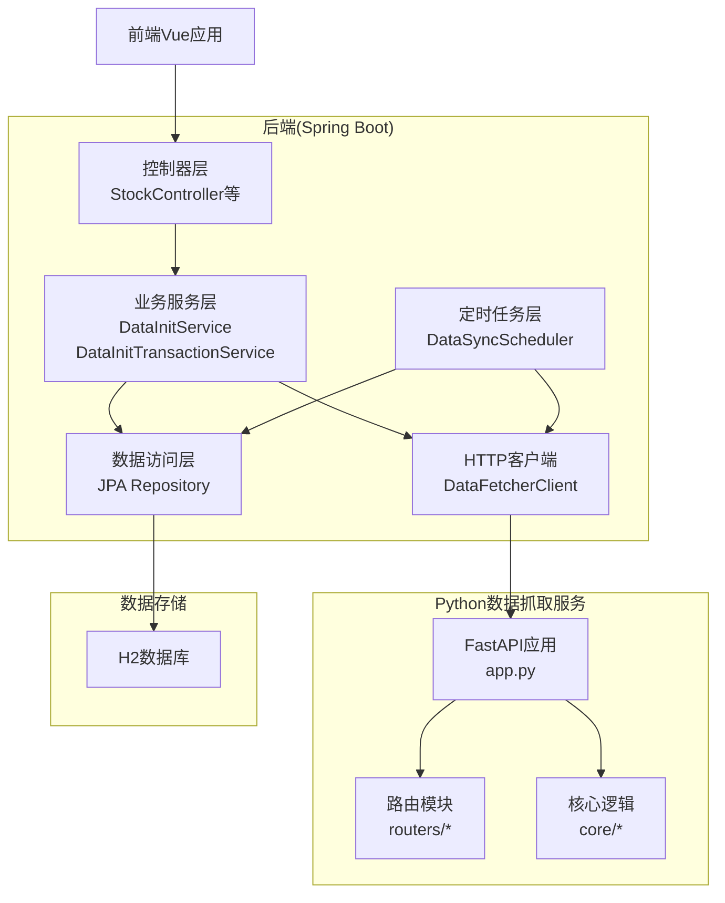
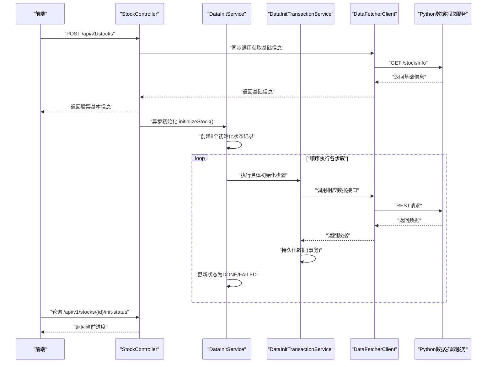
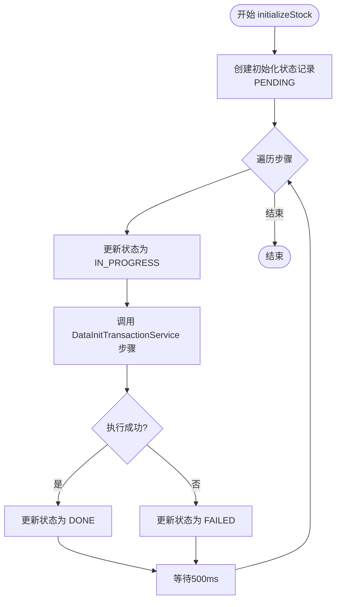
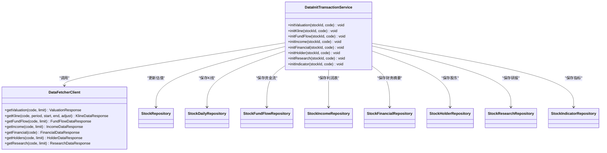
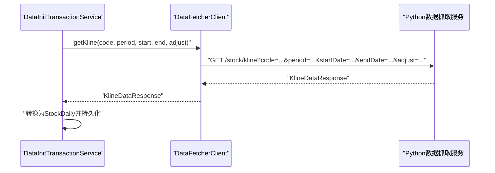
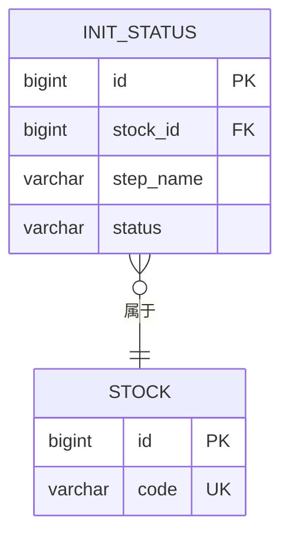
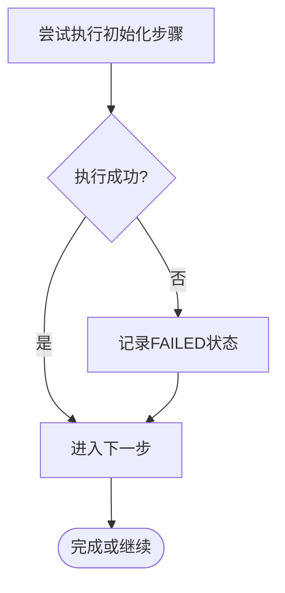
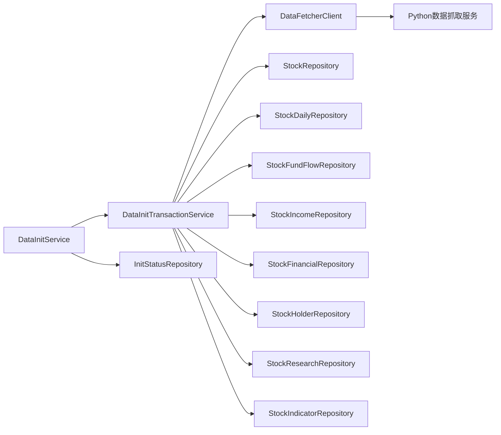

# 数据初始化系统

<cite>
**本文档引用的文件**
- [DataInitService.java](file://backend/src/main/java/com/stock/service/DataInitService.java)
- [DataInitTransactionService.java](file://backend/src/main/java/com/stock/service/DataInitTransactionService.java)
- [DataFetcherClient.java](file://backend/src/main/java/com/stock/client/DataFetcherClient.java)
- [InitStatus.java](file://backend/src/main/java/com/stock/entity/InitStatus.java)
- [InitStatusRepository.java](file://backend/src/main/java/com/stock/repository/InitStatusRepository.java)
- [application.yml](file://backend/src/main/resources/application.yml)
- [app.py](file://data-fetcher/app.py)
- [data-fetcher.md](file://system-planner/data-fetcher.md)
- [high-level-design.md](file://system-planner/high-level-design.md)
- [detailed-design.md](file://system-planner/detailed-design.md)
- [DataSyncScheduler.java](file://backend/src/main/java/com/stock/scheduler/DataSyncScheduler.java)
- [DataFetchException.java](file://backend/src/main/java/com/stock/exception/DataFetchException.java)
- [Stock.java](file://backend/src/main/java/com/stock/entity/Stock.java)
</cite>

## 目录
1. [简介](#简介)
2. [项目结构](#项目结构)
3. [核心组件](#核心组件)
4. [架构总览](#架构总览)
5. [详细组件分析](#详细组件分析)
6. [依赖关系分析](#依赖关系分析)
7. [性能考虑](#性能考虑)
8. [故障排除指南](#故障排除指南)
9. [结论](#结论)

## 简介
本文件面向数据初始化系统，系统采用异步初始化策略，通过协调器服务编排多个数据获取步骤，并在事务边界内持久化数据。系统与Python数据抓取服务通过REST API通信，严格遵循限流与容错策略。本文档详细阐述初始化状态管理、事务控制、错误恢复机制、组件协作关系，并提供流程图与状态转换图，帮助读者快速理解与维护该系统。

## 项目结构
后端采用Spring Boot三层架构：Controller-Service-Repository，配合定时任务与异步执行；Python侧提供FastAPI微服务，封装东方财富与AKShare数据源，统一对外提供REST接口。

**图表来源**
- [high-level-design.md:1-68](file://system-planner/high-level-design.md#L1-L68)
- [DataInitService.java:1-101](file://backend/src/main/java/com/stock/service/DataInitService.java#L1-L101)
- [DataInitTransactionService.java:1-152](file://backend/src/main/java/com/stock/service/DataInitTransactionService.java#L1-L152)
- [DataFetcherClient.java:1-126](file://backend/src/main/java/com/stock/client/DataFetcherClient.java#L1-L126)
- [app.py:1-31](file://data-fetcher/app.py#L1-L31)

**章节来源**
- [high-level-design.md:1-68](file://system-planner/high-level-design.md#L1-L68)
- [application.yml:1-28](file://backend/src/main/resources/application.yml#L1-L28)

## 核心组件
- DataInitService：异步初始化协调器，负责创建初始化状态记录、顺序执行各初始化步骤、更新状态、提供进度查询。
- DataInitTransactionService：事务边界内的数据写入服务，确保每一步初始化在独立事务中执行，避免跨步骤污染。
- DataFetcherClient：后端HTTP客户端，封装Python数据抓取服务的REST接口，统一参数与响应模型。
- InitStatus/InitStatusRepository：初始化状态实体与仓储，记录每个步骤的PENDING/IN_PROGRESS/DONE/FAILED状态。
- Python数据抓取服务：FastAPI应用，提供个股信息、K线、资金流向、财务、研报、估值、行业板块等接口，内置限流与缓存策略。

**章节来源**
- [DataInitService.java:1-101](file://backend/src/main/java/com/stock/service/DataInitService.java#L1-L101)
- [DataInitTransactionService.java:1-152](file://backend/src/main/java/com/stock/service/DataInitTransactionService.java#L1-L152)
- [DataFetcherClient.java:1-126](file://backend/src/main/java/com/stock/client/DataFetcherClient.java#L1-L126)
- [InitStatus.java:1-30](file://backend/src/main/java/com/stock/entity/InitStatus.java#L1-L30)
- [InitStatusRepository.java:1-18](file://backend/src/main/java/com/stock/repository/InitStatusRepository.java#L1-L18)
- [app.py:1-31](file://data-fetcher/app.py#L1-L31)

## 架构总览
系统采用“后端编排 + Python数据源”的双层架构。后端负责业务编排、状态管理与持久化；Python服务负责外部API封装、限流与数据清洗。初始化流程通过异步执行，前端轮询进度，实现良好的用户体验。

**图表来源**
- [high-level-design.md:321-348](file://system-planner/high-level-design.md#L321-L348)
- [DataInitService.java:42-92](file://backend/src/main/java/com/stock/service/DataInitService.java#L42-L92)
- [DataInitTransactionService.java:35-150](file://backend/src/main/java/com/stock/service/DataInitTransactionService.java#L35-L150)
- [DataFetcherClient.java:26-105](file://backend/src/main/java/com/stock/client/DataFetcherClient.java#L26-L105)
- [app.py:23-25](file://data-fetcher/app.py#L23-L25)

## 详细组件分析

### DataInitService 协调逻辑
- 初始化步骤定义：通过配置化的步骤列表定义8个初始化步骤，依次为估值、K线、资金流向、利润表、财务摘要、股东、研报、技术指标。
- 异步执行：使用异步注解启动初始化任务，避免阻塞HTTP响应。
- 状态管理：初始化开始时为每个步骤创建状态记录，执行过程中更新为IN_PROGRESS，完成后更新为DONE或发生异常时更新为FAILED。
- 进度查询：聚合各步骤状态，返回完成数量与总数，供前端轮询展示。

**图表来源**
- [DataInitService.java:23-71](file://backend/src/main/java/com/stock/service/DataInitService.java#L23-L71)

**章节来源**
- [DataInitService.java:1-101](file://backend/src/main/java/com/stock/service/DataInitService.java#L1-L101)

### DataInitTransactionService 事务处理
- 事务边界：每个初始化步骤均在独立的事务方法中执行，确保步骤间的数据隔离与一致性。
- 数据写入：根据步骤类型调用相应的数据获取接口，将数据转换为实体并批量持久化。
- 指标计算：最后一步基于K线数据计算技术指标并持久化。

**图表来源**
- [DataInitTransactionService.java:1-152](file://backend/src/main/java/com/stock/service/DataInitTransactionService.java#L1-L152)
- [DataFetcherClient.java:1-126](file://backend/src/main/java/com/stock/client/DataFetcherClient.java#L1-L126)

**章节来源**
- [DataInitTransactionService.java:1-152](file://backend/src/main/java/com/stock/service/DataInitTransactionService.java#L1-L152)

### DataFetcherClient 与Python数据获取器通信协议
- 基础URL：从配置文件读取数据抓取服务的基础地址。
- 接口覆盖：提供个股信息、K线、分时、最新行情、批量行情、资金流向、利润表、财务摘要、股东、研报、估值、龙虎榜、行业板块等接口。
- 错误处理：统一捕获异常并包装为数据获取异常，便于上层识别与降级。

**图表来源**
- [DataFetcherClient.java:31-35](file://backend/src/main/java/com/stock/client/DataFetcherClient.java#L31-L35)
- [app.py:14-20](file://data-fetcher/app.py#L14-L20)

**章节来源**
- [DataFetcherClient.java:1-126](file://backend/src/main/java/com/stock/client/DataFetcherClient.java#L1-L126)
- [application.yml:19-22](file://backend/src/main/resources/application.yml#L19-L22)
- [data-fetcher.md:31-350](file://system-planner/data-fetcher.md#L31-L350)

### 初始化状态管理与进度报告
- 状态实体：包含股票ID、步骤名、状态值，唯一约束防止重复记录。
- 状态更新：每次步骤执行前后更新状态，保证前端轮询可见。
- 进度聚合：服务层聚合步骤状态，返回完成计数与总数，便于前端展示。

**图表来源**
- [InitStatus.java:12-28](file://backend/src/main/java/com/stock/entity/InitStatus.java#L12-L28)
- [InitStatusRepository.java:10-16](file://backend/src/main/java/com/stock/repository/InitStatusRepository.java#L10-L16)
- [Stock.java:16-24](file://backend/src/main/java/com/stock/entity/Stock.java#L16-L24)

**章节来源**
- [InitStatus.java:1-30](file://backend/src/main/java/com/stock/entity/InitStatus.java#L1-L30)
- [InitStatusRepository.java:1-18](file://backend/src/main/java/com/stock/repository/InitStatusRepository.java#L1-L18)
- [DataInitService.java:73-92](file://backend/src/main/java/com/stock/service/DataInitService.java#L73-L92)

### 错误恢复机制
- 步骤级失败：单个步骤失败不影响后续步骤继续执行，失败状态被记录以便追踪。
- 异常包装：底层HTTP调用异常统一包装为数据获取异常，便于全局处理。
- 定时重试：Python侧对特定异常进行指数退避重试，降低外部服务波动影响。

**图表来源**
- [DataInitService.java:57-63](file://backend/src/main/java/com/stock/service/DataInitService.java#L57-L63)
- [DataFetchException.java:1-6](file://backend/src/main/java/com/stock/exception/DataFetchException.java#L1-L6)
- [data-fetcher.md:314-321](file://system-planner/data-fetcher.md#L314-L321)

**章节来源**
- [DataInitService.java:57-63](file://backend/src/main/java/com/stock/service/DataInitService.java#L57-L63)
- [DataFetchException.java:1-6](file://backend/src/main/java/com/stock/exception/DataFetchException.java#L1-L6)
- [data-fetcher.md:314-321](file://system-planner/data-fetcher.md#L314-L321)

## 依赖关系分析
- 组件耦合：DataInitService依赖DataInitTransactionService与InitStatusRepository；DataInitTransactionService依赖DataFetcherClient与各领域Repository；DataFetcherClient依赖RestTemplate与Python服务。
- 外部依赖：Python数据抓取服务提供REST接口，后端通过HTTP调用；H2数据库提供本地持久化。
- 并发与限流：Python侧对东方财富接口实施500ms间隔与指数退避；后端通过异步与步骤间sleep实现顺序化与限流。

**图表来源**
- [DataInitService.java:19-40](file://backend/src/main/java/com/stock/service/DataInitService.java#L19-L40)
- [DataInitTransactionService.java:24-33](file://backend/src/main/java/com/stock/service/DataInitTransactionService.java#L24-L33)
- [DataFetcherClient.java:17-24](file://backend/src/main/java/com/stock/client/DataFetcherClient.java#L17-L24)

**章节来源**
- [DataInitService.java:1-101](file://backend/src/main/java/com/stock/service/DataInitService.java#L1-L101)
- [DataInitTransactionService.java:1-152](file://backend/src/main/java/com/stock/service/DataInitTransactionService.java#L1-L152)
- [DataFetcherClient.java:1-126](file://backend/src/main/java/com/stock/client/DataFetcherClient.java#L1-L126)

## 性能考虑
- 异步初始化：避免阻塞HTTP响应，提升用户体验。
- 步骤间延迟：500ms延迟用于满足Python侧限流要求，减少外部服务压力。
- 事务粒度：每个步骤独立事务，降低锁竞争与回滚成本。
- 批量写入：步骤内部使用批量保存，减少数据库往返。
- 缓存策略：Python侧针对不同接口设置TTL缓存，降低重复请求开销。

**章节来源**
- [high-level-design.md:441-466](file://system-planner/high-level-design.md#L441-L466)
- [data-fetcher.md:323-337](file://system-planner/data-fetcher.md#L323-L337)

## 故障排除指南
- 初始化失败排查
  - 检查初始化状态表中对应步骤的状态是否为FAILED，定位失败步骤。
  - 查看后端日志中的异常堆栈，确认是网络超时、数据为空还是转换异常。
  - 确认Python数据抓取服务健康检查接口可用。
- 数据抓取异常
  - 若出现数据获取异常，确认Python服务端限流与重试策略是否生效。
  - 检查网络连通性与代理设置，确保后端可访问Python服务。
- 数据一致性
  - 若发现部分数据缺失，确认对应步骤是否执行成功且事务已提交。
  - 对于需要重新初始化的标的，可清理相关历史数据后重新触发初始化。

**章节来源**
- [DataInitService.java:57-63](file://backend/src/main/java/com/stock/service/DataInitService.java#L57-L63)
- [DataFetchException.java:1-6](file://backend/src/main/java/com/stock/exception/DataFetchException.java#L1-L6)
- [app.py:23-25](file://data-fetcher/app.py#L23-L25)

## 结论
数据初始化系统通过异步编排、事务隔离与状态管理，实现了稳定的多步骤数据加载流程。后端与Python数据抓取服务的职责分离，既保证了外部接口的稳定性，又提升了系统的可维护性。建议在生产环境中持续监控初始化进度与异常率，并根据外部服务稳定性调整Python侧的重试与退避策略。