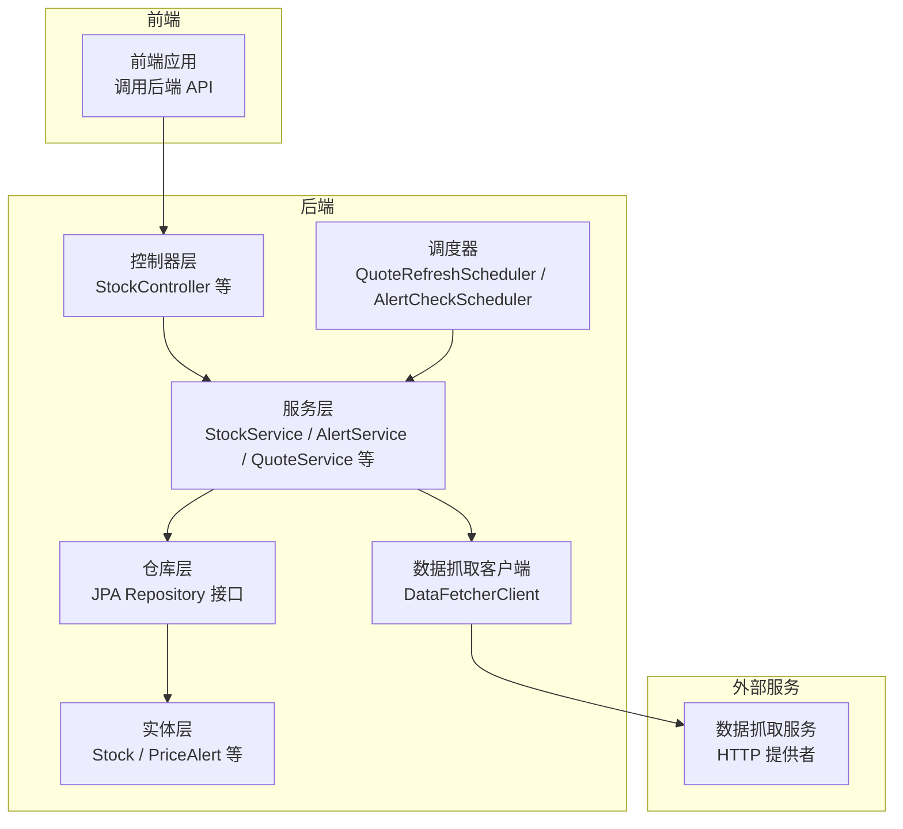
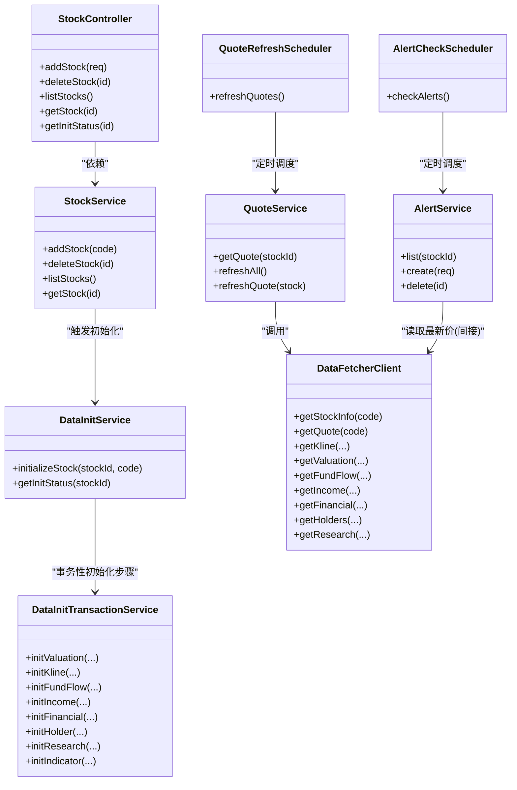
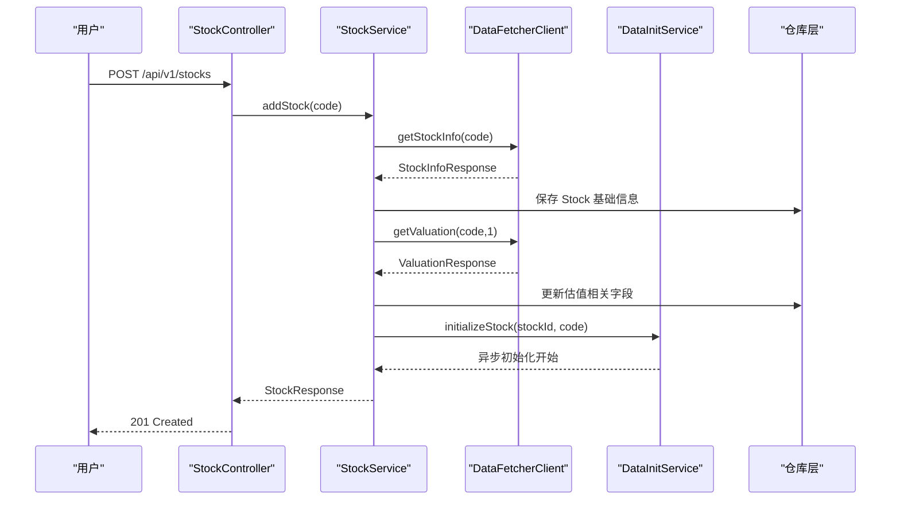
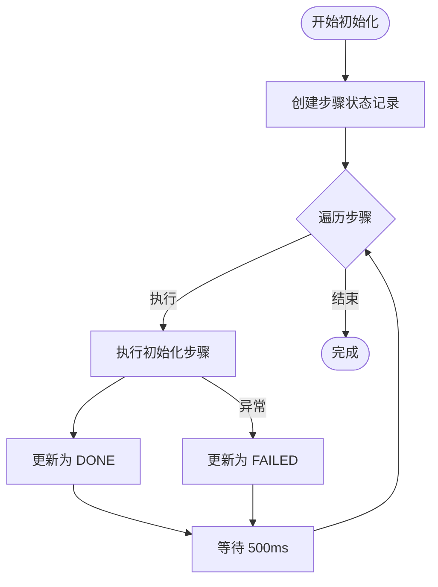
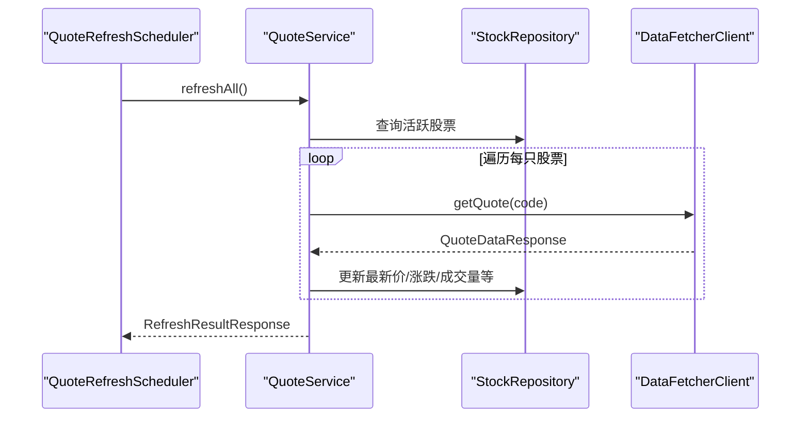
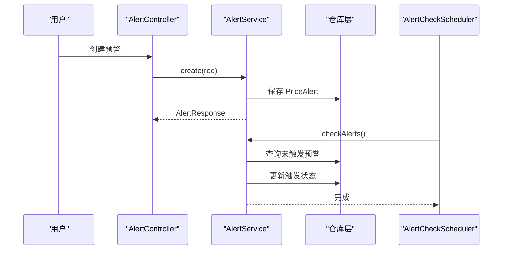
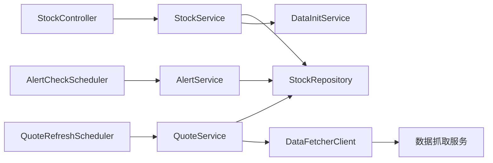

# 核心功能模块

<cite>
**本文引用的文件**
- [StockController.java](file://backend/src/main/java/com/stock/controller/StockController.java)
- [StockService.java](file://backend/src/main/java/com/stock/service/StockService.java)
- [DataInitService.java](file://backend/src/main/java/com/stock/service/DataInitService.java)
- [DataInitTransactionService.java](file://backend/src/main/java/com/stock/service/DataInitTransactionService.java)
- [AlertService.java](file://backend/src/main/java/com/stock/service/AlertService.java)
- [AlertCheckScheduler.java](file://backend/src/main/java/com/stock/scheduler/AlertCheckScheduler.java)
- [QuoteService.java](file://backend/src/main/java/com/stock/service/QuoteService.java)
- [QuoteRefreshScheduler.java](file://backend/src/main/java/com/stock/scheduler/QuoteRefreshScheduler.java)
- [DataFetcherClient.java](file://backend/src/main/java/com/stock/client/DataFetcherClient.java)
- [Stock.java](file://backend/src/main/java/com/stock/entity/Stock.java)
- [PriceAlert.java](file://backend/src/main/java/com/stock/entity/PriceAlert.java)
- [StockRepository.java](file://backend/src/main/java/com/stock/repository/StockRepository.java)
- [application.yml](file://backend/src/main/resources/application.yml)
- [AddStockRequest.java](file://backend/src/main/java/com/stock/dto/request/AddStockRequest.java)
- [StockResponse.java](file://backend/src/main/java/com/stock/dto/response/StockResponse.java)
- [InitStatusResponse.java](file://backend/src/main/java/com/stock/dto/response/InitStatusResponse.java)
</cite>

## 目录
1. [简介](#简介)
2. [项目结构](#项目结构)
3. [核心组件](#核心组件)
4. [架构总览](#架构总览)
5. [详细组件分析](#详细组件分析)
6. [依赖关系分析](#依赖关系分析)
7. [性能考量](#性能考量)
8. [故障排查指南](#故障排查指南)
9. [结论](#结论)
10. [附录](#附录)

## 简介
本文件聚焦于股票交易系统的核心功能模块，围绕以下关键能力进行深入解析：股票管理（新增、删除、查询）、数据初始化系统、实时行情刷新与监控、价格预警系统。文档从系统架构、组件关系、数据流、处理逻辑、API 设计、状态变化、使用示例与配置项等方面展开，并提供可视化图示帮助读者快速理解各模块之间的依赖与集成方式。

## 项目结构
后端采用 Spring Boot 架构，按职责划分为控制器层、服务层、仓库层、实体层、DTO 层、调度器与客户端。前端通过 API 调用后端接口；数据来源由独立的数据抓取服务提供，通过 HTTP 客户端统一访问。

图表来源
- [StockController.java:17-56](file://backend/src/main/java/com/stock/controller/StockController.java#L17-L56)
- [StockService.java:28-91](file://backend/src/main/java/com/stock/service/StockService.java#L28-L91)
- [DataFetcherClient.java:14-24](file://backend/src/main/java/com/stock/client/DataFetcherClient.java#L14-L24)
- [QuoteRefreshScheduler.java:14-33](file://backend/src/main/java/com/stock/scheduler/QuoteRefreshScheduler.java#L14-L33)
- [AlertCheckScheduler.java:16-50](file://backend/src/main/java/com/stock/scheduler/AlertCheckScheduler.java#L16-L50)

章节来源
- [application.yml:1-28](file://backend/src/main/resources/application.yml#L1-L28)

## 核心组件
- 股票管理：提供新增、删除、列表与详情查询；新增时同步拉取基础信息与估值，并异步触发全量初始化。
- 数据初始化系统：按步骤顺序执行估值、K线、资金流、利润表、财务报表、股东、研报、技术指标等初始化任务，支持进度查询。
- 实时监控：定时刷新行情，更新最新价、涨跌幅、成交量、换手率、振幅等；支持批量刷新与单只刷新。
- 预警系统：支持设置“高于/低于”阈值的预警，定时扫描未触发的预警并标记触发状态。

章节来源
- [StockController.java:29-55](file://backend/src/main/java/com/stock/controller/StockController.java#L29-L55)
- [StockService.java:93-189](file://backend/src/main/java/com/stock/service/StockService.java#L93-L189)
- [DataInitService.java:42-92](file://backend/src/main/java/com/stock/service/DataInitService.java#L42-L92)
- [QuoteService.java:30-96](file://backend/src/main/java/com/stock/service/QuoteService.java#L30-L96)
- [AlertService.java:26-61](file://backend/src/main/java/com/stock/service/AlertService.java#L26-L61)
- [AlertCheckScheduler.java:26-50](file://backend/src/main/java/com/stock/scheduler/AlertCheckScheduler.java#L26-L50)

## 架构总览
系统以控制器为入口，服务层编排业务流程，仓库层持久化数据，客户端封装对外数据抓取调用，调度器负责定时任务。整体呈现清晰的分层与解耦。

图表来源
- [StockController.java:21-27](file://backend/src/main/java/com/stock/controller/StockController.java#L21-L27)
- [StockService.java:51-90](file://backend/src/main/java/com/stock/service/StockService.java#L51-L90)
- [DataInitService.java:34-40](file://backend/src/main/java/com/stock/service/DataInitService.java#L34-L40)
- [DataInitTransactionService.java](file://backend/src/main/java/com/stock/service/DataInitTransactionService.java)
- [QuoteService.java:25-28](file://backend/src/main/java/com/stock/service/QuoteService.java#L25-L28)
- [DataFetcherClient.java:26-99](file://backend/src/main/java/com/stock/client/DataFetcherClient.java#L26-L99)
- [QuoteRefreshScheduler.java:19-22](file://backend/src/main/java/com/stock/scheduler/QuoteRefreshScheduler.java#L19-L22)
- [AlertCheckScheduler.java:21-24](file://backend/src/main/java/com/stock/scheduler/AlertCheckScheduler.java#L21-L24)

## 详细组件分析

### 股票管理模块
- 新增股票
  - 控制器接收请求体，校验代码格式与唯一性，调用服务层创建 Stock 记录。
  - 同步拉取基础信息与估值，写入 Stock 字段。
  - 使用事务提交后的回调确保异步初始化可见新记录。
- 删除股票
  - 清理该股票相关的所有明细表与状态表，最后删除主表记录。
- 查询与列表
  - 列表聚合完整性评分；详情返回完整字段集。

图表来源
- [StockController.java:29-34](file://backend/src/main/java/com/stock/controller/StockController.java#L29-L34)
- [StockService.java:93-163](file://backend/src/main/java/com/stock/service/StockService.java#L93-L163)
- [DataFetcherClient.java:26-46](file://backend/src/main/java/com/stock/client/DataFetcherClient.java#L26-L46)
- [DataInitService.java:42-71](file://backend/src/main/java/com/stock/service/DataInitService.java#L42-L71)

章节来源
- [StockController.java:29-55](file://backend/src/main/java/com/stock/controller/StockController.java#L29-L55)
- [StockService.java:93-189](file://backend/src/main/java/com/stock/service/StockService.java#L93-L189)
- [AddStockRequest.java:7-9](file://backend/src/main/java/com/stock/dto/request/AddStockRequest.java#L7-L9)
- [StockResponse.java:7-24](file://backend/src/main/java/com/stock/dto/response/StockResponse.java#L7-L24)
- [Stock.java:17-85](file://backend/src/main/java/com/stock/entity/Stock.java#L17-L85)
- [StockRepository.java:10-17](file://backend/src/main/java/com/stock/repository/StockRepository.java#L10-L17)

### 数据初始化系统
- 步骤定义
  - 顺序执行：估值、K线、资金流、利润表、财务报表、股东、研报、技术指标。
  - 每步创建一条初始化状态记录，状态包括 PENDING、IN_PROGRESS、DONE、FAILED。
- 执行策略
  - 异步执行，步间延时 500ms，便于观察与避免过载。
  - 失败步骤仅标记失败，不影响后续步骤继续执行。
- 进度查询
  - 返回每步状态、完成数量与总数，便于前端展示。

图表来源
- [DataInitService.java:23-71](file://backend/src/main/java/com/stock/service/DataInitService.java#L23-L71)
- [DataInitService.java:73-84](file://backend/src/main/java/com/stock/service/DataInitService.java#L73-L84)

章节来源
- [DataInitService.java:17-101](file://backend/src/main/java/com/stock/service/DataInitService.java#L17-L101)
- [InitStatusResponse.java:5-11](file://backend/src/main/java/com/stock/dto/response/InitStatusResponse.java#L5-L11)

### 实时监控与行情刷新
- 行情获取
  - 若缓存最新价为空，则尝试从数据抓取服务刷新一次。
- 全量刷新
  - 遍历所有活跃股票，逐个刷新，统计成功/失败数量与明细。
- 定时刷新
  - 工作日特定时间间隔自动刷新，保证盘中数据及时性。

图表来源
- [QuoteRefreshScheduler.java:24-33](file://backend/src/main/java/com/stock/scheduler/QuoteRefreshScheduler.java#L24-L33)
- [QuoteService.java:64-96](file://backend/src/main/java/com/stock/service/QuoteService.java#L64-L96)
- [DataFetcherClient.java:43-46](file://backend/src/main/java/com/stock/client/DataFetcherClient.java#L43-L46)

章节来源
- [QuoteService.java:30-96](file://backend/src/main/java/com/stock/service/QuoteService.java#L30-L96)
- [QuoteRefreshScheduler.java:14-35](file://backend/src/main/java/com/stock/scheduler/QuoteRefreshScheduler.java#L14-L35)
- [application.yml:24-27](file://backend/src/main/resources/application.yml#L24-L27)

### 预警系统
- 预警创建
  - 校验股票存在性，设置类型（高于/低于）与阈值，初始状态未触发。
- 预警查询
  - 支持按股票过滤或全局查询，返回最新价与是否触发状态。
- 定时检查
  - 扫描未触发的预警，根据当前最新价判断是否满足阈值条件并标记触发。

图表来源
- [AlertService.java:41-56](file://backend/src/main/java/com/stock/service/AlertService.java#L41-L56)
- [AlertCheckScheduler.java:26-50](file://backend/src/main/java/com/stock/scheduler/AlertCheckScheduler.java#L26-L50)
- [PriceAlert.java:17-36](file://backend/src/main/java/com/stock/entity/PriceAlert.java#L17-L36)

章节来源
- [AlertService.java:15-63](file://backend/src/main/java/com/stock/service/AlertService.java#L15-L63)
- [AlertCheckScheduler.java:16-51](file://backend/src/main/java/com/stock/scheduler/AlertCheckScheduler.java#L16-L51)
- [PriceAlert.java:17-36](file://backend/src/main/java/com/stock/entity/PriceAlert.java#L17-L36)

## 依赖关系分析
- 控制器到服务：StockController 依赖 StockService；其他功能控制器分别依赖对应服务。
- 服务到仓库：各服务通过 JPA 仓库访问数据库。
- 服务到客户端：QuoteService、StockService 等通过 DataFetcherClient 调用外部数据抓取服务。
- 调度器到服务：QuoteRefreshScheduler 调用 QuoteService；AlertCheckScheduler 调用 AlertService。
- 配置驱动：定时任务表达式由 application.yml 注入。

图表来源
- [StockController.java:21-27](file://backend/src/main/java/com/stock/controller/StockController.java#L21-L27)
- [StockService.java:51-90](file://backend/src/main/java/com/stock/service/StockService.java#L51-L90)
- [QuoteService.java:25-28](file://backend/src/main/java/com/stock/service/QuoteService.java#L25-L28)
- [AlertService.java:21-24](file://backend/src/main/java/com/stock/service/AlertService.java#L21-L24)
- [DataFetcherClient.java:22-24](file://backend/src/main/java/com/stock/client/DataFetcherClient.java#L22-L24)
- [QuoteRefreshScheduler.java:19-22](file://backend/src/main/java/com/stock/scheduler/QuoteRefreshScheduler.java#L19-L22)
- [AlertCheckScheduler.java:21-24](file://backend/src/main/java/com/stock/scheduler/AlertCheckScheduler.java#L21-L24)

章节来源
- [application.yml:19-27](file://backend/src/main/resources/application.yml#L19-L27)

## 性能考量
- 异步初始化：新增股票后立即异步执行初始化，避免阻塞主线程。
- 步间延时：初始化步骤间 500ms 延时，降低瞬时压力，提升稳定性。
- 批量刷新：行情刷新采用批量接口与逐条回写，减少网络往返与锁竞争。
- 定时策略：工作日盘中高频刷新，盘后低频刷新，平衡时效与资源消耗。
- 事务边界：在 StockService 中利用事务提交后回调确保异步初始化可见新记录，避免并发问题。

## 故障排查指南
- 新增失败
  - 检查股票代码格式与唯一性约束；确认数据抓取服务可达且返回有效数据。
  - 关注估值同步异常日志，确认估值接口可用性。
- 初始化卡住
  - 查看初始化状态表中各步骤状态，定位失败步骤；检查 DataInitTransactionService 对应实现。
- 行情不更新
  - 核对定时表达式与服务器时区；检查 DataFetcherClient 的超时与 URL 配置。
  - 观察 QuoteRefreshScheduler 日志，确认执行次数与结果。
- 预警未触发
  - 确认预警类型与阈值设置；检查 AlertCheckScheduler 执行频率与 Stock 最新价是否正确刷新。
  - 查看 PriceAlert 表中 is_triggered 字段状态。

章节来源
- [StockService.java:95-105](file://backend/src/main/java/com/stock/service/StockService.java#L95-L105)
- [DataInitService.java:55-70](file://backend/src/main/java/com/stock/service/DataInitService.java#L55-L70)
- [application.yml:20-27](file://backend/src/main/resources/application.yml#L20-L27)
- [AlertCheckScheduler.java:26-50](file://backend/src/main/java/com/stock/scheduler/AlertCheckScheduler.java#L26-L50)

## 结论
本系统通过清晰的分层设计与调度机制，实现了股票管理、数据初始化、实时行情监控与价格预警的闭环。新增股票即刻建立基础数据并异步补齐全量指标；定时任务保障数据新鲜度与告警有效性；配置化调度表达式便于运维调整。建议在生产环境关注初始化失败重试、限流与熔断策略，以及监控与日志的完善。

## 附录

### API 接口清单与使用示例
- 新增股票
  - 方法与路径：POST /api/v1/stocks
  - 请求体：AddStockRequest（6 位数字代码）
  - 响应：StockResponse（201 Created）
  - 示例：请求体包含字段 code=“600036”，响应包含该股票的完整基础信息。
- 删除股票
  - 方法与路径：DELETE /api/v1/stocks/{id}
  - 响应：204 No Content
- 查询股票列表
  - 方法与路径：GET /api/v1/stocks
  - 响应：StockListItemResponse 列表（含完整性评分）
- 查询单只股票详情
  - 方法与路径：GET /api/v1/stocks/{id}
  - 响应：StockResponse
- 查询初始化进度
  - 方法与路径：GET /api/v1/stocks/{id}/init-status
  - 响应：InitStatusResponse（steps、completedCount、totalCount）

章节来源
- [StockController.java:29-55](file://backend/src/main/java/com/stock/controller/StockController.java#L29-L55)
- [AddStockRequest.java:7-9](file://backend/src/main/java/com/stock/dto/request/AddStockRequest.java#L7-L9)
- [StockResponse.java:7-24](file://backend/src/main/java/com/stock/dto/response/StockResponse.java#L7-L24)
- [InitStatusResponse.java:5-11](file://backend/src/main/java/com/stock/dto/response/InitStatusResponse.java#L5-L11)

### 配置项说明
- 数据源与 JPA
  - spring.datasource.url：数据库连接地址
  - spring.jpa.hibernate.ddl-auto：DDL 自动建模策略
  - h2.console.enabled：H2 控制台开关
- 数据抓取服务
  - stock.data-fetcher.url：数据抓取服务地址
  - stock.data-fetcher.timeout：请求超时时间
- 定时任务
  - stock.scheduler.quote-refresh-cron：行情刷新表达式
  - stock.scheduler.kline-sync-cron：K线同步表达式
  - stock.scheduler.fund-flow-sync-cron：资金流同步表达式
  - stock.scheduler.alert-check-cron：预警检查表达式

章节来源
- [application.yml:4-27](file://backend/src/main/resources/application.yml#L4-L27)