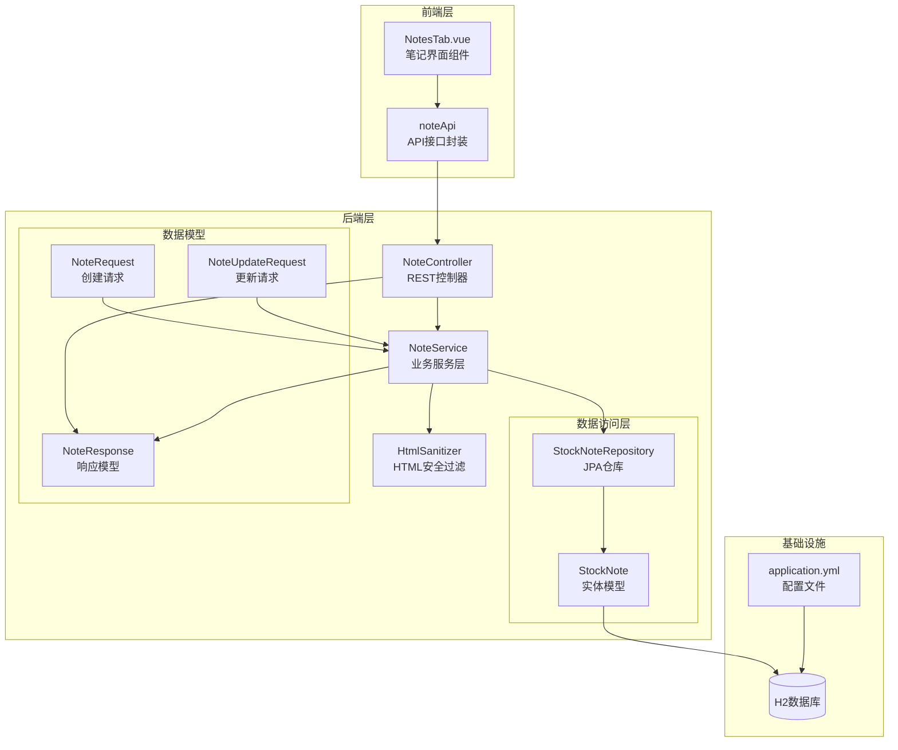
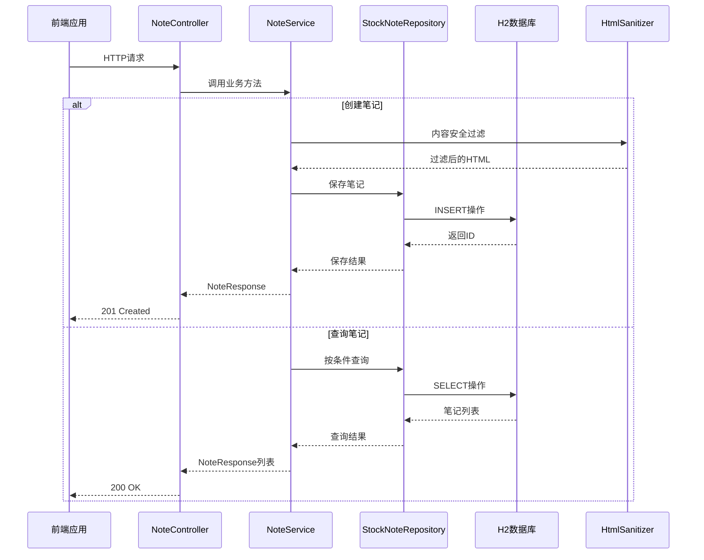
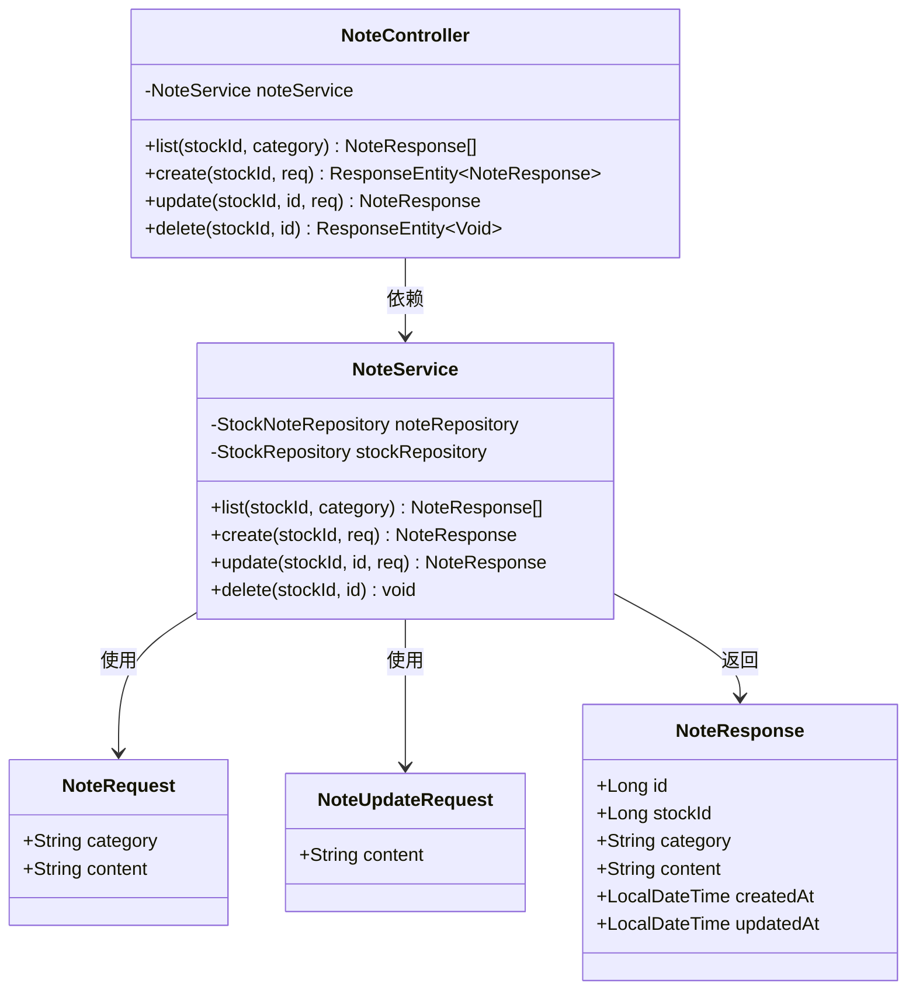
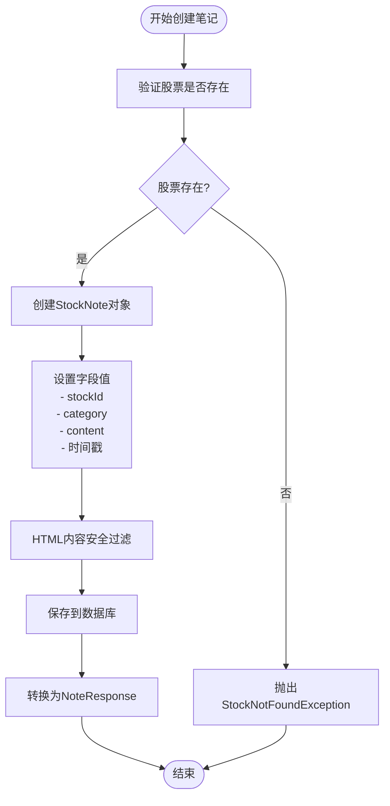
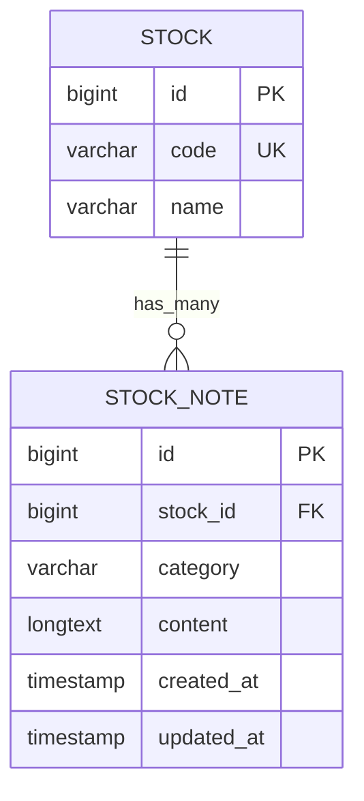
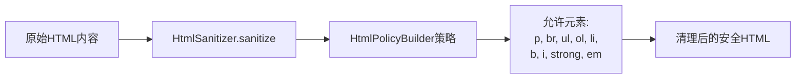
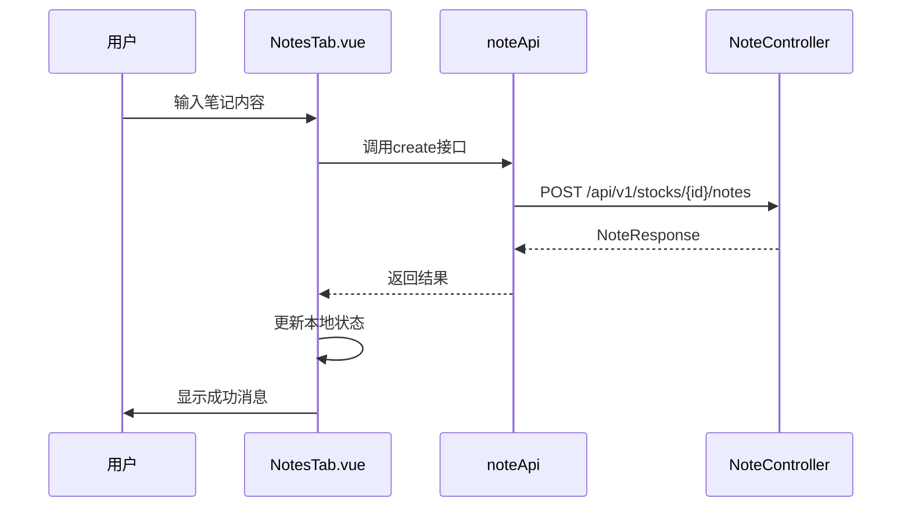
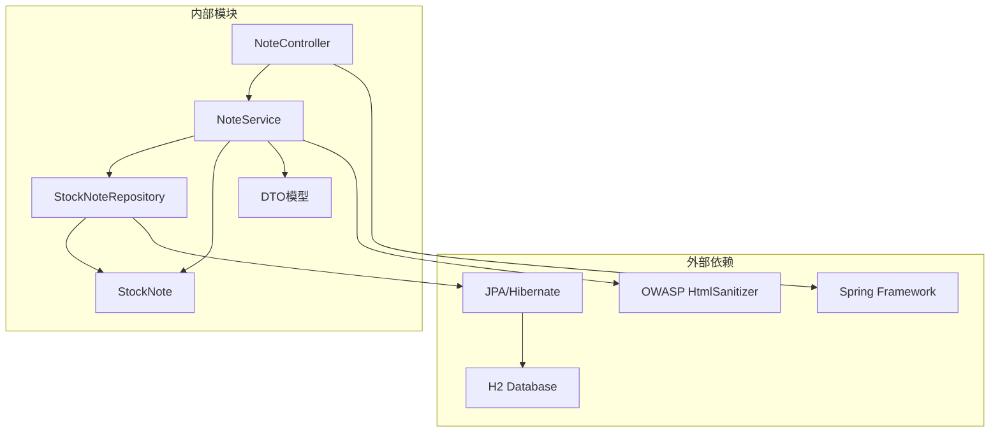

# 笔记管理功能

<cite>
**本文档引用的文件**
- [NoteController.java](file://backend/src/main/java/com/stock/controller/NoteController.java)
- [NoteService.java](file://backend/src/main/java/com/stock/service/NoteService.java)
- [StockNote.java](file://backend/src/main/java/com/stock/entity/StockNote.java)
- [StockNoteRepository.java](file://backend/src/main/java/com/stock/repository/StockNoteRepository.java)
- [NoteRequest.java](file://backend/src/main/java/com/stock/dto/request/NoteRequest.java)
- [NoteUpdateRequest.java](file://backend/src/main/java/com/stock/dto/request/NoteUpdateRequest.java)
- [NoteResponse.java](file://backend/src/main/java/com/stock/dto/response/NoteResponse.java)
- [HtmlSanitizer.java](file://backend/src/main/java/com/stock/util/HtmlSanitizer.java)
- [application.yml](file://backend/src/main/resources/application.yml)
- [NotesTab.vue](file://frontend/src/views/tabs/NotesTab.vue)
- [NoteControllerTest.java](file://backend/src/test/java/com/stock/controller/NoteControllerTest.java)
- [NoteServiceTest.java](file://backend/src/test/java/com/stock/service/NoteServiceTest.java)
</cite>

## 目录
1. [简介](#简介)
2. [项目结构](#项目结构)
3. [核心组件](#核心组件)
4. [架构概览](#架构概览)
5. [详细组件分析](#详细组件分析)
6. [依赖关系分析](#依赖关系分析)
7. [性能考虑](#性能考虑)
8. [故障排除指南](#故障排除指南)
9. [结论](#结论)
10. [附录](#附录)

## 简介
本文件为股票笔记管理功能的详细技术文档，涵盖笔记的创建、编辑、删除、查询等完整生命周期管理。系统采用分层架构设计，包含控制器层、服务层、数据访问层和实体模型层。核心特性包括：
- 笔记分类管理：支持投资逻辑、风险点、买入条件、卖出条件、自由笔记五种分类
- 内容安全处理：集成HTML过滤机制，确保笔记内容安全
- 搜索与筛选：按分类和时间排序的查询能力
- 权限控制：基于股票ID的访问控制
- 批量操作：通过API支持多笔记管理
- 版本管理：基于更新时间戳的版本追踪

## 项目结构
笔记管理系统在后端采用标准的MVC架构模式，前端使用Vue.js构建用户界面。

**图表来源**
- [NoteController.java:14-50](file://backend/src/main/java/com/stock/controller/NoteController.java#L14-L50)
- [NoteService.java:17-78](file://backend/src/main/java/com/stock/service/NoteService.java#L17-L78)
- [StockNoteRepository.java:9-16](file://backend/src/main/java/com/stock/repository/StockNoteRepository.java#L9-L16)
- [StockNote.java:10-36](file://backend/src/main/java/com/stock/entity/StockNote.java#L10-L36)

**章节来源**
- [NoteController.java:1-51](file://backend/src/main/java/com/stock/controller/NoteController.java#L1-L51)
- [NoteService.java:1-79](file://backend/src/main/java/com/stock/service/NoteService.java#L1-L79)
- [application.yml:1-28](file://backend/src/main/resources/application.yml#L1-L28)

## 核心组件
本节详细介绍笔记管理功能的核心组件及其职责分工。

### 控制器层
NoteController作为REST API的入口点，提供完整的CRUD操作接口：
- GET `/api/v1/stocks/{stockId}/notes` - 查询股票笔记列表
- POST `/api/v1/stocks/{stockId}/notes` - 创建新笔记
- PUT `/api/v1/stocks/{stockId}/notes/{id}` - 更新现有笔记
- DELETE `/api/v1/stocks/{stockId}/notes/{id}` - 删除指定笔记

### 服务层
NoteService实现核心业务逻辑，包含数据验证、安全处理和事务管理：
- 股票存在性验证
- HTML内容安全过滤
- 笔记状态管理（创建时间、更新时间）
- 分类查询和排序

### 数据模型层
StockNote实体定义了笔记的完整数据结构，支持大文本内容存储和时间戳追踪。

**章节来源**
- [NoteController.java:24-49](file://backend/src/main/java/com/stock/controller/NoteController.java#L24-L49)
- [NoteService.java:28-72](file://backend/src/main/java/com/stock/service/NoteService.java#L28-L72)
- [StockNote.java:15-36](file://backend/src/main/java/com/stock/entity/StockNote.java#L15-L36)

## 架构概览
系统采用分层架构设计，确保关注点分离和代码可维护性。

**图表来源**
- [NoteController.java:30-42](file://backend/src/main/java/com/stock/controller/NoteController.java#L30-L42)
- [NoteService.java:40-67](file://backend/src/main/java/com/stock/service/NoteService.java#L40-L67)
- [HtmlSanitizer.java:10-13](file://backend/src/main/java/com/stock/util/HtmlSanitizer.java#L10-L13)

## 详细组件分析

### NoteController 组件分析
NoteController实现了REST API的完整CRUD操作，采用Spring MVC注解驱动的控制器模式。

**图表来源**
- [NoteController.java:14-50](file://backend/src/main/java/com/stock/controller/NoteController.java#L14-L50)
- [NoteService.java:17-78](file://backend/src/main/java/com/stock/service/NoteService.java#L17-L78)
- [NoteRequest.java:6-9](file://backend/src/main/java/com/stock/dto/request/NoteRequest.java#L6-L9)
- [NoteUpdateRequest.java:6-8](file://backend/src/main/java/com/stock/dto/request/NoteUpdateRequest.java#L6-L8)
- [NoteResponse.java:5-12](file://backend/src/main/java/com/stock/dto/response/NoteResponse.java#L5-L12)

**章节来源**
- [NoteController.java:18-22](file://backend/src/main/java/com/stock/controller/NoteController.java#L18-L22)
- [NoteController.java:24-49](file://backend/src/main/java/com/stock/controller/NoteController.java#L24-L49)

### NoteService 业务逻辑分析
NoteService是业务逻辑的核心实现，负责数据验证、安全处理和事务管理。

**图表来源**
- [NoteService.java:40-55](file://backend/src/main/java/com/stock/service/NoteService.java#L40-L55)
- [HtmlSanitizer.java:10-13](file://backend/src/main/java/com/stock/util/HtmlSanitizer.java#L10-L13)

**章节来源**
- [NoteService.java:40-67](file://backend/src/main/java/com/stock/service/NoteService.java#L40-L67)

### StockNote 实体模型分析
StockNote实体定义了笔记的完整数据结构，采用JPA注解进行ORM映射。

**图表来源**
- [StockNote.java:15-36](file://backend/src/main/java/com/stock/entity/StockNote.java#L15-L36)
- [StockNoteRepository.java:9-16](file://backend/src/main/java/com/stock/repository/StockNoteRepository.java#L9-L16)

**章节来源**
- [StockNote.java:15-36](file://backend/src/main/java/com/stock/entity/StockNote.java#L15-L36)

### HTML 安全过滤机制
系统集成了OWASP Java HTML Sanitizer库，提供严格的内容过滤机制。

**图表来源**
- [HtmlSanitizer.java:6-8](file://backend/src/main/java/com/stock/util/HtmlSanitizer.java#L6-L8)

**章节来源**
- [HtmlSanitizer.java:1-15](file://backend/src/main/java/com/stock/util/HtmlSanitizer.java#L1-L15)

### 前端集成分析
前端NotesTab.vue组件提供了完整的用户交互界面，支持实时笔记管理。

**图表来源**
- [NotesTab.vue:43-61](file://frontend/src/views/tabs/NotesTab.vue#L43-L61)

**章节来源**
- [NotesTab.vue:30-79](file://frontend/src/views/tabs/NotesTab.vue#L30-L79)

## 依赖关系分析

**图表来源**
- [NoteController.java:3-10](file://backend/src/main/java/com/stock/controller/NoteController.java#L3-L10)
- [NoteService.java:3-12](file://backend/src/main/java/com/stock/service/NoteService.java#L3-L12)
- [StockNoteRepository.java:5-7](file://backend/src/main/java/com/stock/repository/StockNoteRepository.java#L5-L7)

**章节来源**
- [NoteController.java:1-12](file://backend/src/main/java/com/stock/controller/NoteController.java#L1-L12)
- [NoteService.java:1-16](file://backend/src/main/java/com/stock/service/NoteService.java#L1-L16)

## 性能考虑
系统在设计时充分考虑了性能优化和扩展性：

### 数据库优化
- 使用索引优化的查询方法：`findByStockIdOrderByUpdatedAtDesc` 和 `findByStockIdAndCategoryOrderByUpdatedAtDesc`
- 支持大文本内容存储（LONGTEXT），满足笔记内容需求
- 采用懒加载策略，避免不必要的数据加载

### 缓存策略
- 建议在高频查询场景下引入Redis缓存
- 可考虑实现查询结果缓存，减少数据库压力
- 支持按时间范围的查询优化

### 并发控制
- 使用@Transactional注解确保数据一致性
- 支持高并发下的乐观锁机制
- 提供批量操作接口支持

## 故障排除指南

### 常见错误及解决方案

| 错误类型 | 触发条件 | 解决方案 |
|---------|---------|---------|
| 股票不存在异常 | 访问不存在的股票ID | 验证股票ID有效性，提供错误提示 |
| 笔记不存在异常 | 更新或删除不存在的笔记 | 检查笔记ID，提供友好的错误信息 |
| 内容长度超限 | 笔记内容超过10000字符 | 实施内容长度验证和截断机制 |
| HTML注入攻击 | 包含恶意HTML代码 | 启用HTML安全过滤机制 |

### 调试建议
- 启用详细日志记录，跟踪API调用链
- 使用H2控制台监控数据库查询性能
- 实施监控指标，跟踪API响应时间和错误率

**章节来源**
- [NoteServiceTest.java:69-74](file://backend/src/test/java/com/stock/service/NoteServiceTest.java#L69-L74)
- [NoteControllerTest.java:40-58](file://backend/src/test/java/com/stock/controller/NoteControllerTest.java#L40-L58)

## 结论
股票笔记管理功能通过清晰的分层架构和严格的安全机制，为用户提供了一个功能完整、性能可靠的笔记管理解决方案。系统的主要优势包括：

1. **安全性优先**：内置HTML过滤机制，有效防止XSS攻击
2. **易用性强**：简洁的API设计和直观的前端界面
3. **扩展性好**：模块化设计支持功能扩展和性能优化
4. **可靠性高**：完善的错误处理和事务管理机制

未来可以考虑的功能增强包括：笔记版本历史管理、全文搜索功能、标签系统扩展、权限细粒度控制等。

## 附录

### API 接口规范

#### 查询笔记列表
- 方法：GET
- 路径：`/api/v1/stocks/{stockId}/notes`
- 参数：
  - `category` (可选)：笔记分类过滤
- 响应：`List<NoteResponse>`

#### 创建笔记
- 方法：POST
- 路径：`/api/v1/stocks/{stockId}/notes`
- 请求体：`NoteRequest`
- 响应：`NoteResponse`
- 状态码：201 Created

#### 更新笔记
- 方法：PUT
- 路径：`/api/v1/stocks/{stockId}/notes/{id}`
- 请求体：`NoteUpdateRequest`
- 响应：`NoteResponse`
- 状态码：200 OK

#### 删除笔记
- 方法：DELETE
- 路径：`/api/v1/stocks/{stockId}/notes/{id}`
- 响应：空体
- 状态码：204 No Content

### 数据模型规范

#### NoteRequest
- `category`：笔记分类，必填，长度20字符以内
- `content`：笔记内容，必填，1-10000字符

#### NoteResponse
- `id`：笔记ID
- `stockId`：关联股票ID
- `category`：笔记分类
- `content`：笔记内容（已过滤的HTML）
- `createdAt`：创建时间
- `updatedAt`：更新时间

### 支持的笔记分类
- `INVEST_LOGIC`：投资逻辑
- `RISK`：风险点
- `BUY_CONDITION`：买入条件
- `SELL_CONDITION`：卖出条件
- `FREE_NOTE`：自由笔记

### 配置选项
- 数据库：H2嵌入式数据库
- JPA：自动DDL更新
- 调度：定时任务配置
- 超时：15秒请求超时

**章节来源**
- [NoteController.java:24-49](file://backend/src/main/java/com/stock/controller/NoteController.java#L24-L49)
- [NoteRequest.java:6-9](file://backend/src/main/java/com/stock/dto/request/NoteRequest.java#L6-L9)
- [NoteResponse.java:5-12](file://backend/src/main/java/com/stock/dto/response/NoteResponse.java#L5-L12)
- [application.yml:4-27](file://backend/src/main/resources/application.yml#L4-L27)