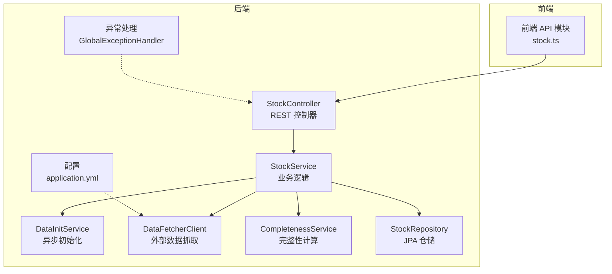
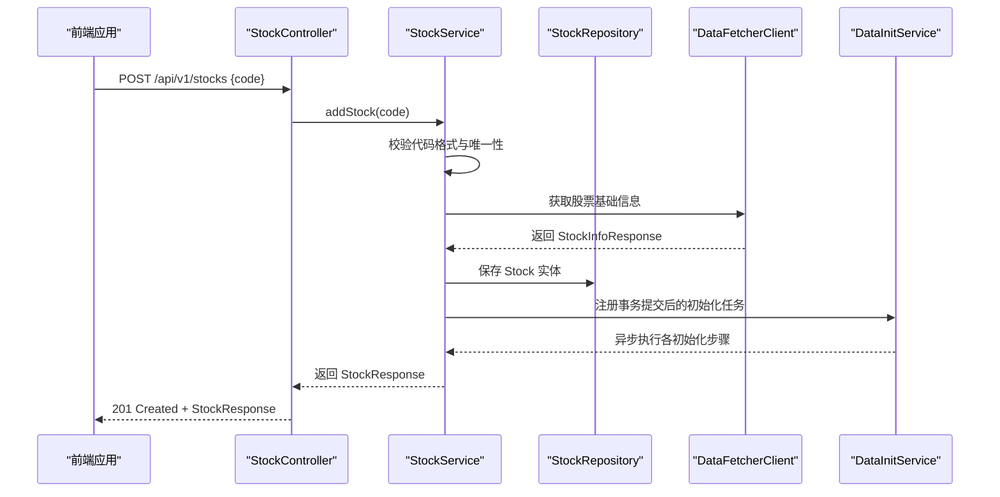
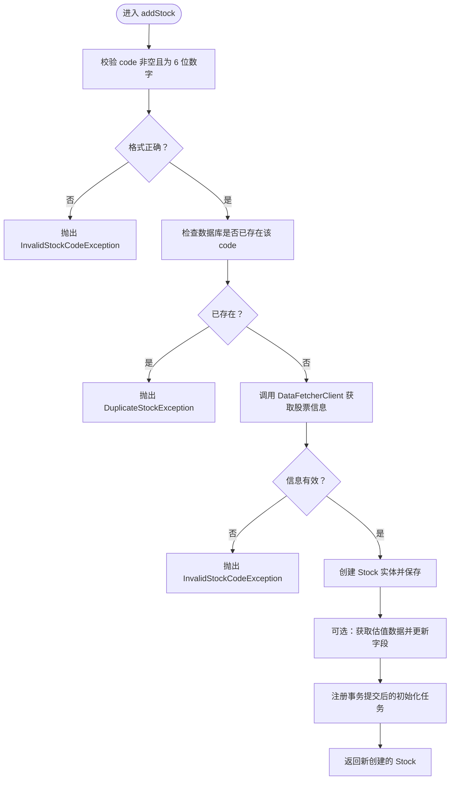
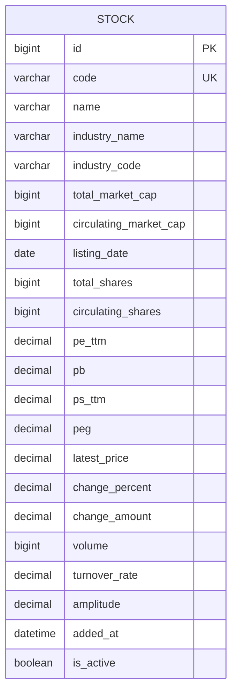
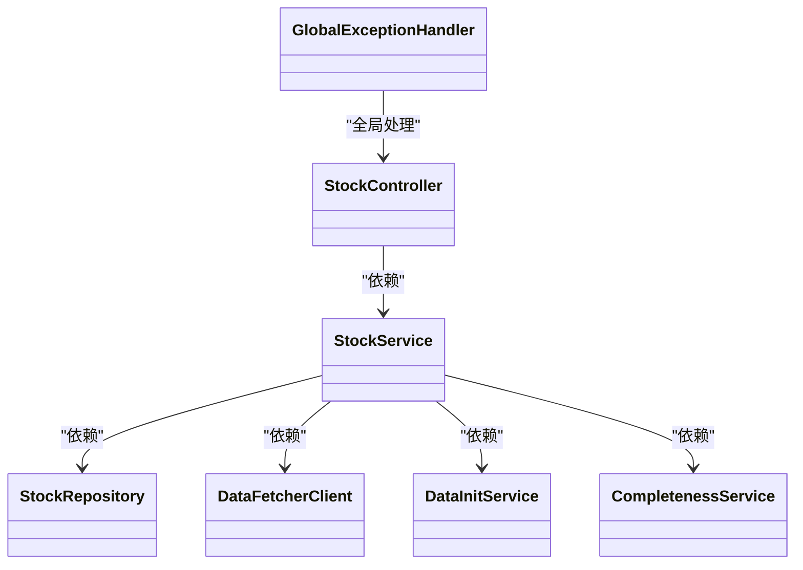

# 股票管理功能

<cite>
**本文档引用的文件**
- [StockController.java](file://backend/src/main/java/com/stock/controller/StockController.java)
- [StockService.java](file://backend/src/main/java/com/stock/service/StockService.java)
- [Stock.java](file://backend/src/main/java/com/stock/entity/Stock.java)
- [AddStockRequest.java](file://backend/src/main/java/com/stock/dto/request/AddStockRequest.java)
- [StockResponse.java](file://backend/src/main/java/com/stock/dto/response/StockResponse.java)
- [StockListItemResponse.java](file://backend/src/main/java/com/stock/dto/response/StockListItemResponse.java)
- [DataFetcherClient.java](file://backend/src/main/java/com/stock/client/DataFetcherClient.java)
- [DataInitService.java](file://backend/src/main/java/com/stock/service/DataInitService.java)
- [CompletenessService.java](file://backend/src/main/java/com/stock/service/CompletenessService.java)
- [StockRepository.java](file://backend/src/main/java/com/stock/repository/StockRepository.java)
- [DuplicateStockException.java](file://backend/src/main/java/com/stock/exception/DuplicateStockException.java)
- [InvalidStockCodeException.java](file://backend/src/main/java/com/stock/exception/InvalidStockCodeException.java)
- [StockNotFoundException.java](file://backend/src/main/java/com/stock/exception/StockNotFoundException.java)
- [GlobalExceptionHandler.java](file://backend/src/main/java/com/stock/exception/GlobalExceptionHandler.java)
- [application.yml](file://backend/src/main/resources/application.yml)
- [stock.ts](file://frontend/src/api/stock.ts)
- [StockControllerTest.java](file://backend/src/test/java/com/stock/controller/StockControllerTest.java)
</cite>

## 目录
1. [简介](#简介)
2. [项目结构](#项目结构)
3. [核心组件](#核心组件)
4. [架构总览](#架构总览)
5. [详细组件分析](#详细组件分析)
6. [依赖关系分析](#依赖关系分析)
7. [性能考虑](#性能考虑)
8. [故障排除指南](#故障排除指南)
9. [结论](#结论)
10. [附录](#附录)

## 简介
本文件面向股票管理功能，系统性阐述股票的添加、删除、查询等核心操作的实现原理与使用方法。内容覆盖：
- REST API 设计：StockController 的接口定义、请求参数与响应格式
- 业务逻辑：StockService 的添加/删除/查询流程与数据一致性保障
- 数据模型：Stock 实体的字段与约束
- 验证规则：股票代码格式校验与重复添加处理
- 前后端交互：前端如何调用后端接口以及状态展示
- 错误处理：异常类型、HTTP 状态码与统一错误响应

## 项目结构
后端采用分层架构（控制器、服务、仓储、实体、DTO），前端通过封装的 API 模块与后端交互。

图表来源
- [StockController.java:17-56](file://backend/src/main/java/com/stock/controller/StockController.java#L17-L56)
- [StockService.java:28-91](file://backend/src/main/java/com/stock/service/StockService.java#L28-L91)
- [DataInitService.java:17-40](file://backend/src/main/java/com/stock/service/DataInitService.java#L17-L40)
- [DataFetcherClient.java:14-24](file://backend/src/main/java/com/stock/client/DataFetcherClient.java#L14-L24)
- [CompletenessService.java:13-44](file://backend/src/main/java/com/stock/service/CompletenessService.java#L13-L44)
- [StockRepository.java:10-17](file://backend/src/main/java/com/stock/repository/StockRepository.java#L10-L17)
- [GlobalExceptionHandler.java:7-32](file://backend/src/main/java/com/stock/exception/GlobalExceptionHandler.java#L7-L32)
- [application.yml:19-22](file://backend/src/main/resources/application.yml#L19-L22)

章节来源
- [StockController.java:17-56](file://backend/src/main/java/com/stock/controller/StockController.java#L17-L56)
- [application.yml:19-22](file://backend/src/main/resources/application.yml#L19-L22)

## 核心组件
- StockController：提供 /api/v1/stocks 的 REST 接口，负责接收请求、调用服务层并返回响应。
- StockService：核心业务逻辑，包含股票添加（含验证与异步初始化）、删除（级联清理）、查询列表与详情。
- Stock 实体：数据库映射，包含股票基础信息与估值指标等字段。
- DTO：AddStockRequest（请求体）、StockResponse/StockListItemResponse（响应体）。
- DataFetcherClient：调用外部数据抓取服务，获取股票基础信息与估值数据。
- DataInitService：异步初始化股票数据，按步骤顺序执行并记录状态。
- 异常与全局处理器：统一处理业务异常与参数校验异常，返回标准错误响应。

章节来源
- [StockController.java:29-55](file://backend/src/main/java/com/stock/controller/StockController.java#L29-L55)
- [StockService.java:93-163](file://backend/src/main/java/com/stock/service/StockService.java#L93-L163)
- [Stock.java:18-85](file://backend/src/main/java/com/stock/entity/Stock.java#L18-L85)
- [AddStockRequest.java:7-9](file://backend/src/main/java/com/stock/dto/request/AddStockRequest.java#L7-L9)
- [StockResponse.java:7-24](file://backend/src/main/java/com/stock/dto/response/StockResponse.java#L7-L24)
- [StockListItemResponse.java:6-22](file://backend/src/main/java/com/stock/dto/response/StockListItemResponse.java#L6-L22)
- [DataFetcherClient.java:26-93](file://backend/src/main/java/com/stock/client/DataFetcherClient.java#L26-L93)
- [DataInitService.java:42-71](file://backend/src/main/java/com/stock/service/DataInitService.java#L42-L71)
- [GlobalExceptionHandler.java:9-31](file://backend/src/main/java/com/stock/exception/GlobalExceptionHandler.java#L9-L31)

## 架构总览
下图展示了从前端到后端的关键交互路径，以及添加股票时的异步初始化流程。

图表来源
- [StockController.java:29-34](file://backend/src/main/java/com/stock/controller/StockController.java#L29-L34)
- [StockService.java:93-163](file://backend/src/main/java/com/stock/service/StockService.java#L93-L163)
- [DataFetcherClient.java:26-29](file://backend/src/main/java/com/stock/client/DataFetcherClient.java#L26-L29)
- [DataInitService.java:42-71](file://backend/src/main/java/com/stock/service/DataInitService.java#L42-L71)

## 详细组件分析

### REST API 设计（StockController）
- 路径前缀：/api/v1/stocks
- 接口一览
  - POST /api/v1/stocks：添加股票
    - 请求体：AddStockRequest（仅包含 6 位数字的 code）
    - 成功响应：201 Created，Body：StockResponse
  - DELETE /api/v1/stocks/{id}：删除股票
    - 成功响应：204 No Content
  - GET /api/v1/stocks：查询股票列表
    - 成功响应：200 OK，Body：StockListItemResponse[]
  - GET /api/v1/stocks/{id}：查询单个股票详情
    - 成功响应：200 OK，Body：StockResponse
  - GET /api/v1/stocks/{id}/init-status：查询初始化进度
    - 成功响应：200 OK，Body：InitStatusResponse

参数与返回值要点
- 请求体参数均通过 Spring MVC 参数校验，非法参数会触发统一错误响应（400）。
- 列表项包含“数据分析完整度”字段，由 CompletenessService 计算得出。

章节来源
- [StockController.java:29-55](file://backend/src/main/java/com/stock/controller/StockController.java#L29-L55)
- [AddStockRequest.java:7-9](file://backend/src/main/java/com/stock/dto/request/AddStockRequest.java#L7-L9)
- [StockResponse.java:7-24](file://backend/src/main/java/com/stock/dto/response/StockResponse.java#L7-L24)
- [StockListItemResponse.java:6-22](file://backend/src/main/java/com/stock/dto/response/StockListItemResponse.java#L6-L22)

### 业务逻辑（StockService）
- 添加股票（addStock）
  - 输入校验：非空且必须是 6 位纯数字
  - 唯一性检查：数据库中是否存在相同 code
  - 外部数据拉取：调用 DataFetcherClient 获取股票基础信息
  - 实体持久化：填充 Stock 字段并保存
  - 估值数据同步：尝试获取估值数据并更新部分字段
  - 异步初始化：在事务提交后触发 DataInitService 初始化各数据模块
- 删除股票（deleteStock）
  - 先查找股票，不存在则抛出 StockNotFoundException
  - 依次删除该股票相关的所有数据表记录（日线、资金流、利润表、财务报表、股东、研报、技术指标、行业分析、产品/地区分解、竞品、笔记、价格提醒、信号、初始化状态等）
  - 最后删除 Stock 主记录
- 查询列表（listStocks）
  - 查询所有激活的股票，计算每只股票的“数据分析完整度”，组装为 StockListItemResponse 列表
- 查询详情（getStock）
  - 根据 id 查询 Stock 并组装为 StockResponse

图表来源
- [StockService.java:93-163](file://backend/src/main/java/com/stock/service/StockService.java#L93-L163)
- [DataFetcherClient.java:26-29](file://backend/src/main/java/com/stock/client/DataFetcherClient.java#L26-L29)

章节来源
- [StockService.java:93-189](file://backend/src/main/java/com/stock/service/StockService.java#L93-L189)
- [StockRepository.java:12-16](file://backend/src/main/java/com/stock/repository/StockRepository.java#L12-L16)

### 数据模型（Stock 实体）
Stock 实体映射到数据库表 stock，包含以下关键字段：
- 基础信息：code（6 位唯一）、name、industryName、industryCode
- 财务与市值：totalMarketCap、circulatingMarketCap、listingDate、totalShares、circulatingShares
- 估值指标：peTtm、pb、psTtm、peg
- 实时行情：latestPrice、changePercent、changeAmount、volume、turnoverRate、amplitude
- 系统字段：addedAt、isActive

图表来源
- [Stock.java:18-85](file://backend/src/main/java/com/stock/entity/Stock.java#L18-L85)

章节来源
- [Stock.java:18-85](file://backend/src/main/java/com/stock/entity/Stock.java#L18-L85)

### 股票代码验证规则与重复添加处理
- 验证规则
  - 必填且长度为 6 位
  - 仅允许数字
  - 后端进一步校验数据库唯一性
- 重复添加处理
  - 若 code 已存在，抛出 DuplicateStockException（409）
- 外部数据有效性
  - 若无法获取有效股票信息，抛出 InvalidStockCodeException（400）

章节来源
- [AddStockRequest.java:7-9](file://backend/src/main/java/com/stock/dto/request/AddStockRequest.java#L7-L9)
- [StockService.java:95-105](file://backend/src/main/java/com/stock/service/StockService.java#L95-L105)
- [DuplicateStockException.java:2-4](file://backend/src/main/java/com/stock/exception/DuplicateStockException.java#L2-L4)
- [InvalidStockCodeException.java:2-4](file://backend/src/main/java/com/stock/exception/InvalidStockCodeException.java#L2-L4)

### 前后端交互流程
- 前端 API 封装
  - 提供 list/add/delete/get/initStatus/completeness 等方法
  - 统一的响应类型定义（StockListItem、StockResponse、InitStatusResponse 等）
- 调用示例（基于前端封装）
  - 新增：stockApi.add("600519")
  - 列表：stockApi.list()
  - 详情：stockApi.get(1)
  - 删除：stockApi.delete(1)
  - 初始化状态：stockApi.initStatus(1)

章节来源
- [stock.ts:53-60](file://frontend/src/api/stock.ts#L53-L60)

### 错误处理策略
- 异常类型与状态码
  - 股票不存在：StockNotFoundException → 404
  - 股票已存在：DuplicateStockException → 409
  - 无效股票代码：InvalidStockCodeException → 400
  - 数据抓取失败：DataFetchException → 503
  - 参数校验失败：MethodArgumentNotValidException → 400
- 统一错误响应
  - 所有异常经 GlobalExceptionHandler 转换为包含状态码与消息的 ErrorResponse

章节来源
- [GlobalExceptionHandler.java:9-31](file://backend/src/main/java/com/stock/exception/GlobalExceptionHandler.java#L9-L31)
- [StockNotFoundException.java:2-5](file://backend/src/main/java/com/stock/exception/StockNotFoundException.java#L2-L5)
- [DuplicateStockException.java:2-4](file://backend/src/main/java/com/stock/exception/DuplicateStockException.java#L2-L4)
- [InvalidStockCodeException.java:2-4](file://backend/src/main/java/com/stock/exception/InvalidStockCodeException.java#L2-L4)

## 依赖关系分析
- 控制器依赖服务层；服务层依赖仓储、外部客户端与初始化服务；异常处理器全局生效。
- 配置文件指定外部数据抓取服务地址，影响 DataFetcherClient 的行为。

图表来源
- [StockController.java:21-27](file://backend/src/main/java/com/stock/controller/StockController.java#L21-L27)
- [StockService.java:51-91](file://backend/src/main/java/com/stock/service/StockService.java#L51-L91)
- [GlobalExceptionHandler.java:7-32](file://backend/src/main/java/com/stock/exception/GlobalExceptionHandler.java#L7-L32)

章节来源
- [StockController.java:21-27](file://backend/src/main/java/com/stock/controller/StockController.java#L21-L27)
- [StockService.java:51-91](file://backend/src/main/java/com/stock/service/StockService.java#L51-L91)
- [application.yml:19-22](file://backend/src/main/resources/application.yml#L19-L22)

## 性能考虑
- 异步初始化：添加完成后通过 DataInitService 在事务提交后异步执行多步骤初始化，避免阻塞主流程。
- 逐步延迟：初始化步骤间增加固定延迟，降低外部数据源压力。
- 完整度计算：CompletenessService 对多个维度进行快速检查，复杂度与数据量线性相关。
- 外部调用超时：DataFetcherClient 的超时时间可在配置中调整，以平衡稳定性与响应速度。

章节来源
- [DataInitService.java:42-71](file://backend/src/main/java/com/stock/service/DataInitService.java#L42-L71)
- [CompletenessService.java:61-112](file://backend/src/main/java/com/stock/service/CompletenessService.java#L61-L112)
- [application.yml:20-22](file://backend/src/main/resources/application.yml#L20-L22)

## 故障排除指南
- 添加股票返回 400（无效股票代码）
  - 检查 code 是否为 6 位纯数字
  - 确认外部数据抓取服务可达且返回有效信息
- 添加股票返回 409（股票已存在）
  - 确认数据库中是否已存在该 code
- 删除股票返回 404
  - 确认 id 是否正确
- 初始化状态查询
  - 使用 GET /api/v1/stocks/{id}/init-status 查看各步骤状态
- 单元测试参考
  - 可参考 StockControllerTest 中的断言与期望响应，验证接口行为

章节来源
- [StockControllerTest.java:51-114](file://backend/src/test/java/com/stock/controller/StockControllerTest.java#L51-L114)
- [GlobalExceptionHandler.java:9-31](file://backend/src/main/java/com/stock/exception/GlobalExceptionHandler.java#L9-L31)

## 结论
股票管理功能通过清晰的分层设计实现了稳定的添加、删除与查询能力。StockController 提供简洁的 REST 接口，StockService 在添加流程中完成严格的校验与异步初始化，Stock 实体与 DTO 明确了数据边界。配合全局异常处理与前端 API 封装，系统具备良好的可用性与可维护性。

## 附录

### API 调用示例与参数说明
- 新增股票
  - 方法：POST /api/v1/stocks
  - 请求体：{"code":"600519"}
  - 成功响应：201 Created，Body：StockResponse
- 删除股票
  - 方法：DELETE /api/v1/stocks/{id}
  - 成功响应：204 No Content
- 查询股票列表
  - 方法：GET /api/v1/stocks
  - 成功响应：200 OK，Body：StockListItemResponse[]
- 查询单个股票详情
  - 方法：GET /api/v1/stocks/{id}
  - 成功响应：200 OK，Body：StockResponse
- 查询初始化状态
  - 方法：GET /api/v1/stocks/{id}/init-status
  - 成功响应：200 OK，Body：InitStatusResponse

章节来源
- [StockController.java:29-55](file://backend/src/main/java/com/stock/controller/StockController.java#L29-L55)
- [stock.ts:53-60](file://frontend/src/api/stock.ts#L53-L60)