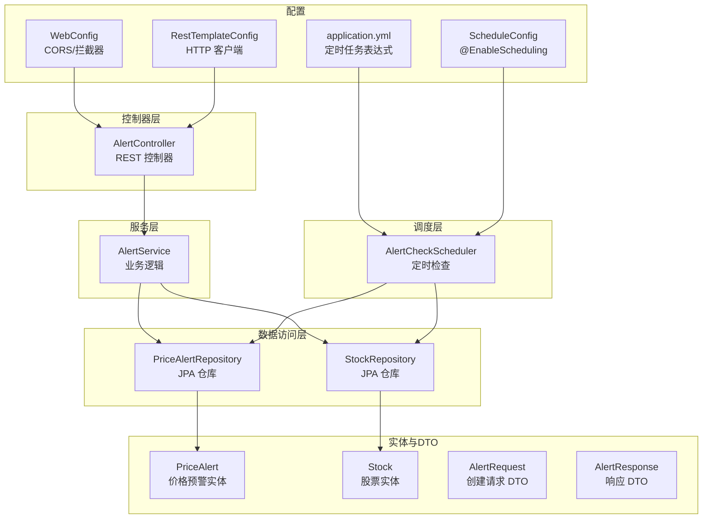
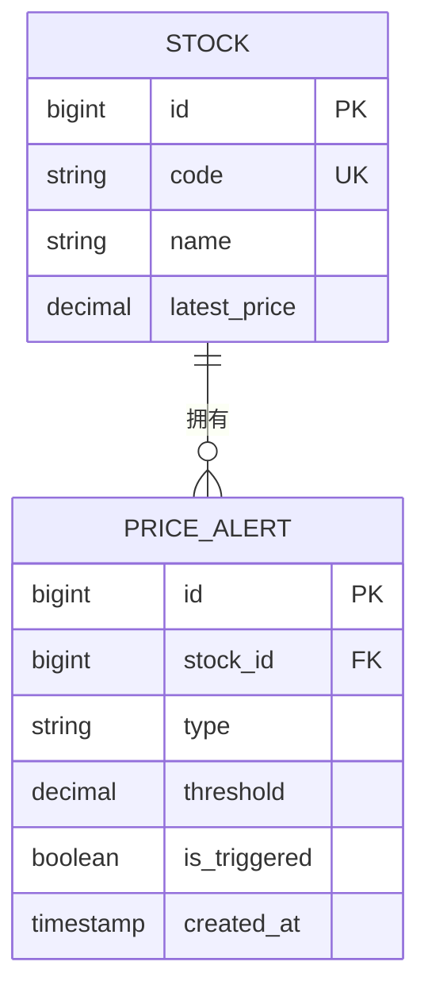
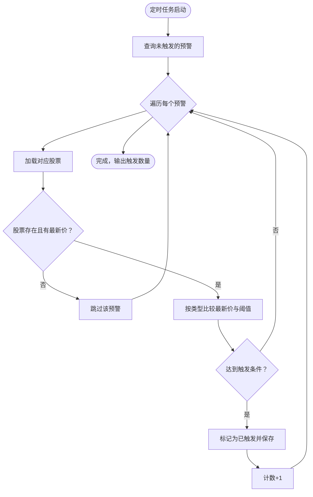
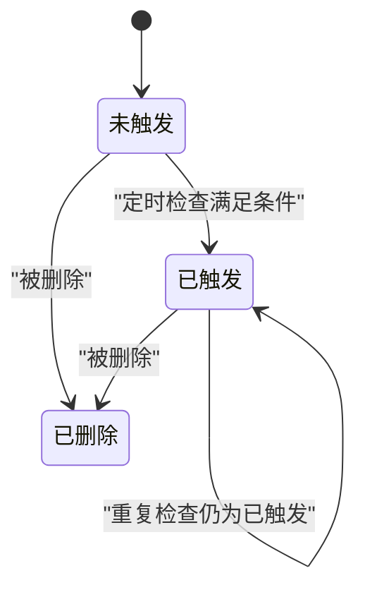
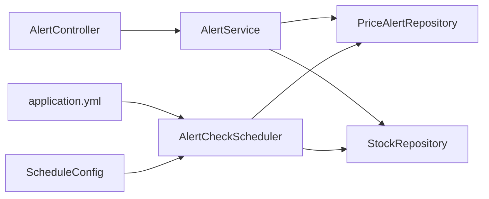

# 预警系统

<cite>
**本文引用的文件**
- [AlertController.java](file://backend/src/main/java/com/stock/controller/AlertController.java)
- [AlertService.java](file://backend/src/main/java/com/stock/service/AlertService.java)
- [PriceAlert.java](file://backend/src/main/java/com/stock/entity/PriceAlert.java)
- [PriceAlertRepository.java](file://backend/src/main/java/com/stock/repository/PriceAlertRepository.java)
- [AlertRequest.java](file://backend/src/main/java/com/stock/dto/request/AlertRequest.java)
- [AlertResponse.java](file://backend/src/main/java/com/stock/dto/response/AlertResponse.java)
- [AlertCheckScheduler.java](file://backend/src/main/java/com/stock/scheduler/AlertCheckScheduler.java)
- [Stock.java](file://backend/src/main/java/com/stock/entity/Stock.java)
- [StockRepository.java](file://backend/src/main/java/com/stock/repository/StockRepository.java)
- [application.yml](file://backend/src/main/resources/application.yml)
- [AlertControllerTest.java](file://backend/src/test/java/com/stock/controller/AlertControllerTest.java)
- [AlertServiceTest.java](file://backend/src/test/java/com/stock/service/AlertServiceTest.java)
- [WebConfig.java](file://backend/src/main/java/com/stock/config/WebConfig.java)
- [ScheduleConfig.java](file://backend/src/main/java/com/stock/config/ScheduleConfig.java)
- [RestTemplateConfig.java](file://backend/src/main/java/com/stock/config/RestTemplateConfig.java)
</cite>

## 目录
1. [简介](#简介)
2. [项目结构](#项目结构)
3. [核心组件](#核心组件)
4. [架构总览](#架构总览)
5. [详细组件分析](#详细组件分析)
6. [依赖分析](#依赖分析)
7. [性能考虑](#性能考虑)
8. [故障排查指南](#故障排查指南)
9. [结论](#结论)
10. [附录](#附录)

## 简介
本文件为“预警系统”的技术文档，聚焦于价格预警功能的完整实现，涵盖以下方面：
- REST API：AlertController 的端点定义与请求/响应格式
- 业务逻辑：AlertService 的规则校验、持久化与查询
- 数据模型：PriceAlert 实体及其与 Stock 的关联
- 触发机制：AlertCheckScheduler 周期性检查与触发条件判断
- 配置与调度：应用配置中的定时任务表达式
- 历史与状态：预警状态生命周期与清理策略
- 示例与最佳实践：规则配置、API 调用与历史查询方法

## 项目结构
预警系统位于后端模块中，采用分层架构（Controller → Service → Repository），数据访问基于 JPA/Hibernate，定时任务通过 Spring Scheduling 驱动。



图表来源
- [AlertController.java:13-39](file://backend/src/main/java/com/stock/controller/AlertController.java#L13-L39)
- [AlertService.java:15-62](file://backend/src/main/java/com/stock/service/AlertService.java#L15-L62)
- [PriceAlertRepository.java:9-16](file://backend/src/main/java/com/stock/repository/PriceAlertRepository.java#L9-L16)
- [StockRepository.java:10-17](file://backend/src/main/java/com/stock/repository/StockRepository.java#L10-L17)
- [PriceAlert.java:14-36](file://backend/src/main/java/com/stock/entity/PriceAlert.java#L14-L36)
- [Stock.java:16-84](file://backend/src/main/java/com/stock/entity/Stock.java#L16-L84)
- [AlertCheckScheduler.java:14-51](file://backend/src/main/java/com/stock/scheduler/AlertCheckScheduler.java#L14-L51)
- [application.yml:19-27](file://backend/src/main/resources/application.yml#L19-L27)
- [WebConfig.java:44-51](file://backend/src/main/java/com/stock/config/WebConfig.java#L44-L51)
- [ScheduleConfig.java:55-57](file://backend/src/main/java/com/stock/config/ScheduleConfig.java#L55-L57)
- [RestTemplateConfig.java:61-68](file://backend/src/main/java/com/stock/config/RestTemplateConfig.java#L61-L68)

章节来源
- [AlertController.java:13-39](file://backend/src/main/java/com/stock/controller/AlertController.java#L13-L39)
- [AlertService.java:15-62](file://backend/src/main/java/com/stock/service/AlertService.java#L15-L62)
- [PriceAlertRepository.java:9-16](file://backend/src/main/java/com/stock/repository/PriceAlertRepository.java#L9-L16)
- [StockRepository.java:10-17](file://backend/src/main/java/com/stock/repository/StockRepository.java#L10-L17)
- [PriceAlert.java:14-36](file://backend/src/main/java/com/stock/entity/PriceAlert.java#L14-L36)
- [Stock.java:16-84](file://backend/src/main/java/com/stock/entity/Stock.java#L16-L84)
- [AlertCheckScheduler.java:14-51](file://backend/src/main/java/com/stock/scheduler/AlertCheckScheduler.java#L14-L51)
- [application.yml:19-27](file://backend/src/main/resources/application.yml#L19-L27)

## 核心组件
- AlertController：提供 /api/v1/alerts 的 REST 接口，支持列表查询、创建与删除。
- AlertService：封装业务规则，负责校验股票存在性、保存预警、查询历史。
- PriceAlert：预警数据模型，包含股票标识、类型、阈值、触发状态与创建时间。
- AlertCheckScheduler：定时扫描未触发的预警，按类型比较最新股价与阈值，触发并持久化。
- Stock/StockRepository：持有最新股价等信息，供预警检查使用。

章节来源
- [AlertController.java:23-38](file://backend/src/main/java/com/stock/controller/AlertController.java#L23-L38)
- [AlertService.java:26-61](file://backend/src/main/java/com/stock/service/AlertService.java#L26-L61)
- [PriceAlert.java:16-36](file://backend/src/main/java/com/stock/entity/PriceAlert.java#L16-L36)
- [AlertCheckScheduler.java:26-50](file://backend/src/main/java/com/stock/scheduler/AlertCheckScheduler.java#L26-L50)
- [Stock.java:62-63](file://backend/src/main/java/com/stock/entity/Stock.java#L62-L63)

## 架构总览
预警系统遵循典型的 MVC 分层与领域驱动设计：
- 控制器层接收请求，进行参数校验与响应封装
- 服务层编排业务流程，处理异常与事务
- 数据访问层通过 JPA 与数据库交互
- 定时任务层周期性执行触发检查
- 配置层提供调度表达式与跨域、HTTP 客户端等基础能力

```mermaid
sequenceDiagram
participant C as "客户端"
participant CTRL as "AlertController"
participant SVC as "AlertService"
participant PAR as "PriceAlertRepository"
participant SR as "StockRepository"
Note over C,CTRL : 创建预警
C->>CTRL : POST /api/v1/alerts
CTRL->>SVC : create(AlertRequest)
SVC->>SR : findById(stockId)
SR-->>SVC : Stock
SVC->>PAR : save(PriceAlert)
PAR-->>SVC : PriceAlert
SVC-->>CTRL : AlertResponse
CTRL-->>C : 201 Created
Note over C,SVC : 定时检查触发
SVC->>PAR : findByIsTriggeredFalse()
PAR-->>SVC : List<PriceAlert>
loop 遍历未触发预警
SVC->>SR : findById(alert.stockId)
SR-->>SVC : Stock
SVC->>SVC : 比较 latestPrice 与阈值
alt 达到触发条件
SVC->>PAR : save(alert setIsTriggered=true)
end
end
```

图表来源
- [AlertController.java:28-32](file://backend/src/main/java/com/stock/controller/AlertController.java#L28-L32)
- [AlertService.java:41-56](file://backend/src/main/java/com/stock/service/AlertService.java#L41-L56)
- [PriceAlertRepository.java:11-13](file://backend/src/main/java/com/stock/repository/PriceAlertRepository.java#L11-L13)
- [StockRepository.java:10-17](file://backend/src/main/java/com/stock/repository/StockRepository.java#L10-L17)
- [AlertCheckScheduler.java:26-50](file://backend/src/main/java/com/stock/scheduler/AlertCheckScheduler.java#L26-L50)

## 详细组件分析

### AlertController：REST API
- GET /api/v1/alerts：支持按股票 ID 过滤查询，返回预警列表
- POST /api/v1/alerts：创建新预警，返回 201 与新建对象
- DELETE /api/v1/alerts/{id}：删除指定预警，返回 204

请求/响应要点
- 请求体：AlertRequest（stockId、type、threshold）
- 响应体：AlertResponse（包含 stockName、type、threshold、isTriggered、latestPrice）

章节来源
- [AlertController.java:23-38](file://backend/src/main/java/com/stock/controller/AlertController.java#L23-L38)
- [AlertRequest.java:6-10](file://backend/src/main/java/com/stock/dto/request/AlertRequest.java#L6-L10)
- [AlertResponse.java:5-13](file://backend/src/main/java/com/stock/dto/response/AlertResponse.java#L5-L13)

### AlertService：业务逻辑
职责与流程
- 列表查询：根据 stockId 查询或全量查询，组装 AlertResponse，填充股票名称与最新价
- 创建预警：校验股票存在性，构造 PriceAlert 并持久化，返回 AlertResponse
- 删除预警：按 ID 删除

事务与异常
- 使用 @Transactional 包裹写操作
- 股票不存在抛出 StockNotFoundException

复杂度与性能
- 列表查询：O(n) 遍历预警并查询股票信息
- 创建/删除：O(1) 持久化操作

章节来源
- [AlertService.java:26-61](file://backend/src/main/java/com/stock/service/AlertService.java#L26-L61)
- [StockNotFoundException.java:1-6](file://backend/src/main/java/com/stock/exception/StockNotFoundException.java#L1-L6)

### PriceAlert 实体：数据模型
字段与约束
- id：主键自增
- stockId：外键关联 Stock.id
- type：预警类型（如 ABOVE、BELOW）
- threshold：阈值（BigDecimal，精度与刻度由表结构定义）
- isTriggered：是否已触发，默认 false
- createdAt：创建时间



图表来源
- [Stock.java:19-27](file://backend/src/main/java/com/stock/entity/Stock.java#L19-L27)
- [PriceAlert.java:18-35](file://backend/src/main/java/com/stock/entity/PriceAlert.java#L18-L35)

章节来源
- [PriceAlert.java:16-36](file://backend/src/main/java/com/stock/entity/PriceAlert.java#L16-L36)
- [Stock.java:16-84](file://backend/src/main/java/com/stock/entity/Stock.java#L16-L84)

### AlertCheckScheduler：触发机制
- 定时策略：由 application.yml 中的 cron 表达式控制
- 执行逻辑：查询未触发的预警，逐条读取对应股票的最新价，按类型比较阈值，满足则标记为已触发并持久化
- 日志：开始与结束日志输出触发数量统计



图表来源
- [AlertCheckScheduler.java:26-50](file://backend/src/main/java/com/stock/scheduler/AlertCheckScheduler.java#L26-L50)
- [application.yml](file://backend/src/main/resources/application.yml#L27)

章节来源
- [AlertCheckScheduler.java:26-50](file://backend/src/main/java/com/stock/scheduler/AlertCheckScheduler.java#L26-L50)
- [application.yml](file://backend/src/main/resources/application.yml#L27)

### 预警类型与阈值设置
- 预警类型：ABOVE（高于）、BELOW（低于）
- 阈值：必须为正数（最小值约束），以 BigDecimal 存储，支持精确小数比较
- 触发条件：根据类型选择对应的比较运算符；当比较结果为真时，标记 isTriggered 为 true

章节来源
- [AlertCheckScheduler.java:37-41](file://backend/src/main/java/com/stock/scheduler/AlertCheckScheduler.java#L37-L41)
- [AlertRequest.java:8-9](file://backend/src/main/java/com/stock/dto/request/AlertRequest.java#L8-L9)

### 有效期管理与清理策略
- 当前实现未包含显式的“有效期”字段或自动清理逻辑
- 建议策略（概念性）：
  - 在 PriceAlert 增加有效期限字段，并在定时任务中增加清理逻辑
  - 或通过业务层在查询时过滤过期记录
- 清理频率可与预警检查同频或更宽松，避免重复扫描

[本节为概念性建议，不直接分析具体文件]

### API 调用示例与历史查询
- 列表查询：GET /api/v1/alerts?stockId={id}
- 创建预警：POST /api/v1/alerts（请求体包含 stockId、type、threshold）
- 删除预警：DELETE /api/v1/alerts/{id}

章节来源
- [AlertController.java:23-38](file://backend/src/main/java/com/stock/controller/AlertController.java#L23-L38)
- [AlertControllerTest.java:43-71](file://backend/src/test/java/com/stock/controller/AlertControllerTest.java#L43-L71)

### 预警状态生命周期
- 创建：保存未触发状态
- 检查：定时任务扫描未触发预警，满足条件后更新为已触发
- 查询：列表接口返回 isTriggered 状态
- 删除：物理删除，不再参与后续检查



图表来源
- [AlertCheckScheduler.java:43-47](file://backend/src/main/java/com/stock/scheduler/AlertCheckScheduler.java#L43-L47)
- [AlertService.java:58-61](file://backend/src/main/java/com/stock/service/AlertService.java#L58-L61)

## 依赖分析
- 组件耦合
  - AlertController 仅依赖 AlertService
  - AlertService 依赖 PriceAlertRepository 与 StockRepository
  - AlertCheckScheduler 依赖两个仓库，用于扫描与更新
- 外部依赖
  - Spring Scheduling（@EnableScheduling 与 @Scheduled）
  - JPA/Hibernate（实体映射与查询）
  - H2 数据库（开发环境）



图表来源
- [AlertController.java:17-21](file://backend/src/main/java/com/stock/controller/AlertController.java#L17-L21)
- [AlertService.java:18-24](file://backend/src/main/java/com/stock/service/AlertService.java#L18-L24)
- [AlertCheckScheduler.java:21-24](file://backend/src/main/java/com/stock/scheduler/AlertCheckScheduler.java#L21-L24)
- [application.yml](file://backend/src/main/resources/application.yml#L27)
- [ScheduleConfig.java:55-57](file://backend/src/main/java/com/stock/config/ScheduleConfig.java#L55-L57)

章节来源
- [AlertController.java:17-21](file://backend/src/main/java/com/stock/controller/AlertController.java#L17-L21)
- [AlertService.java:18-24](file://backend/src/main/java/com/stock/service/AlertService.java#L18-L24)
- [AlertCheckScheduler.java:21-24](file://backend/src/main/java/com/stock/scheduler/AlertCheckScheduler.java#L21-L24)
- [application.yml](file://backend/src/main/resources/application.yml#L27)
- [ScheduleConfig.java:55-57](file://backend/src/main/java/com/stock/config/ScheduleConfig.java#L55-L57)

## 性能考虑
- 定时检查复杂度：O(n)，n 为未触发预警数量；建议在业务低峰期执行
- 数据库压力：批量查询未触发预警，逐条读取股票最新价；可考虑缓存热点股票价格
- 网络与外部服务：若股价刷新来自外部数据源，需关注网络延迟与超时配置
- 并发与一致性：定时任务使用事务包裹，避免脏读；建议在高并发场景下引入锁或幂等设计

[本节提供通用指导，不直接分析具体文件]

## 故障排查指南
常见问题与定位
- 股票不存在：创建预警时报 StockNotFoundException，检查 stockId 是否正确
- 未触发预警：确认定时任务 cron 表达式与服务器时区设置
- 最新价为空：检查股价刷新任务是否正常运行
- 接口跨域问题：确认 WebConfig 中 CORS 配置与前端地址一致

章节来源
- [AlertServiceTest.java:73-77](file://backend/src/test/java/com/stock/service/AlertServiceTest.java#L73-L77)
- [WebConfig.java:44-51](file://backend/src/main/java/com/stock/config/WebConfig.java#L44-L51)

## 结论
预警系统以简洁清晰的方式实现了价格预警的核心能力：REST API、业务规则、实体模型与定时触发。当前实现具备良好的扩展性，可通过增加有效期字段与清理策略进一步完善生命周期管理；同时建议引入缓存与限流等手段优化性能与稳定性。

## 附录

### 配置项参考
- 定时任务表达式：stock.scheduler.alert-check-cron
- 跨域配置：WebConfig 中允许的源与方法
- HTTP 客户端：RestTemplateConfig 提供超时与连接配置

章节来源
- [application.yml:23-27](file://backend/src/main/resources/application.yml#L23-L27)
- [WebConfig.java:44-51](file://backend/src/main/java/com/stock/config/WebConfig.java#L44-L51)
- [RestTemplateConfig.java:61-68](file://backend/src/main/java/com/stock/config/RestTemplateConfig.java#L61-L68)