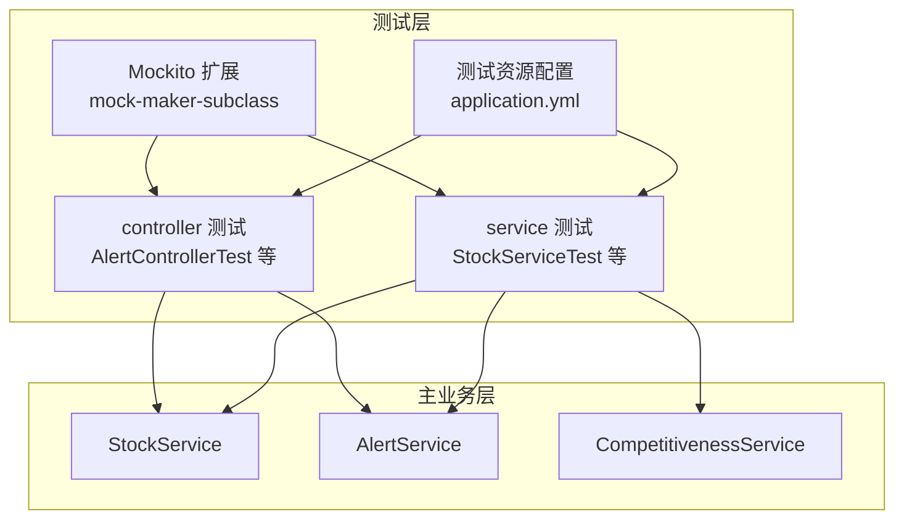
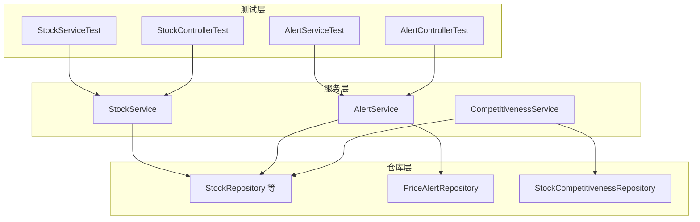
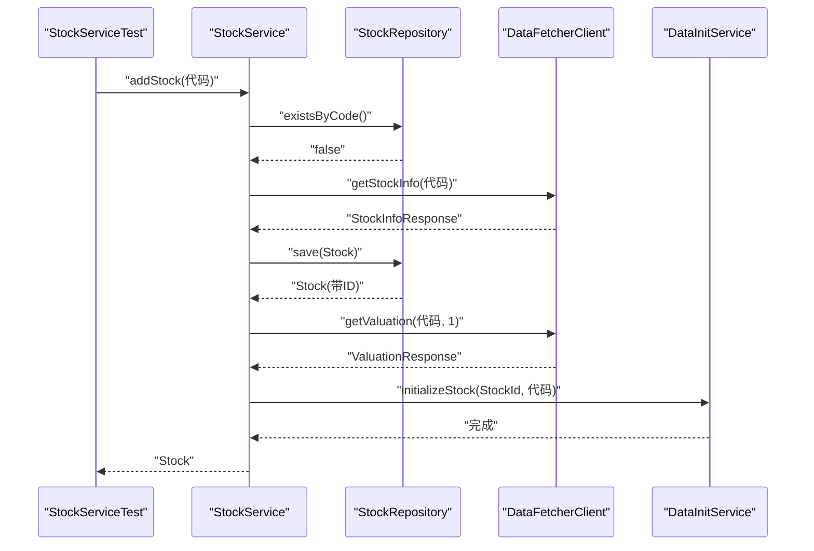
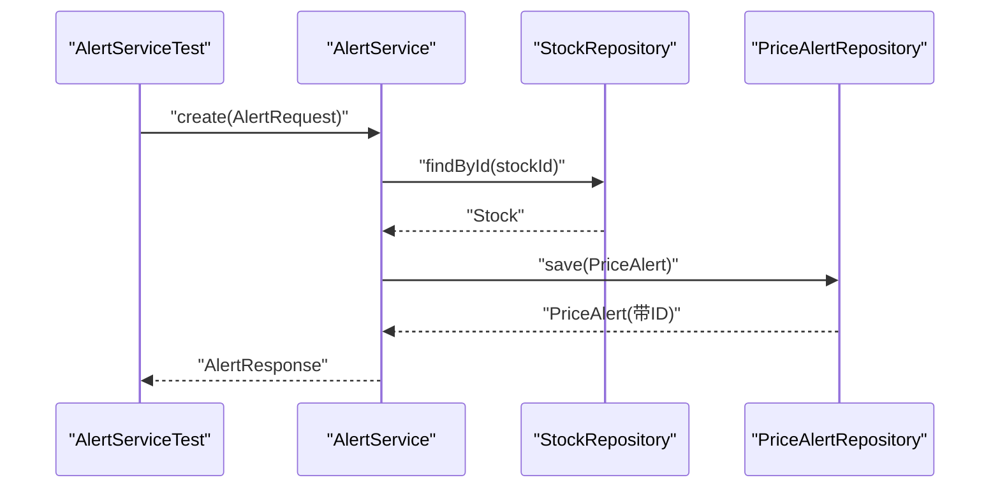
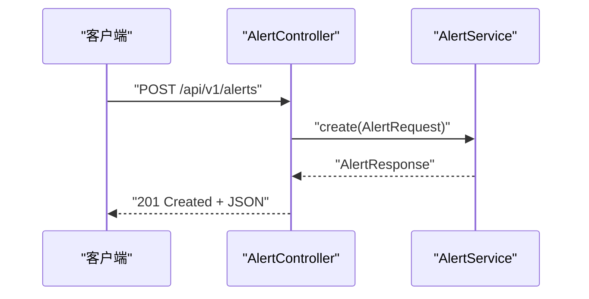
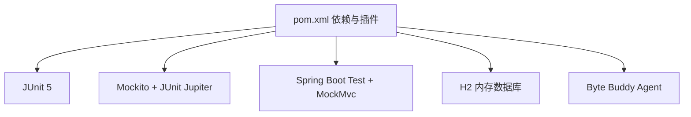

# 单元测试

<cite>
**本文引用的文件**
- [StockServiceTest.java](file://backend/src/test/java/com/stock/service/StockServiceTest.java)
- [AlertServiceTest.java](file://backend/src/test/java/com/stock/service/AlertServiceTest.java)
- [AlertControllerTest.java](file://backend/src/test/java/com/stock/controller/AlertControllerTest.java)
- [StockControllerTest.java](file://backend/src/test/java/com/stock/controller/StockControllerTest.java)
- [CompetitivenessServiceTest.java](file://backend/src/test/java/com/stock/service/CompetitivenessServiceTest.java)
- [IndicatorCalcServiceTest.java](file://backend/src/test/java/com/stock/service/IndicatorCalcServiceTest.java)
- [NoteServiceTest.java](file://backend/src/test/java/com/stock/service/NoteServiceTest.java)
- [IncomeServiceTest.java](file://backend/src/test/java/com/stock/service/IncomeServiceTest.java)
- [IndustryAnalysisServiceTest.java](file://backend/src/test/java/com/stock/service/IndustryAnalysisServiceTest.java)
- [application.yml](file://backend/src/test/resources/application.yml)
- [pom.xml](file://backend/pom.xml)
- [StockService.java](file://backend/src/main/java/com/stock/service/StockService.java)
- [AlertService.java](file://backend/src/main/java/com/stock/service/AlertService.java)
- [CompetitivenessService.java](file://backend/src/main/java/com/stock/service/CompetitivenessService.java)
- [org.mockito.plugins.MockMaker](file://backend/src/test/resources/mockito-extensions/org.mockito.plugins.MockMaker)
</cite>

## 目录
1. [引言](#引言)
2. [项目结构](#项目结构)
3. [核心组件](#核心组件)
4. [架构总览](#架构总览)
5. [详细组件分析](#详细组件分析)
6. [依赖分析](#依赖分析)
7. [性能考虑](#性能考虑)
8. [故障排查指南](#故障排查指南)
9. [结论](#结论)
10. [附录](#附录)

## 引言
本文件系统性梳理后端模块中的单元测试与集成测试实践，重点覆盖 JUnit 5 与 Mockito 框架在 Spring Boot 环境下的使用方式，包括测试类组织结构、Mock 策略、断言方法、边界条件与异常处理、参数匹配器应用、以及测试覆盖率与最佳实践建议。文档以 StockServiceTest、AlertServiceTest 等核心服务类为切入点，结合控制器层的 MockMvc 测试，帮助读者快速掌握该系统的测试编写方法。

## 项目结构
后端测试目录采用按功能分层的组织方式：service 与 controller 分别有对应的测试包，便于定位与维护。测试资源位于 test/resources 下，包含数据库内存配置与 Mockito 扩展配置。

图表来源
- [StockServiceTest.java:1-179](file://backend/src/test/java/com/stock/service/StockServiceTest.java#L1-L179)
- [AlertServiceTest.java:1-85](file://backend/src/test/java/com/stock/service/AlertServiceTest.java#L1-L85)
- [AlertControllerTest.java:1-73](file://backend/src/test/java/com/stock/controller/AlertControllerTest.java#L1-L73)
- [StockControllerTest.java:1-116](file://backend/src/test/java/com/stock/controller/StockControllerTest.java#L1-L116)
- [application.yml:1-27](file://backend/src/test/resources/application.yml#L1-L27)
- [org.mockito.plugins.MockMaker:1-1](file://backend/src/test/resources/mockito-extensions/org.mockito.plugins.MockMaker#L1-L1)

章节来源
- [StockServiceTest.java:1-179](file://backend/src/test/java/com/stock/service/StockServiceTest.java#L1-L179)
- [AlertServiceTest.java:1-85](file://backend/src/test/java/com/stock/service/AlertServiceTest.java#L1-L85)
- [AlertControllerTest.java:1-73](file://backend/src/test/java/com/stock/controller/AlertControllerTest.java#L1-L73)
- [StockControllerTest.java:1-116](file://backend/src/test/java/com/stock/controller/StockControllerTest.java#L1-L116)
- [application.yml:1-27](file://backend/src/test/resources/application.yml#L1-L27)
- [org.mockito.plugins.MockMaker:1-1](file://backend/src/test/resources/mockito-extensions/org.mockito.plugins.MockMaker#L1-L1)

## 核心组件
- 测试运行环境
  - 使用 JUnit 5 与 Mockito JUnit Jupiter 扩展，通过注解驱动测试生命周期与 Mock 注入。
  - Maven Surefire 插件启用 Byte Buddy JavaAgent，支持对未开放包的字节码增强，确保 Mockito 能够生成子类代理。
- 测试类组织
  - 按功能模块划分：service 与 controller 各自独立测试类，命名遵循“目标类名Test”的约定。
  - 使用 @ExtendWith(MockitoExtension.class) 启用 Mockito 支持；@InjectMocks 注入被测对象；@Mock 声明依赖 Mock。
- 断言与匹配器
  - 使用 JUnit 5 的 Assertions 进行断言（如 assertThrows、assertEquals、assertNotNull 等）。
  - 使用 Mockito ArgumentMatchers 提供灵活的参数匹配（any、eq、anyLong、anyString 等），避免硬编码值。
- Mock 配置与 when-then
  - 使用 when(...).thenReturn(...) 或 doNothing().when(...) 配置行为。
  - 使用 thenAnswer(...) 对返回值进行动态注入（如设置 ID）。
- 控制器测试
  - 使用 MockMvc 在不启动完整服务器的情况下验证控制器行为，结合 JSONPath 断言响应体字段。

章节来源
- [pom.xml:75-87](file://backend/pom.xml#L75-L87)
- [StockServiceTest.java:29-54](file://backend/src/test/java/com/stock/service/StockServiceTest.java#L29-L54)
- [AlertControllerTest.java:25-41](file://backend/src/test/java/com/stock/controller/AlertControllerTest.java#L25-L41)
- [StockControllerTest.java:30-49](file://backend/src/test/java/com/stock/controller/StockControllerTest.java#L30-L49)

## 架构总览
下图展示测试层与被测服务层的交互关系，突出 Mock 的使用范围与验证点。

图表来源
- [StockServiceTest.java:32-54](file://backend/src/test/java/com/stock/service/StockServiceTest.java#L32-L54)
- [AlertServiceTest.java:28-32](file://backend/src/test/java/com/stock/service/AlertServiceTest.java#L28-L32)
- [AlertControllerTest.java:30-34](file://backend/src/test/java/com/stock/controller/AlertControllerTest.java#L30-L34)
- [StockControllerTest.java:35-42](file://backend/src/test/java/com/stock/controller/StockControllerTest.java#L35-L42)
- [StockService.java:30-91](file://backend/src/main/java/com/stock/service/StockService.java#L30-L91)
- [AlertService.java:18-24](file://backend/src/main/java/com/stock/service/AlertService.java#L18-L24)
- [CompetitivenessService.java:19-25](file://backend/src/main/java/com/stock/service/CompetitivenessService.java#L19-L25)

## 详细组件分析

### StockServiceTest 分析
- 测试目标
  - 覆盖新增股票（addStock）、删除股票（deleteStock）、查询股票（getStock/listStocks）等核心流程。
  - 包含边界与异常场景：非法代码、重复代码、不存在的股票 ID、数据初始化触发时机等。
- Mock 策略
  - 对 StockRepository、各业务仓库、DataFetcherClient、DataInitService、CompletenessService 进行 Mock。
  - 使用 any、eq、anyLong、anyString 等匹配器，确保参数无关性与精确匹配并存。
- 关键断言
  - 使用 assertThrows 验证异常类型；使用 assertNotNull/assertEquals 验证返回值字段。
  - 使用 verify 验证异步初始化调用是否发生。
- 边界与异常
  - 非法代码格式、空字符串、不足六位数均抛出 InvalidStockCodeException。
  - 已存在的代码抛出 DuplicateStockException。
  - 删除与查询不存在的 ID 抛出 StockNotFoundException。
- 时序流程（新增股票）

图表来源
- [StockServiceTest.java:87-119](file://backend/src/test/java/com/stock/service/StockServiceTest.java#L87-L119)
- [StockService.java:93-163](file://backend/src/main/java/com/stock/service/StockService.java#L93-L163)

章节来源
- [StockServiceTest.java:73-178](file://backend/src/test/java/com/stock/service/StockServiceTest.java#L73-L178)
- [StockService.java:93-242](file://backend/src/main/java/com/stock/service/StockService.java#L93-L242)

### AlertServiceTest 分析
- 测试目标
  - 列表查询、创建告警、删除告警；验证 Stock 不存在时抛出 StockNotFoundException。
- Mock 策略
  - Mock PriceAlertRepository 与 StockRepository，使用 any、eq 等匹配器。
- 关键断言
  - 断言返回列表大小、类型、阈值等；断言异常类型。
- 时序流程（创建告警）

图表来源
- [AlertServiceTest.java:52-70](file://backend/src/test/java/com/stock/service/AlertServiceTest.java#L52-L70)
- [AlertService.java:41-56](file://backend/src/main/java/com/stock/service/AlertService.java#L41-L56)

章节来源
- [AlertServiceTest.java:34-84](file://backend/src/test/java/com/stock/service/AlertServiceTest.java#L34-L84)
- [AlertService.java:26-62](file://backend/src/main/java/com/stock/service/AlertService.java#L26-L62)

### AlertControllerTest 分析
- 测试目标
  - 验证控制器对 /api/v1/alerts 的 GET、POST、DELETE 请求的响应状态与 JSON 字段。
- Mock 策略
  - 使用 MockMvc 构建独立测试环境，对 AlertService 进行 Mock。
- 关键断言
  - 使用 andExpect 验证状态码与 JSONPath 字段值。
- 时序流程（创建告警）

图表来源
- [AlertControllerTest.java:54-65](file://backend/src/test/java/com/stock/controller/AlertControllerTest.java#L54-L65)

章节来源
- [AlertControllerTest.java:43-72](file://backend/src/test/java/com/stock/controller/AlertControllerTest.java#L43-L72)

### 其他核心服务测试要点
- CompetitivenessServiceTest
  - 验证获取与保存行业竞争力数据，包含 Stock 不存在时的异常路径。
- IndicatorCalcServiceTest
  - 纯函数计算逻辑测试，无需外部依赖，关注指标可用性与边界值。
- NoteServiceTest
  - 验证笔记分类过滤、创建与删除，包含 Stock 不存在时的异常路径。
- IncomeServiceTest
  - 验证收入数据查询、YOY 计算与结果截断逻辑。

章节来源
- [CompetitivenessServiceTest.java:32-74](file://backend/src/test/java/com/stock/service/CompetitivenessServiceTest.java#L32-L74)
- [IndicatorCalcServiceTest.java:41-81](file://backend/src/test/java/com/stock/service/IndicatorCalcServiceTest.java#L41-L81)
- [NoteServiceTest.java:32-81](file://backend/src/test/java/com/stock/service/NoteServiceTest.java#L32-L81)
- [IncomeServiceTest.java:29-69](file://backend/src/test/java/com/stock/service/IncomeServiceTest.java#L29-L69)

## 依赖分析
- 测试框架与工具
  - JUnit 5：提供测试生命周期与断言能力。
  - Mockito + Mockito JUnit Jupiter Extension：提供 Mock 对象与参数匹配器。
  - Spring Boot Test + MockMvc：提供 Web 层集成测试能力。
  - Maven Surefire + Byte Buddy Agent：保证 Mockito 子类代理可用。
- 配置要点
  - 测试数据库使用内存 H2，DDL 自动建表/删表，便于隔离与快速执行。
  - Mockito 扩展启用 mock-maker-subclass，提升代理稳定性。

图表来源
- [pom.xml:23-56](file://backend/pom.xml#L23-L56)
- [application.yml:4-16](file://backend/src/test/resources/application.yml#L4-L16)
- [org.mockito.plugins.MockMaker:1-1](file://backend/src/test/resources/mockito-extensions/org.mockito.plugins.MockMaker#L1-L1)

章节来源
- [pom.xml:75-87](file://backend/pom.xml#L75-L87)
- [application.yml:1-27](file://backend/src/test/resources/application.yml#L1-L27)

## 性能考虑
- 测试执行效率
  - 使用内存数据库与轻量级 Mock，避免真实网络与持久化开销。
  - 控制器测试使用 MockMvc，减少启动时间。
- 并发与事务
  - 测试中尽量避免真实事务同步回调，使用 thenAnswer 注入 ID 等模拟行为，降低复杂度。
- 复杂度控制
  - 将大对象构造拆分为辅助方法（如生成日线数据），提高可读性与复用性。

## 故障排查指南
- 常见问题
  - Mock 行为未生效：检查 when(...).thenReturn(...) 是否与实际调用签名一致（参数匹配器使用 eq/any 等）。
  - 异常断言失败：确认被测方法抛出的异常类型与消息是否符合预期。
  - JSON 断言失败：核对 JSONPath 表达式与响应体结构是否一致。
- 排查步骤
  - 逐步缩小范围：先验证 Mock 返回值，再验证业务分支。
  - 使用 verify 确认关键调用是否发生。
  - 在 application.yml 中临时开启日志或简化断言，定位问题根因。

章节来源
- [AlertServiceTest.java:72-77](file://backend/src/test/java/com/stock/service/AlertServiceTest.java#L72-L77)
- [StockServiceTest.java:146-150](file://backend/src/test/java/com/stock/service/StockServiceTest.java#L146-L150)

## 结论
本项目的单元测试与集成测试以 JUnit 5 和 Mockito 为核心，配合 Spring Boot Test 与 MockMvc，实现了对服务层与控制器层的高覆盖测试。通过合理的 Mock 策略、参数匹配器与断言组合，测试能够稳定地覆盖正常流程、边界条件与异常路径。建议持续补充控制器层与服务层的边界与异常用例，并结合覆盖率工具评估整体质量。

## 附录
- 测试用例设计原则
  - 一个测试只验证一个行为或分支。
  - 使用参数化与辅助方法减少重复代码。
  - 明确区分正常路径与异常路径，分别编写用例。
- 边界条件测试
  - 输入为空、null、超长、越界等。
  - 数据缺失、空集合、单元素等。
- 异常情况处理
  - 明确断言异常类型与关键信息。
  - 验证异常不会导致状态污染或资源泄漏。
- Mock 对象配置与 when-then
  - 使用 any/eq/anyLong/anyString 等匹配器，避免硬编码。
  - 对需要注入 ID 的返回值使用 thenAnswer(inv -> ...)。
- 参数匹配器应用
  - 精准匹配与通配匹配并用，优先使用 eq 精确值，使用 any 适配不确定参数。
- 测试覆盖率与最佳实践
  - 建议使用覆盖率工具（如 JaCoCo）评估关键路径覆盖率。
  - 保持测试命名清晰、断言明确、Mock 行为可读。
  - 控制测试粒度，避免过度耦合外部系统。