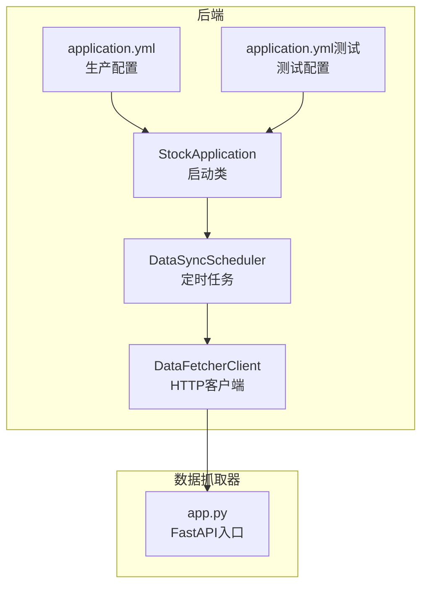
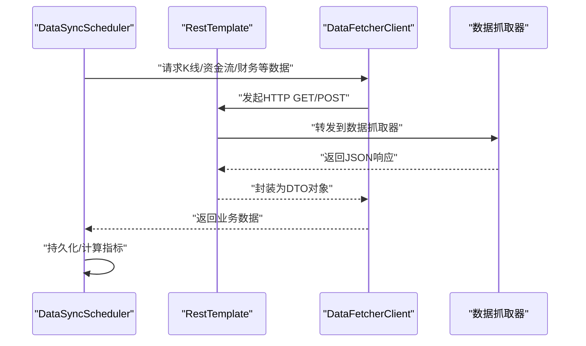
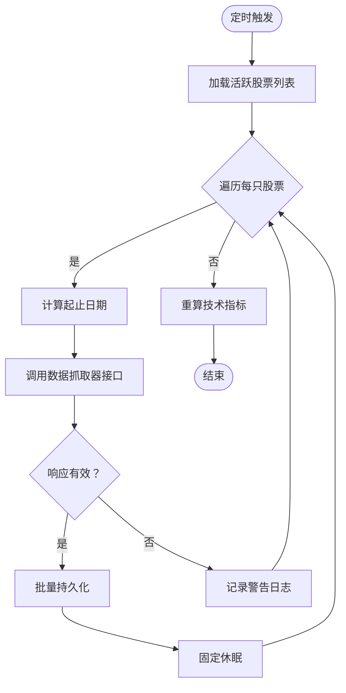
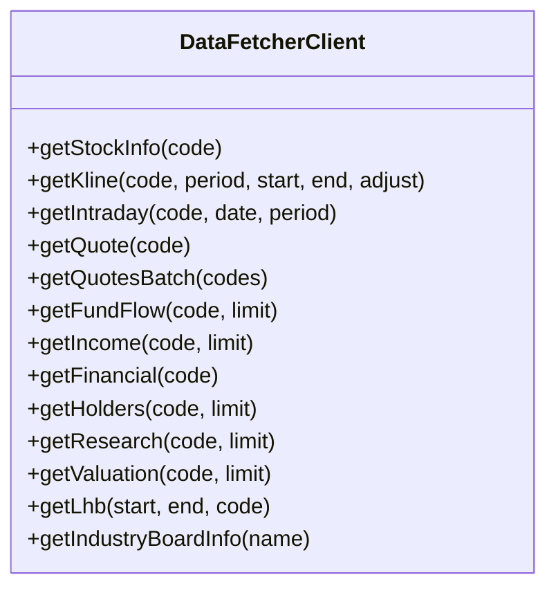
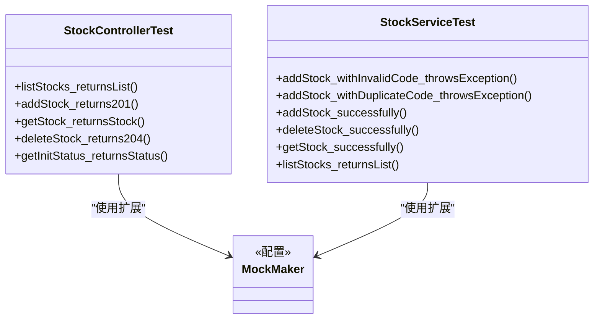
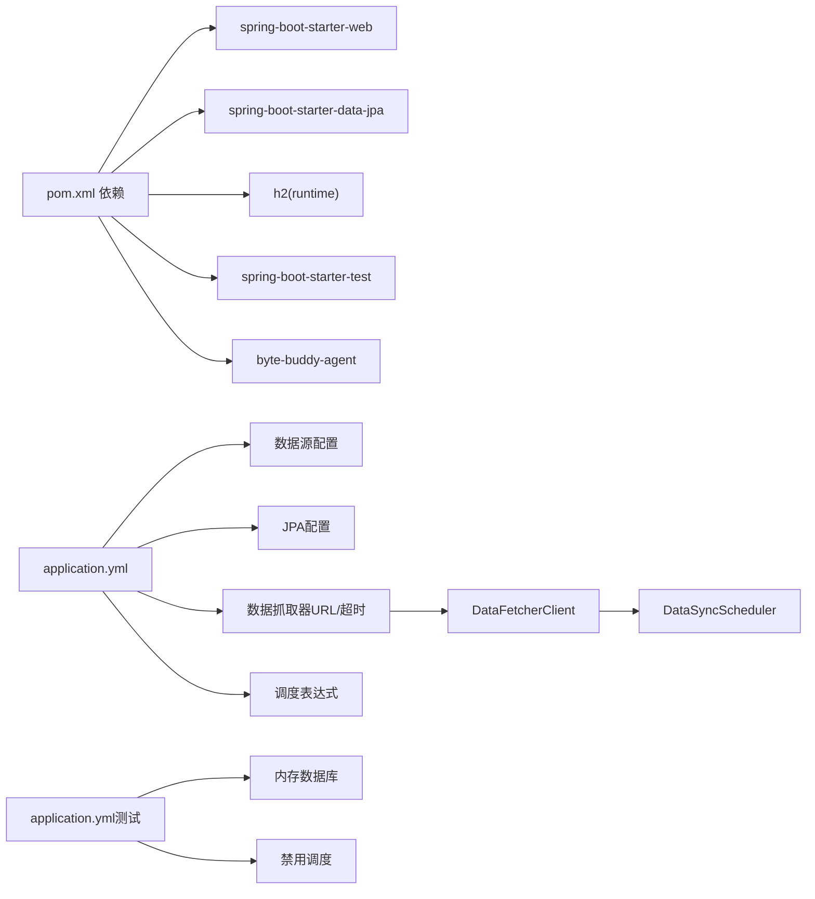

# 性能测试

<cite>
**本文引用的文件**
- [StockApplication.java](file://backend/src/main/java/com/stock/StockApplication.java)
- [pom.xml](file://backend/pom.xml)
- [application.yml](file://backend/src/main/resources/application.yml)
- [application.yml（测试）](file://backend/src/test/resources/application.yml)
- [DataSyncScheduler.java](file://backend/src/main/java/com/stock/scheduler/DataSyncScheduler.java)
- [DataFetcherClient.java](file://backend/src/main/java/com/stock/client/DataFetcherClient.java)
- [StockControllerTest.java](file://backend/src/test/java/com/stock/controller/StockControllerTest.java)
- [StockServiceTest.java](file://backend/src/test/java/com/stock/service/StockServiceTest.java)
- [org.mockito.plugins.MockMaker](file://backend/src/test/resources/mockito-extensions/org.mockito.plugins.MockMaker)
- [app.py（数据抓取器）](file://data-fetcher/app.py)
- [requirements.txt（数据抓取器）](file://data-fetcher/requirements.txt)
</cite>

## 目录
1. [引言](#引言)
2. [项目结构](#项目结构)
3. [核心组件](#核心组件)
4. [架构总览](#架构总览)
5. [详细组件分析](#详细组件分析)
6. [依赖分析](#依赖分析)
7. [性能考虑](#性能考虑)
8. [故障排查指南](#故障排查指南)
9. [结论](#结论)
10. [附录](#附录)

## 引言
本文件面向股票交易系统后端的性能测试实践，目标是提供一套可落地的实施方法与工具选择，覆盖负载测试、压力测试与并发测试策略；明确测试场景设计、测试数据准备与性能指标采集；给出Mockito扩展配置、测试环境优化与资源限制设置；并包含性能基准测试、瓶颈分析与优化建议，以及在CI/CD流程中的集成思路。

## 项目结构
后端采用Spring Boot应用，使用H2内存数据库进行测试，定时任务调度从外部数据抓取器拉取数据，服务层通过RestTemplate调用数据抓取器接口。前端为Vue单页应用，数据抓取器为FastAPI服务。

图表来源
- [StockApplication.java:1-16](file://backend/src/main/java/com/stock/StockApplication.java#L1-L16)
- [DataSyncScheduler.java:1-238](file://backend/src/main/java/com/stock/scheduler/DataSyncScheduler.java#L1-L238)
- [DataFetcherClient.java:1-126](file://backend/src/main/java/com/stock/client/DataFetcherClient.java#L1-L126)
- [application.yml:1-28](file://backend/src/main/resources/application.yml#L1-L28)
- [application.yml（测试）:1-27](file://backend/src/test/resources/application.yml#L1-L27)
- [app.py（数据抓取器）:1-31](file://data-fetcher/app.py#L1-L31)

章节来源
- [StockApplication.java:1-16](file://backend/src/main/java/com/stock/StockApplication.java#L1-L16)
- [application.yml:1-28](file://backend/src/main/resources/application.yml#L1-L28)
- [application.yml（测试）:1-27](file://backend/src/test/resources/application.yml#L1-L27)

## 核心组件
- 启动类：启用调度与异步，作为Spring Boot应用入口。
- 定时任务：负责周期性从数据抓取器同步行情、资金流、财务等数据，并计算技术指标。
- HTTP客户端：封装对数据抓取器的REST调用，统一异常处理。
- 配置文件：生产与测试分别定义数据源、JPA行为、H2控制台、数据抓取器URL与超时、调度表达式等。

章节来源
- [StockApplication.java:8-15](file://backend/src/main/java/com/stock/StockApplication.java#L8-L15)
- [DataSyncScheduler.java:19-52](file://backend/src/main/java/com/stock/scheduler/DataSyncScheduler.java#L19-L52)
- [DataFetcherClient.java:14-24](file://backend/src/main/java/com/stock/client/DataFetcherClient.java#L14-L24)
- [application.yml:19-28](file://backend/src/main/resources/application.yml#L19-L28)
- [application.yml（测试）:18-27](file://backend/src/test/resources/application.yml#L18-L27)

## 架构总览
后端通过RestTemplate访问数据抓取器，定时任务按工作日与分钟级频率触发，涉及数据库写入与远程调用。测试阶段使用内存数据库与禁用调度，确保可重复性与隔离性。

图表来源
- [DataSyncScheduler.java:54-82](file://backend/src/main/java/com/stock/scheduler/DataSyncScheduler.java#L54-L82)
- [DataSyncScheduler.java:84-117](file://backend/src/main/java/com/stock/scheduler/DataSyncScheduler.java#L84-L117)
- [DataSyncScheduler.java:119-161](file://backend/src/main/java/com/stock/scheduler/DataSyncScheduler.java#L119-L161)
- [DataSyncScheduler.java:163-214](file://backend/src/main/java/com/stock/scheduler/DataSyncScheduler.java#L163-L214)
- [DataSyncScheduler.java:216-236](file://backend/src/main/java/com/stock/scheduler/DataSyncScheduler.java#L216-L236)
- [DataFetcherClient.java:26-99](file://backend/src/main/java/com/stock/client/DataFetcherClient.java#L26-L99)
- [app.py（数据抓取器）:14-25](file://data-fetcher/app.py#L14-L25)

## 详细组件分析

### 组件A：定时任务与数据同步
- 触发频率：按cron表达式在工作日的固定时间点执行，包含日K同步、资金流同步、估值与研报同步、周频财务与股东数据同步、日频指标重算。
- 并发与事务：每个任务标注事务注解，逐个股票循环处理，并在每次调用间加入固定休眠，降低上游限流或网络抖动影响。
- 数据一致性：删除旧数据后批量保存，避免重复与脏数据。
- 异常处理：捕获异常并记录告警日志，保证任务整体不中断。

图表来源
- [DataSyncScheduler.java:54-82](file://backend/src/main/java/com/stock/scheduler/DataSyncScheduler.java#L54-L82)
- [DataSyncScheduler.java:84-117](file://backend/src/main/java/com/stock/scheduler/DataSyncScheduler.java#L84-L117)
- [DataSyncScheduler.java:119-161](file://backend/src/main/java/com/stock/scheduler/DataSyncScheduler.java#L119-L161)
- [DataSyncScheduler.java:163-214](file://backend/src/main/java/com/stock/scheduler/DataSyncScheduler.java#L163-L214)
- [DataSyncScheduler.java:216-236](file://backend/src/main/java/com/stock/scheduler/DataSyncScheduler.java#L216-L236)

章节来源
- [DataSyncScheduler.java:19-52](file://backend/src/main/java/com/stock/scheduler/DataSyncScheduler.java#L19-L52)

### 组件B：HTTP客户端与外部依赖
- 负责封装所有对外数据抓取器的REST调用，统一参数化路径与请求体，集中异常转换。
- 基于配置文件的URL与超时参数，便于在不同环境调整。

图表来源
- [DataFetcherClient.java:14-24](file://backend/src/main/java/com/stock/client/DataFetcherClient.java#L14-L24)
- [DataFetcherClient.java:26-99](file://backend/src/main/java/com/stock/client/DataFetcherClient.java#L26-L99)

章节来源
- [DataFetcherClient.java:14-24](file://backend/src/main/java/com/stock/client/DataFetcherClient.java#L14-L24)
- [application.yml:20-22](file://backend/src/main/resources/application.yml#L20-L22)

### 组件C：测试框架与Mockito扩展
- 使用JUnit 5与Mockito扩展，结合MockMvc验证控制器行为。
- 测试配置使用内存数据库与禁用调度，确保测试隔离与可重复性。
- Mockito扩展配置为子类Mock生成器，提升复杂对象的Mock能力。

图表来源
- [StockControllerTest.java:30-49](file://backend/src/test/java/com/stock/controller/StockControllerTest.java#L30-L49)
- [StockServiceTest.java:29-54](file://backend/src/test/java/com/stock/service/StockServiceTest.java#L29-L54)
- [org.mockito.plugins.MockMaker:1-1](file://backend/src/test/resources/mockito-extensions/org.mockito.plugins.MockMaker#L1-L1)

章节来源
- [StockControllerTest.java:1-116](file://backend/src/test/java/com/stock/controller/StockControllerTest.java#L1-L116)
- [StockServiceTest.java:1-179](file://backend/src/test/java/com/stock/service/StockServiceTest.java#L1-L179)
- [application.yml（测试）:4-27](file://backend/src/test/resources/application.yml#L4-L27)
- [org.mockito.plugins.MockMaker:1-1](file://backend/src/test/resources/mockito-extensions/org.mockito.plugins.MockMaker#L1-L1)

## 依赖分析
- Spring Boot与Web Starter：提供Web容器、MVC、JPA、校验等基础能力。
- H2数据库：开发/测试默认存储，内存模式用于测试。
- ByteBuddy代理：Surefire插件开启模块开销，支持Mockito子类Mock。
- 数据抓取器：FastAPI服务，提供多路由的数据接口，供后端定时任务调用。

图表来源
- [pom.xml:23-56](file://backend/pom.xml#L23-L56)
- [pom.xml:77-87](file://backend/pom.xml#L77-L87)
- [application.yml:4-28](file://backend/src/main/resources/application.yml#L4-L28)
- [application.yml（测试）:4-27](file://backend/src/test/resources/application.yml#L4-L27)
- [DataFetcherClient.java:19-24](file://backend/src/main/java/com/stock/client/DataFetcherClient.java#L19-L24)
- [DataSyncScheduler.java:54-236](file://backend/src/main/java/com/stock/scheduler/DataSyncScheduler.java#L54-L236)

章节来源
- [pom.xml:17-21](file://backend/pom.xml#L17-L21)
- [pom.xml:77-87](file://backend/pom.xml#L77-L87)
- [application.yml:4-28](file://backend/src/main/resources/application.yml#L4-L28)
- [application.yml（测试）:4-27](file://backend/src/test/resources/application.yml#L4-L27)

## 性能考虑
- 系统特性与潜在瓶颈
  - 定时任务循环逐股票处理并固定休眠，存在串行化风险；在高并发请求下，若同时触发多个任务，可能放大数据库与外部接口压力。
  - 外部数据抓取器为独立服务，其性能直接影响后端同步效率；需关注网络延迟、超时与限流。
  - 批量持久化前先清理历史数据，写入量大时对数据库I/O与索引维护有压力。
- 指标建议
  - 后端：CPU使用率、堆内存占用、GC次数与耗时、数据库连接池活跃数、慢查询数量、线程池排队长度。
  - 外部服务：数据抓取器的响应时间分位值、错误率、吞吐量、队列积压。
- 基准与回归
  - 在稳定基线环境（相同硬件、相同数据规模）下运行标准化场景，记录关键指标，形成回归基线。
- 优化方向
  - 将定时任务的逐股票循环改为分批并发，结合线程池与信号量控制并发度。
  - 对外部接口增加熔断与重试策略，避免雪崩效应。
  - 优化数据库写入批次大小与索引策略，必要时引入异步落盘或消息队列削峰。
  - 缓存热点数据与结果，减少重复计算与远程调用。

## 故障排查指南
- 常见问题定位
  - 定时任务失败：检查日志中警告条目，确认起止日期计算与响应有效性判断逻辑。
  - 外部接口超时：核对配置文件中的超时参数，评估上游限流策略。
  - 测试不稳定：确认测试配置使用内存数据库且禁用调度，避免跨测试相互干扰。
- 排查步骤
  - 启用更详细的日志级别，观察任务执行耗时与异常栈。
  - 使用性能分析工具（如Java Flight Recorder或外部APM）定位CPU与内存热点。
  - 对外部接口进行独立压测，识别瓶颈环节（网络、解析、业务处理）。
- 相关实现参考
  - 定时任务异常捕获与日志记录。
  - HTTP客户端统一异常转换与空响应检测。
  - 测试配置禁用调度与使用内存数据库。

章节来源
- [DataSyncScheduler.java:78-81](file://backend/src/main/java/com/stock/scheduler/DataSyncScheduler.java#L78-L81)
- [DataSyncScheduler.java:113-116](file://backend/src/main/java/com/stock/scheduler/DataSyncScheduler.java#L113-L116)
- [DataSyncScheduler.java:157-160](file://backend/src/main/java/com/stock/scheduler/DataSyncScheduler.java#L157-L160)
- [DataSyncScheduler.java:210-213](file://backend/src/main/java/com/stock/scheduler/DataSyncScheduler.java#L210-L213)
- [DataSyncScheduler.java:232-235](file://backend/src/main/java/com/stock/scheduler/DataSyncScheduler.java#L232-L235)
- [DataFetcherClient.java:112-124](file://backend/src/main/java/com/stock/client/DataFetcherClient.java#L112-L124)
- [application.yml（测试）:18-27](file://backend/src/test/resources/application.yml#L18-L27)

## 结论
通过明确的测试场景设计、规范的测试数据准备与完善的性能指标采集，结合Mockito扩展与测试环境优化，可以系统性地评估与改进系统性能。针对定时任务与外部依赖的特性，建议优先优化并发策略、缓存与限流机制，并在CI/CD中引入自动化性能回归，确保持续交付质量。

## 附录

### 性能测试实施方法与工具选择
- 负载测试
  - 工具：JMeter、k6、Gatling。
  - 场景：模拟用户访问股票列表、详情、初始化状态等接口，逐步提升并发与吞吐。
  - 关键指标：响应时间（P50/P90/P95）、错误率、吞吐量、数据库连接池利用率。
- 压力测试
  - 工具：Locust、k6。
  - 场景：逐步加大并发直至系统出现明显延迟或错误，识别容量边界。
  - 关键指标：最大并发、饱和点、错误阈值、恢复时间。
- 并发测试
  - 工具：JMH（微基准）、k6。
  - 场景：对关键方法（如批量持久化、指标重算）进行微基准测试，评估不同参数下的性能表现。
  - 关键指标：OPS、平均耗时、方差。

### 测试场景设计
- 场景一：日常浏览（列表/详情）
  - 并发用户：100~500。
  - 持续时间：5~15分钟。
  - 关键路径：StockController相关接口。
- 场景二：初始化与同步
  - 并发用户：低。
  - 触发频率：定时任务在工作日的固定时间点。
  - 关键路径：DataSyncScheduler → DataFetcherClient。
- 场景三：高峰时段
  - 并发用户：峰值可达1000+。
  - 关键路径：多接口并发、数据库写入、外部接口调用。

### 测试数据准备
- 数据规模：按“小/中/大”三档准备股票与历史数据量。
- 数据来源：使用测试配置的内存数据库，确保可快速初始化与清理。
- 初始化脚本：在测试前预热数据，避免冷启动偏差。

### 性能指标收集
- 后端：Micrometer + Prometheus + Grafana（建议），或使用内置Actuator暴露指标。
- 外部：数据抓取器健康检查与路由级指标。
- 日志：结合采样日志与慢查询分析。

### Mockito扩展配置
- 配置文件：org.mockito.plugins.MockMaker指向子类生成器，提升复杂对象Mock成功率。
- 测试隔离：确保每个测试使用独立的Mock上下文，避免共享状态。

章节来源
- [org.mockito.plugins.MockMaker:1-1](file://backend/src/test/resources/mockito-extensions/org.mockito.plugins.MockMaker#L1-L1)

### 测试环境优化与资源限制
- 内存与线程
  - JVM参数：合理设置堆大小与GC策略，避免Full GC风暴。
  - 线程池：对定时任务与外部调用分别配置线程池，限制最大并发。
- 数据库
  - 连接池：根据并发与RT设定最大连接数与超时。
  - 索引：对高频查询字段建立合适索引，避免全表扫描。
- 外部接口
  - 超时与重试：基于SLA设置超时与指数退避重试。
  - 限流：对上游接口进行配额管理，防止过载。

### CI/CD集成
- 单元与集成测试：在PR流水线中运行，确保基本功能与Mock验证通过。
- 性能回归：在夜间或低峰期运行标准化场景，对比基线指标，失败即阻断。
- 容量规划：结合压测结果在发布前完成资源扩容与配置校准。

### 参考实现位置
- 启动与调度
  - [StockApplication.java:8-15](file://backend/src/main/java/com/stock/StockApplication.java#L8-L15)
- 定时任务
  - [DataSyncScheduler.java:54-236](file://backend/src/main/java/com/stock/scheduler/DataSyncScheduler.java#L54-L236)
- HTTP客户端
  - [DataFetcherClient.java:19-24](file://backend/src/main/java/com/stock/client/DataFetcherClient.java#L19-L24)
- 测试配置
  - [application.yml（测试）:4-27](file://backend/src/test/resources/application.yml#L4-L27)
- 数据抓取器
  - [app.py（数据抓取器）:14-25](file://data-fetcher/app.py#L14-L25)