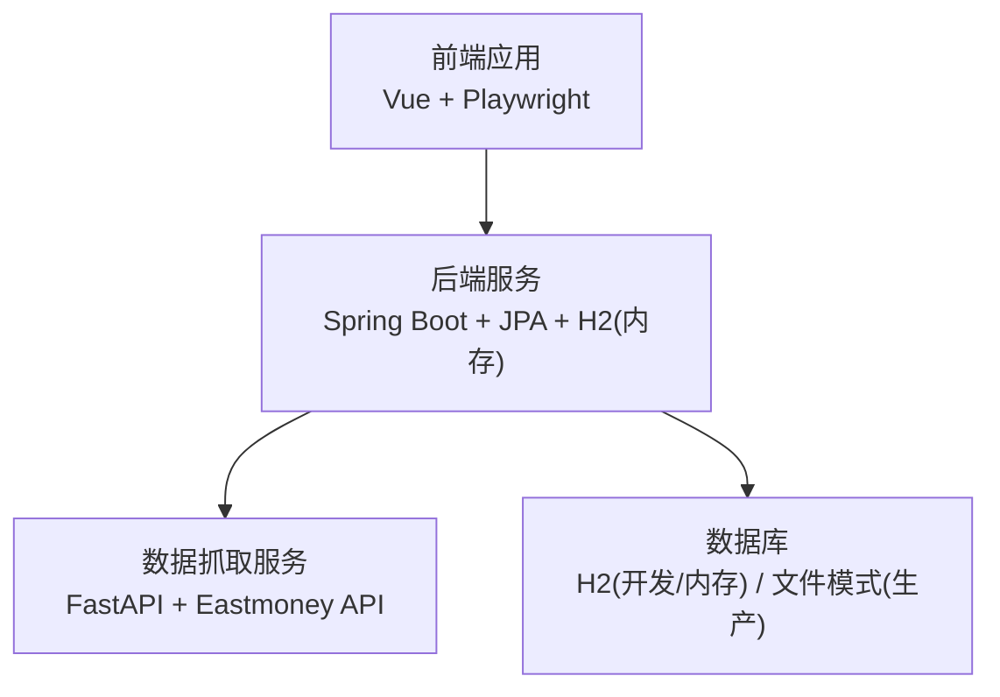
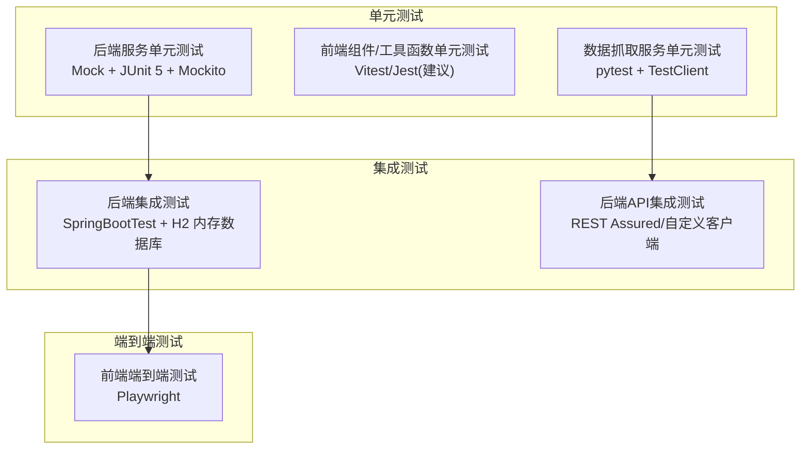
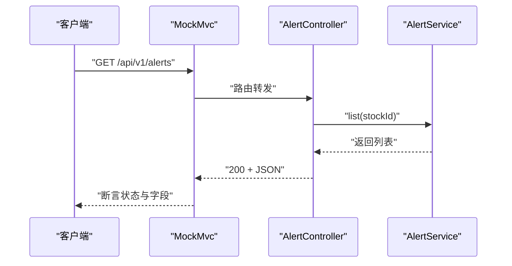
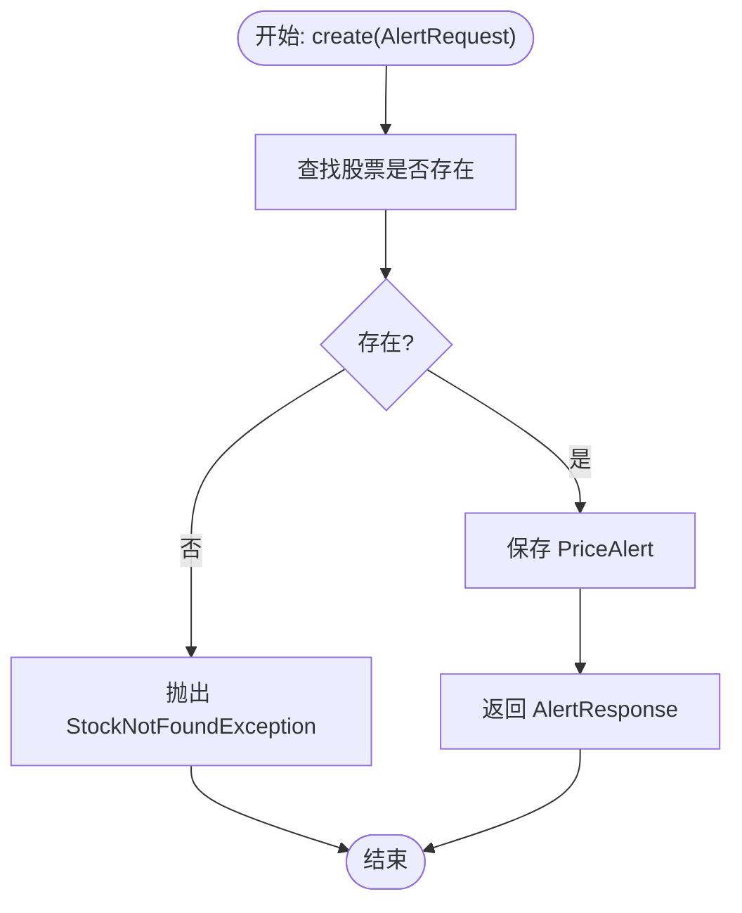
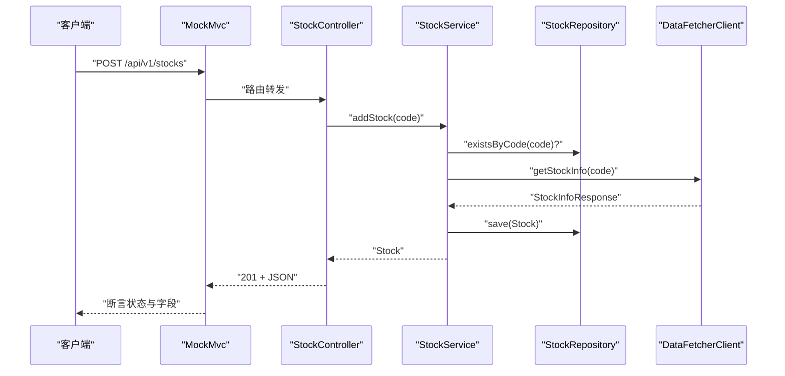
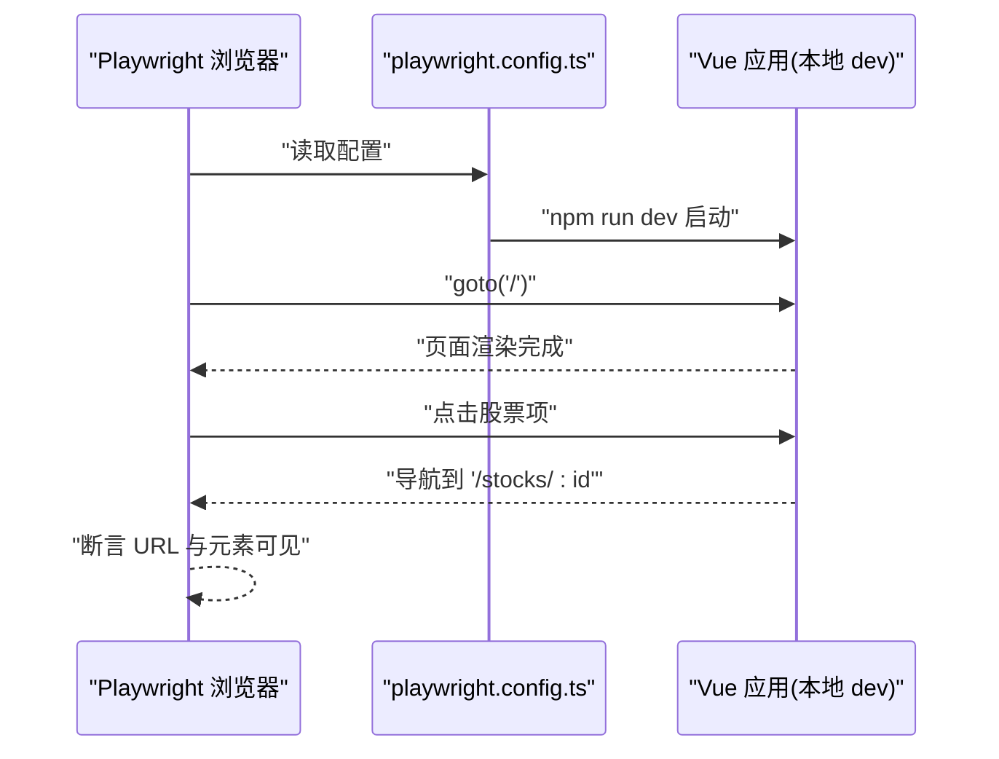
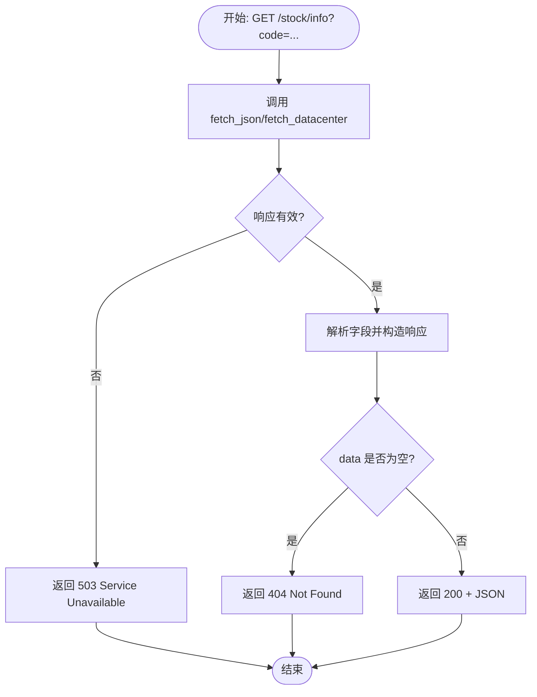
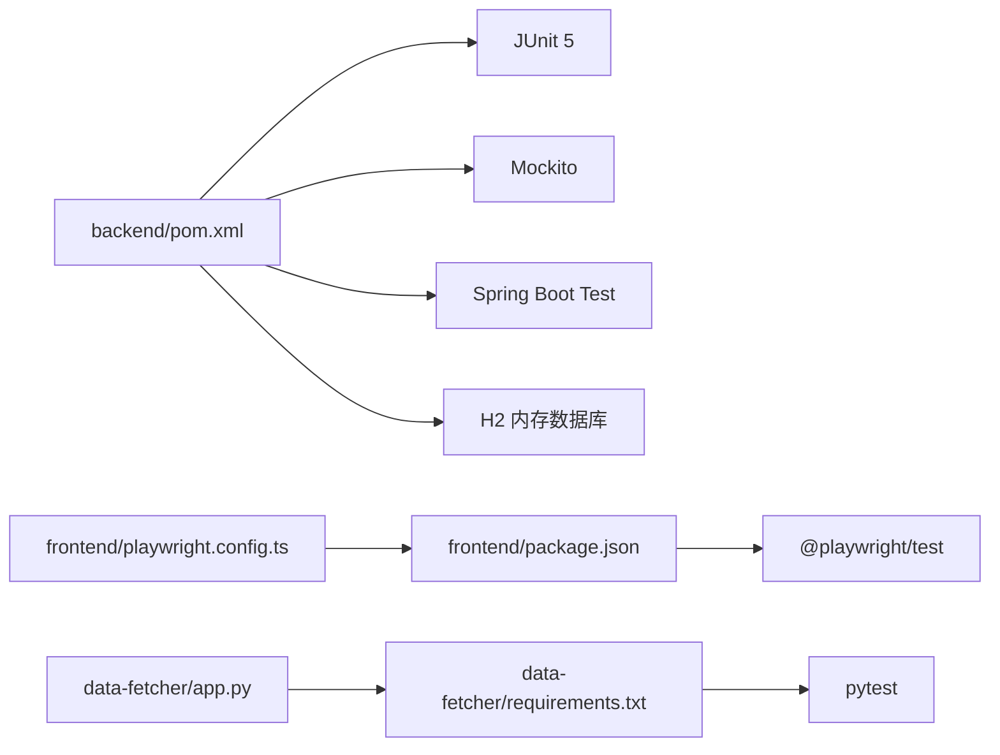

# 测试策略

<cite>
**本文引用的文件**
- [backend/pom.xml](file://backend/pom.xml)
- [backend/src/test/resources/application.yml](file://backend/src/test/resources/application.yml)
- [backend/src/main/resources/application.yml](file://backend/src/main/resources/application.yml)
- [backend/src/test/java/com/stock/controller/AlertControllerTest.java](file://backend/src/test/java/com/stock/controller/AlertControllerTest.java)
- [backend/src/test/java/com/stock/service/AlertServiceTest.java](file://backend/src/test/java/com/stock/controller/AlertServiceTest.java)
- [backend/src/test/java/com/stock/controller/StockControllerTest.java](file://backend/src/test/java/com/stock/controller/StockControllerTest.java)
- [backend/src/test/java/com/stock/service/StockServiceTest.java](file://backend/src/test/java/com/stock/service/StockServiceTest.java)
- [frontend/package.json](file://frontend/package.json)
- [frontend/playwright.config.ts](file://frontend/playwright.config.ts)
- [frontend/e2e/stock.spec.ts](file://frontend/e2e/stock.spec.ts)
- [data-fetcher/app.py](file://data-fetcher/app.py)
- [data-fetcher/requirements.txt](file://data-fetcher/requirements.txt)
- [data-fetcher/tests/test_stock_router.py](file://data-fetcher/tests/test_stock_router.py)
- [data-fetcher/routers/stock.py](file://data-fetcher/routers/stock.py)
</cite>

## 目录
1. [引言](#引言)
2. [项目结构](#项目结构)
3. [核心组件](#核心组件)
4. [架构总览](#架构总览)
5. [详细组件分析](#详细组件分析)
6. [依赖分析](#依赖分析)
7. [性能考虑](#性能考虑)
8. [故障排查指南](#故障排查指南)
9. [结论](#结论)
10. [附录](#附录)

## 引言
本测试策略文档面向股票交易系统（后端 Spring Boot、前端 Vue + Playwright、数据抓取服务 FastAPI）的整体测试体系，覆盖单元测试、集成测试与端到端测试的实施方法，明确测试框架选择与配置要点，给出测试用例设计原则、Mock 策略、测试数据准备方案，并提出覆盖率目标、持续集成配置建议与自动化测试流程。同时包含性能测试与压力测试的实施方案，帮助团队建立可落地的质量保障体系。

## 项目结构
系统由三部分组成：
- 后端服务：Spring Boot 应用，提供 REST API、定时任务、JPA 数据访问与 H2 内存数据库用于测试。
- 前端应用：Vue 3 + Vite，使用 Playwright 进行端到端测试。
- 数据抓取服务：FastAPI 应用，提供股票基础信息、K线、分时、批量报价等接口。

**图表来源**
- [backend/src/main/resources/application.yml:1-28](file://backend/src/main/resources/application.yml#L1-L28)
- [backend/src/test/resources/application.yml:1-27](file://backend/src/test/resources/application.yml#L1-L27)
- [data-fetcher/app.py:1-31](file://data-fetcher/app.py#L1-L31)
- [frontend/playwright.config.ts:1-25](file://frontend/playwright.config.ts#L1-L25)

**章节来源**
- [backend/src/main/resources/application.yml:1-28](file://backend/src/main/resources/application.yml#L1-L28)
- [backend/src/test/resources/application.yml:1-27](file://backend/src/test/resources/application.yml#L1-L27)
- [data-fetcher/app.py:1-31](file://data-fetcher/app.py#L1-L31)
- [frontend/playwright.config.ts:1-25](file://frontend/playwright.config.ts#L1-L25)

## 核心组件
- 单元测试（JUnit 5 + Mockito）
  - 后端通过 Spring Boot Starter Test 提供测试支持；使用 Mockito 注入 Mock 依赖，隔离被测类。
  - 示例：控制器层使用 MockMvc 验证 HTTP 行为；服务层进行业务逻辑断言与异常场景验证。
- 集成测试（SpringBootTest + H2 内存数据库）
  - 使用测试配置文件切换至内存数据库与禁用调度器，确保测试可重复且无副作用。
- 端到端测试（Playwright）
  - 前端使用 Playwright 在真实浏览器中运行，自动启动本地开发服务器，验证页面交互与路由行为。
- 数据抓取服务测试（pytest + TestClient）
  - FastAPI 使用 TestClient 发起请求，配合 unittest.mock.patch 对外部依赖进行隔离。

**章节来源**
- [backend/pom.xml:53-55](file://backend/pom.xml#L53-L55)
- [backend/src/test/resources/application.yml:1-27](file://backend/src/test/resources/application.yml#L1-L27)
- [backend/src/test/java/com/stock/controller/AlertControllerTest.java:1-73](file://backend/src/test/java/com/stock/controller/AlertControllerTest.java#L1-L73)
- [backend/src/test/java/com/stock/service/AlertServiceTest.java:1-85](file://backend/src/test/java/com/stock/service/AlertServiceTest.java#L1-L85)
- [frontend/package.json:17-25](file://frontend/package.json#L17-L25)
- [frontend/playwright.config.ts:1-25](file://frontend/playwright.config.ts#L1-L25)
- [data-fetcher/tests/test_stock_router.py:1-185](file://data-fetcher/tests/test_stock_router.py#L1-L185)

## 架构总览
下图展示测试金字塔在本项目中的落地：单元测试位于底层，快速反馈；集成测试覆盖服务与数据库交互；端到端测试覆盖用户路径与真实浏览器行为；数据抓取服务独立进行接口级测试。

**图表来源**
- [backend/pom.xml:53-55](file://backend/pom.xml#L53-L55)
- [backend/src/test/resources/application.yml:1-27](file://backend/src/test/resources/application.yml#L1-L27)
- [frontend/playwright.config.ts:1-25](file://frontend/playwright.config.ts#L1-L25)
- [data-fetcher/tests/test_stock_router.py:1-185](file://data-fetcher/tests/test_stock_router.py#L1-L185)

## 详细组件分析

### 后端：控制器层测试（AlertController）
- 测试目标：验证控制器对 AlertService 的调用、HTTP 状态码、响应体字段。
- 关键点：
  - 使用 MockMvc 构建请求，设置 Jackson 转换器以处理 JSON。
  - 使用 @Mock/@InjectMocks 注入并注入 Mock 服务。
  - 断言状态码与 JSONPath 字段值。
- 典型场景：
  - 列表查询返回正确类型与阈值。
  - 创建告警返回 201 并校验类型。
  - 删除返回 204。

**图表来源**
- [backend/src/test/java/com/stock/controller/AlertControllerTest.java:44-52](file://backend/src/test/java/com/stock/controller/AlertControllerTest.java#L44-L52)

**章节来源**
- [backend/src/test/java/com/stock/controller/AlertControllerTest.java:1-73](file://backend/src/test/java/com/stock/controller/AlertControllerTest.java#L1-L73)

### 后端：服务层测试（AlertService）
- 测试目标：验证业务逻辑、异常处理与仓储交互。
- 关键点：
  - Mock StockRepository 与 PriceAlertRepository。
  - 验证保存、查询、删除等操作。
  - 验证未找到股票时抛出 StockNotFoundException。
- 典型场景：
  - 按股票 ID 查询告警列表。
  - 创建告警并返回预期字段。
  - 股票不存在时抛出异常。

**图表来源**
- [backend/src/test/java/com/stock/service/AlertServiceTest.java:73-77](file://backend/src/test/java/com/stock/service/AlertServiceTest.java#L73-L77)

**章节来源**
- [backend/src/test/java/com/stock/service/AlertServiceTest.java:1-85](file://backend/src/test/java/com/stock/service/AlertServiceTest.java#L1-L85)

### 后端：Stock 控制器与服务测试
- 控制器测试要点：
  - 使用 MockMvc 验证列表、新增、详情、删除与初始化状态接口。
  - 断言 JSONPath 字段与状态码。
- 服务测试要点：
  - Mock 多个仓储与 DataFetcherClient。
  - 验证新增股票的业务流程：校验代码、拉取基础信息与估值、保存并触发初始化。
  - 验证删除时级联清理各维度数据。
  - 验证查询与异常场景。

**图表来源**
- [backend/src/test/java/com/stock/controller/StockControllerTest.java:67-83](file://backend/src/test/java/com/stock/controller/StockControllerTest.java#L67-L83)
- [backend/src/test/java/com/stock/service/StockServiceTest.java:87-119](file://backend/src/test/java/com/stock/service/StockServiceTest.java#L87-L119)

**章节来源**
- [backend/src/test/java/com/stock/controller/StockControllerTest.java:1-116](file://backend/src/test/java/com/stock/controller/StockControllerTest.java#L1-L116)
- [backend/src/test/java/com/stock/service/StockServiceTest.java:1-179](file://backend/src/test/java/com/stock/service/StockServiceTest.java#L1-L179)

### 前端：端到端测试（Playwright）
- 测试目标：验证页面加载、路由导航、标签页切换、告警入口可达性等用户路径。
- 关键点：
  - 通过 playwright.config.ts 配置 baseURL、浏览器、截图策略与 webServer 启动命令。
  - 使用 page.locator 定位元素并断言可见性与 URL 变化。
- 典型场景：
  - 访问首页显示标题或头部元素。
  - 输入框可编辑（若存在）。
  - 点击股票项跳转详情页。
  - 详情页标签页可切换。

**图表来源**
- [frontend/playwright.config.ts:1-25](file://frontend/playwright.config.ts#L1-L25)
- [frontend/e2e/stock.spec.ts:1-67](file://frontend/e2e/stock.spec.ts#L1-L67)

**章节来源**
- [frontend/playwright.config.ts:1-25](file://frontend/playwright.config.ts#L1-L25)
- [frontend/e2e/stock.spec.ts:1-67](file://frontend/e2e/stock.spec.ts#L1-L67)

### 数据抓取服务：FastAPI 接口测试
- 测试目标：验证股票信息、K线、分时、批量报价接口的正确性与错误处理。
- 关键点：
  - 使用 fastapi.testclient.TestClient 发起请求。
  - 使用 unittest.mock.patch 对外部 fetch_json/fetch_datacenter 进行隔离。
  - 断言状态码与响应字段。
- 典型场景：
  - 获取股票信息成功：断言 code、name、peTtm、pb、latestPrice。
  - 未找到：返回 404。
  - 服务错误：返回 503。
  - 批量报价：部分失败时跳过失败项并返回成功结果。

**图表来源**
- [data-fetcher/tests/test_stock_router.py:38-63](file://data-fetcher/tests/test_stock_router.py#L38-L63)
- [data-fetcher/routers/stock.py:14-72](file://data-fetcher/routers/stock.py#L14-L72)

**章节来源**
- [data-fetcher/tests/test_stock_router.py:1-185](file://data-fetcher/tests/test_stock_router.py#L1-L185)
- [data-fetcher/routers/stock.py:1-246](file://data-fetcher/routers/stock.py#L1-L246)

## 依赖分析
- 后端测试依赖
  - JUnit 5、Mockito、Spring Boot Test、H2 内存数据库。
  - Surefire 插件启用 ByteBuddy 代理以支持 Mockito。
- 前端测试依赖
  - Playwright、Vite 开发服务器。
- 数据抓取服务依赖
  - pytest、fastapi.testclient、unittest.mock。

**图表来源**
- [backend/pom.xml:53-55](file://backend/pom.xml#L53-L55)
- [frontend/package.json:17-25](file://frontend/package.json#L17-L25)
- [frontend/playwright.config.ts:1-25](file://frontend/playwright.config.ts#L1-L25)
- [data-fetcher/requirements.txt:1-7](file://data-fetcher/requirements.txt#L1-L7)
- [data-fetcher/app.py:1-31](file://data-fetcher/app.py#L1-L31)

**章节来源**
- [backend/pom.xml:53-55](file://backend/pom.xml#L53-L55)
- [frontend/package.json:17-25](file://frontend/package.json#L17-L25)
- [data-fetcher/requirements.txt:1-7](file://data-fetcher/requirements.txt#L1-L7)

## 性能考虑
- 单元测试
  - 优先使用 Mock 与内存数据库，避免 IO 与网络开销。
  - 将复杂计算逻辑拆分为纯函数以便快速测试。
- 集成测试
  - 使用 H2 内存数据库提升速度；仅在必要时使用文件数据库。
  - 减少事务与持久化次数，批量写入。
- 端到端测试
  - 使用 headless 模式与单浏览器项目，缩短执行时间。
  - 通过 webServer.reuseExistingServer 避免重复启动。
- 性能测试与压力测试
  - 后端：使用 JMeter 或 Gatling 对关键接口（如 /api/v1/stocks、/stock/quotes/batch）进行并发与吞吐测试，设定 SLA（P95/P99 延迟与错误率）。
  - 前端：使用 Lighthouse 或 WebPageTest 评估首屏加载与交互延迟。
  - 数据抓取服务：对 /stock/info、/stock/kline 等高频接口进行并发压测，监控上游 API（Eastmoney）限流与超时。

[本节为通用指导，不直接分析具体文件]

## 故障排查指南
- 后端测试常见问题
  - H2 数据库未按预期重建：检查测试配置文件中的 DDL 自动策略与端口。
  - Mock 注入失败：确认 @ExtendWith(MockitoExtension.class) 与 @Mock/@InjectMocks 组合正确。
  - JSON 断言失败：核对响应字段命名与精度，使用 JSONPath 精确匹配。
- 前端 E2E 常见问题
  - 页面元素不可见：增加显式等待或调整选择器；确认 baseURL 与 webServer 端口一致。
  - 截图策略：仅在失败时截图有助于定位问题。
- 数据抓取服务常见问题
  - 外部 API 调用不稳定：通过 patch 模拟不同响应与异常，覆盖 503 场景。
  - 字段解析异常：对空值与格式异常进行健壮性测试。

**章节来源**
- [backend/src/test/resources/application.yml:1-27](file://backend/src/test/resources/application.yml#L1-L27)
- [frontend/playwright.config.ts:1-25](file://frontend/playwright.config.ts#L1-L25)
- [data-fetcher/tests/test_stock_router.py:51-63](file://data-fetcher/tests/test_stock_router.py#L51-L63)

## 结论
本测试策略以“单元测试为基础、集成测试为中坚、端到端测试为门面”的金字塔模型构建，结合 JUnit/Mockito、Playwright、pytest 等主流框架，覆盖后端、前端与数据抓取服务。通过明确的 Mock 策略、测试数据准备与错误处理验证，确保系统在功能、稳定性与用户体验方面达到高质量标准。建议在持续集成流水线中引入覆盖率统计与性能回归检查，形成闭环质量保障。

[本节为总结性内容，不直接分析具体文件]

## 附录

### 测试用例设计原则
- 单一职责：每个测试聚焦一个行为或边界条件。
- 可重复：使用内存数据库与 Mock，避免外部状态影响。
- 可维护：清晰的 Arrange-Act-Assert 结构，明确输入输出。
- 全面性：覆盖正常路径、异常路径与边界值。

### Mock 策略
- 后端：对 Repository、Client、第三方服务进行 Mock，避免真实数据库与网络调用。
- 前端：对 API 请求进行拦截或使用测试桩，模拟不同响应。
- 数据抓取服务：对 fetch_json/fetch_datacenter 进行 patch，覆盖成功、失败与超时场景。

### 测试数据准备
- 后端：在测试中构造 DTO/Entity，使用 @BeforeEach 初始化常用对象。
- 前端：通过路由参数或全局状态模拟已初始化的股票数据。
- 数据抓取服务：在测试中返回固定结构的字典，便于断言。

### 覆盖率要求（建议）
- 单元测试：关键业务逻辑行覆盖率 ≥ 80%，分支覆盖率 ≥ 60%。
- 集成测试：核心 API 路径覆盖率 ≥ 70%。
- 端到端测试：关键用户路径覆盖率 ≥ 60%。

### 持续集成与自动化
- 后端：在 Maven 构建阶段运行单元测试与集成测试，启用覆盖率插件（JaCoCo）。
- 前端：在 CI 中安装 Playwright 依赖并运行 e2e 测试，缓存 node_modules。
- 数据抓取服务：在 Python 环境中运行 pytest，生成报告并上传。

### 性能与压力测试实施
- 明确指标：QPS、P95/P99 延迟、错误率、资源占用。
- 覆盖接口：后端关键 REST 接口、前端主要页面、数据抓取高频接口。
- 工具与平台：JMeter/Gatling（后端）、Lighthouse/WebPageTest（前端）、自定义脚本（数据抓取服务）。

[本节为通用指导，不直接分析具体文件]