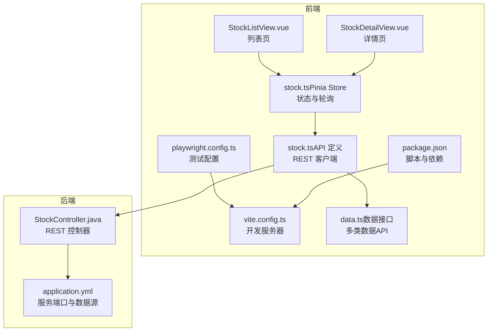
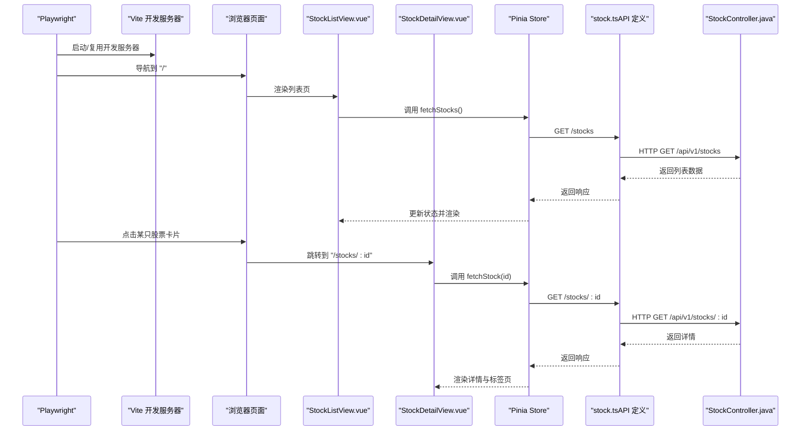
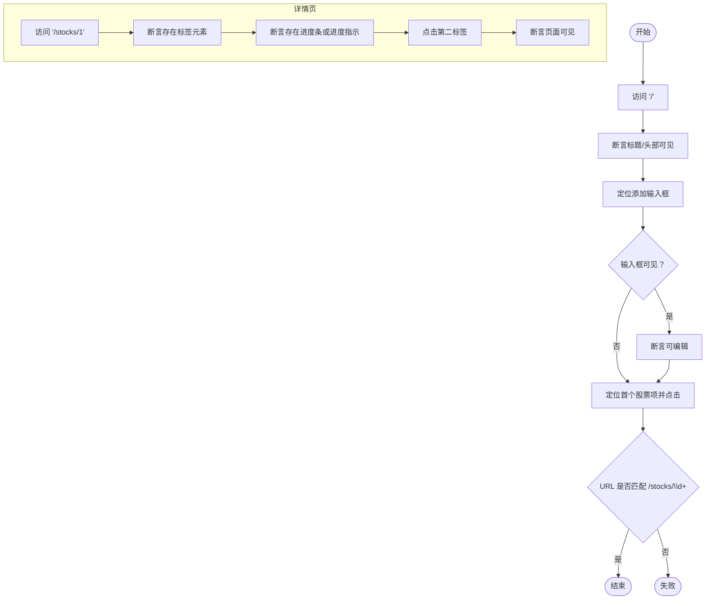
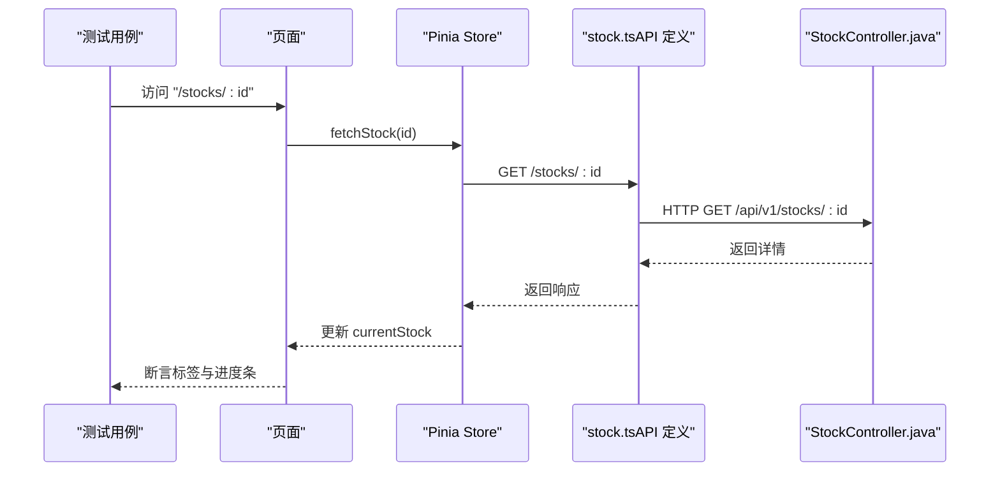
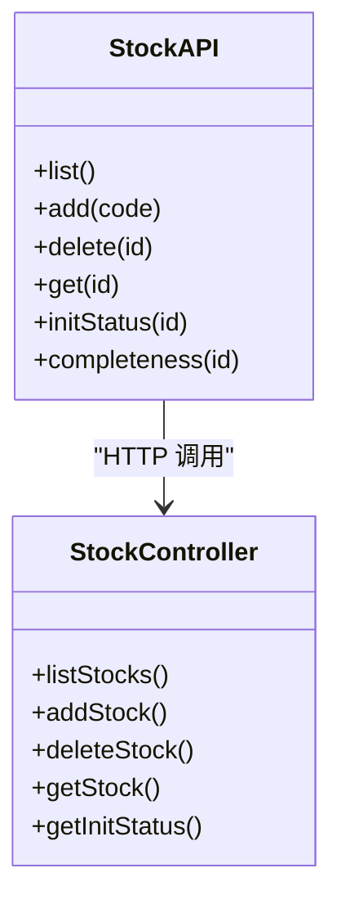
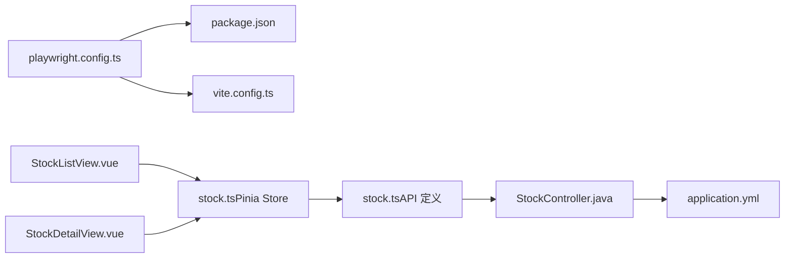

# 端到端测试

<cite>
**本文引用的文件**
- [playwright.config.ts](file://frontend/playwright.config.ts)
- [stock.spec.ts](file://frontend/e2e/stock.spec.ts)
- [package.json](file://frontend/package.json)
- [vite.config.ts](file://frontend/vite.config.ts)
- [StockListView.vue](file://frontend/src/views/StockListView.vue)
- [StockDetailView.vue](file://frontend/src/views/StockDetailView.vue)
- [stock.ts（Pinia Store）](file://frontend/src/stores/stock.ts)
- [stock.ts（API 定义）](file://frontend/src/api/stock.ts)
- [data.ts（数据接口定义）](file://frontend/src/api/data.ts)
- [StockController.java](file://backend/src/main/java/com/stock/controller/StockController.java)
- [application.yml](file://backend/src/main/resources/application.yml)
- [.last-run.json](file://frontend/test-results/.last-run.json)
</cite>

## 目录
1. [简介](#简介)
2. [项目结构](#项目结构)
3. [核心组件](#核心组件)
4. [架构总览](#架构总览)
5. [详细组件分析](#详细组件分析)
6. [依赖分析](#依赖分析)
7. [性能考虑](#性能考虑)
8. [故障排查指南](#故障排查指南)
9. [结论](#结论)
10. [附录](#附录)

## 简介
本文件面向前端与全栈工程师，系统化阐述本项目的 Playwright 端到端测试体系，涵盖测试环境搭建、浏览器与服务器配置、测试用例设计与断言策略、页面导航与交互流程、API 调用验证、截图与视频录制、错误诊断方法，以及在持续集成中的执行策略。文档以 stock.spec.ts 的测试场景为主线，结合前端视图与状态管理、后端控制器与配置，给出可落地的实践建议。

## 项目结构
前端采用 Vite + Vue 3 + Pinia 架构，Playwright 作为 E2E 测试框架；后端为 Spring Boot 应用，提供股票相关 REST 接口。E2E 测试位于 frontend/e2e，Playwright 配置位于 frontend/playwright.config.ts，开发服务器由 Vite 提供。

**图表来源**
- [playwright.config.ts:1-25](file://frontend/playwright.config.ts#L1-L25)
- [package.json:1-27](file://frontend/package.json#L1-L27)
- [vite.config.ts:1-8](file://frontend/vite.config.ts#L1-L8)
- [StockListView.vue:1-102](file://frontend/src/views/StockListView.vue#L1-L102)
- [StockDetailView.vue:1-82](file://frontend/src/views/StockDetailView.vue#L1-L82)
- [stock.ts（Pinia Store）:1-80](file://frontend/src/stores/stock.ts#L1-L80)
- [stock.ts（API 定义）:1-61](file://frontend/src/api/stock.ts#L1-L61)
- [data.ts（数据接口定义）:1-169](file://frontend/src/api/data.ts#L1-L169)
- [StockController.java:1-57](file://backend/src/main/java/com/stock/controller/StockController.java#L1-L57)
- [application.yml:1-28](file://backend/src/main/resources/application.yml#L1-L28)

**章节来源**
- [playwright.config.ts:1-25](file://frontend/playwright.config.ts#L1-L25)
- [package.json:1-27](file://frontend/package.json#L1-L27)
- [vite.config.ts:1-8](file://frontend/vite.config.ts#L1-L8)
- [StockListView.vue:1-102](file://frontend/src/views/StockListView.vue#L1-L102)
- [StockDetailView.vue:1-82](file://frontend/src/views/StockDetailView.vue#L1-L82)
- [stock.ts（Pinia Store）:1-80](file://frontend/src/stores/stock.ts#L1-L80)
- [stock.ts（API 定义）:1-61](file://frontend/src/api/stock.ts#L1-L61)
- [data.ts（数据接口定义）:1-169](file://frontend/src/api/data.ts#L1-L169)
- [StockController.java:1-57](file://backend/src/main/java/com/stock/controller/StockController.java#L1-L57)
- [application.yml:1-28](file://backend/src/main/resources/application.yml#L1-L28)

## 核心组件
- Playwright 配置与生命周期
  - 测试目录、超时、重试、截图策略、浏览器项目、WebServer 启动命令与端口等均在 playwright.config.ts 中集中配置。
  - 使用 npm run dev 作为测试前置的本地开发服务器，端口 5173，支持复用现有进程。
- 测试用例组织
  - stock.spec.ts 将测试分为“股票列表页”“股票详情页”“提醒管理”三大主题，分别覆盖导航、交互与状态展示。
- 前端页面与状态
  - 列表页负责加载与添加股票，详情页负责展示与标签切换、初始化进度条。
  - Pinia Store 统一管理数据请求、当前股票、初始化状态与轮询控制。
- 后端接口
  - 提供股票增删查、初始化状态查询等接口，配合前端完成端到端闭环。

**章节来源**
- [playwright.config.ts:1-25](file://frontend/playwright.config.ts#L1-L25)
- [stock.spec.ts:1-67](file://frontend/e2e/stock.spec.ts#L1-L67)
- [StockListView.vue:1-102](file://frontend/src/views/StockListView.vue#L1-L102)
- [StockDetailView.vue:1-82](file://frontend/src/views/StockDetailView.vue#L1-L82)
- [stock.ts（Pinia Store）:1-80](file://frontend/src/stores/stock.ts#L1-L80)
- [StockController.java:1-57](file://backend/src/main/java/com/stock/controller/StockController.java#L1-L57)

## 架构总览
下图展示了从 Playwright 执行到前端页面、状态管理与后端接口的整体调用链路。

**图表来源**
- [playwright.config.ts:18-23](file://frontend/playwright.config.ts#L18-L23)
- [StockListView.vue:60-62](file://frontend/src/views/StockListView.vue#L60-L62)
- [StockDetailView.vue:61-65](file://frontend/src/views/StockDetailView.vue#L61-L65)
- [stock.ts（Pinia Store）:12-20](file://frontend/src/stores/stock.ts#L12-L20)
- [stock.ts（API 定义）:54-58](file://frontend/src/api/stock.ts#L54-L58)
- [StockController.java:42-50](file://backend/src/main/java/com/stock/controller/StockController.java#L42-L50)

## 详细组件分析

### Playwright 配置与执行策略
- 测试目录与超时
  - testDir 指向 ./e2e；timeout 默认 30 秒；retries 为 0，便于快速暴露问题。
- 浏览器与截图
  - headless 为 true；screenshot 在失败时自动截取；可按需调整为 “on" 或 "only-on-failure"。
- 项目与浏览器
  - 单项目 chromium，便于一致性与跨平台兼容。
- WebServer
  - command 使用 npm run dev，端口 5173，reuseExistingServer=true，缩短 CI 启动时间。
- 脚本与依赖
  - package.json 中包含 @playwright/test 与相关类型依赖，确保类型安全与自动发现。

**章节来源**
- [playwright.config.ts:1-25](file://frontend/playwright.config.ts#L1-L25)
- [package.json:17-25](file://frontend/package.json#L17-L25)

### stock.spec.ts 测试场景解析
- 股票列表页
  - 页面可见性：访问根路径，断言标题或头部元素可见。
  - 添加输入框：定位带“股票代码/代码”占位符的输入框，若可见则断言可编辑。
  - 点击跳转：定位首个股票项容器，点击后断言 URL 匹配 /stocks/\d+。
- 股票详情页
  - 标签页展示：直接访问 /stocks/1，断言存在标签元素且页面可见。
  - 初始化进度条：访问 /stocks/1，断言存在进度条或进度指示元素（根据实际状态可能显示或隐藏）。
  - 标签切换：统计标签数量，点击第二项，等待短暂时间后断言页面仍可见。
- 提醒管理
  - 导航至详情页：访问 /stocks/1 并断言页面可见，为后续提醒相关测试预留入口。

**图表来源**
- [stock.spec.ts:3-26](file://frontend/e2e/stock.spec.ts#L3-L26)
- [stock.spec.ts:28-57](file://frontend/e2e/stock.spec.ts#L28-L57)

**章节来源**
- [stock.spec.ts:1-67](file://frontend/e2e/stock.spec.ts#L1-L67)

### 前端页面与交互流程
- 列表页（StockListView.vue）
  - 初始化时调用 store.fetchStocks() 加载数据。
  - 支持输入框回车与按钮点击添加股票，异常时弹窗提示。
  - 渲染表格，包含代码、名称、行业、价格、涨跌幅、PE、PB、完成度等字段。
- 详情页（StockDetailView.vue）
  - 读取路由参数 id，调用 store.fetchStock(id) 获取详情。
  - 若初始化未完成，展示初始化进度条与步骤状态；完成后触发刷新与标签页重渲染。
  - 提供返回列表与多个标签页（总览、产业分析、财务数据、竞争力、市场行情、投资笔记）。

**图表来源**
- [StockDetailView.vue:61-65](file://frontend/src/views/StockDetailView.vue#L61-L65)
- [stock.ts（Pinia Store）:38-41](file://frontend/src/stores/stock.ts#L38-L41)
- [stock.ts（API 定义）:57-58](file://frontend/src/api/stock.ts#L57-L58)
- [StockController.java:47-50](file://backend/src/main/java/com/stock/controller/StockController.java#L47-L50)

**章节来源**
- [StockListView.vue:60-80](file://frontend/src/views/StockListView.vue#L60-L80)
- [StockDetailView.vue:61-80](file://frontend/src/views/StockDetailView.vue#L61-L80)
- [stock.ts（Pinia Store）:38-58](file://frontend/src/stores/stock.ts#L38-L58)
- [stock.ts（API 定义）:53-60](file://frontend/src/api/stock.ts#L53-L60)
- [StockController.java:42-55](file://backend/src/main/java/com/stock/controller/StockController.java#L42-L55)

### API 调用与数据模型
- 前端 API
  - 列表/新增/删除/详情/初始化状态/完成度等接口通过 stock.ts（API 定义）统一导出。
  - 多类数据接口（资金流、利润、财务、股东、研报、指标）在 data.ts 中定义。
- 后端控制器
  - 提供 /api/v1/stocks 与 /api/v1/stocks/:id 及 /init-status 等端点。
- 配置
  - 后端 application.yml 指定端口、数据库与数据抓取器地址，确保 E2E 期间后端可用。

**图表来源**
- [stock.ts（API 定义）:53-60](file://frontend/src/api/stock.ts#L53-L60)
- [StockController.java:17-56](file://backend/src/main/java/com/stock/controller/StockController.java#L17-L56)

**章节来源**
- [stock.ts（API 定义）:1-61](file://frontend/src/api/stock.ts#L1-L61)
- [data.ts（数据接口定义）:1-169](file://frontend/src/api/data.ts#L1-L169)
- [StockController.java:1-57](file://backend/src/main/java/com/stock/controller/StockController.java#L1-L57)
- [application.yml:1-28](file://backend/src/main/resources/application.yml#L1-L28)

## 依赖分析
- Playwright 与前端
  - playwright.config.ts 依赖 package.json 的 dev 脚本与 vite.config.ts 的插件配置。
- 前端页面与状态
  - 列表与详情页依赖 Pinia Store；Store 依赖 API 定义；API 定义依赖后端控制器。
- 后端
  - 控制器依赖服务层与数据初始化服务，application.yml 提供数据源与调度配置。

**图表来源**
- [playwright.config.ts:1-25](file://frontend/playwright.config.ts#L1-L25)
- [package.json:6-10](file://frontend/package.json#L6-L10)
- [vite.config.ts:1-8](file://frontend/vite.config.ts#L1-L8)
- [StockListView.vue:50-58](file://frontend/src/views/StockListView.vue#L50-L58)
- [StockDetailView.vue:47-56](file://frontend/src/views/StockDetailView.vue#L47-L56)
- [stock.ts（Pinia Store）:1-10](file://frontend/src/stores/stock.ts#L1-L10)
- [stock.ts（API 定义）:1-3](file://frontend/src/api/stock.ts#L1-L3)
- [StockController.java:17-27](file://backend/src/main/java/com/stock/controller/StockController.java#L17-L27)
- [application.yml:1-28](file://backend/src/main/resources/application.yml#L1-L28)

**章节来源**
- [playwright.config.ts:1-25](file://frontend/playwright.config.ts#L1-L25)
- [package.json:1-27](file://frontend/package.json#L1-L27)
- [vite.config.ts:1-8](file://frontend/vite.config.ts#L1-L8)
- [StockListView.vue:1-102](file://frontend/src/views/StockListView.vue#L1-L102)
- [StockDetailView.vue:1-82](file://frontend/src/views/StockDetailView.vue#L1-L82)
- [stock.ts（Pinia Store）:1-80](file://frontend/src/stores/stock.ts#L1-L80)
- [stock.ts（API 定义）:1-61](file://frontend/src/api/stock.ts#L1-L61)
- [StockController.java:1-57](file://backend/src/main/java/com/stock/controller/StockController.java#L1-L57)
- [application.yml:1-28](file://backend/src/main/resources/application.yml#L1-L28)

## 性能考虑
- 浏览器与截图
  - headless=true 降低资源消耗；仅在失败时截图可减少磁盘 IO。
- 服务器启动
  - reuseExistingServer=true 避免重复冷启动，缩短 CI 时间。
- 超时与重试
  - 合理设置 timeout 与 retries，避免长耗时导致测试不稳定。
- 页面交互
  - 使用稳定的定位器（如 role、语义标签）提升稳定性；对动态内容增加显式等待。

[本节为通用建议，无需特定文件来源]

## 故障排查指南
- 截图与视频
  - 截图保存在默认输出目录；视频可在 playwright.config.ts 中开启录制并指定输出路径。
- 最近一次运行结果
  - .last-run.json 记录最近一次运行状态，可用于快速判断是否通过。
- 常见问题
  - 服务器未启动：确认 npm run dev 可正常启动，端口 5173 未被占用。
  - 定位器失效：检查页面元素选择器是否随 UI 更新而变化，必要时改为更稳定的属性或 role。
  - 初始化状态：详情页初始化进度条可能延迟出现，适当增加等待时间或条件断言。
  - 后端不可用：确认后端 application.yml 中的数据源与端口配置正确，数据抓取器地址可达。

**章节来源**
- [playwright.config.ts:7-11](file://frontend/playwright.config.ts#L7-L11)
- [.last-run.json:1-4](file://frontend/test-results/.last-run.json#L1-L4)

## 结论
本项目的 Playwright E2E 测试以简洁配置与清晰的页面职责为基础，围绕列表与详情两大核心场景构建了稳定可靠的端到端验证。通过 Pinia Store 与后端控制器的协作，测试能够覆盖导航、交互、状态更新与 API 调用。建议在 CI 中启用复用服务器与失败截图，并逐步扩展提醒管理等子场景的测试覆盖面。

[本节为总结，无需特定文件来源]

## 附录
- 持续集成中的执行策略
  - 在 CI 中安装依赖后，先启动后端（如需要），再启动 Playwright 测试；利用 reuseExistingServer 减少冷启动。
  - 将截图与视频归档，便于问题复现与回归分析。
  - 对关键场景（列表加载、详情页标签切换、初始化进度）设置独立 Job 并行执行，提高吞吐。

[本节为通用建议，无需特定文件来源]