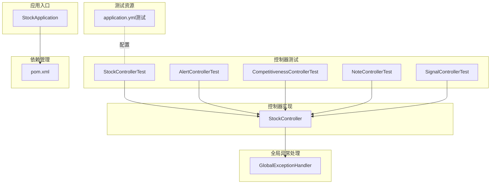
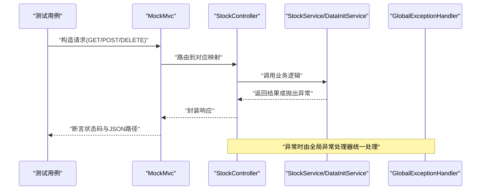
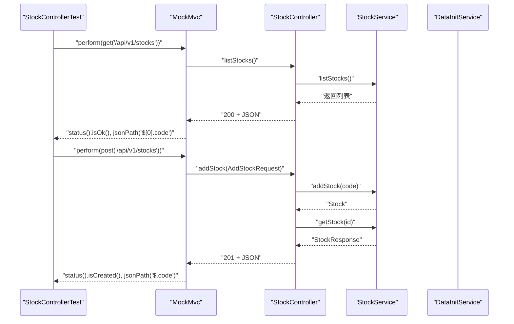
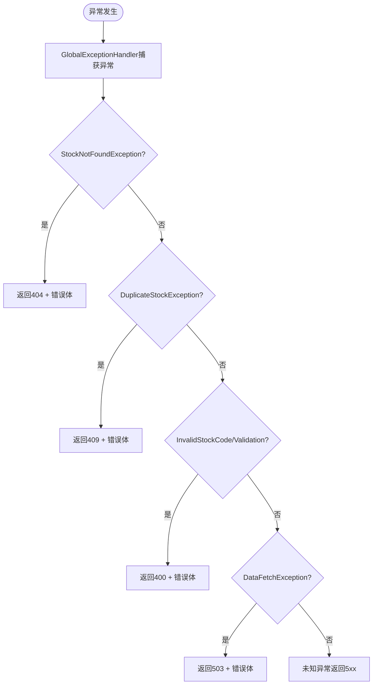
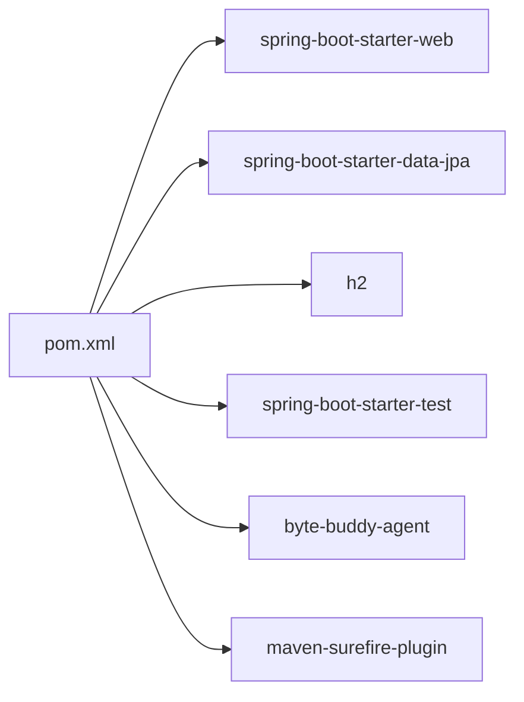

# 集成测试

<cite>
**本文引用的文件**
- [StockControllerTest.java](file://backend/src/test/java/com/stock/controller/StockControllerTest.java)
- [StockController.java](file://backend/src/main/java/com/stock/controller/StockController.java)
- [AlertControllerTest.java](file://backend/src/test/java/com/stock/controller/AlertControllerTest.java)
- [CompetitivenessControllerTest.java](file://backend/src/test/java/com/stock/controller/CompetitivenessControllerTest.java)
- [NoteControllerTest.java](file://backend/src/test/java/com/stock/controller/NoteControllerTest.java)
- [SignalControllerTest.java](file://backend/src/test/java/com/stock/controller/SignalControllerTest.java)
- [application.yml（测试）](file://backend/src/test/resources/application.yml)
- [application.yml（主资源）](file://backend/src/main/resources/application.yml)
- [GlobalExceptionHandler.java](file://backend/src/main/java/com/stock/exception/GlobalExceptionHandler.java)
- [StockServiceTest.java](file://backend/src/test/java/com/stock/service/StockServiceTest.java)
- [StockApplication.java](file://backend/src/main/java/com/stock/StockApplication.java)
- [pom.xml](file://backend/pom.xml)
</cite>

## 目录
1. [引言](#引言)
2. [项目结构](#项目结构)
3. [核心组件](#核心组件)
4. [架构总览](#架构总览)
5. [详细组件分析](#详细组件分析)
6. [依赖分析](#依赖分析)
7. [性能考虑](#性能考虑)
8. [故障排查指南](#故障排查指南)
9. [结论](#结论)
10. [附录](#附录)

## 引言
本文件面向Spring Boot后端的集成测试实践，聚焦于控制器层的MockMvc测试与端到端行为验证。通过对StockControllerTest等控制器测试类的深入解析，系统性阐述以下主题：
- 使用MockMvc进行HTTP请求模拟与响应断言
- GET、POST、DELETE等不同HTTP方法的测试策略
- 测试数据准备、数据库清理与事务管理策略
- 异常处理测试与状态码校验
- 测试环境配置与测试隔离策略

## 项目结构
后端采用标准Spring Boot目录结构，测试代码位于src/test下，按包划分控制器测试、服务测试与仓库测试；测试资源配置在src/test/resources中，主资源配置在src/main/resources中。

图表来源
- [StockControllerTest.java:1-116](file://backend/src/test/java/com/stock/controller/StockControllerTest.java#L1-L116)
- [StockController.java:1-57](file://backend/src/main/java/com/stock/controller/StockController.java#L1-L57)
- [application.yml（测试）:1-27](file://backend/src/test/resources/application.yml#L1-L27)
- [GlobalExceptionHandler.java:1-33](file://backend/src/main/java/com/stock/exception/GlobalExceptionHandler.java#L1-L33)
- [StockApplication.java:1-16](file://backend/src/main/java/com/stock/StockApplication.java#L1-L16)
- [pom.xml:1-103](file://backend/pom.xml#L1-L103)

章节来源
- [StockControllerTest.java:1-116](file://backend/src/test/java/com/stock/controller/StockControllerTest.java#L1-L116)
- [application.yml（测试）:1-27](file://backend/src/test/resources/application.yml#L1-L27)
- [application.yml（主资源）:1-28](file://backend/src/main/resources/application.yml#L1-L28)

## 核心组件
- 控制器层：通过@RestController暴露REST接口，如StockController提供股票增删查改与初始化状态查询。
- MockMvc：在测试中构建WebApplicationContext，对控制器进行HTTP请求模拟与响应断言。
- 全局异常处理：通过@ControllerAdvice集中处理业务异常，统一返回错误响应体与状态码。
- 测试配置：使用内存数据库H2与JPA自动建表/删表策略，确保测试隔离与可重复性。

章节来源
- [StockController.java:1-57](file://backend/src/main/java/com/stock/controller/StockController.java#L1-L57)
- [GlobalExceptionHandler.java:1-33](file://backend/src/main/java/com/stock/exception/GlobalExceptionHandler.java#L1-L33)
- [application.yml（测试）:1-27](file://backend/src/test/resources/application.yml#L1-L27)

## 架构总览
下图展示控制器测试在整体架构中的位置与交互路径：测试通过MockMvc向控制器发起HTTP请求，控制器调用服务层，服务层可能访问外部客户端或仓库层；异常由全局异常处理器统一捕获并返回标准化错误响应。

图表来源
- [StockControllerTest.java:51-114](file://backend/src/test/java/com/stock/controller/StockControllerTest.java#L51-L114)
- [StockController.java:29-55](file://backend/src/main/java/com/stock/controller/StockController.java#L29-L55)
- [GlobalExceptionHandler.java:9-31](file://backend/src/main/java/com/stock/exception/GlobalExceptionHandler.java#L9-L31)

## 详细组件分析

### StockControllerTest：控制器层集成测试范式
该测试类演示了典型的控制器集成测试模式，覆盖列表查询、新增、详情查询、删除与初始化状态查询，并通过Mock对象替代真实服务以实现快速、可控的测试。

- 测试准备
  - 使用MockMvcBuilders.standaloneSetup构建MockMvc实例，注入消息转换器以支持JSON序列化。
  - 通过@BeforeEach为每个测试方法准备Mock环境。
- 数据准备
  - 使用DTO与实体类构造测试数据，模拟服务层返回值。
- 请求模拟与断言
  - GET：断言状态码与JSON路径值，验证字段匹配。
  - POST：设置Content-Type为application/json，断言201状态与响应体字段。
  - DELETE：断言204状态。
  - 初始化状态查询：断言聚合统计字段。
- 事务与清理
  - 测试配置使用内存数据库与JPA DDL策略，确保每次测试后自动清理。

图表来源
- [StockControllerTest.java:51-114](file://backend/src/test/java/com/stock/controller/StockControllerTest.java#L51-L114)
- [StockController.java:29-55](file://backend/src/main/java/com/stock/controller/StockController.java#L29-L55)

章节来源
- [StockControllerTest.java:44-114](file://backend/src/test/java/com/stock/controller/StockControllerTest.java#L44-L114)
- [StockController.java:17-57](file://backend/src/main/java/com/stock/controller/StockController.java#L17-L57)

### 其他控制器测试：一致性与扩展
- AlertControllerTest：验证告警列表、创建与删除接口，重点在于JSON请求体与状态码断言。
- CompetitivenessControllerTest：验证竞争力指标的读取与更新，强调PUT请求与JSON字段校验。
- NoteControllerTest：验证笔记列表与分类过滤，关注查询参数与数组断言。
- SignalControllerTest：验证信号列表与标记已读操作，强调布尔字段断言。

这些测试均遵循相同的MockMvc模式：standaloneSetup + 消息转换器 + 期望状态码 + JSON路径断言。

章节来源
- [AlertControllerTest.java:36-71](file://backend/src/test/java/com/stock/controller/AlertControllerTest.java#L36-L71)
- [CompetitivenessControllerTest.java:34-63](file://backend/src/test/java/com/stock/controller/CompetitivenessControllerTest.java#L34-L63)
- [NoteControllerTest.java:33-58](file://backend/src/test/java/com/stock/controller/NoteControllerTest.java#L33-L58)
- [SignalControllerTest.java:33-59](file://backend/src/test/java/com/stock/controller/SignalControllerTest.java#L33-L59)

### 异常处理测试与状态码校验
- 全局异常处理器集中处理多种业务异常，返回标准化错误响应体与状态码（如404、409、400、503）。
- 在控制器测试中可通过模拟服务抛出异常，验证异常被正确捕获并返回预期状态码与错误信息。
- 建议在测试中增加针对不同异常类型的断言，确保异常场景覆盖完整。

图表来源
- [GlobalExceptionHandler.java:9-31](file://backend/src/main/java/com/stock/exception/GlobalExceptionHandler.java#L9-L31)

章节来源
- [GlobalExceptionHandler.java:1-33](file://backend/src/main/java/com/stock/exception/GlobalExceptionHandler.java#L1-L33)

### 测试数据准备、数据库清理与事务管理
- 内存数据库与DDL策略
  - 测试配置使用H2内存数据库与JPA DDL策略，确保测试前后自动建表与删表，避免跨测试污染。
- 事务管理
  - Spring Boot测试默认在事务中运行，测试结束后回滚，保证数据隔离与可重复性。
- 外部依赖隔离
  - 通过Mockito对服务层进行桩替，避免真实外部调用影响测试稳定性。

章节来源
- [application.yml（测试）:4-16](file://backend/src/test/resources/application.yml#L4-L16)
- [StockServiceTest.java:58-119](file://backend/src/test/java/com/stock/service/StockServiceTest.java#L58-L119)

### 测试环境配置与隔离策略
- 环境配置
  - 测试环境使用独立的application.yml，配置内存数据库与禁用H2控制台，降低外部依赖。
  - 主资源配置用于开发与生产环境，包含H2控制台路径与调度任务配置。
- 隔离策略
  - 每个控制器测试类独立构建MockMvc，避免相互干扰。
  - 使用standaloneSetup减少上下文加载开销，提升测试执行效率。

章节来源
- [application.yml（测试）:1-27](file://backend/src/test/resources/application.yml#L1-L27)
- [application.yml（主资源）:1-28](file://backend/src/main/resources/application.yml#L1-L28)
- [StockControllerTest.java:44-48](file://backend/src/test/java/com/stock/controller/StockControllerTest.java#L44-L48)

## 依赖分析
- 测试框架与工具
  - JUnit 5 + Mockito：提供注解驱动的测试与Mock能力。
  - Spring Boot Starter Test：内置MockMvc与WebMvcTest等测试支撑。
- 运行时依赖
  - Spring Web、Data JPA、H2数据库与验证器。
- 编译与测试插件
  - Byte Buddy代理与Surefire插件配置，确保测试运行时的反射与代理兼容性。

图表来源
- [pom.xml:23-56](file://backend/pom.xml#L23-L56)

章节来源
- [pom.xml:1-103](file://backend/pom.xml#L1-L103)

## 性能考虑
- 使用内存数据库与DDL策略，避免磁盘I/O与持久化开销。
- MockMvc基于本地内存请求处理，避免启动完整服务器带来的额外延迟。
- 合理拆分测试用例，避免单测过长导致整体CI时间增长。
- 对高频外部调用使用Mock，减少网络抖动对测试的影响。

## 故障排查指南
- 状态码不符
  - 检查控制器映射路径与HTTP方法是否一致。
  - 确认服务层返回值与响应封装逻辑。
- JSON路径断言失败
  - 使用MockMvc的andDo(print())输出实际响应体，核对字段名与层级。
- 异常未被捕获
  - 确认异常类型与全局异常处理器的映射关系。
  - 检查是否遗漏了特定异常的处理分支。
- 数据库污染或脏数据
  - 确认测试配置的DDL策略与事务回滚是否生效。
  - 避免在测试中直接操作真实数据库。

章节来源
- [StockControllerTest.java:51-114](file://backend/src/test/java/com/stock/controller/StockControllerTest.java#L51-L114)
- [GlobalExceptionHandler.java:9-31](file://backend/src/main/java/com/stock/exception/GlobalExceptionHandler.java#L9-L31)
- [application.yml（测试）:9-10](file://backend/src/test/resources/application.yml#L9-L10)

## 结论
通过MockMvc与Mockito的组合，本项目实现了对控制器层的高效、稳定与可维护的集成测试。测试覆盖了常见HTTP方法与关键业务流程，并通过内存数据库与全局异常处理保障了测试隔离与一致性。建议持续补充异常场景与边界条件测试，进一步完善测试矩阵。

## 附录
- 参考实现路径
  - 控制器测试：[StockControllerTest.java:51-114](file://backend/src/test/java/com/stock/controller/StockControllerTest.java#L51-L114)
  - 控制器实现：[StockController.java:29-55](file://backend/src/main/java/com/stock/controller/StockController.java#L29-L55)
  - 全局异常处理：[GlobalExceptionHandler.java:9-31](file://backend/src/main/java/com/stock/exception/GlobalExceptionHandler.java#L9-L31)
  - 测试配置：[application.yml（测试）:4-16](file://backend/src/test/resources/application.yml#L4-L16)
  - 主资源配置：[application.yml（主资源）:4-17](file://backend/src/main/resources/application.yml#L4-L17)
  - 服务层测试示例：[StockServiceTest.java:87-119](file://backend/src/test/java/com/stock/service/StockServiceTest.java#L87-L119)
  - 应用入口：[StockApplication.java:8-11](file://backend/src/main/java/com/stock/StockApplication.java#L8-L11)
  - 依赖管理：[pom.xml:23-56](file://backend/pom.xml#L23-L56)