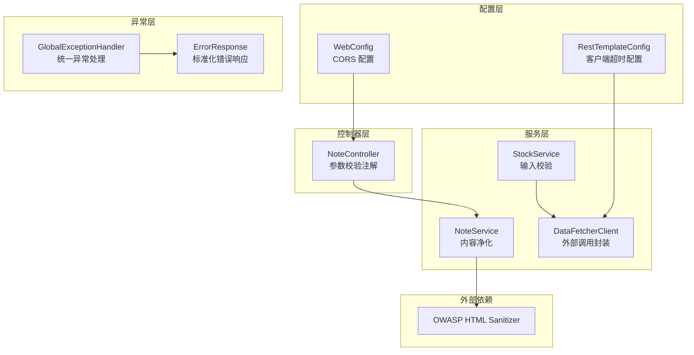
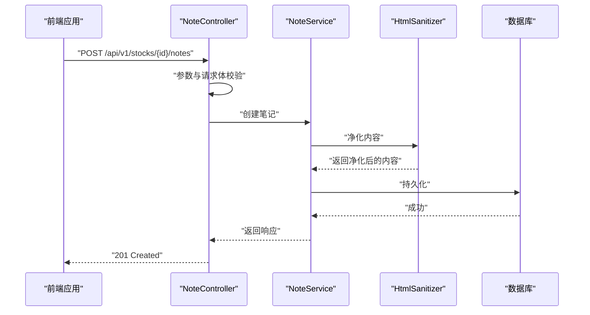
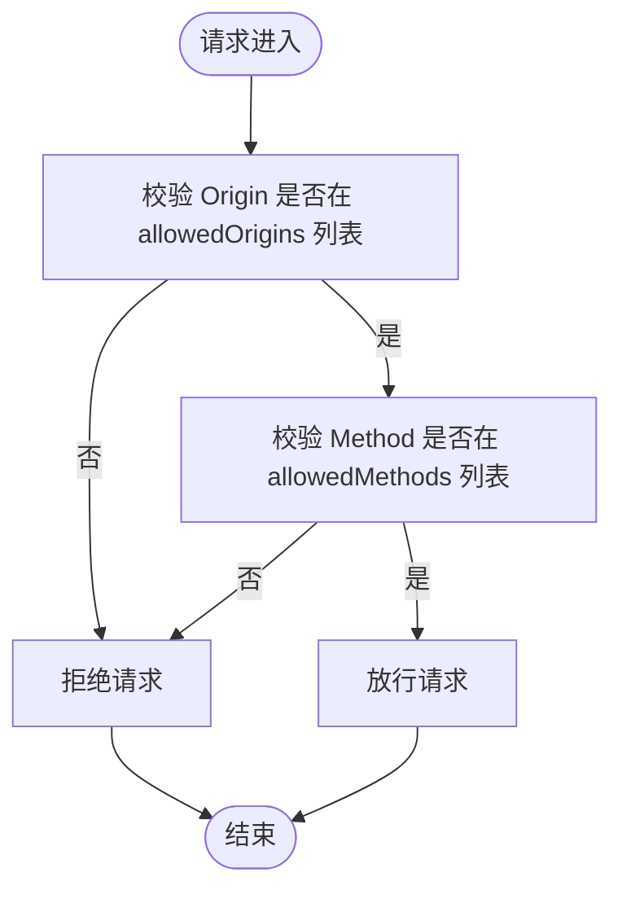
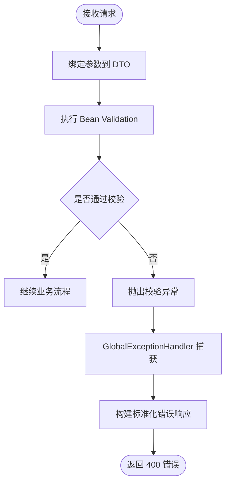
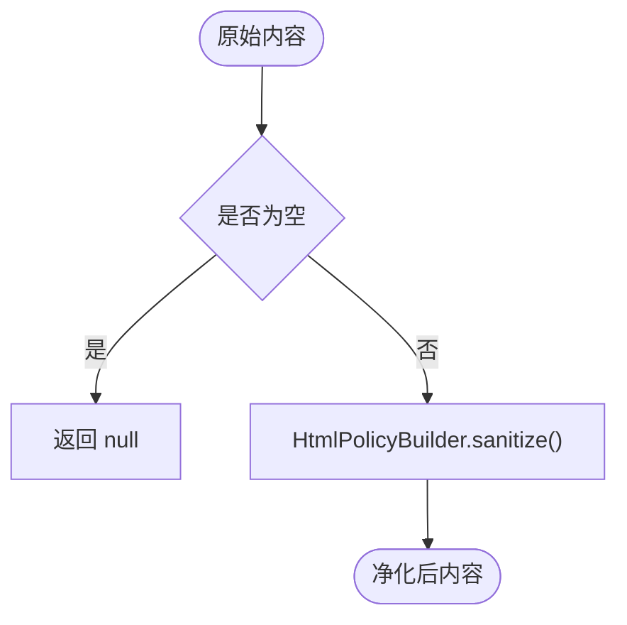
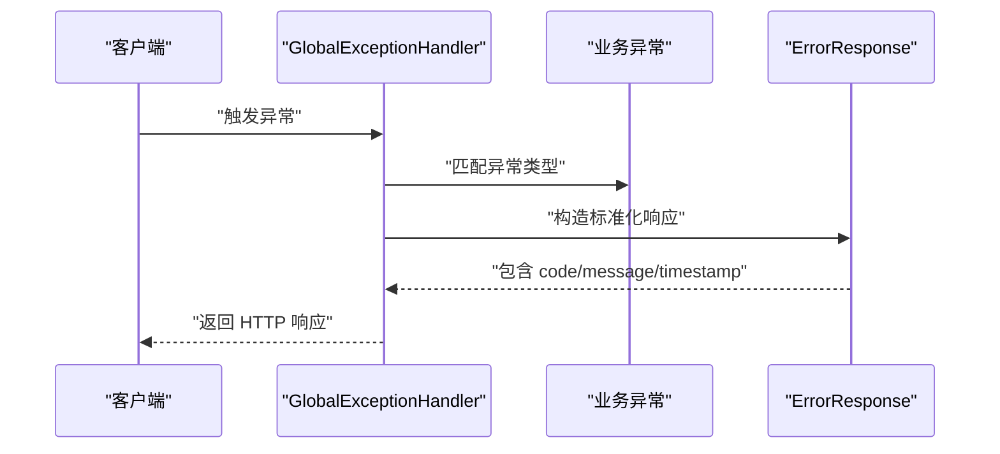
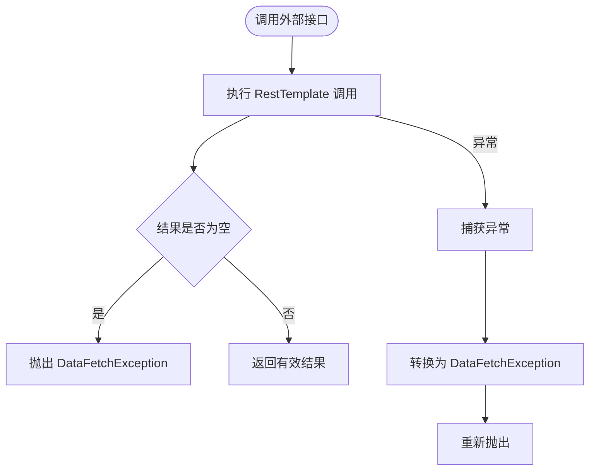
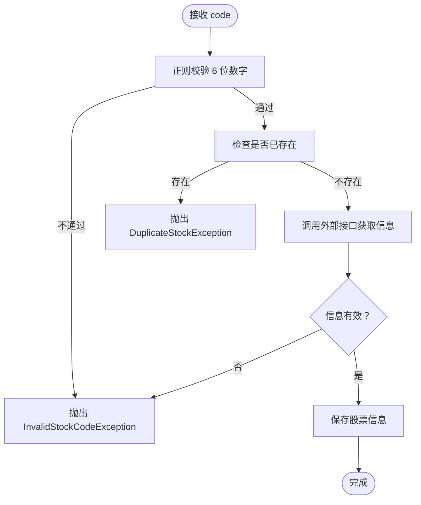
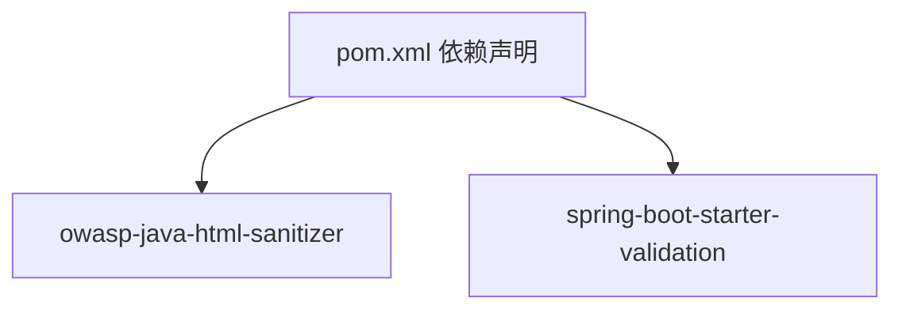

# 安全架构

<cite>
**本文引用的文件**
- [WebConfig.java](file://backend/src/main/java/com/stock/config/WebConfig.java)
- [RestTemplateConfig.java](file://backend/src/main/java/com/stock/config/RestTemplateConfig.java)
- [GlobalExceptionHandler.java](file://backend/src/main/java/com/stock/exception/GlobalExceptionHandler.java)
- [ErrorResponse.java](file://backend/src/main/java/com/stock/exception/ErrorResponse.java)
- [HtmlSanitizer.java](file://backend/src/main/java/com/stock/util/HtmlSanitizer.java)
- [DataFetcherClient.java](file://backend/src/main/java/com/stock/client/DataFetcherClient.java)
- [application.yml](file://backend/src/main/resources/application.yml)
- [NoteController.java](file://backend/src/main/java/com/stock/controller/NoteController.java)
- [NoteRequest.java](file://backend/src/main/java/com/stock/dto/request/NoteRequest.java)
- [AddStockRequest.java](file://backend/src/main/java/com/stock/dto/request/AddStockRequest.java)
- [NoteService.java](file://backend/src/main/java/com/stock/service/NoteService.java)
- [StockService.java](file://backend/src/main/java/com/stock/service/StockService.java)
- [pom.xml](file://backend/pom.xml)
</cite>

## 目录
1. [引言](#引言)
2. [项目结构](#项目结构)
3. [核心组件](#核心组件)
4. [架构总览](#架构总览)
5. [详细组件分析](#详细组件分析)
6. [依赖分析](#依赖分析)
7. [性能考量](#性能考量)
8. [故障排查指南](#故障排查指南)
9. [结论](#结论)
10. [附录](#附录)

## 引言
本文件系统化梳理后端安全架构，覆盖输入验证、XSS 防护、跨域安全配置、全局异常处理与统一错误响应、对外数据调用的安全边界、以及潜在风险与防护策略。文档同时提供安全最佳实践与合规性建议，帮助在开发与运维中持续保持安全基线。

## 项目结构
后端采用 Spring Boot 架构，安全相关能力主要分布在以下模块：
- 配置层：CORS 跨域配置、HTTP 客户端超时配置
- 控制器层：参数校验注解、请求体校验
- 服务层：输入净化（HTML 净化器）、对外接口调用封装
- 异常层：统一异常处理与标准化错误响应
- 外部依赖：OWASP HTML Sanitizer、Spring Validation

图表来源
- [WebConfig.java:1-15](file://backend/src/main/java/com/stock/config/WebConfig.java#L1-L15)
- [RestTemplateConfig.java:1-18](file://backend/src/main/java/com/stock/config/RestTemplateConfig.java#L1-L18)
- [NoteController.java:1-51](file://backend/src/main/java/com/stock/controller/NoteController.java#L1-L51)
- [NoteService.java:1-79](file://backend/src/main/java/com/stock/service/NoteService.java#L1-L79)
- [StockService.java:1-243](file://backend/src/main/java/com/stock/service/StockService.java#L1-L243)
- [DataFetcherClient.java:1-126](file://backend/src/main/java/com/stock/client/DataFetcherClient.java#L1-L126)
- [GlobalExceptionHandler.java:1-33](file://backend/src/main/java/com/stock/exception/GlobalExceptionHandler.java#L1-L33)
- [ErrorResponse.java:1-8](file://backend/src/main/java/com/stock/exception/ErrorResponse.java#L1-L8)
- [HtmlSanitizer.java:1-15](file://backend/src/main/java/com/stock/util/HtmlSanitizer.java#L1-L15)

章节来源
- [WebConfig.java:1-15](file://backend/src/main/java/com/stock/config/WebConfig.java#L1-L15)
- [RestTemplateConfig.java:1-18](file://backend/src/main/java/com/stock/config/RestTemplateConfig.java#L1-L18)
- [application.yml:1-28](file://backend/src/main/resources/application.yml#L1-L28)

## 核心组件
- CORS 跨域配置：限定受信源与方法，避免宽泛暴露
- 输入验证：基于 Bean Validation 的参数与请求体校验
- HTML 净化器：仅允许白名单元素，阻断脚本与恶意标签
- 全局异常处理：统一捕获业务与校验异常，返回标准化错误
- 对外调用封装：统一异常转换与超时控制，降低上游失败影响
- 应用配置：数据库与调度等运行参数集中管理

章节来源
- [WebConfig.java:8-13](file://backend/src/main/java/com/stock/config/WebConfig.java#L8-L13)
- [NoteController.java:30-42](file://backend/src/main/java/com/stock/controller/NoteController.java#L30-L42)
- [NoteRequest.java:6-9](file://backend/src/main/java/com/stock/dto/request/NoteRequest.java#L6-L9)
- [AddStockRequest.java:7-9](file://backend/src/main/java/com/stock/dto/request/AddStockRequest.java#L7-L9)
- [HtmlSanitizer.java:6-13](file://backend/src/main/java/com/stock/util/HtmlSanitizer.java#L6-L13)
- [GlobalExceptionHandler.java:9-31](file://backend/src/main/java/com/stock/exception/GlobalExceptionHandler.java#L9-L31)
- [ErrorResponse.java:3-6](file://backend/src/main/java/com/stock/exception/ErrorResponse.java#L3-L6)
- [DataFetcherClient.java:112-124](file://backend/src/main/java/com/stock/client/DataFetcherClient.java#L112-L124)
- [RestTemplateConfig.java:10-16](file://backend/src/main/java/com/stock/config/RestTemplateConfig.java#L10-L16)
- [application.yml:19-28](file://backend/src/main/resources/application.yml#L19-L28)

## 架构总览
下图展示安全相关的关键交互路径：前端通过受控的 CORS 源访问后端 API；控制器层进行参数与请求体校验；服务层对用户输入执行 HTML 净化；对外调用通过封装客户端统一处理异常；全局异常处理器统一输出标准化错误。

图表来源
- [NoteController.java:30-42](file://backend/src/main/java/com/stock/controller/NoteController.java#L30-L42)
- [NoteService.java:41-55](file://backend/src/main/java/com/stock/service/NoteService.java#L41-L55)
- [HtmlSanitizer.java:10-13](file://backend/src/main/java/com/stock/util/HtmlSanitizer.java#L10-L13)

## 详细组件分析

### CORS 跨域安全配置
- 受信源限制：仅允许本地开发源，避免生产环境宽泛暴露
- 方法白名单：限定常用方法，减少攻击面
- 请求头策略：允许通配符，需结合实际场景审慎评估

图表来源
- [WebConfig.java:8-13](file://backend/src/main/java/com/stock/config/WebConfig.java#L8-L13)

章节来源
- [WebConfig.java:8-13](file://backend/src/main/java/com/stock/config/WebConfig.java#L8-L13)

### 输入验证与参数校验
- 控制器层：使用校验注解约束路径变量与请求体字段
- DTO 层：定义最小/最大长度、非空、正则表达式等约束
- 统一校验异常：由全局异常处理器转换为标准化错误

图表来源
- [NoteController.java:30-42](file://backend/src/main/java/com/stock/controller/NoteController.java#L30-L42)
- [NoteRequest.java:6-9](file://backend/src/main/java/com/stock/dto/request/NoteRequest.java#L6-L9)
- [AddStockRequest.java:7-9](file://backend/src/main/java/com/stock/dto/request/AddStockRequest.java#L7-L9)
- [GlobalExceptionHandler.java:25-31](file://backend/src/main/java/com/stock/exception/GlobalExceptionHandler.java#L25-L31)

章节来源
- [NoteController.java:30-42](file://backend/src/main/java/com/stock/controller/NoteController.java#L30-L42)
- [NoteRequest.java:6-9](file://backend/src/main/java/com/stock/dto/request/NoteRequest.java#L6-L9)
- [AddStockRequest.java:7-9](file://backend/src/main/java/com/stock/dto/request/AddStockRequest.java#L7-L9)
- [GlobalExceptionHandler.java:25-31](file://backend/src/main/java/com/stock/exception/GlobalExceptionHandler.java#L25-L31)

### HTML 净化器与 XSS 防护
- 白名单策略：仅允许安全元素，阻断脚本与危险标签
- 空值保护：对空输入直接返回空值，避免异常
- 使用位置：服务层在持久化前对用户输入进行净化

图表来源
- [HtmlSanitizer.java:6-13](file://backend/src/main/java/com/stock/util/HtmlSanitizer.java#L6-L13)
- [NoteService.java:49-62](file://backend/src/main/java/com/stock/service/NoteService.java#L49-L62)

章节来源
- [HtmlSanitizer.java:6-13](file://backend/src/main/java/com/stock/util/HtmlSanitizer.java#L6-L13)
- [NoteService.java:49-62](file://backend/src/main/java/com/stock/service/NoteService.java#L49-L62)

### 全局异常处理与统一错误响应
- 异常映射：针对不同业务异常返回对应状态码
- 校验异常：提取字段级错误消息，拼接为统一提示
- 标准化响应：携带状态码、消息与时间戳

图表来源
- [GlobalExceptionHandler.java:9-31](file://backend/src/main/java/com/stock/exception/GlobalExceptionHandler.java#L9-L31)
- [ErrorResponse.java:3-6](file://backend/src/main/java/com/stock/exception/ErrorResponse.java#L3-L6)

章节来源
- [GlobalExceptionHandler.java:9-31](file://backend/src/main/java/com/stock/exception/GlobalExceptionHandler.java#L9-L31)
- [ErrorResponse.java:3-6](file://backend/src/main/java/com/stock/exception/ErrorResponse.java#L3-L6)

### 对外数据调用的安全封装
- 统一封装：将 RestTemplate 调用包裹在客户端中，集中处理异常
- 异常转换：将底层异常转换为领域异常，便于上层统一处理
- 超时控制：通过客户端配置连接与读取超时，避免阻塞扩散

图表来源
- [DataFetcherClient.java:112-124](file://backend/src/main/java/com/stock/client/DataFetcherClient.java#L112-L124)
- [RestTemplateConfig.java:10-16](file://backend/src/main/java/com/stock/config/RestTemplateConfig.java#L10-L16)

章节来源
- [DataFetcherClient.java:112-124](file://backend/src/main/java/com/stock/client/DataFetcherClient.java#L112-L124)
- [RestTemplateConfig.java:10-16](file://backend/src/main/java/com/stock/config/RestTemplateConfig.java#L10-L16)

### 输入验证与业务规则（示例：添加股票）
- 正则与长度约束：确保股票代码为 6 位数字
- 业务检查：重复代码与无效代码均抛出相应异常
- 外部接口校验：若无法获取有效股票信息，拒绝入库

图表来源
- [StockService.java:94-105](file://backend/src/main/java/com/stock/service/StockService.java#L94-L105)

章节来源
- [StockService.java:94-105](file://backend/src/main/java/com/stock/service/StockService.java#L94-L105)

## 依赖分析
- OWASP HTML Sanitizer：用于白名单化 HTML 内容，防止 XSS
- Spring Validation：提供声明式参数校验能力
- Spring Web MVC：支持全局异常处理与 CORS 配置

图表来源
- [pom.xml:47-50](file://backend/pom.xml#L47-L50)
- [pom.xml:34-35](file://backend/pom.xml#L34-L35)

章节来源
- [pom.xml:47-50](file://backend/pom.xml#L47-L50)
- [pom.xml:34-35](file://backend/pom.xml#L34-L35)

## 性能考量
- CORS 配置：限制受信源与方法可降低跨域攻击面，同时避免不必要的预检请求
- 参数校验：在入口处快速失败，减少后续处理开销
- 净化策略：白名单元素数量有限，性能开销可控；建议在批量写入时评估批量净化成本
- 异常处理：统一异常映射与标准化响应可减少分支逻辑，提升可观测性
- 外部调用：设置合理超时，避免下游抖动影响整体性能

## 故障排查指南
- CORS 相关问题
  - 现象：浏览器报跨域错误或预检失败
  - 排查：确认请求源是否在 allowedOrigins 列表，方法是否在 allowedMethods
  - 参考：[WebConfig.java:8-13](file://backend/src/main/java/com/stock/config/WebConfig.java#L8-L13)
- 参数校验失败
  - 现象：返回 400 错误，包含字段级错误信息
  - 排查：核对 DTO 注解与请求体结构
  - 参考：[GlobalExceptionHandler.java:25-31](file://backend/src/main/java/com/stock/exception/GlobalExceptionHandler.java#L25-L31)、[NoteRequest.java:6-9](file://backend/src/main/java/com/stock/dto/request/NoteRequest.java#L6-L9)
- XSS 风险
  - 现象：富文本显示异常或被过滤
  - 排查：确认输入是否经过 HtmlSanitizer；白名单是否满足需求
  - 参考：[HtmlSanitizer.java:6-13](file://backend/src/main/java/com/stock/util/HtmlSanitizer.java#L6-L13)、[NoteService.java:49-62](file://backend/src/main/java/com/stock/service/NoteService.java#L49-L62)
- 外部接口异常
  - 现象：服务不可用或超时
  - 排查：检查 DataFetcherClient 的异常转换与超时配置
  - 参考：[DataFetcherClient.java:112-124](file://backend/src/main/java/com/stock/client/DataFetcherClient.java#L112-L124)、[RestTemplateConfig.java:10-16](file://backend/src/main/java/com/stock/config/RestTemplateConfig.java#L10-L16)
- 统一错误响应
  - 现象：错误格式不一致
  - 排查：确认 GlobalExceptionHandler 是否正确捕获异常并返回 ErrorResponse
  - 参考：[GlobalExceptionHandler.java:9-31](file://backend/src/main/java/com/stock/exception/GlobalExceptionHandler.java#L9-L31)、[ErrorResponse.java:3-6](file://backend/src/main/java/com/stock/exception/ErrorResponse.java#L3-L6)

章节来源
- [WebConfig.java:8-13](file://backend/src/main/java/com/stock/config/WebConfig.java#L8-L13)
- [GlobalExceptionHandler.java:25-31](file://backend/src/main/java/com/stock/exception/GlobalExceptionHandler.java#L25-L31)
- [HtmlSanitizer.java:6-13](file://backend/src/main/java/com/stock/util/HtmlSanitizer.java#L6-L13)
- [DataFetcherClient.java:112-124](file://backend/src/main/java/com/stock/client/DataFetcherClient.java#L112-L124)
- [RestTemplateConfig.java:10-16](file://backend/src/main/java/com/stock/config/RestTemplateConfig.java#L10-L16)
- [ErrorResponse.java:3-6](file://backend/src/main/java/com/stock/exception/ErrorResponse.java#L3-L6)

## 结论
本系统通过“入口参数校验 + 内容净化 + 统一异常处理 + 受控跨域 + 外部调用封装”的组合拳，构建了较为完善的后端安全基线。建议在生产环境中进一步强化 CORS 受信源与方法列表、完善审计日志、引入 WAF 与速率限制，并定期进行安全扫描与渗透测试以持续加固。

## 附录
- 安全最佳实践
  - CORS：仅允许必要源与方法；生产环境禁止通配符
  - 输入校验：在控制器与 DTO 层双重约束，避免漏网之鱼
  - XSS：坚持白名单策略，定期审查白名单元素
  - 异常处理：统一错误格式与状态码映射，避免泄露敏感信息
  - 外部调用：设置超时与重试策略，做好降级与熔断
- 合规性考虑
  - 数据最小化：仅收集与处理必要的字段
  - 日志脱敏：避免记录敏感字段
  - 访问审计：记录关键操作与异常事件
  - 第三方依赖：定期更新 OWASP Sanitizer 等依赖版本