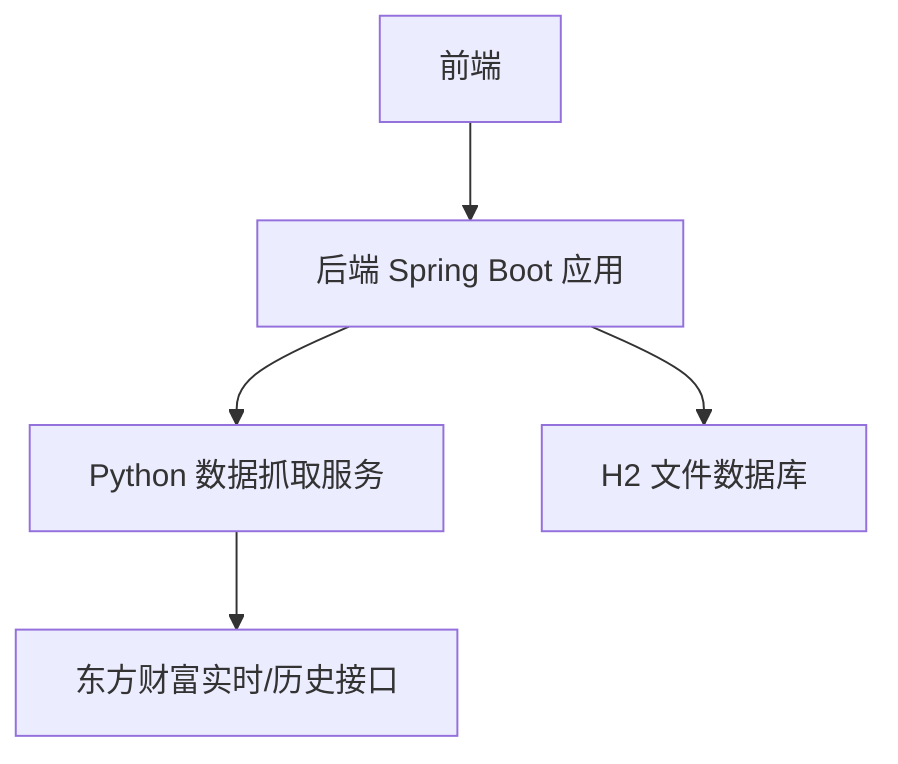
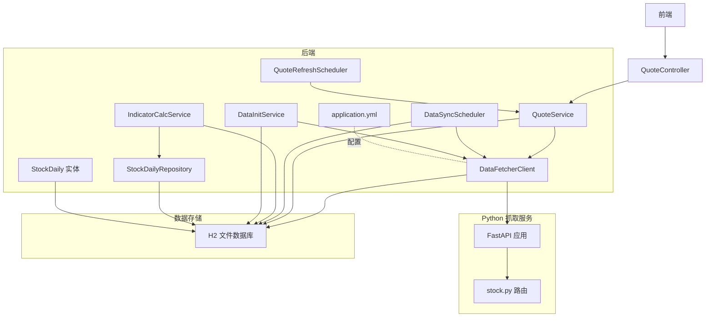
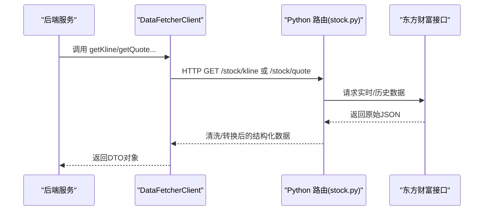
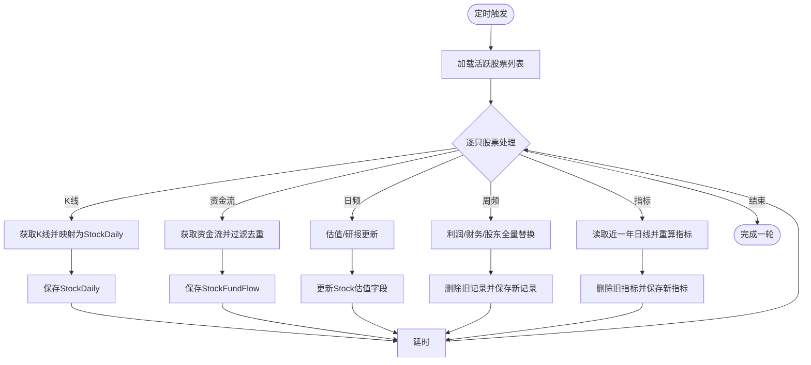
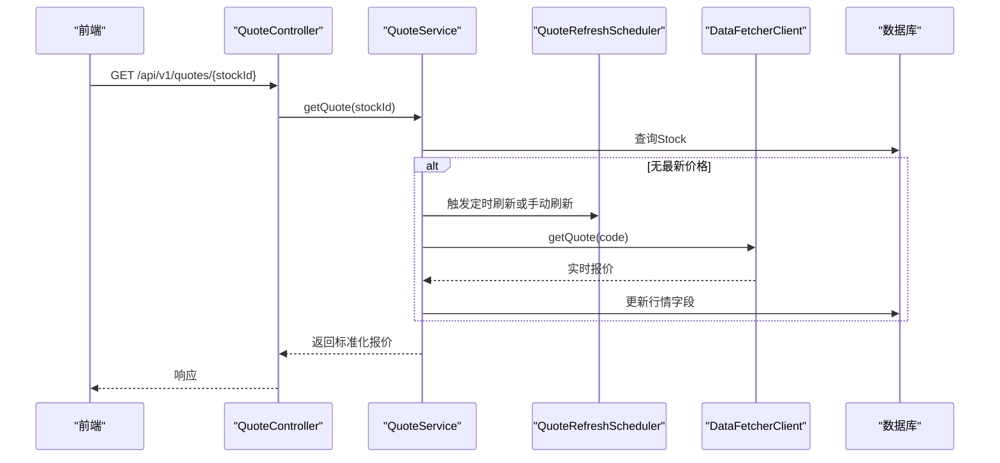
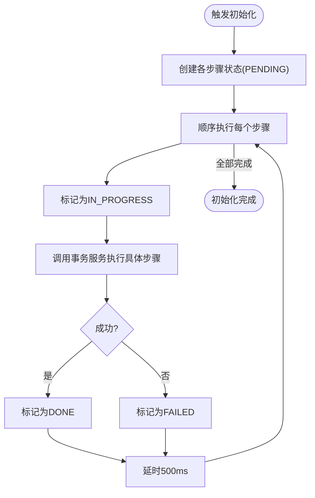
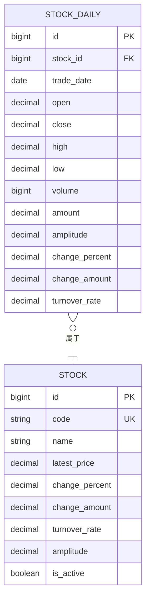
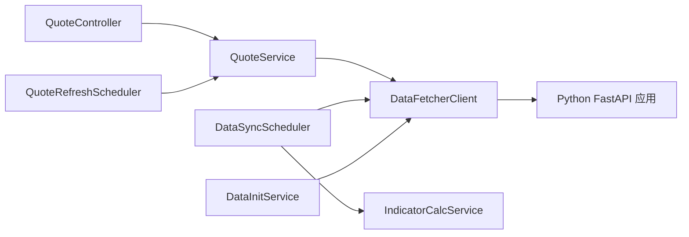

# 数据流设计

<cite>
**本文引用的文件**
- [backend/src/main/java/com/stock/client/DataFetcherClient.java](file://backend/src/main/java/com/stock/client/DataFetcherClient.java)
- [backend/src/main/java/com/stock/scheduler/DataSyncScheduler.java](file://backend/src/main/java/com/stock/scheduler/DataSyncScheduler.java)
- [backend/src/main/java/com/stock/service/QuoteService.java](file://backend/src/main/java/com/stock/service/QuoteService.java)
- [backend/src/main/java/com/stock/repository/StockDailyRepository.java](file://backend/src/main/java/com/stock/repository/StockDailyRepository.java)
- [backend/src/main/java/com/stock/service/IndicatorCalcService.java](file://backend/src/main/java/com/stock/service/IndicatorCalcService.java)
- [backend/src/main/java/com/stock/entity/StockDaily.java](file://backend/src/main/java/com/stock/entity/StockDaily.java)
- [backend/src/main/java/com/stock/dto/fetcher/KlineDataResponse.java](file://backend/src/main/java/com/stock/dto/fetcher/KlineDataResponse.java)
- [backend/src/main/resources/application.yml](file://backend/src/main/resources/application.yml)
- [data-fetcher/app.py](file://data-fetcher/app.py)
- [data-fetcher/routers/stock.py](file://data-fetcher/routers/stock.py)
- [backend/src/main/java/com/stock/exception/DataFetchException.java](file://backend/src/main/java/com/stock/exception/DataFetchException.java)
- [backend/src/main/java/com/stock/entity/Stock.java](file://backend/src/main/java/com/stock/entity/Stock.java)
- [backend/src/main/java/com/stock/scheduler/QuoteRefreshScheduler.java](file://backend/src/main/java/com/stock/scheduler/QuoteRefreshScheduler.java)
- [backend/src/main/java/com/stock/service/DataInitService.java](file://backend/src/main/java/com/stock/service/DataInitService.java)
- [backend/src/main/java/com/stock/controller/QuoteController.java](file://backend/src/main/java/com/stock/controller/QuoteController.java)
- [system-planner/high-level-design.md](file://system-planner/high-level-design.md)
</cite>

## 目录
1. [引言](#引言)
2. [项目结构](#项目结构)
3. [核心组件](#核心组件)
4. [架构总览](#架构总览)
5. [详细组件分析](#详细组件分析)
6. [依赖分析](#依赖分析)
7. [性能考虑](#性能考虑)
8. [故障排查指南](#故障排查指南)
9. [结论](#结论)
10. [附录](#附录)

## 引言
本文件聚焦于系统中“数据流设计”的完整说明，覆盖从外部API获取数据、数据转换、存储、查询与展示的全流程。同时解释定时任务调度机制、异步数据处理流程与缓存策略，给出数据流图与时序图，明确关键数据处理节点与性能优化点，并阐述数据一致性保证与错误恢复机制。

## 项目结构
后端采用Spring Boot，数据来源为独立的Python数据抓取服务（FastAPI）。前端通过REST接口访问后端，后端再通过DataFetcherClient调用Python服务获取实时/历史数据，随后进行转换与入库，最终由各Service提供查询与展示能力。

图表来源
- [backend/src/main/java/com/stock/client/DataFetcherClient.java:1-126](file://backend/src/main/java/com/stock/client/DataFetcherClient.java#L1-L126)
- [data-fetcher/app.py:1-31](file://data-fetcher/app.py#L1-L31)
- [backend/src/main/resources/application.yml:1-28](file://backend/src/main/resources/application.yml#L1-L28)

章节来源
- [backend/src/main/resources/application.yml:1-28](file://backend/src/main/resources/application.yml#L1-L28)
- [data-fetcher/app.py:1-31](file://data-fetcher/app.py#L1-L31)

## 核心组件
- 外部数据客户端：DataFetcherClient封装对Python数据抓取服务的REST调用，统一异常处理与空响应校验。
- 定时同步器：DataSyncScheduler按计划执行多类数据的增量同步与指标重算。
- 实时行情服务：QuoteService负责获取/刷新单只股票的实时行情，并返回标准化响应。
- 数据仓库与实体：StockDailyRepository与StockDaily等实体支撑日线与衍生指标的持久化。
- 指标计算服务：IndicatorCalcService基于日线数据批量计算MA/MACD/RSI/KDJ/BOLL等技术指标。
- 配置与调度：application.yml定义数据抓取服务地址与调度cron；QuoteRefreshScheduler按配置周期刷新行情。
- 初始化编排：DataInitService以异步方式顺序执行初始化步骤，记录每步状态。

章节来源
- [backend/src/main/java/com/stock/client/DataFetcherClient.java:1-126](file://backend/src/main/java/com/stock/client/DataFetcherClient.java#L1-L126)
- [backend/src/main/java/com/stock/scheduler/DataSyncScheduler.java:1-238](file://backend/src/main/java/com/stock/scheduler/DataSyncScheduler.java#L1-L238)
- [backend/src/main/java/com/stock/service/QuoteService.java:1-98](file://backend/src/main/java/com/stock/service/QuoteService.java#L1-L98)
- [backend/src/main/java/com/stock/repository/StockDailyRepository.java:1-24](file://backend/src/main/java/com/stock/repository/StockDailyRepository.java#L1-L24)
- [backend/src/main/java/com/stock/service/IndicatorCalcService.java:1-210](file://backend/src/main/java/com/stock/service/IndicatorCalcService.java#L1-L210)
- [backend/src/main/java/com/stock/entity/StockDaily.java:1-60](file://backend/src/main/java/com/stock/entity/StockDaily.java#L1-L60)
- [backend/src/main/resources/application.yml:1-28](file://backend/src/main/resources/application.yml#L1-L28)
- [backend/src/main/java/com/stock/scheduler/QuoteRefreshScheduler.java:1-35](file://backend/src/main/java/com/stock/scheduler/QuoteRefreshScheduler.java#L1-L35)
- [backend/src/main/java/com/stock/service/DataInitService.java:1-101](file://backend/src/main/java/com/stock/service/DataInitService.java#L1-L101)

## 架构总览
系统采用“后端编排 + Python抓取 + 本地数据库”的三层架构。后端通过DataFetcherClient统一访问Python服务，完成数据拉取、转换与入库；定时任务驱动增量同步与指标重算；异步初始化保障新增股票的全量数据补齐。

图表来源
- [backend/src/main/java/com/stock/client/DataFetcherClient.java:1-126](file://backend/src/main/java/com/stock/client/DataFetcherClient.java#L1-L126)
- [backend/src/main/java/com/stock/service/QuoteService.java:1-98](file://backend/src/main/java/com/stock/service/QuoteService.java#L1-L98)
- [backend/src/main/java/com/stock/scheduler/DataSyncScheduler.java:1-238](file://backend/src/main/java/com/stock/scheduler/DataSyncScheduler.java#L1-L238)
- [backend/src/main/java/com/stock/service/IndicatorCalcService.java:1-210](file://backend/src/main/java/com/stock/service/IndicatorCalcService.java#L1-L210)
- [backend/src/main/java/com/stock/repository/StockDailyRepository.java:1-24](file://backend/src/main/java/com/stock/repository/StockDailyRepository.java#L1-L24)
- [backend/src/main/java/com/stock/entity/StockDaily.java:1-60](file://backend/src/main/java/com/stock/entity/StockDaily.java#L1-L60)
- [backend/src/main/resources/application.yml:1-28](file://backend/src/main/resources/application.yml#L1-L28)
- [backend/src/main/java/com/stock/scheduler/QuoteRefreshScheduler.java:1-35](file://backend/src/main/java/com/stock/scheduler/QuoteRefreshScheduler.java#L1-L35)
- [backend/src/main/java/com/stock/service/DataInitService.java:1-101](file://backend/src/main/java/com/stock/service/DataInitService.java#L1-L101)
- [backend/src/main/java/com/stock/controller/QuoteController.java:1-28](file://backend/src/main/java/com/stock/controller/QuoteController.java#L1-L28)
- [data-fetcher/app.py:1-31](file://data-fetcher/app.py#L1-L31)
- [data-fetcher/routers/stock.py:1-246](file://data-fetcher/routers/stock.py#L1-L246)

## 详细组件分析

### 组件A：外部数据抓取与转换
- DataFetcherClient封装所有对外HTTP调用，统一异常包装与空响应检查，确保上层调用稳定。
- Python侧stock.py路由实现基础信息、K线、分时、实时报价与批量报价等接口，统一字段清洗与类型转换。
- K线响应结构KlineDataResponse承载列表项，便于后端映射到StockDaily实体。

图表来源
- [backend/src/main/java/com/stock/client/DataFetcherClient.java:1-126](file://backend/src/main/java/com/stock/client/DataFetcherClient.java#L1-L126)
- [data-fetcher/routers/stock.py:75-126](file://data-fetcher/routers/stock.py#L75-L126)
- [data-fetcher/routers/stock.py:173-206](file://data-fetcher/routers/stock.py#L173-L206)

章节来源
- [backend/src/main/java/com/stock/client/DataFetcherClient.java:1-126](file://backend/src/main/java/com/stock/client/DataFetcherClient.java#L1-L126)
- [data-fetcher/routers/stock.py:1-246](file://data-fetcher/routers/stock.py#L1-L246)
- [backend/src/main/java/com/stock/dto/fetcher/KlineDataResponse.java:1-10](file://backend/src/main/java/com/stock/dto/fetcher/KlineDataResponse.java#L1-L10)

### 组件B：定时任务调度与增量同步
- DataSyncScheduler按不同cron执行K线、资金流、日频估值/研报、周频利润/财务/股东、以及指标重算。
- 每类任务均基于“最大已存在日期+1”策略进行增量同步，避免重复写入。
- 指标重算通过IndicatorCalcService批量计算并替换旧指标，保证计算一致性。

图表来源
- [backend/src/main/java/com/stock/scheduler/DataSyncScheduler.java:54-236](file://backend/src/main/java/com/stock/scheduler/DataSyncScheduler.java#L54-L236)
- [backend/src/main/java/com/stock/service/IndicatorCalcService.java:15-63](file://backend/src/main/java/com/stock/service/IndicatorCalcService.java#L15-L63)
- [backend/src/main/java/com/stock/repository/StockDailyRepository.java:19-20](file://backend/src/main/java/com/stock/repository/StockDailyRepository.java#L19-L20)

章节来源
- [backend/src/main/java/com/stock/scheduler/DataSyncScheduler.java:1-238](file://backend/src/main/java/com/stock/scheduler/DataSyncScheduler.java#L1-L238)
- [backend/src/main/java/com/stock/service/IndicatorCalcService.java:1-210](file://backend/src/main/java/com/stock/service/IndicatorCalcService.java#L1-L210)
- [backend/src/main/java/com/stock/repository/StockDailyRepository.java:1-24](file://backend/src/main/java/com/stock/repository/StockDailyRepository.java#L1-L24)

### 组件C：实时行情刷新与查询
- QuoteRefreshScheduler按配置的cron周期性刷新所有活跃股票的实时行情。
- QuoteService在查询时若发现缓存缺失或过期，会主动从DataFetcherClient抓取并更新Stock实体的行情字段，随后返回标准化响应。
- QuoteController提供REST接口供前端调用。

图表来源
- [backend/src/main/java/com/stock/scheduler/QuoteRefreshScheduler.java:24-33](file://backend/src/main/java/com/stock/scheduler/QuoteRefreshScheduler.java#L24-L33)
- [backend/src/main/java/com/stock/service/QuoteService.java:30-96](file://backend/src/main/java/com/stock/service/QuoteService.java#L30-L96)
- [backend/src/main/java/com/stock/controller/QuoteController.java:18-26](file://backend/src/main/java/com/stock/controller/QuoteController.java#L18-L26)
- [backend/src/main/resources/application.yml:24-27](file://backend/src/main/resources/application.yml#L24-L27)

章节来源
- [backend/src/main/java/com/stock/scheduler/QuoteRefreshScheduler.java:1-35](file://backend/src/main/java/com/stock/scheduler/QuoteRefreshScheduler.java#L1-L35)
- [backend/src/main/java/com/stock/service/QuoteService.java:1-98](file://backend/src/main/java/com/stock/service/QuoteService.java#L1-L98)
- [backend/src/main/java/com/stock/controller/QuoteController.java:1-28](file://backend/src/main/java/com/stock/controller/QuoteController.java#L1-L28)
- [backend/src/main/resources/application.yml:24-27](file://backend/src/main/resources/application.yml#L24-L27)

### 组件D：异步数据初始化与一致性
- DataInitService以异步方式顺序执行初始化步骤（估值、K线、资金流、利润、财务、股东、研报、指标），并在每个步骤间插入固定延时，降低外部接口压力。
- 初始化状态通过InitStatusRepository记录，便于前端轮询查看进度。
- 为保证异步线程可见刚提交的Stock记录，使用事务同步钩子确保在事务提交后再触发异步任务。

图表来源
- [backend/src/main/java/com/stock/service/DataInitService.java:42-71](file://backend/src/main/java/com/stock/service/DataInitService.java#L42-L71)

章节来源
- [backend/src/main/java/com/stock/service/DataInitService.java:1-101](file://backend/src/main/java/com/stock/service/DataInitService.java#L1-L101)

### 组件E：数据模型与存储
- StockDaily实体定义日线数据字段，并通过唯一约束(stock_id, trade_date)保证同一天同一股票的唯一性。
- StockDailyRepository提供按日期范围查询、最大交易日查询与按stock_id删除等方法，支撑增量同步与指标重算。

图表来源
- [backend/src/main/java/com/stock/entity/StockDaily.java:1-60](file://backend/src/main/java/com/stock/entity/StockDaily.java#L1-L60)
- [backend/src/main/java/com/stock/entity/Stock.java:1-86](file://backend/src/main/java/com/stock/entity/Stock.java#L1-L86)
- [backend/src/main/java/com/stock/repository/StockDailyRepository.java:1-24](file://backend/src/main/java/com/stock/repository/StockDailyRepository.java#L1-L24)

章节来源
- [backend/src/main/java/com/stock/entity/StockDaily.java:1-60](file://backend/src/main/java/com/stock/entity/StockDaily.java#L1-L60)
- [backend/src/main/java/com/stock/entity/Stock.java:1-86](file://backend/src/main/java/com/stock/entity/Stock.java#L1-L86)
- [backend/src/main/java/com/stock/repository/StockDailyRepository.java:1-24](file://backend/src/main/java/com/stock/repository/StockDailyRepository.java#L1-L24)

## 依赖分析
- 后端对Python抓取服务的依赖通过DataFetcherClient集中管理，统一异常与空响应处理。
- 定时任务与业务服务解耦，通过Repository与Service层协作，避免跨模块耦合。
- 配置集中于application.yml，便于运维调整调度频率与外部服务地址。

图表来源
- [backend/src/main/java/com/stock/controller/QuoteController.java:1-28](file://backend/src/main/java/com/stock/controller/QuoteController.java#L1-L28)
- [backend/src/main/java/com/stock/service/QuoteService.java:1-98](file://backend/src/main/java/com/stock/service/QuoteService.java#L1-L98)
- [backend/src/main/java/com/stock/scheduler/DataSyncScheduler.java:1-238](file://backend/src/main/java/com/stock/scheduler/DataSyncScheduler.java#L1-L238)
- [backend/src/main/java/com/stock/scheduler/QuoteRefreshScheduler.java:1-35](file://backend/src/main/java/com/stock/scheduler/QuoteRefreshScheduler.java#L1-L35)
- [backend/src/main/java/com/stock/service/DataInitService.java:1-101](file://backend/src/main/java/com/stock/service/DataInitService.java#L1-L101)
- [backend/src/main/java/com/stock/client/DataFetcherClient.java:1-126](file://backend/src/main/java/com/stock/client/DataFetcherClient.java#L1-L126)
- [data-fetcher/app.py:1-31](file://data-fetcher/app.py#L1-L31)

章节来源
- [backend/src/main/java/com/stock/controller/QuoteController.java:1-28](file://backend/src/main/java/com/stock/controller/QuoteController.java#L1-L28)
- [backend/src/main/java/com/stock/service/QuoteService.java:1-98](file://backend/src/main/java/com/stock/service/QuoteService.java#L1-L98)
- [backend/src/main/java/com/stock/scheduler/DataSyncScheduler.java:1-238](file://backend/src/main/java/com/stock/scheduler/DataSyncScheduler.java#L1-L238)
- [backend/src/main/java/com/stock/scheduler/QuoteRefreshScheduler.java:1-35](file://backend/src/main/java/com/stock/scheduler/QuoteRefreshScheduler.java#L1-L35)
- [backend/src/main/java/com/stock/service/DataInitService.java:1-101](file://backend/src/main/java/com/stock/service/DataInitService.java#L1-L101)
- [backend/src/main/java/com/stock/client/DataFetcherClient.java:1-126](file://backend/src/main/java/com/stock/client/DataFetcherClient.java#L1-L126)
- [data-fetcher/app.py:1-31](file://data-fetcher/app.py#L1-L31)

## 性能考虑
- 增量同步策略：基于最大交易日+1，减少重复写入与网络请求。
- 批量写入：K线、资金流、指标等批量保存，降低数据库往返次数。
- 固定延时：定时任务与初始化步骤间插入固定延时，缓解外部接口限流压力。
- 计算批量化：IndicatorCalcService一次性计算多周期指标，避免多次扫描日线数据。
- 配置化调度：application.yml集中管理cron，便于按业务需求动态调整。

章节来源
- [backend/src/main/java/com/stock/scheduler/DataSyncScheduler.java:56-82](file://backend/src/main/java/com/stock/scheduler/DataSyncScheduler.java#L56-L82)
- [backend/src/main/java/com/stock/service/IndicatorCalcService.java:15-63](file://backend/src/main/java/com/stock/service/IndicatorCalcService.java#L15-L63)
- [backend/src/main/resources/application.yml:24-27](file://backend/src/main/resources/application.yml#L24-L27)

## 故障排查指南
- 外部调用失败：DataFetcherClient捕获异常并抛出DataFetchException，便于上层统一处理。
- 空响应校验：当DataFetcherClient收到null响应时，显式抛出异常，避免脏数据进入系统。
- 日志与告警：定时任务与服务层广泛使用日志输出，便于定位失败原因与统计失败数量。
- 健康检查：Python服务提供/health端点，可快速验证抓取服务可用性。

章节来源
- [backend/src/main/java/com/stock/client/DataFetcherClient.java:112-124](file://backend/src/main/java/com/stock/client/DataFetcherClient.java#L112-L124)
- [backend/src/main/java/com/stock/exception/DataFetchException.java:1-6](file://backend/src/main/java/com/stock/exception/DataFetchException.java#L1-L6)
- [data-fetcher/app.py:23-25](file://data-fetcher/app.py#L23-L25)

## 结论
该系统通过清晰的职责划分与配置化的调度策略，实现了从外部API到本地数据库的高效数据流闭环。定时任务与异步初始化确保了数据的持续更新与补齐，而统一的异常处理与日志体系提供了良好的可观测性与可维护性。建议在生产环境中结合限流策略与监控告警进一步提升稳定性。

## 附录
- Python抓取服务路由概览：基础信息、K线、分时、实时报价、批量报价等接口，统一字段清洗与类型转换。
- 高层设计要点：后端调用链、初始化编排、调度策略与缓存策略详见系统规划文档。

章节来源
- [data-fetcher/routers/stock.py:1-246](file://data-fetcher/routers/stock.py#L1-L246)
- [system-planner/high-level-design.md:239-271](file://system-planner/high-level-design.md#L239-L271)
- [system-planner/high-level-design.md:441-466](file://system-planner/high-level-design.md#L441-L466)