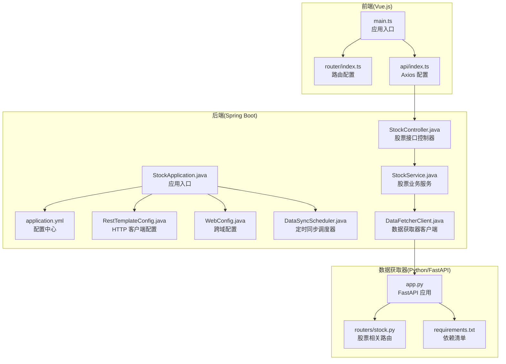
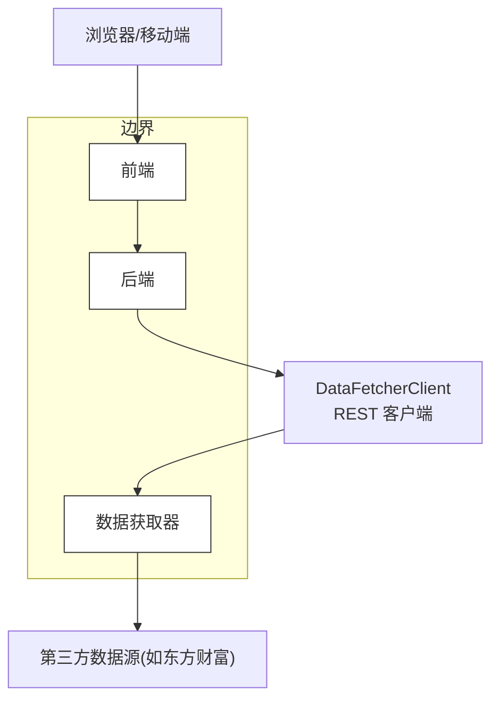
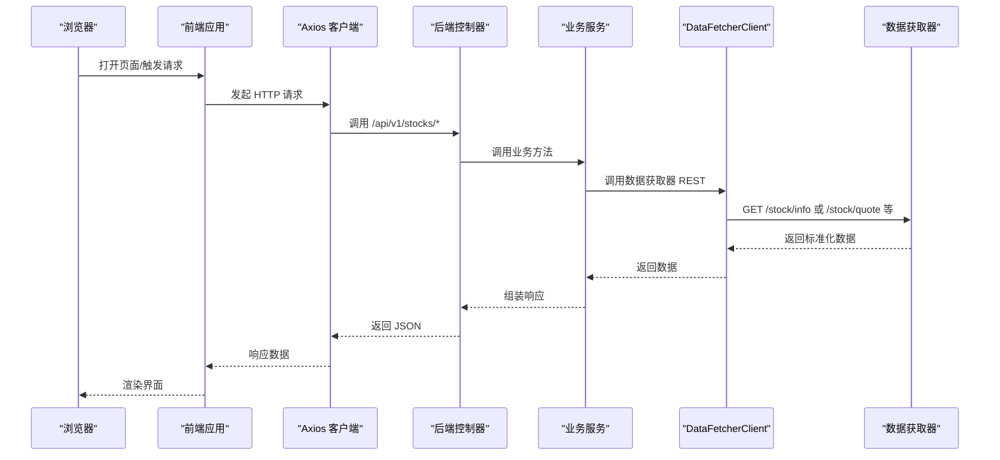
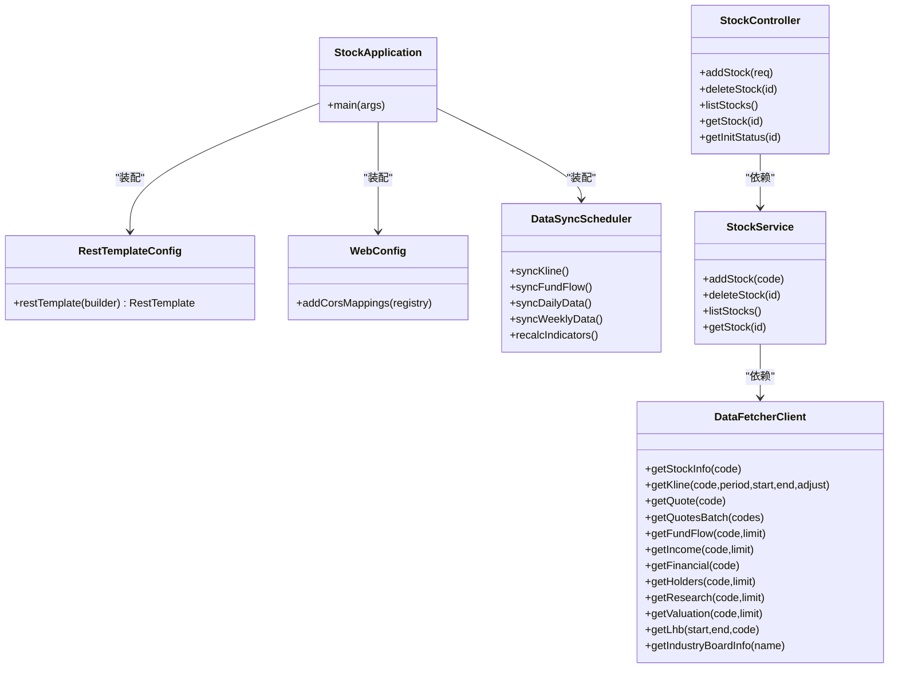
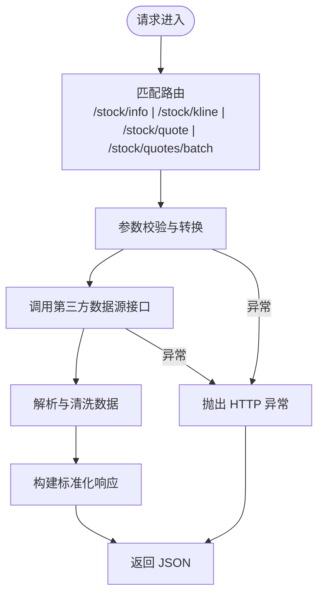
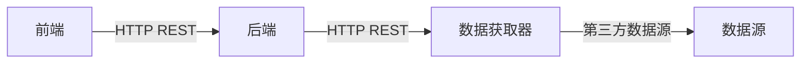

# 整体架构概述

<cite>
**本文档引用的文件**
- [StockApplication.java](file://backend/src/main/java/com/stock/StockApplication.java)
- [application.yml](file://backend/src/main/resources/application.yml)
- [DataFetcherClient.java](file://backend/src/main/java/com/stock/client/DataFetcherClient.java)
- [RestTemplateConfig.java](file://backend/src/main/java/com/stock/config/RestTemplateConfig.java)
- [WebConfig.java](file://backend/src/main/java/com/stock/config/WebConfig.java)
- [StockController.java](file://backend/src/main/java/com/stock/controller/StockController.java)
- [StockService.java](file://backend/src/main/java/com/stock/service/StockService.java)
- [DataSyncScheduler.java](file://backend/src/main/java/com/stock/scheduler/DataSyncScheduler.java)
- [package.json](file://frontend/package.json)
- [main.ts](file://frontend/src/main.ts)
- [index.ts](file://frontend/src/router/index.ts)
- [index.ts](file://frontend/src/api/index.ts)
- [app.py](file://data-fetcher/app.py)
- [requirements.txt](file://data-fetcher/requirements.txt)
- [stock.py](file://data-fetcher/routers/stock.py)
</cite>

## 目录
1. [引言](#引言)
2. [项目结构](#项目结构)
3. [核心组件](#核心组件)
4. [架构总览](#架构总览)
5. [详细组件分析](#详细组件分析)
6. [依赖关系分析](#依赖关系分析)
7. [性能考虑](#性能考虑)
8. [故障排除指南](#故障排除指南)
9. [结论](#结论)

## 引言
本文件为股票交易系统的整体架构概述，重点阐述三层架构模式：前端 Vue.js 应用、后端 Spring Boot 服务、Python 数据获取器（FastAPI）。文档从系统边界、组件职责与交互关系入手，结合技术栈选择与架构决策的权衡，给出系统启动流程与核心组件启动顺序说明，帮助读者快速理解并开展开发与运维工作。

## 项目结构
系统采用前后端分离架构，后端通过定时任务与数据获取器对接外部数据源，前端通过 REST 接口消费后端数据。项目目录组织清晰，按功能域划分模块，便于扩展与维护。

**图表来源**
- [main.ts:1-11](file://frontend/src/main.ts#L1-L11)
- [index.ts:1-28](file://frontend/src/router/index.ts#L1-L28)
- [index.ts:1-18](file://frontend/src/api/index.ts#L1-L18)
- [StockApplication.java:1-16](file://backend/src/main/java/com/stock/StockApplication.java#L1-L16)
- [application.yml:1-28](file://backend/src/main/resources/application.yml#L1-L28)
- [RestTemplateConfig.java:1-18](file://backend/src/main/java/com/stock/config/RestTemplateConfig.java#L1-L18)
- [WebConfig.java:1-15](file://backend/src/main/java/com/stock/config/WebConfig.java#L1-L15)
- [DataFetcherClient.java:1-126](file://backend/src/main/java/com/stock/client/DataFetcherClient.java#L1-L126)
- [DataSyncScheduler.java:1-238](file://backend/src/main/java/com/stock/scheduler/DataSyncScheduler.java#L1-L238)
- [StockController.java:1-57](file://backend/src/main/java/com/stock/controller/StockController.java#L1-L57)
- [StockService.java:1-243](file://backend/src/main/java/com/stock/service/StockService.java#L1-L243)
- [app.py:1-31](file://data-fetcher/app.py#L1-L31)
- [stock.py:1-246](file://data-fetcher/routers/stock.py#L1-L246)
- [requirements.txt:1-7](file://data-fetcher/requirements.txt#L1-L7)

**章节来源**
- [StockApplication.java:1-16](file://backend/src/main/java/com/stock/StockApplication.java#L1-L16)
- [application.yml:1-28](file://backend/src/main/resources/application.yml#L1-L28)
- [package.json:1-27](file://frontend/package.json#L1-L27)
- [app.py:1-31](file://data-fetcher/app.py#L1-L31)

## 核心组件
- 前端 Vue.js 应用
  - 应用入口负责初始化 Pinia 状态管理与 Vue Router 路由系统，并挂载根组件。
  - Axios 实例统一配置基础 URL、超时时间与响应拦截器，集中处理错误。
  - 路由定义了列表页与详情页及其子标签页，支持动态导入视图组件。
- 后端 Spring Boot 服务
  - 应用入口启用调度与异步能力，加载配置与组件。
  - RestTemplateConfig 提供连接与读取超时设置，确保对外部调用的稳定性。
  - WebConfig 配置 CORS，允许前端本地开发服务器访问后端 API。
  - DataFetcherClient 封装对 Python 数据获取器的 REST 调用，统一封装异常处理。
  - DataSyncScheduler 通过 cron 表达式定期拉取各类行情与财务数据，计算技术指标。
  - StockController/StockService 提供股票增删查与初始化状态查询等核心业务。
- Python 数据获取器（FastAPI）
  - app.py 注册多个路由模块，启用 CORS 并提供健康检查端点。
  - routers/stock.py 实现股票基本信息、K线、分时、实时报价与批量报价等接口，内部封装数据清洗与字段映射。
  - requirements.txt 列出 FastAPI、uvicorn、akshare、pandas、requests、python-dotenv 等依赖。

**章节来源**
- [main.ts:1-11](file://frontend/src/main.ts#L1-L11)
- [index.ts:1-28](file://frontend/src/router/index.ts#L1-L28)
- [index.ts:1-18](file://frontend/src/api/index.ts#L1-L18)
- [StockApplication.java:1-16](file://backend/src/main/java/com/stock/StockApplication.java#L1-L16)
- [RestTemplateConfig.java:1-18](file://backend/src/main/java/com/stock/config/RestTemplateConfig.java#L1-L18)
- [WebConfig.java:1-15](file://backend/src/main/java/com/stock/config/WebConfig.java#L1-L15)
- [DataFetcherClient.java:1-126](file://backend/src/main/java/com/stock/client/DataFetcherClient.java#L1-L126)
- [DataSyncScheduler.java:1-238](file://backend/src/main/java/com/stock/scheduler/DataSyncScheduler.java#L1-L238)
- [StockController.java:1-57](file://backend/src/main/java/com/stock/controller/StockController.java#L1-L57)
- [StockService.java:1-243](file://backend/src/main/java/com/stock/service/StockService.java#L1-L243)
- [app.py:1-31](file://data-fetcher/app.py#L1-L31)
- [stock.py:1-246](file://data-fetcher/routers/stock.py#L1-L246)
- [requirements.txt:1-7](file://data-fetcher/requirements.txt#L1-L7)

## 架构总览
系统采用“前端单页应用 + 后端微服务 + 外部数据获取器”的三层架构。前端通过 Axios 访问后端 REST API；后端通过 DataFetcherClient 统一调用 Python 数据获取器；数据获取器直连第三方数据源（如东方财富），完成数据抓取与清洗后返回标准化 JSON。

**图表来源**
- [index.ts:1-18](file://frontend/src/api/index.ts#L1-L18)
- [StockController.java:1-57](file://backend/src/main/java/com/stock/controller/StockController.java#L1-L57)
- [DataFetcherClient.java:1-126](file://backend/src/main/java/com/stock/client/DataFetcherClient.java#L1-L126)
- [app.py:1-31](file://data-fetcher/app.py#L1-L31)
- [stock.py:1-246](file://data-fetcher/routers/stock.py#L1-L246)

## 详细组件分析

### 前端组件分析
- 应用入口与状态管理
  - main.ts 初始化应用实例、Pinia 与路由，随后挂载到 DOM。
- 路由与视图
  - router/index.ts 定义首页与股票详情页路由，详情页包含行业、财务、竞争力、市场、笔记等子标签页，均采用动态导入以优化首屏加载。
- API 客户端
  - api/index.ts 创建 Axios 实例，设置基础 URL 指向后端 API，统一超时时间与错误拦截，便于全局错误处理与调试。

**图表来源**
- [main.ts:1-11](file://frontend/src/main.ts#L1-L11)
- [index.ts:1-28](file://frontend/src/router/index.ts#L1-L28)
- [index.ts:1-18](file://frontend/src/api/index.ts#L1-L18)
- [StockController.java:1-57](file://backend/src/main/java/com/stock/controller/StockController.java#L1-L57)
- [StockService.java:1-243](file://backend/src/main/java/com/stock/service/StockService.java#L1-L243)
- [DataFetcherClient.java:1-126](file://backend/src/main/java/com/stock/client/DataFetcherClient.java#L1-L126)
- [stock.py:1-246](file://data-fetcher/routers/stock.py#L1-L246)

**章节来源**
- [main.ts:1-11](file://frontend/src/main.ts#L1-L11)
- [index.ts:1-28](file://frontend/src/router/index.ts#L1-L28)
- [index.ts:1-18](file://frontend/src/api/index.ts#L1-L18)

### 后端组件分析
- 应用入口与配置
  - StockApplication 启用调度与异步注解，作为 Spring Boot 启动类。
  - application.yml 定义服务端口、数据库连接、JPA 配置、H2 控制台以及数据获取器地址与调度策略。
- HTTP 客户端与跨域
  - RestTemplateConfig 设置连接与读取超时，避免长时间阻塞。
  - WebConfig 对 /api/v1/** 开启 CORS，允许前端本地开发服务器访问。
- 数据获取器客户端
  - DataFetcherClient 将不同数据类型的请求封装为方法，统一异常处理，增强健壮性。
- 定时同步调度器
  - DataSyncScheduler 周期性拉取日线、资金流、估值、研报、周频财务与技术指标，保证数据新鲜度。
- 股票业务服务
  - StockService 在新增股票时先持久化，再在事务提交后触发异步初始化，确保并发一致性。

**图表来源**
- [StockApplication.java:1-16](file://backend/src/main/java/com/stock/StockApplication.java#L1-L16)
- [RestTemplateConfig.java:1-18](file://backend/src/main/java/com/stock/config/RestTemplateConfig.java#L1-L18)
- [WebConfig.java:1-15](file://backend/src/main/java/com/stock/config/WebConfig.java#L1-L15)
- [DataFetcherClient.java:1-126](file://backend/src/main/java/com/stock/client/DataFetcherClient.java#L1-L126)
- [DataSyncScheduler.java:1-238](file://backend/src/main/java/com/stock/scheduler/DataSyncScheduler.java#L1-L238)
- [StockController.java:1-57](file://backend/src/main/java/com/stock/controller/StockController.java#L1-L57)
- [StockService.java:1-243](file://backend/src/main/java/com/stock/service/StockService.java#L1-L243)

**章节来源**
- [StockApplication.java:1-16](file://backend/src/main/java/com/stock/StockApplication.java#L1-L16)
- [application.yml:1-28](file://backend/src/main/resources/application.yml#L1-L28)
- [RestTemplateConfig.java:1-18](file://backend/src/main/java/com/stock/config/RestTemplateConfig.java#L1-L18)
- [WebConfig.java:1-15](file://backend/src/main/java/com/stock/config/WebConfig.java#L1-L15)
- [DataFetcherClient.java:1-126](file://backend/src/main/java/com/stock/client/DataFetcherClient.java#L1-L126)
- [DataSyncScheduler.java:1-238](file://backend/src/main/java/com/stock/scheduler/DataSyncScheduler.java#L1-L238)
- [StockController.java:1-57](file://backend/src/main/java/com/stock/controller/StockController.java#L1-L57)
- [StockService.java:1-243](file://backend/src/main/java/com/stock/service/StockService.java#L1-L243)

### 数据获取器组件分析
- 应用与路由
  - app.py 使用 FastAPI 注册股票、基金、财务、股东、研报、龙虎榜、行业等路由模块，启用 CORS 并提供健康检查。
- 股票路由实现
  - routers/stock.py 提供股票基本信息、K线、分时、实时报价与批量报价接口，内部进行字段清洗与安全转换，异常时返回 HTTP 503/404。
- 依赖与运行
  - requirements.txt 明确依赖项，app.py 支持直接运行 uvicorn 启动服务。

**图表来源**
- [app.py:1-31](file://data-fetcher/app.py#L1-L31)
- [stock.py:1-246](file://data-fetcher/routers/stock.py#L1-L246)
- [requirements.txt:1-7](file://data-fetcher/requirements.txt#L1-L7)

**章节来源**
- [app.py:1-31](file://data-fetcher/app.py#L1-L31)
- [stock.py:1-246](file://data-fetcher/routers/stock.py#L1-L246)
- [requirements.txt:1-7](file://data-fetcher/requirements.txt#L1-L7)

## 依赖关系分析
- 技术栈选择与权衡
  - 前端：Vue 3 + Vue Router + Pinia + Axios，生态成熟、组件化程度高，适合快速迭代与大型单页应用。
  - 后端：Spring Boot + JPA/H2 + Spring Scheduler，轻量易用、开发效率高，适合中小规模数据处理与定时任务。
  - 数据获取器：FastAPI + uvicorn + akshare/pandas，异步高性能、类型安全、易于扩展新路由。
- 组件耦合与协作
  - 前端仅依赖后端 REST API，无直接耦合数据获取器，降低前端复杂度。
  - 后端通过 DataFetcherClient 与数据获取器解耦，便于替换或扩展数据源。
  - 数据获取器独立部署，可水平扩展与灰度发布。

**图表来源**
- [index.ts:1-18](file://frontend/src/api/index.ts#L1-L18)
- [StockController.java:1-57](file://backend/src/main/java/com/stock/controller/StockController.java#L1-L57)
- [DataFetcherClient.java:1-126](file://backend/src/main/java/com/stock/client/DataFetcherClient.java#L1-L126)
- [app.py:1-31](file://data-fetcher/app.py#L1-L31)
- [stock.py:1-246](file://data-fetcher/routers/stock.py#L1-L246)

**章节来源**
- [package.json:1-27](file://frontend/package.json#L1-L27)
- [application.yml:1-28](file://backend/src/main/resources/application.yml#L1-L28)
- [requirements.txt:1-7](file://data-fetcher/requirements.txt#L1-L7)

## 性能考虑
- 前端
  - 动态导入子路由组件，减少首屏体积；合理设置 Axios 超时，避免长时间等待。
- 后端
  - RestTemplate 超时配置避免阻塞；定时任务按工作日与时间段执行，避免高峰时段压力过大。
  - 数据初始化在事务提交后异步执行，保证一致性与并发安全。
- 数据获取器
  - 单次批量报价限制数量，防止接口过载；异常时返回明确错误码，便于前端重试与降级。

[本节为通用建议，无需具体文件引用]

## 故障排除指南
- 前端无法访问后端接口
  - 检查前端 Axios 基础 URL 与后端端口是否一致；确认后端 CORS 是否允许前端地址。
- 后端调用数据获取器失败
  - 查看 DataFetcherClient 的异常处理与日志；确认数据获取器地址与超时配置；检查网络连通性。
- 数据获取器健康检查失败
  - 确认 uvicorn 已启动且监听端口正确；查看路由注册与依赖安装情况。
- 定时任务未执行
  - 检查 application.yml 中的 cron 表达式与时区；确认后端应用已启用调度注解。

**章节来源**
- [index.ts:1-18](file://frontend/src/api/index.ts#L1-L18)
- [WebConfig.java:1-15](file://backend/src/main/java/com/stock/config/WebConfig.java#L1-L15)
- [DataFetcherClient.java:1-126](file://backend/src/main/java/com/stock/client/DataFetcherClient.java#L1-L126)
- [application.yml:1-28](file://backend/src/main/resources/application.yml#L1-L28)
- [app.py:1-31](file://data-fetcher/app.py#L1-L31)

## 结论
该系统通过清晰的三层架构实现了前后端分离与数据解耦：前端专注用户体验与交互，后端聚焦业务编排与数据同步，数据获取器专注于数据采集与清洗。技术栈选择兼顾开发效率与可扩展性，配合合理的超时与调度策略，能够满足中小规模股票数据应用的开发与运维需求。后续可在数据获取器侧引入缓存与限流、后端引入消息队列与缓存中间件，进一步提升吞吐与稳定性。