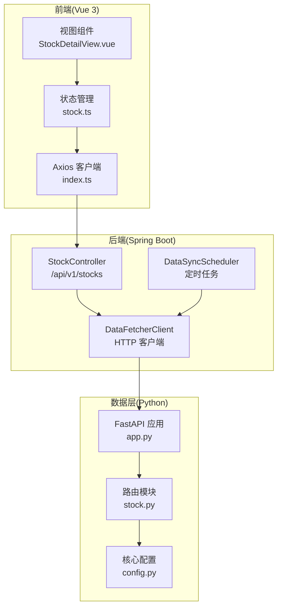
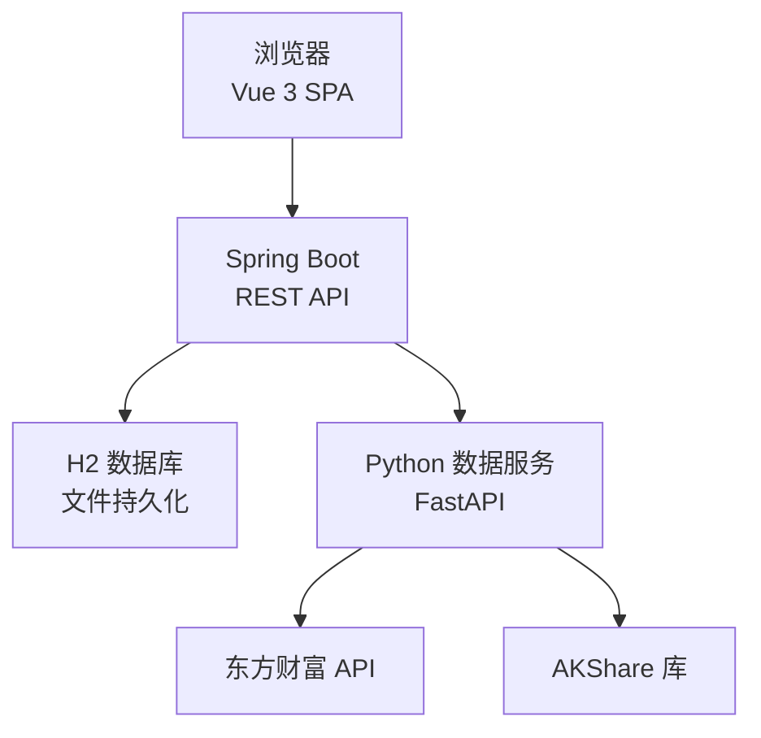
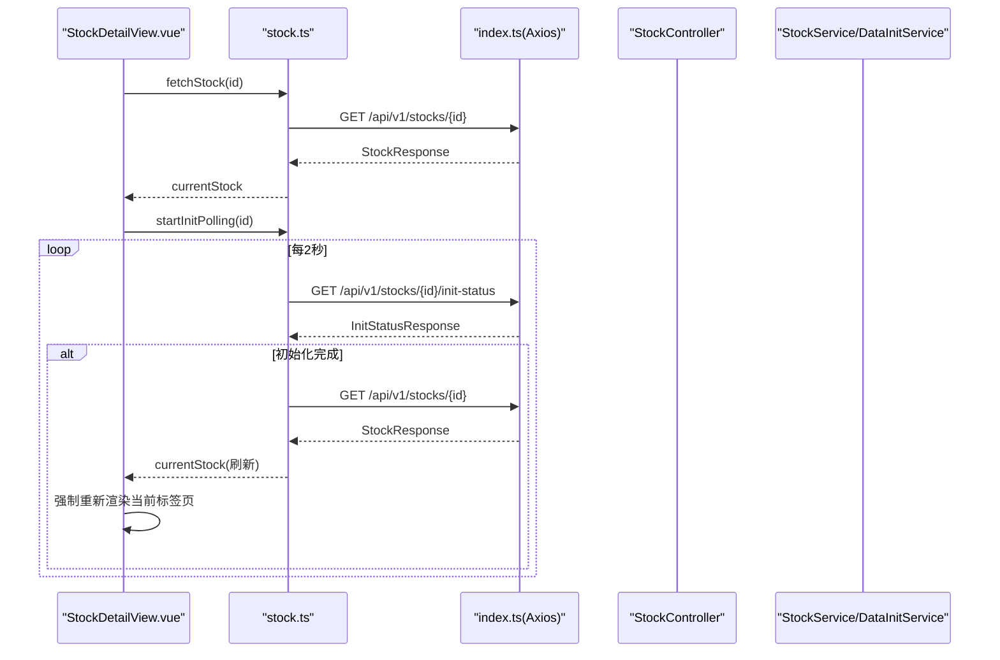
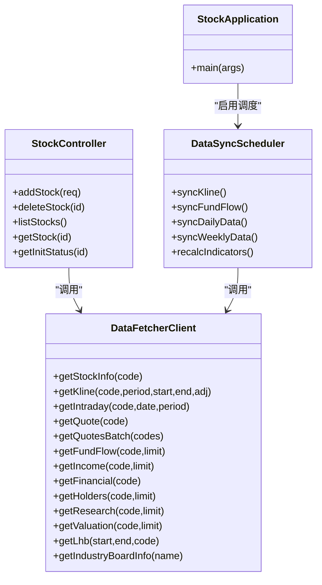
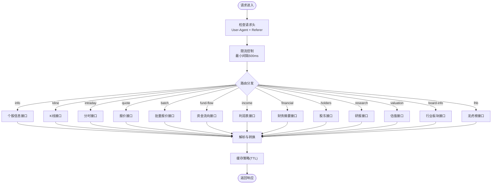
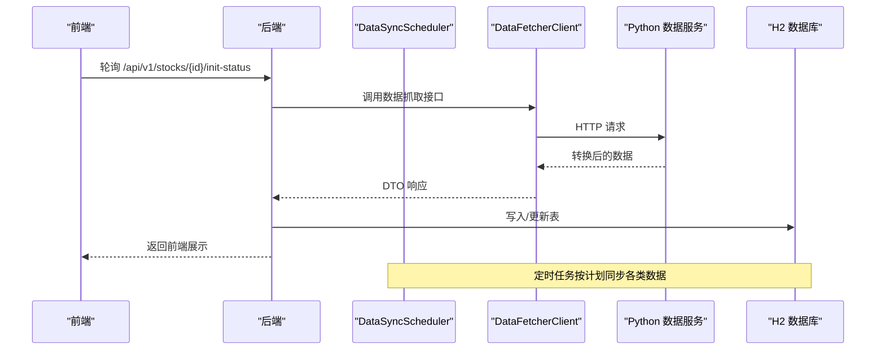
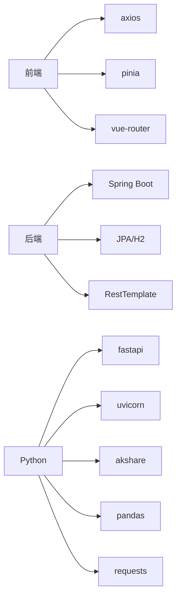

# 系统架构设计

<cite>
**本文引用的文件**
- [StockApplication.java](file://backend/src/main/java/com/stock/StockApplication.java)
- [application.yml](file://backend/src/main/resources/application.yml)
- [DataFetcherClient.java](file://backend/src/main/java/com/stock/client/DataFetcherClient.java)
- [DataSyncScheduler.java](file://backend/src/main/java/com/stock/scheduler/DataSyncScheduler.java)
- [StockController.java](file://backend/src/main/java/com/stock/controller/StockController.java)
- [app.py](file://data-fetcher/app.py)
- [stock.py](file://data-fetcher/routers/stock.py)
- [config.py](file://data-fetcher/core/config.py)
- [index.ts](file://frontend/src/api/index.ts)
- [stock.ts](file://frontend/src/stores/stock.ts)
- [StockDetailView.vue](file://frontend/src/views/StockDetailView.vue)
- [high-level-design.md](file://system-planner/high-level-design.md)
- [data-fetcher.md](file://system-planner/data-fetcher.md)
</cite>

## 目录
1. [简介](#简介)
2. [项目结构](#项目结构)
3. [核心组件](#核心组件)
4. [架构总览](#架构总览)
5. [详细组件分析](#详细组件分析)
6. [依赖分析](#依赖分析)
7. [性能考量](#性能考量)
8. [故障排查指南](#故障排查指南)
9. [结论](#结论)
10. [附录](#附录)

## 简介
本系统采用三层架构模式：
- 表现层：Vue 3 单页应用（SPA），负责数据展示、用户交互与状态管理
- 业务层：Spring Boot 后端，负责业务逻辑、数据持久化、定时调度与技术指标计算
- 数据层：Python FastAPI 微服务，负责外部数据抓取、限流与格式转换

系统通过 HTTP REST API 进行组件间通信，结合定时任务调度与异步数据处理，实现自动化数据同步与信号预警。安全方面采用本地回环网络与输入过滤，性能方面通过缓存与限流策略保障稳定性。

## 项目结构
系统由三个子工程组成，分别对应三层架构：
- backend：Spring Boot 后端，包含控制器、服务、仓储、定时任务与异常处理
- data-fetcher：Python FastAPI 数据抓取服务，封装东方财富与 AKShare 接口
- frontend：Vue 3 前端，基于 Axios 进行 API 调用，使用 Pinia 管理状态

**图表来源**
- [StockApplication.java:1-16](file://backend/src/main/java/com/stock/StockApplication.java#L1-L16)
- [application.yml:1-28](file://backend/src/main/resources/application.yml#L1-L28)
- [DataFetcherClient.java:1-126](file://backend/src/main/java/com/stock/client/DataFetcherClient.java#L1-L126)
- [DataSyncScheduler.java:1-238](file://backend/src/main/java/com/stock/scheduler/DataSyncScheduler.java#L1-L238)
- [StockController.java:1-57](file://backend/src/main/java/com/stock/controller/StockController.java#L1-L57)
- [app.py:1-31](file://data-fetcher/app.py#L1-L31)
- [stock.py:1-246](file://data-fetcher/routers/stock.py#L1-L246)
- [config.py:1-121](file://data-fetcher/core/config.py#L1-L121)
- [index.ts:1-18](file://frontend/src/api/index.ts#L1-L18)
- [stock.ts:1-80](file://frontend/src/stores/stock.ts#L1-L80)
- [StockDetailView.vue:1-82](file://frontend/src/views/StockDetailView.vue#L1-L82)

**章节来源**
- [high-level-design.md:1-503](file://system-planner/high-level-design.md#L1-L503)

## 核心组件
- 前端 API 客户端：统一配置基础 URL 与超时，拦截响应错误进行日志输出
- 前端状态管理：Pinia Store 管理标的列表、当前标的、初始化状态与加载状态，并提供轮询控制
- 后端控制器：提供标的管理、行情、K线、指标、资金流向、财务、股东、研报、龙虎榜、产业分析、产品/地区构成、竞争力、竞品、笔记、预警、信号、完成度等 REST 接口
- 数据抓取客户端：封装 HTTP 调用，统一异常处理，支持个股信息、K线、分时、报价、批量报价、资金流向、利润表、财务摘要、股东、研报、估值、行业板块、龙虎榜等
- 数据同步调度器：按计划任务周期同步 K 线、资金流向、日频数据（估值、研报）、周频数据（利润表、财务摘要、股东）与技术指标重算
- Python 数据服务：FastAPI 提供路由，封装东方财富与 AKShare 接口，内置限流、重试、缓存与 secid 推断

**章节来源**
- [index.ts:1-18](file://frontend/src/api/index.ts#L1-L18)
- [stock.ts:1-80](file://frontend/src/stores/stock.ts#L1-L80)
- [StockController.java:1-57](file://backend/src/main/java/com/stock/controller/StockController.java#L1-L57)
- [DataFetcherClient.java:1-126](file://backend/src/main/java/com/stock/client/DataFetcherClient.java#L1-L126)
- [DataSyncScheduler.java:1-238](file://backend/src/main/java/com/stock/scheduler/DataSyncScheduler.java#L1-L238)
- [app.py:1-31](file://data-fetcher/app.py#L1-L31)
- [stock.py:1-246](file://data-fetcher/routers/stock.py#L1-L246)
- [config.py:1-121](file://data-fetcher/core/config.py#L1-L121)

## 架构总览
系统边界与部署拓扑如下：
- 前端运行于本地 127.0.0.1:5173（开发环境）
- 后端运行于本地 127.0.0.1:8080，提供 /api/v1 REST 接口
- Python 数据服务运行于本地 127.0.0.1:5001，提供 /stock/* 与 /industry/* 接口
- 数据库为 H2 文件数据库，位于用户目录下

**图表来源**
- [application.yml:1-28](file://backend/src/main/resources/application.yml#L1-L28)
- [app.py:1-31](file://data-fetcher/app.py#L1-L31)
- [high-level-design.md:1-503](file://system-planner/high-level-design.md#L1-L503)

## 详细组件分析

### 前端组件分析
- API 客户端：设置 baseURL 为 http://localhost:8080/api/v1，统一超时时间，拦截响应错误并输出日志
- 状态管理：提供标的列表、当前标的、初始化状态的读写方法，以及启动/停止轮询的控制函数
- 详情视图：展示标的名称、代码、行业、PE/PB 等信息，显示初始化进度条与步骤状态；初始化完成后刷新当前数据并强制重新渲染当前标签页

**图表来源**
- [StockDetailView.vue:47-82](file://frontend/src/views/StockDetailView.vue#L47-L82)
- [stock.ts:43-78](file://frontend/src/stores/stock.ts#L43-L78)
- [index.ts:1-18](file://frontend/src/api/index.ts#L1-L18)
- [StockController.java:52-55](file://backend/src/main/java/com/stock/controller/StockController.java#L52-L55)

**章节来源**
- [StockDetailView.vue:1-82](file://frontend/src/views/StockDetailView.vue#L1-L82)
- [stock.ts:1-80](file://frontend/src/stores/stock.ts#L1-L80)
- [index.ts:1-18](file://frontend/src/api/index.ts#L1-L18)
- [StockController.java:1-57](file://backend/src/main/java/com/stock/controller/StockController.java#L1-L57)

### 后端组件分析
- 应用入口：启用调度与异步注解，启动 Spring Boot 应用
- 配置：定义服务器端口、数据源（H2 文件数据库）、JPA Hibernate DDL 自动更新、H2 控制台、数据抓取服务地址与定时任务表达式
- 数据抓取客户端：封装 GET/POST 请求，统一异常包装，支持批量报价上限与参数化查询
- 数据同步调度器：按工作日与时间窗口同步 K 线、资金流向、日频/周频数据与技术指标，保证事务一致性与异常日志

**图表来源**
- [StockApplication.java:1-16](file://backend/src/main/java/com/stock/StockApplication.java#L1-L16)
- [DataFetcherClient.java:1-126](file://backend/src/main/java/com/stock/client/DataFetcherClient.java#L1-L126)
- [DataSyncScheduler.java:1-238](file://backend/src/main/java/com/stock/scheduler/DataSyncScheduler.java#L1-L238)
- [StockController.java:1-57](file://backend/src/main/java/com/stock/controller/StockController.java#L1-L57)

**章节来源**
- [StockApplication.java:1-16](file://backend/src/main/java/com/stock/StockApplication.java#L1-L16)
- [application.yml:1-28](file://backend/src/main/resources/application.yml#L1-L28)
- [DataFetcherClient.java:1-126](file://backend/src/main/java/com/stock/client/DataFetcherClient.java#L1-L126)
- [DataSyncScheduler.java:1-238](file://backend/src/main/java/com/stock/scheduler/DataSyncScheduler.java#L1-L238)
- [StockController.java:1-57](file://backend/src/main/java/com/stock/controller/StockController.java#L1-L57)

### Python 数据服务组件分析
- 应用入口：注册 CORS 中间件，挂载各路由模块，提供健康检查端点
- 路由模块：提供个股信息、K线、分时、报价、批量报价、资金流向、利润表、财务摘要、股东、研报、估值、行业板块、龙虎榜等接口
- 核心配置：统一请求头（必须包含 Referer），限流控制（最小 500ms 间隔），数值精度处理（价格/百分比字段除以 100），请求重试与指数退避，批量请求上限

**图表来源**
- [app.py:1-31](file://data-fetcher/app.py#L1-L31)
- [stock.py:14-246](file://data-fetcher/routers/stock.py#L14-L246)
- [config.py:80-121](file://data-fetcher/core/config.py#L80-L121)

**章节来源**
- [app.py:1-31](file://data-fetcher/app.py#L1-L31)
- [stock.py:1-246](file://data-fetcher/routers/stock.py#L1-L246)
- [config.py:1-121](file://data-fetcher/core/config.py#L1-L121)

### 数据流与定时任务
- 自动数据流：从东方财富与 AKShare 拉取数据，经 Python 服务转换后写入 H2 数据库，前端通过 REST API 获取展示
- 手动数据流：前端表单提交至后端，经服务层校验与 XSS 过滤后写入数据库
- 定时任务：按工作日与时间窗口同步 K 线、资金流向、日频/周频数据与技术指标，保证数据新鲜度

**图表来源**
- [DataSyncScheduler.java:54-236](file://backend/src/main/java/com/stock/scheduler/DataSyncScheduler.java#L54-L236)
- [DataFetcherClient.java:26-105](file://backend/src/main/java/com/stock/client/DataFetcherClient.java#L26-L105)
- [stock.py:14-246](file://data-fetcher/routers/stock.py#L14-L246)

**章节来源**
- [high-level-design.md:275-351](file://system-planner/high-level-design.md#L275-L351)
- [DataSyncScheduler.java:1-238](file://backend/src/main/java/com/stock/scheduler/DataSyncScheduler.java#L1-L238)
- [DataFetcherClient.java:1-126](file://backend/src/main/java/com/stock/client/DataFetcherClient.java#L1-L126)
- [stock.py:1-246](file://data-fetcher/routers/stock.py#L1-L246)

## 依赖分析
- 前端依赖：axios、pinia、vue、vue-router
- 后端依赖：Spring Boot、JPA/H2、定时任务、RestTemplate
- Python 依赖：fastapi、uvicorn、akshare、pandas、requests、python-dotenv

**图表来源**
- [package.json:1-27](file://frontend/package.json#L1-L27)
- [application.yml:1-28](file://backend/src/main/resources/application.yml#L1-L28)
- [data-fetcher.md:271-280](file://system-planner/data-fetcher.md#L271-L280)

**章节来源**
- [package.json:1-27](file://frontend/package.json#L1-L27)
- [application.yml:1-28](file://backend/src/main/resources/application.yml#L1-L28)
- [data-fetcher.md:271-280](file://system-planner/data-fetcher.md#L271-L280)

## 性能考量
- 限流策略：Python 侧最小 500ms 间隔，避免并发请求导致风控；遇到 RemoteDisconnected 指数退避
- 缓存策略：Python TTL 缓存覆盖实时行情、K线、资金流向、财务/研报等；后端直接读取 H2，无需应用层缓存
- 异步初始化：添加标的后立即返回基本信息，后台异步初始化并轮询进度，避免阻塞
- 批量请求：批量报价限制单轮不超过 20 只，降低单次请求压力
- 技术指标：后端计算并落库，前端仅展示，减少重复计算

**章节来源**
- [high-level-design.md:439-491](file://system-planner/high-level-design.md#L439-L491)
- [data-fetcher.md:24-30](file://system-planner/data-fetcher.md#L24-L30)
- [config.py:80-100](file://data-fetcher/core/config.py#L80-L100)
- [stock.ts:43-58](file://frontend/src/stores/stock.ts#L43-L58)

## 故障排查指南
- 前端 API 错误：Axios 拦截器会打印错误响应或消息，便于定位接口问题
- 后端异常：全局异常处理器统一返回标准错误结构，便于前端提示
- Python 服务：缺少 Referer 将导致连接中断；遇到 RemoteDisconnected 会进行指数退避重试
- 数据同步：定时任务日志记录每次执行结果，便于追踪失败原因

**章节来源**
- [index.ts:8-15](file://frontend/src/api/index.ts#L8-L15)
- [high-level-design.md:468-491](file://system-planner/high-level-design.md#L468-L491)
- [config.py:88-94](file://data-fetcher/core/config.py#L88-L94)
- [DataSyncScheduler.java:54-236](file://backend/src/main/java/com/stock/scheduler/DataSyncScheduler.java#L54-L236)

## 结论
该系统通过三层架构清晰分离关注点：前端专注展示与交互，后端专注业务与数据，Python 服务专注外部数据抓取与转换。通过 HTTP API、定时任务与异步初始化实现高效的数据流转与用户体验。限流与缓存策略确保系统在外部接口波动下的稳定性，安全设计与输入过滤降低风险。整体设计兼顾易用性、可维护性与可扩展性。

## 附录
- 技术选型与权衡：Spring Boot 3、H2、Vue 3 + Vite、FastAPI、JPA、Pinia、OWASP HTML Sanitizer 等
- 部署建议：三进程均绑定 127.0.0.1，无需公网暴露；生产环境可考虑容器化与反向代理

**章节来源**
- [high-level-design.md:354-437](file://system-planner/high-level-design.md#L354-L437)