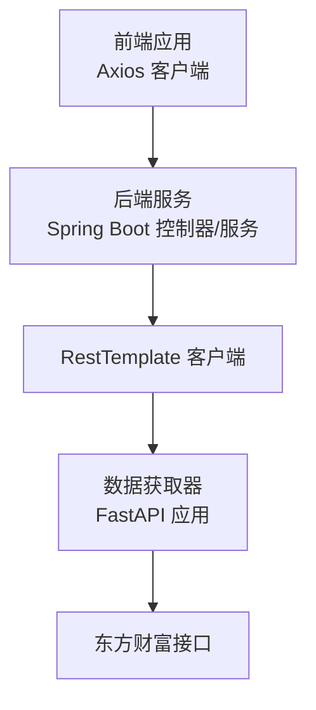
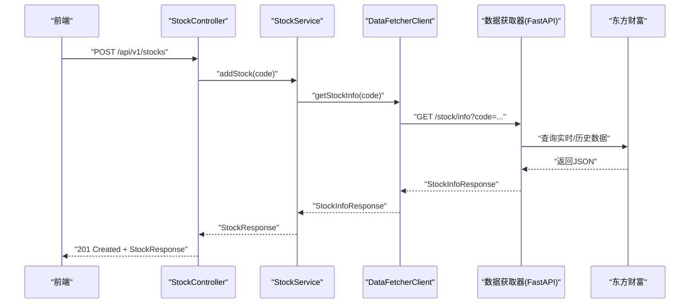
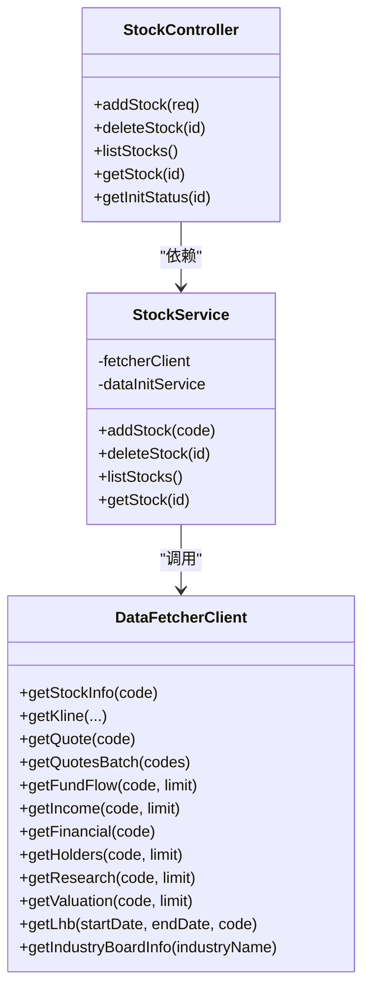
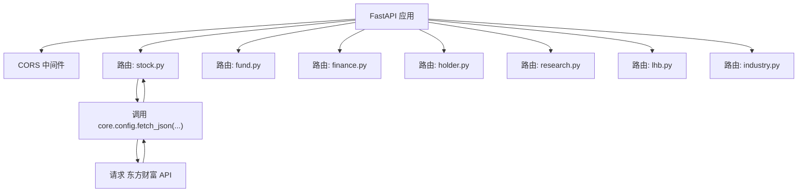
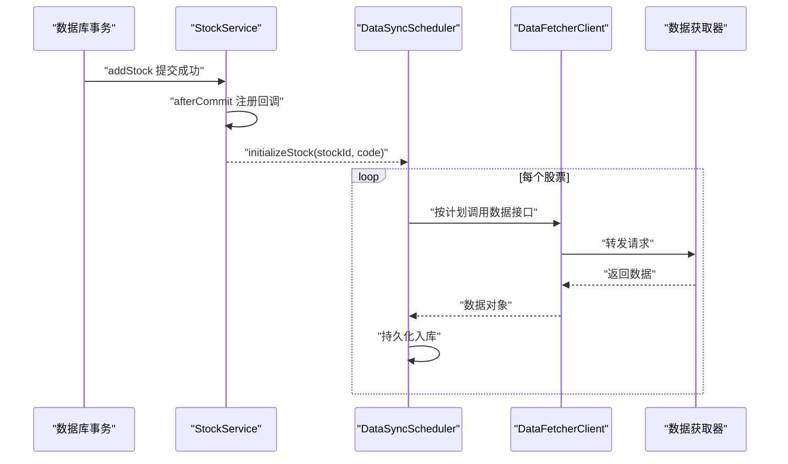
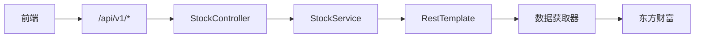
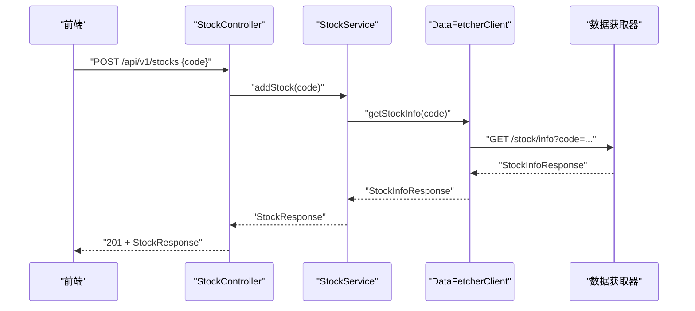

# 组件交互机制

<cite>
**本文引用的文件**
- [DataFetcherClient.java](file://backend/src/main/java/com/stock/client/DataFetcherClient.java)
- [WebConfig.java](file://backend/src/main/java/com/stock/config/WebConfig.java)
- [RestTemplateConfig.java](file://backend/src/main/java/com/stock/config/RestTemplateConfig.java)
- [StockController.java](file://backend/src/main/java/com/stock/controller/StockController.java)
- [StockService.java](file://backend/src/main/java/com/stock/service/StockService.java)
- [DataSyncScheduler.java](file://backend/src/main/java/com/stock/scheduler/DataSyncScheduler.java)
- [GlobalExceptionHandler.java](file://backend/src/main/java/com/stock/exception/GlobalExceptionHandler.java)
- [StockInfoResponse.java](file://backend/src/main/java/com/stock/dto/fetcher/StockInfoResponse.java)
- [application.yml](file://backend/src/main/resources/application.yml)
- [app.py](file://data-fetcher/app.py)
- [stock.py](file://data-fetcher/routers/stock.py)
- [config.py](file://data-fetcher/core/config.py)
- [index.ts](file://frontend/src/api/index.ts)
- [stock.ts](file://frontend/src/api/stock.ts)
- [quote.ts](file://frontend/src/api/quote.ts)
- [kline.ts](file://frontend/src/api/kline.ts)
- [stock.ts（Pinia Store）](file://frontend/src/stores/stock.ts)
</cite>

## 目录
1. [简介](#简介)
2. [项目结构](#项目结构)
3. [核心组件](#核心组件)
4. [架构总览](#架构总览)
5. [详细组件分析](#详细组件分析)
6. [依赖关系分析](#依赖关系分析)
7. [性能考量](#性能考量)
8. [故障排查指南](#故障排查指南)
9. [结论](#结论)
10. [附录：API 设计与调用示例](#附录api-设计与调用示例)

## 简介
本文件聚焦于系统中“组件交互机制”的实现细节，涵盖前端如何通过 HTTP API 与后端交互、后端如何调用 Python 数据获取器、以及各组件之间的异步通信模式。文档还总结了 REST API 的设计原则、请求/响应格式、错误处理机制，并提供跨域配置、认证授权与安全建议。

## 项目结构
系统由三层组成：
- 前端（Vue + Pinia + Axios）
- 后端（Spring Boot + JPA + 定时任务）
- 数据获取器（FastAPI + 东方财富接口）

图表来源
- [index.ts:1-18](file://frontend/src/api/index.ts#L1-L18)
- [StockController.java:17-56](file://backend/src/main/java/com/stock/controller/StockController.java#L17-L56)
- [DataFetcherClient.java:14-125](file://backend/src/main/java/com/stock/client/DataFetcherClient.java#L14-L125)
- [app.py:1-31](file://data-fetcher/app.py#L1-L31)

章节来源
- [index.ts:1-18](file://frontend/src/api/index.ts#L1-L18)
- [WebConfig.java:1-15](file://backend/src/main/java/com/stock/config/WebConfig.java#L1-L15)
- [RestTemplateConfig.java:1-18](file://backend/src/main/java/com/stock/config/RestTemplateConfig.java#L1-L18)
- [application.yml:1-28](file://backend/src/main/resources/application.yml#L1-L28)

## 核心组件
- 前端 Axios 客户端：统一配置基础路径与超时，拦截错误。
- 后端 Spring MVC 控制器：暴露 /api/v1 路径下的 REST 接口。
- 后端服务层：业务编排、参数校验、事务控制、调用数据获取器。
- 后端定时任务：周期性拉取数据并写入数据库。
- 数据获取器 FastAPI：封装东方财富接口，提供标准化数据。
- 跨域与超时配置：后端 CORS 与 RestTemplate 超时设置。

章节来源
- [StockController.java:17-56](file://backend/src/main/java/com/stock/controller/StockController.java#L17-L56)
- [StockService.java:93-163](file://backend/src/main/java/com/stock/service/StockService.java#L93-L163)
- [DataSyncScheduler.java:54-82](file://backend/src/main/java/com/stock/scheduler/DataSyncScheduler.java#L54-L82)
- [DataFetcherClient.java:14-125](file://backend/src/main/java/com/stock/client/DataFetcherClient.java#L14-L125)
- [stock.py:14-72](file://data-fetcher/routers/stock.py#L14-L72)

## 架构总览
前端通过 Axios 访问后端控制器；后端控制器调用服务层；服务层使用 RestTemplate 客户端访问数据获取器；数据获取器对接东方财富接口并返回标准化数据；后端定时任务周期性从数据获取器同步数据到数据库。

图表来源
- [StockController.java:29-34](file://backend/src/main/java/com/stock/controller/StockController.java#L29-L34)
- [StockService.java:94-163](file://backend/src/main/java/com/stock/service/StockService.java#L94-L163)
- [DataFetcherClient.java:26-29](file://backend/src/main/java/com/stock/client/DataFetcherClient.java#L26-L29)
- [stock.py:14-72](file://data-fetcher/routers/stock.py#L14-L72)

## 详细组件分析

### 前端 API 客户端与交互流程
- Axios 基础配置：baseURL 指向后端 /api/v1，统一超时时间。
- 错误拦截：统一打印错误信息并拒绝 Promise。
- 股票相关接口：列表、新增、删除、详情、初始化状态轮询。
- 引用示例：
  - [前端 Axios 配置:3-6](file://frontend/src/api/index.ts#L3-L6)
  - [前端错误拦截:8-15](file://frontend/src/api/index.ts#L8-L15)
  - [股票 API 定义:53-60](file://frontend/src/api/stock.ts#L53-L60)
  - [报价 API 定义:20-23](file://frontend/src/api/quote.ts#L20-L23)
  - [K线 API 定义:24-36](file://frontend/src/api/kline.ts#L24-L36)
  - [Pinia Store 初始化轮询:43-58](file://frontend/src/stores/stock.ts#L43-L58)

章节来源
- [index.ts:1-18](file://frontend/src/api/index.ts#L1-L18)
- [stock.ts:1-61](file://frontend/src/api/stock.ts#L1-L61)
- [quote.ts:1-24](file://frontend/src/api/quote.ts#L1-L24)
- [kline.ts:1-37](file://frontend/src/api/kline.ts#L1-L37)
- [stock.ts（Pinia Store）:1-80](file://frontend/src/stores/stock.ts#L1-L80)

### 后端控制器与服务层
- 控制器层：
  - 提供 /api/v1/stocks 的增删查与初始化状态查询。
  - 返回标准响应体与状态码。
- 服务层：
  - 新增股票：校验代码格式与唯一性，调用数据获取器获取基础信息，持久化 Stock 实体。
  - 异步初始化：在事务提交后触发初始化任务，确保异步线程可见新插入的数据。
  - 查询与列表：读取 Stock 及完整性指标，返回 DTO。

图表来源
- [StockController.java:17-56](file://backend/src/main/java/com/stock/controller/StockController.java#L17-L56)
- [StockService.java:28-91](file://backend/src/main/java/com/stock/service/StockService.java#L28-L91)
- [DataFetcherClient.java:14-125](file://backend/src/main/java/com/stock/client/DataFetcherClient.java#L14-L125)

章节来源
- [StockController.java:17-56](file://backend/src/main/java/com/stock/controller/StockController.java#L17-L56)
- [StockService.java:93-163](file://backend/src/main/java/com/stock/service/StockService.java#L93-L163)

### 数据获取器（FastAPI）与数据源
- FastAPI 应用：启用 CORS（允许所有），挂载多个路由模块。
- 股票路由：提供基础信息、K线、分时、实时报价、批量报价等接口。
- 通用工具：统一请求头、限流、解析与转换函数、重试逻辑。
- 与东方财富交互：按 secid 格式构造请求，按字段映射返回标准化数据。

图表来源
- [app.py:1-31](file://data-fetcher/app.py#L1-L31)
- [stock.py:14-72](file://data-fetcher/routers/stock.py#L14-L72)
- [config.py:80-100](file://data-fetcher/core/config.py#L80-L100)

章节来源
- [app.py:1-31](file://data-fetcher/app.py#L1-L31)
- [stock.py:1-246](file://data-fetcher/routers/stock.py#L1-L246)
- [config.py:1-121](file://data-fetcher/core/config.py#L1-L121)

### 异步通信与定时任务
- 事务后回调：在 StockService.addStock 成功提交后，注册 afterCommit 回调，再调用初始化服务，保证异步线程能读取到最新数据。
- 定时任务：DataSyncScheduler 按计划拉取日线、资金流、估值研究、财务与股东数据，写入对应表。
- 轮询刷新：前端通过 Pinia Store 对初始化状态进行轮询，完成后刷新当前股票详情。

图表来源
- [StockService.java:148-160](file://backend/src/main/java/com/stock/service/StockService.java#L148-L160)
- [DataSyncScheduler.java:54-82](file://backend/src/main/java/com/stock/scheduler/DataSyncScheduler.java#L54-L82)
- [DataFetcherClient.java:31-35](file://backend/src/main/java/com/stock/client/DataFetcherClient.java#L31-L35)

章节来源
- [StockService.java:145-160](file://backend/src/main/java/com/stock/service/StockService.java#L145-L160)
- [DataSyncScheduler.java:1-238](file://backend/src/main/java/com/stock/scheduler/DataSyncScheduler.java#L1-L238)

### 跨域、认证与安全
- 跨域配置：后端仅对 /api/v1/** 开放本地开发源，允许常见方法与头部。
- 认证授权：未见显式认证/授权实现，建议在生产环境引入 JWT 或会话机制。
- 安全建议：
  - 限制 CORS 源为可信域名。
  - 在网关或反向代理层启用 HTTPS。
  - 对外部接口调用增加重试与熔断策略。
  - 对输入参数进行严格校验与白名单过滤。

章节来源
- [WebConfig.java:8-13](file://backend/src/main/java/com/stock/config/WebConfig.java#L8-L13)
- [application.yml:19-22](file://backend/src/main/resources/application.yml#L19-L22)

## 依赖关系分析
- 前端依赖后端 /api/v1 接口；后端依赖数据获取器；数据获取器依赖东方财富。
- 后端通过 RestTemplateConfig 设置连接与读取超时；DataFetcherClient 统一封装调用与异常转换。
- 全局异常处理器将业务异常映射为统一错误响应。

图表来源
- [RestTemplateConfig.java:10-16](file://backend/src/main/java/com/stock/config/RestTemplateConfig.java#L10-L16)
- [DataFetcherClient.java:17-24](file://backend/src/main/java/com/stock/client/DataFetcherClient.java#L17-L24)
- [application.yml:19-22](file://backend/src/main/resources/application.yml#L19-L22)

章节来源
- [RestTemplateConfig.java:1-18](file://backend/src/main/java/com/stock/config/RestTemplateConfig.java#L1-L18)
- [DataFetcherClient.java:1-125](file://backend/src/main/java/com/stock/client/DataFetcherClient.java#L1-L125)
- [application.yml:1-28](file://backend/src/main/resources/application.yml#L1-L28)

## 性能考量
- 连接与读取超时：后端 RestTemplate 默认连接超时 5 秒、读取超时 15 秒，避免长时间阻塞。
- 限流与重试：数据获取器对第三方接口进行最小 500ms 间隔限制，并具备有限重试与指数退避。
- 批量与分页：数据获取器对批量报价限制最多 20 只股票，避免单次请求过大。
- 定时任务节流：任务执行期间对每只股票间隔 500ms，降低并发压力。

章节来源
- [RestTemplateConfig.java:10-16](file://backend/src/main/java/com/stock/config/RestTemplateConfig.java#L10-L16)
- [config.py:20-100](file://data-fetcher/core/config.py#L20-L100)
- [stock.py:213-245](file://data-fetcher/routers/stock.py#L213-L245)

## 故障排查指南
- 统一错误响应：全局异常处理器将不同异常映射为 4xx/5xx 与统一错误体。
- 数据获取器异常：DataFetcherClient 将底层异常包装为 DataFetchException，并返回 503。
- 常见问题定位：
  - 前端：检查 baseURL 与 CORS 是否匹配，确认拦截器是否正确输出错误。
  - 后端：查看控制器与服务层日志，确认 RestTemplate 超时与数据获取器可达性。
  - 数据获取器：检查 FastAPI 健康端点与路由是否可用，关注限流与第三方接口稳定性。

章节来源
- [GlobalExceptionHandler.java:1-33](file://backend/src/main/java/com/stock/exception/GlobalExceptionHandler.java#L1-L33)
- [DataFetcherClient.java:112-124](file://backend/src/main/java/com/stock/client/DataFetcherClient.java#L112-L124)
- [app.py:23-25](file://data-fetcher/app.py#L23-L25)

## 结论
该系统采用清晰的分层架构：前端通过 REST API 与后端交互，后端以服务层为核心协调数据库与数据获取器，数据获取器统一对接第三方数据源。通过定时任务实现数据同步，前端通过轮询完成初始化状态跟踪。建议在生产环境中补充认证授权、更严格的 CORS 策略与可观测性监控。

## 附录：API 设计与调用示例

### REST API 设计原则
- 资源命名：使用名词复数形式，如 /stocks。
- 路径参数：用于定位资源，如 /stocks/{id}。
- 查询参数：用于筛选与分页，如 ?period=daily&startDate=...
- 请求体：使用 JSON，遵循 DTO 规范。
- 响应体：统一包含业务数据与元信息（如初始化步骤、完成度）。
- 状态码：遵循语义化 HTTP 状态码，配合全局异常处理器。

章节来源
- [StockController.java:17-56](file://backend/src/main/java/com/stock/controller/StockController.java#L17-L56)
- [stock.ts:53-60](file://frontend/src/api/stock.ts#L53-L60)

### 请求/响应格式与示例
- 新增股票
  - 方法与路径：POST /api/v1/stocks
  - 请求体：{ "code": "600036" }
  - 响应：201 Created + StockResponse
  - 示例路径：[新增股票接口](file://frontend/src/api/stock.ts#L55)
- 获取股票列表
  - 方法与路径：GET /api/v1/stocks
  - 响应：StockListItem[]（包含完整性百分比）
  - 示例路径：[列表接口](file://frontend/src/api/stock.ts#L54)
- 获取股票详情
  - 方法与路径：GET /api/v1/stocks/{id}
  - 响应：StockResponse
  - 示例路径：[详情接口](file://frontend/src/api/stock.ts#L57)
- 获取初始化状态（轮询）
  - 方法与路径：GET /api/v1/stocks/{id}/init-status
  - 响应：InitStatusResponse（含 steps、completedCount、totalCount）
  - 示例路径：[初始化状态接口](file://frontend/src/api/stock.ts#L58)
- 获取实时报价
  - 方法与路径：GET /api/v1/quotes/{stockId}
  - 响应：QuoteResponse
  - 示例路径：[报价接口](file://frontend/src/api/quote.ts#L21)
- 获取 K 线
  - 方法与路径：GET /api/v1/stocks/{stockId}/kline
  - 查询参数：period、startDate、endDate、adjust
  - 响应：KlineResponse
  - 示例路径：[K线接口:25-30](file://frontend/src/api/kline.ts#L25-L30)
- 获取分时 K 线
  - 方法与路径：GET /api/v1/stocks/{stockId}/kline/intraday
  - 查询参数：period、date
  - 响应：KlineResponse
  - 示例路径：[分时接口:31-35](file://frontend/src/api/kline.ts#L31-L35)

章节来源
- [stock.ts:1-61](file://frontend/src/api/stock.ts#L1-L61)
- [quote.ts:1-24](file://frontend/src/api/quote.ts#L1-L24)
- [kline.ts:1-37](file://frontend/src/api/kline.ts#L1-L37)

### 数据模型要点
- 股票基础信息：包含代码、名称、行业、市值、PE/PB、涨跌幅、成交量等。
- K 线项：包含日期、开盘/收盘/最高/最低、成交量/成交额、振幅、涨跌幅等。
- 报价项：包含昨收、今开、最高/最低、现价、涨跌额/涨跌幅、换手率、振幅等。
- 初始化状态：包含步骤数组、已完成数量、总数。

章节来源
- [StockInfoResponse.java:8-26](file://backend/src/main/java/com/stock/dto/fetcher/StockInfoResponse.java#L8-L26)
- [stock.py:54-72](file://data-fetcher/routers/stock.py#L54-L72)
- [kline.ts:3-22](file://frontend/src/api/kline.ts#L3-L22)
- [quote.ts:3-18](file://frontend/src/api/quote.ts#L3-L18)
- [stock.ts:40-51](file://frontend/src/api/stock.ts#L40-L51)

### 调用序列示例（新增股票）

图表来源
- [StockController.java:29-34](file://backend/src/main/java/com/stock/controller/StockController.java#L29-L34)
- [StockService.java:102-105](file://backend/src/main/java/com/stock/service/StockService.java#L102-L105)
- [DataFetcherClient.java:26-29](file://backend/src/main/java/com/stock/client/DataFetcherClient.java#L26-L29)
- [stock.py:14-72](file://data-fetcher/routers/stock.py#L14-L72)