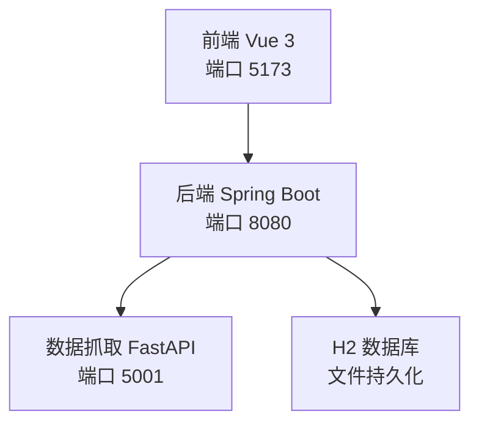
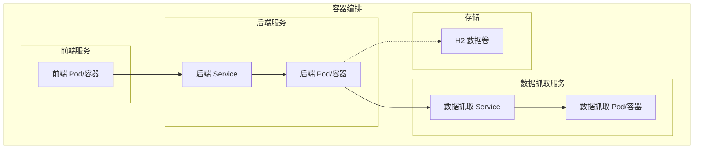
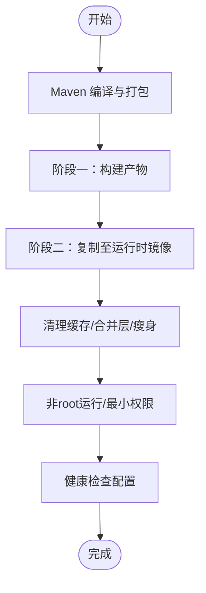
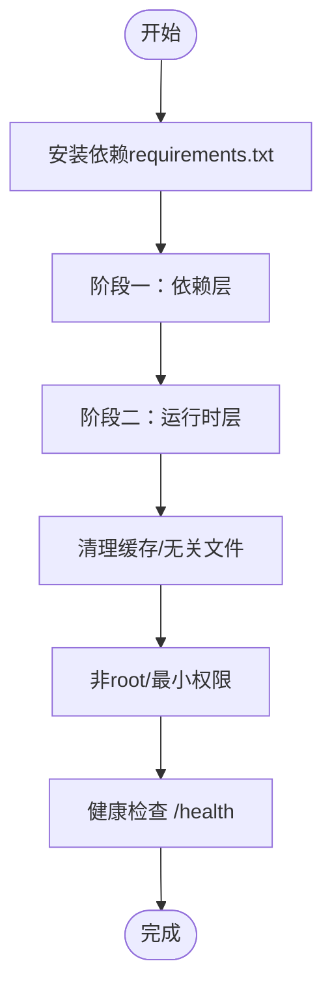
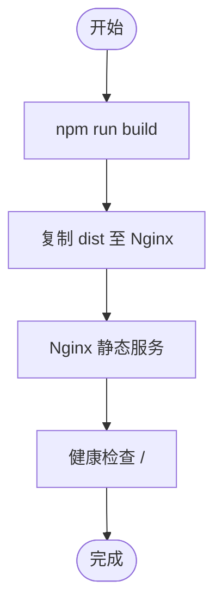
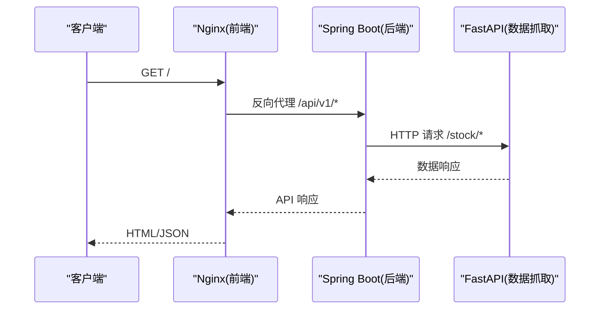
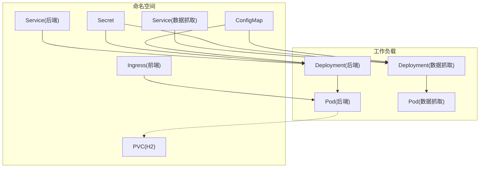
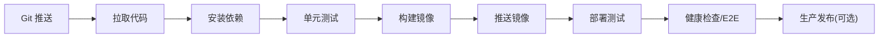
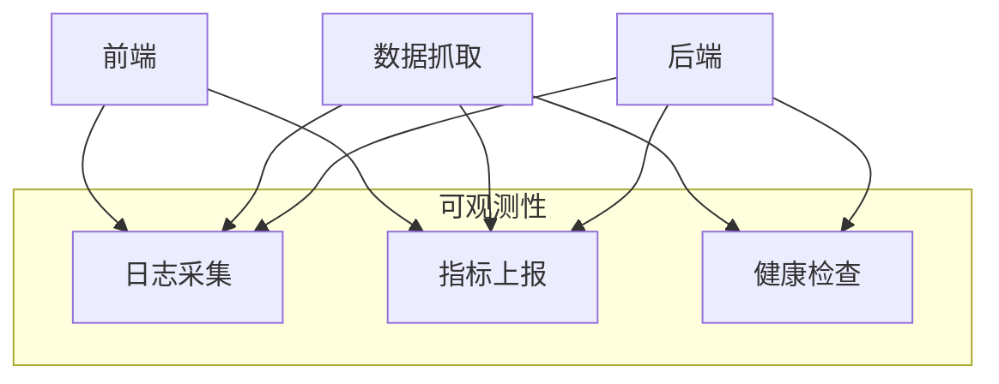
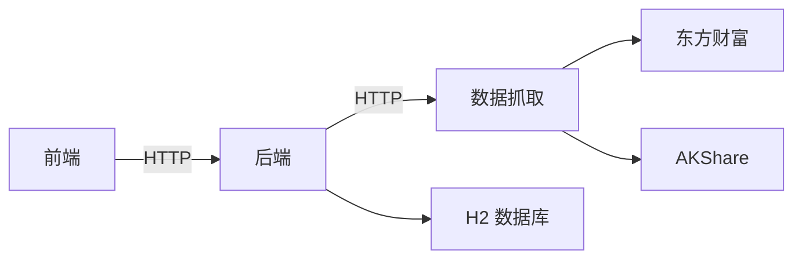

# 容器化部署

<cite>
**本文引用的文件**
- [pom.xml](file://backend/pom.xml)
- [application.yml](file://backend/src/main/resources/application.yml)
- [WebConfig.java](file://backend/src/main/java/com/stock/config/WebConfig.java)
- [RestTemplateConfig.java](file://backend/src/main/java/com/stock/config/RestTemplateConfig.java)
- [requirements.txt](file://data-fetcher/requirements.txt)
- [app.py](file://data-fetcher/app.py)
- [config.py](file://data-fetcher/core/config.py)
- [package.json](file://frontend/package.json)
- [high-level-design.md](file://system-planner/high-level-design.md)
- [detailed-design.md](file://system-planner/detailed-design.md)
- [api-design.md](file://system-planner/api-design.md)
</cite>

## 目录
1. [简介](#简介)
2. [项目结构](#项目结构)
3. [核心组件](#核心组件)
4. [架构总览](#架构总览)
5. [详细组件分析](#详细组件分析)
6. [依赖分析](#依赖分析)
7. [性能考虑](#性能考虑)
8. [故障排查指南](#故障排查指南)
9. [结论](#结论)
10. [附录](#附录)

## 简介
本指南面向“股票交易系统”的容器化部署，覆盖后端（Spring Boot）、数据抓取（FastAPI）与前端（Vue 3）三端的镜像构建、多阶段优化、镜像体积控制、安全加固、服务编排（docker-compose）、Kubernetes 资源定义、CI/CD 流水线以及监控与日志、健康检查等运维要点。目标是在确保功能正确性的前提下，提供可复用、可审计、可扩展的容器化方案。

## 项目结构
系统采用前后端分离与数据抓取微服务的三层架构：
- 后端：Spring Boot 应用，提供 REST API，绑定端口 8080，使用 H2 文件数据库。
- 数据抓取：Python FastAPI 微服务，提供个股与行业数据接口，绑定端口 5001。
- 前端：Vue 3 应用，通过 axios 调用后端 API，开发环境端口 5173。

**图表来源**
- [high-level-design.md:1-68](file://system-planner/high-level-design.md#L1-L68)
- [application.yml:1-28](file://backend/src/main/resources/application.yml#L1-L28)
- [app.py:1-31](file://data-fetcher/app.py#L1-L31)

**章节来源**
- [high-level-design.md:1-68](file://system-planner/high-level-design.md#L1-L68)
- [application.yml:1-28](file://backend/src/main/resources/application.yml#L1-L28)
- [app.py:1-31](file://data-fetcher/app.py#L1-L31)

## 核心组件
- 后端服务（Spring Boot）
  - 端口：8080
  - 数据库：H2 文件数据库（文件位于用户目录）
  - 外部依赖：数据抓取服务（默认 http://localhost:5001）
  - 安全：CORS 配置允许前端 localhost:5173
- 数据抓取服务（FastAPI）
  - 端口：5001
  - 功能：个股/行业数据聚合与限流
  - 健康检查：/health
- 前端应用（Vue 3）
  - 开发端口：5173
  - 构建产物：dist 目录，可由 Nginx 提供静态服务

**章节来源**
- [application.yml:1-28](file://backend/src/main/resources/application.yml#L1-L28)
- [WebConfig.java:42-52](file://backend/src/main/java/com/stock/config/WebConfig.java#L42-L52)
- [app.py:23-25](file://data-fetcher/app.py#L23-L25)
- [package.json:6-10](file://frontend/package.json#L6-L10)

## 架构总览
容器化后的系统由三个服务组成：前端、后端、数据抓取，通过 docker-compose 或 Kubernetes 进行编排。后端与数据抓取通过服务名进行内部网络通信，前端通过反向代理或 Ingress 暴露给外部。

**图表来源**
- [high-level-design.md:1-68](file://system-planner/high-level-design.md#L1-L68)
- [application.yml:4-17](file://backend/src/main/resources/application.yml#L4-L17)

## 详细组件分析

### 后端镜像构建（Spring Boot）
- 基础镜像选择
  - 使用官方 OpenJDK 基础镜像，确保运行时一致性。
- 多阶段构建
  - 阶段一：使用 Maven 编译、打包（跳过测试以加速构建）。
  - 阶段二：复制最小运行时产物至精简镜像，移除构建依赖。
- 镜像体积控制
  - 使用最小化运行时镜像（如 alpine/openjdk）。
  - 清理缓存与临时文件，合并 RUN 指令减少层数。
- 安全加固
  - 非 root 用户运行。
  - 仅开放必要端口（8080）。
  - 设置只读根文件系统与最小权限。
- 健康检查
  - 使用 HTTP GET /actuator/health（若启用 Actuator）或应用内健康端点。
- 环境变量
  - JAVA_OPTS、SPRING_PROFILES_ACTIVE、DATABASE_URL 等通过环境注入。

**图表来源**
- [pom.xml:58-101](file://backend/pom.xml#L58-L101)

**章节来源**
- [pom.xml:58-101](file://backend/pom.xml#L58-L101)

### 数据抓取镜像构建（FastAPI）
- 基础镜像选择
  - 使用官方 Python 基础镜像，启用 pip 缓存优化。
- 多阶段构建
  - 阶段一：安装依赖（requirements.txt）。
  - 阶段二：复制运行时产物，剔除开发依赖与缓存。
- 镜像体积控制
  - 使用 .dockerignore 排除 node_modules、__pycache__、.pytest_cache 等。
  - 使用多阶段构建与分层缓存。
- 安全加固
  - 非 root 用户运行。
  - 仅开放 5001 端口。
  - 只读根文件系统。
- 健康检查
  - HTTP GET /health。
- 环境变量
  - UVICORN_HOST、UVICORN_PORT、LOG_LEVEL 等。

**图表来源**
- [requirements.txt:1-7](file://data-fetcher/requirements.txt#L1-L7)
- [app.py:28-31](file://data-fetcher/app.py#L28-L31)

**章节来源**
- [requirements.txt:1-7](file://data-fetcher/requirements.txt#L1-L7)
- [app.py:28-31](file://data-fetcher/app.py#L28-L31)

### 前端镜像构建（Vue 3）
- 基础镜像选择
  - 使用 Nginx 静态服务器镜像。
- 多阶段构建
  - 阶段一：Node 构建（vite build）。
  - 阶段二：复制 dist 至 Nginx 发布目录。
- 镜像体积控制
  - 仅复制最终静态产物。
  - 使用 .dockerignore 排除 node_modules、dist 等。
- 安全加固
  - Nginx 默认配置最小化。
  - 仅暴露 80 端口。
- 健康检查
  - HTTP GET / 200。
- 环境变量
  - 反向代理后端地址（通过环境变量注入）。

**图表来源**
- [package.json:6-10](file://frontend/package.json#L6-L10)

**章节来源**
- [package.json:6-10](file://frontend/package.json#L6-L10)

### docker-compose 编排
- 服务定义
  - 前端：nginx，端口映射 80:80，挂载 dist。
  - 后端：spring-boot，端口映射 8080:8080，挂载 H2 数据文件。
  - 数据抓取：fastapi，端口映射 5001:5001。
- 网络
  - 自定义桥接网络，服务间通过服务名通信。
- 卷
  - H2 数据卷：持久化数据库文件。
  - 前端静态卷：开发时热更新。
- 环境变量
  - SPRING_DATASOURCE_URL 指向 H2 文件路径。
  - stock.data-fetcher.url 指向数据抓取服务。
- 健康检查
  - 后端与数据抓取服务配置 HTTP 健康检查。
- 重启策略
  - 非生产环境可设置 unless-stopped。

**图表来源**
- [application.yml:19-22](file://backend/src/main/resources/application.yml#L19-L22)
- [high-level-design.md:189-238](file://system-planner/high-level-design.md#L189-L238)

**章节来源**
- [application.yml:19-22](file://backend/src/main/resources/application.yml#L19-L22)
- [high-level-design.md:189-238](file://system-planner/high-level-design.md#L189-L238)

### Kubernetes 部署配置
- Deployment
  - 后端与数据抓取各一个 Deployment，副本数根据负载调整。
  - 使用 ConfigMap 注入环境变量（如数据库 URL、数据抓取地址）。
  - 使用 Secret 存储敏感配置（如密钥、令牌）。
- Service
  - ClusterIP Service 暴露后端与数据抓取服务。
  - Ingress 将前端暴露至公网。
- ConfigMap
  - application.yml 或拆分的配置项。
- Secret
  - 数据库密码、第三方 API 密钥等。
- PersistentVolumeClaim
  - H2 数据卷挂载至后端容器。
- 健康检查
  - livenessProbe/readinessProbe 使用 HTTP GET。
- 资源限制
  - 为各容器设置 requests/limits，避免资源争抢。

**图表来源**
- [application.yml:4-17](file://backend/src/main/resources/application.yml#L4-L17)
- [high-level-design.md:1-68](file://system-planner/high-level-design.md#L1-L68)

**章节来源**
- [application.yml:4-17](file://backend/src/main/resources/application.yml#L4-L17)
- [high-level-design.md:1-68](file://system-planner/high-level-design.md#L1-L68)

### CI/CD 流水线（示例）
- 触发条件
  - 主分支推送、PR 合并。
- 步骤
  - 代码检出 → 依赖安装（后端 Maven、前端 npm、数据抓取 pip）。
  - 单元测试（后端 Surefire、前端 Vitest/Playwright）。
  - 构建镜像（多阶段 Dockerfile）。
  - 推送镜像至镜像仓库（私有/公有）。
  - 部署至测试集群（Kubernetes apply 或 helm upgrade）。
  - 健康检查与 E2E 测试。
  - 生产发布（人工审批或蓝绿/金丝雀）。
- 工件
  - Docker 镜像、Kubernetes 清单、前端 dist。

**图表来源**
- [pom.xml:75-87](file://backend/pom.xml#L75-L87)
- [package.json:6-10](file://frontend/package.json#L6-L10)
- [requirements.txt:1-7](file://data-fetcher/requirements.txt#L1-L7)

**章节来源**
- [pom.xml:75-87](file://backend/pom.xml#L75-L87)
- [package.json:6-10](file://frontend/package.json#L6-L10)
- [requirements.txt:1-7](file://data-fetcher/requirements.txt#L1-L7)

### 监控、日志与健康检查
- 日志
  - 后端：INFO 级别，控制台与文件输出。
  - 数据抓取：INFO 级别，记录外部调用 URL、耗时、状态。
  - 前端：WARN 级别，API 失败记录。
- 健康检查
  - 后端：/actuator/health 或应用内 /health。
  - 数据抓取：/health。
- 监控指标
  - 外部 API 调用统计（成功/失败/超时）。
  - 定时任务执行记录。
  - 数据初始化进度（每步状态）。
  - 预警触发记录。

**图表来源**
- [high-level-design.md:477-490](file://system-planner/high-level-design.md#L477-L490)
- [app.py:23-25](file://data-fetcher/app.py#L23-L25)

**章节来源**
- [high-level-design.md:477-490](file://system-planner/high-level-design.md#L477-L490)
- [app.py:23-25](file://data-fetcher/app.py#L23-L25)

## 依赖分析
- 后端对外部依赖
  - 数据抓取服务（HTTP 客户端配置了连接/读取超时）。
  - H2 数据库（文件持久化）。
- 数据抓取服务对外部依赖
  - 东方财富（datacenter 与 push2/push2his）。
  - AKShare。
  - 限流与指数退避重试。
- 前端对外部依赖
  - 后端 API（CORS 配置允许 localhost:5173）。

**图表来源**
- [RestTemplateConfig.java:61-68](file://backend/src/main/java/com/stock/config/RestTemplateConfig.java#L61-L68)
- [application.yml:19-22](file://backend/src/main/resources/application.yml#L19-L22)
- [config.py:103-121](file://data-fetcher/core/config.py#L103-L121)
- [WebConfig.java:42-52](file://backend/src/main/java/com/stock/config/WebConfig.java#L42-L52)

**章节来源**
- [RestTemplateConfig.java:61-68](file://backend/src/main/java/com/stock/config/RestTemplateConfig.java#L61-L68)
- [application.yml:19-22](file://backend/src/main/resources/application.yml#L19-L22)
- [config.py:103-121](file://data-fetcher/core/config.py#L103-L121)
- [WebConfig.java:42-52](file://backend/src/main/java/com/stock/config/WebConfig.java#L42-L52)

## 性能考虑
- 多阶段构建减少镜像层数与体积，提升拉取速度。
- 依赖分层缓存，加速 CI 构建。
- 运行时镜像最小化，降低内存占用。
- 后端与数据抓取的限流与缓存策略减少外部依赖压力。
- 前端静态资源压缩与缓存策略提升首屏加载。

## 故障排查指南
- 健康检查失败
  - 检查 /health 是否可达，确认端口映射与容器启动日志。
- CORS 问题
  - 确认前端地址与后端 CORS 配置一致。
- 数据抓取超时/失败
  - 检查限流策略与重试机制，确认外部 API 可达性。
- 数据库连接失败
  - 检查 H2 文件路径与权限，确认卷挂载正确。
- 容器权限问题
  - 确认非 root 用户与只读文件系统配置。

**章节来源**
- [WebConfig.java:42-52](file://backend/src/main/java/com/stock/config/WebConfig.java#L42-L52)
- [config.py:80-100](file://data-fetcher/core/config.py#L80-L100)
- [application.yml:4-17](file://backend/src/main/resources/application.yml#L4-L17)

## 结论
通过多阶段构建、最小化运行时镜像、严格的权限与网络隔离，结合 docker-compose/Kubernetes 的编排能力，本指南提供了从镜像构建到部署运维的完整方案。配合健康检查、日志与监控，可实现稳定、可观测、可扩展的容器化部署。

## 附录
- 端口与服务
  - 前端：80（Nginx）
  - 后端：8080（Spring Boot）
  - 数据抓取：5001（FastAPI）
- 关键配置位置
  - 后端：application.yml
  - 数据抓取：app.py（路由与中间件）
  - 前端：package.json（脚本）