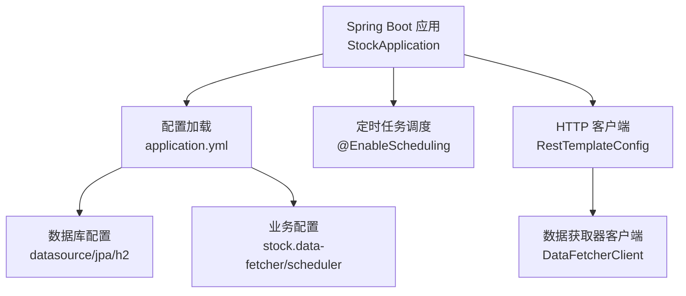
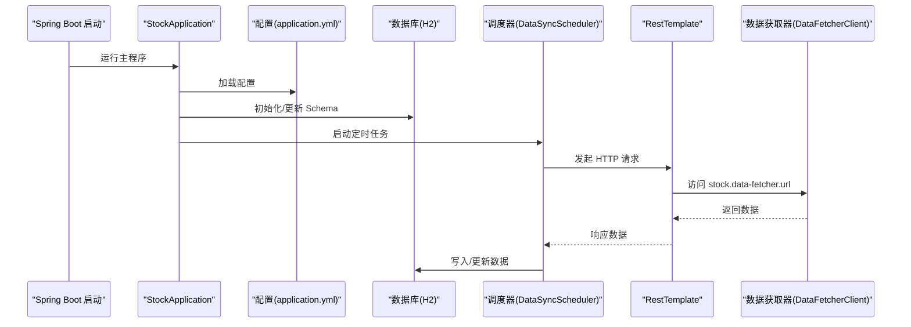
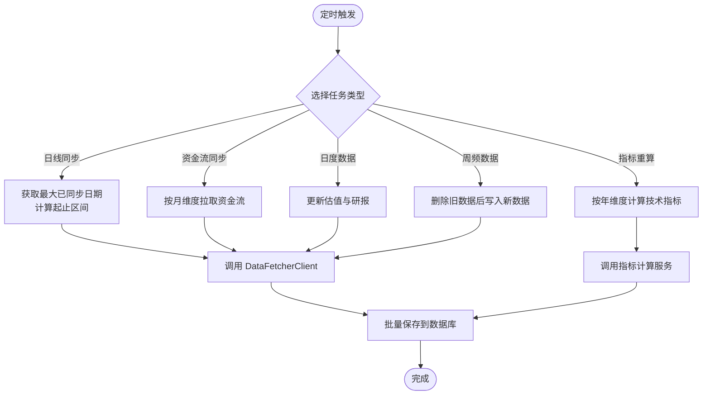
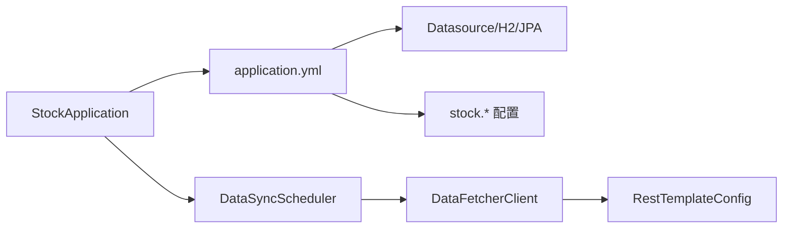

# 环境配置

<cite>
**本文引用的文件**
- [application.yml（主）](file://backend/src/main/resources/application.yml)
- [application.yml（测试）](file://backend/src/test/resources/application.yml)
- [StockApplication.java](file://backend/src/main/java/com/stock/StockApplication.java)
- [RestTemplateConfig.java](file://backend/src/main/java/com/stock/config/RestTemplateConfig.java)
- [DataSyncScheduler.java](file://backend/src/main/java/com/stock/scheduler/DataSyncScheduler.java)
- [DataFetcherClient.java](file://backend/src/main/java/com/stock/client/DataFetcherClient.java)
- [pom.xml](file://backend/pom.xml)
</cite>

## 目录
1. [简介](#简介)
2. [项目结构](#项目结构)
3. [核心组件](#核心组件)
4. [架构总览](#架构总览)
5. [详细组件分析](#详细组件分析)
6. [依赖关系分析](#依赖关系分析)
7. [性能考量](#性能考量)
8. [故障排查指南](#故障排查指南)
9. [结论](#结论)
10. [附录：环境与部署模板](#附录环境与部署模板)

## 简介
本指南面向开发、测试与生产三类环境，系统性说明 Spring Boot 应用在不同环境下的配置差异与设置方法；详解 application.yml 中的关键参数（数据库连接、H2 控制台、数据获取器 URL、定时任务等），并给出通过 JVM 参数与环境变量覆盖默认配置的方法。同时提供 JVM 调优、线程池与连接池的性能建议，以及多场景部署模板与最佳实践。

## 项目结构
后端为 Spring Boot 应用，配置集中在 resources 下的 application.yml；定时任务由 Spring Scheduling 启用；数据获取通过 RestTemplate 客户端访问独立的数据抓取服务；测试环境使用内存数据库以提升执行效率。

图表来源
- [StockApplication.java:1-16](file://backend/src/main/java/com/stock/StockApplication.java#L1-L16)
- [application.yml（主）:1-28](file://backend/src/main/resources/application.yml#L1-L28)
- [RestTemplateConfig.java:1-18](file://backend/src/main/java/com/stock/config/RestTemplateConfig.java#L1-L18)
- [DataFetcherClient.java:1-126](file://backend/src/main/java/com/stock/client/DataFetcherClient.java#L1-L126)

章节来源
- [StockApplication.java:1-16](file://backend/src/main/java/com/stock/StockApplication.java#L1-L16)
- [application.yml（主）:1-28](file://backend/src/main/resources/application.yml#L1-L28)

## 核心组件
- 配置中心：application.yml 提供 server、spring.datasource、spring.jpa、spring.h2.console、stock.data-fetcher、stock.scheduler 等键空间。
- 数据源与 JPA：默认使用 H2 文件数据库，DDL 自动更新；测试环境使用内存 H2 并禁用 H2 控制台。
- 定时任务：启用调度与异步注解，具体任务在 DataSyncScheduler 中实现。
- 外部数据获取：DataFetcherClient 从 stock.data-fetcher.url 指定的服务拉取行情、财务、资金流等数据。
- HTTP 客户端超时：RestTemplateConfig 设置连接与读取超时，保障稳定性。

章节来源
- [application.yml（主）:1-28](file://backend/src/main/resources/application.yml#L1-L28)
- [application.yml（测试）:1-27](file://backend/src/test/resources/application.yml#L1-L27)
- [RestTemplateConfig.java:1-18](file://backend/src/main/java/com/stock/config/RestTemplateConfig.java#L1-L18)
- [DataSyncScheduler.java:1-238](file://backend/src/main/java/com/stock/scheduler/DataSyncScheduler.java#L1-L238)
- [DataFetcherClient.java:1-126](file://backend/src/main/java/com/stock/client/DataFetcherClient.java#L1-L126)

## 架构总览
下图展示应用启动、配置加载、定时任务触发与外部数据获取的整体流程。

图表来源
- [StockApplication.java:1-16](file://backend/src/main/java/com/stock/StockApplication.java#L1-L16)
- [application.yml（主）:1-28](file://backend/src/main/resources/application.yml#L1-L28)
- [DataSyncScheduler.java:1-238](file://backend/src/main/java/com/stock/scheduler/DataSyncScheduler.java#L1-L238)
- [DataFetcherClient.java:1-126](file://backend/src/main/java/com/stock/client/DataFetcherClient.java#L1-L126)
- [RestTemplateConfig.java:1-18](file://backend/src/main/java/com/stock/config/RestTemplateConfig.java#L1-L18)

## 详细组件分析

### application.yml 参数详解
- server.port：服务监听端口，默认 8080。
- spring.datasource.url：数据库连接地址。开发使用文件型 H2，测试使用内存 H2。
- spring.datasource.driver-class-name：数据库驱动类名，H2。
- spring.jpa.hibernate.ddl-auto：开发环境设为 update，便于自动迁移；测试环境可按需调整。
- spring.jpa.properties.hibernate.format_sql：格式化 SQL 输出，便于调试。
- spring.h2.console.enabled：是否启用 H2 控制台，默认开启。
- spring.h2.console.path：H2 控制台访问路径，默认 /h2-console。
- stock.data-fetcher.url：数据获取器服务地址，默认本地 5001 端口。
- stock.data-fetcher.timeout：数据获取器请求超时时间（毫秒）。
- stock.scheduler.quote-refresh-cron / kline-sync-cron / fund-flow-sync-cron / alert-check-cron：各定时任务的 Cron 表达式，仅工作日有效。

章节来源
- [application.yml（主）:1-28](file://backend/src/main/resources/application.yml#L1-L28)
- [application.yml（测试）:1-27](file://backend/src/test/resources/application.yml#L1-L27)

### 测试环境配置差异
- 使用内存数据库（jdbc:h2:mem:testdb），避免磁盘 IO。
- JPA 的 ddl-auto 在测试中通常设为 create-drop 或 update，便于快速重建。
- 关闭 H2 控制台，减少资源占用。
- 缩短数据获取器超时时间，加速测试执行。
- 将所有定时任务 Cron 设为“禁用”（示例中使用占位符），避免在测试中触发真实同步。

章节来源
- [application.yml（测试）:1-27](file://backend/src/test/resources/application.yml#L1-L27)

### 数据获取器客户端与超时配置
- DataFetcherClient 通过 @Value 注入 stock.data-fetcher.url，并基于 RestTemplate 发起 GET/POST 请求。
- RestTemplateConfig 为客户端统一设置连接超时与读取超时，确保网络波动下的稳定性。
- 若外部数据服务响应慢或不可用，可通过缩短超时或增加重试策略缓解。

章节来源
- [DataFetcherClient.java:1-126](file://backend/src/main/java/com/stock/client/DataFetcherClient.java#L1-L126)
- [RestTemplateConfig.java:1-18](file://backend/src/main/java/com/stock/config/RestTemplateConfig.java#L1-L18)

### 定时任务与调度策略
- 应用启用 @EnableScheduling 与 @EnableAsync，支持定时与异步处理。
- DataSyncScheduler 实现多类数据的定时同步与指标重算，包含日线、资金流、估值与研报、周频财务与股东数据等。
- Cron 表达式限定工作日与交易时段，避免非交易时间的无效请求。

图表来源
- [DataSyncScheduler.java:1-238](file://backend/src/main/java/com/stock/scheduler/DataSyncScheduler.java#L1-L238)
- [DataFetcherClient.java:1-126](file://backend/src/main/java/com/stock/client/DataFetcherClient.java#L1-L126)

章节来源
- [StockApplication.java:1-16](file://backend/src/main/java/com/stock/StockApplication.java#L1-L16)
- [DataSyncScheduler.java:1-238](file://backend/src/main/java/com/stock/scheduler/DataSyncScheduler.java#L1-L238)

### 配置覆盖方式：JVM 参数与环境变量
- 环境变量优先级高于 application.yml。例如：
  - server.port 可通过环境变量覆盖。
  - spring.profiles.active 可切换开发/测试/生产配置文件。
  - spring.datasource.url 可通过环境变量覆盖数据库连接。
- JVM 参数：
  - 使用 -Dkey=value 形式临时覆盖配置键值。
  - 使用 JVM 调优参数（如堆大小、GC 策略）提升运行时性能。
- Maven 插件与测试：
  - pom.xml 中 surefire 插件配置了 ByteBuddy 代理与模块开权限参数，保证测试执行稳定。

章节来源
- [pom.xml:77-86](file://backend/pom.xml#L77-L86)

## 依赖关系分析
- 启动入口依赖配置与调度注解；配置影响数据源、JPA、H2 控制台与业务参数；调度器依赖客户端访问外部数据服务；客户端依赖 RestTemplate 的超时配置。

图表来源
- [StockApplication.java:1-16](file://backend/src/main/java/com/stock/StockApplication.java#L1-L16)
- [application.yml（主）:1-28](file://backend/src/main/resources/application.yml#L1-L28)
- [DataSyncScheduler.java:1-238](file://backend/src/main/java/com/stock/scheduler/DataSyncScheduler.java#L1-L238)
- [DataFetcherClient.java:1-126](file://backend/src/main/java/com/stock/client/DataFetcherClient.java#L1-L126)
- [RestTemplateConfig.java:1-18](file://backend/src/main/java/com/stock/config/RestTemplateConfig.java#L1-L18)

章节来源
- [StockApplication.java:1-16](file://backend/src/main/java/com/stock/StockApplication.java#L1-L16)
- [application.yml（主）:1-28](file://backend/src/main/resources/application.yml#L1-L28)

## 性能考量
- JVM 参数建议
  - 初始堆与最大堆：根据数据量与并发设置合理堆大小。
  - GC 策略：在低延迟场景优先考虑 G1GC 或 ZGC。
  - 元空间：确保足够大以容纳大量类元数据。
  - 线程栈：默认合理，若存在大量线程可适当下调。
- 线程池与异步
  - 当前应用启用 @EnableAsync，但未显式定义线程池 Bean。可在高并发场景引入自定义线程池，限制队列长度与拒绝策略。
- 连接池
  - Spring Boot 默认使用 HikariCP。可通过 spring.datasource.hikari.* 键优化连接池参数（最小空闲、最大池大小、连接超时、空闲超时等）。
- 网络与超时
  - RestTemplate 已设置连接与读取超时，建议结合重试与熔断策略（如 Resilience4j）增强健壮性。
- 定时任务
  - Cron 仅在工作日执行，避免非交易时段压力；对耗时任务建议拆分批次与限速，防止阻塞。

[本节为通用性能建议，不直接分析具体文件]

## 故障排查指南
- H2 控制台无法访问
  - 检查 spring.h2.console.enabled 与 path 是否正确；测试环境默认关闭控制台。
- 数据库初始化失败
  - 校验 spring.datasource.url 与 driver-class-name；确认文件型数据库目录可写。
- 定时任务未执行
  - 确认 @EnableScheduling 生效；检查 Cron 表达式与系统时区；测试环境可能将 Cron 设为禁用。
- 外部数据获取超时
  - 检查 stock.data-fetcher.url 与 stock.data-fetcher.timeout；必要时提高超时或增加重试。
- RestTemplate 异常
  - 查看 DataFetcherClient 的异常包装信息，定位具体接口与参数。

章节来源
- [application.yml（主）:1-28](file://backend/src/main/resources/application.yml#L1-L28)
- [application.yml（测试）:1-27](file://backend/src/test/resources/application.yml#L1-L27)
- [DataFetcherClient.java:1-126](file://backend/src/main/java/com/stock/client/DataFetcherClient.java#L1-L126)
- [RestTemplateConfig.java:1-18](file://backend/src/main/java/com/stock/config/RestTemplateConfig.java#L1-L18)
- [DataSyncScheduler.java:1-238](file://backend/src/main/java/com/stock/scheduler/DataSyncScheduler.java#L1-L238)

## 结论
通过明确区分开发/测试/生产环境的配置要点，结合 JVM 参数与环境变量的灵活覆盖，可实现稳定、可维护且高性能的部署。建议在生产环境进一步完善线程池与连接池参数、引入熔断与监控，并规范 Cron 与限速策略，确保系统在高负载下仍保持可靠。

[本节为总结性内容，不直接分析具体文件]

## 附录：环境与部署模板

### 开发环境（Dev）
- 数据库：文件型 H2（持久化到用户目录）
- H2 控制台：启用，路径 /h2-console
- 定时任务：按工作日执行，保证交易时段同步
- 外部数据服务：本地 5001 端口
- JVM 参数：按需设置堆大小与 GC 策略
- 环境变量覆盖：可通过 -D 或环境变量覆盖 server.port、spring.profiles.active、spring.datasource.url 等

章节来源
- [application.yml（主）:1-28](file://backend/src/main/resources/application.yml#L1-L28)
- [StockApplication.java:1-16](file://backend/src/main/java/com/stock/StockApplication.java#L1-L16)

### 测试环境（Test）
- 数据库：内存 H2，DDL 策略按需调整
- H2 控制台：关闭
- 定时任务：全部禁用（Cron 设为禁用占位符）
- 外部数据服务：同上
- JVM 参数：与开发一致，或针对测试场景微调
- 环境变量覆盖：用于切换 profile 与端口

章节来源
- [application.yml（测试）:1-27](file://backend/src/test/resources/application.yml#L1-L27)

### 生产环境（Prod）
- 数据库：建议使用 MySQL/PostgreSQL（替换 H2），配置连接池参数与只读副本
- H2 控制台：关闭
- 定时任务：严格限定工作日与交易时段，加入限速与失败重试
- 外部数据服务：高可用集群与健康检查
- JVM 参数：G1GC、合理堆大小、开启 JIT 优化与 GC 日志
- 环境变量覆盖：通过容器编排注入，避免硬编码

[本节为通用模板与最佳实践，不直接分析具体文件]