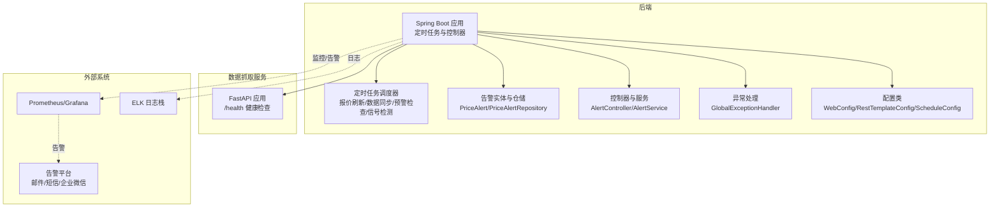
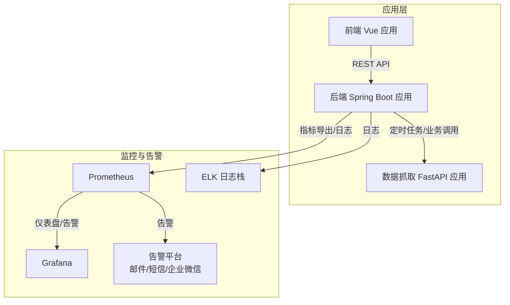
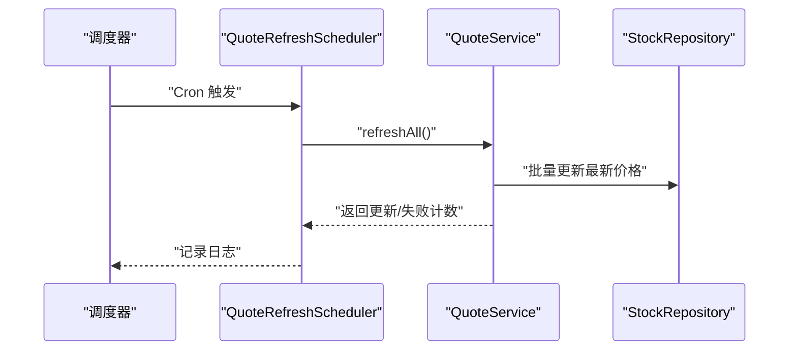
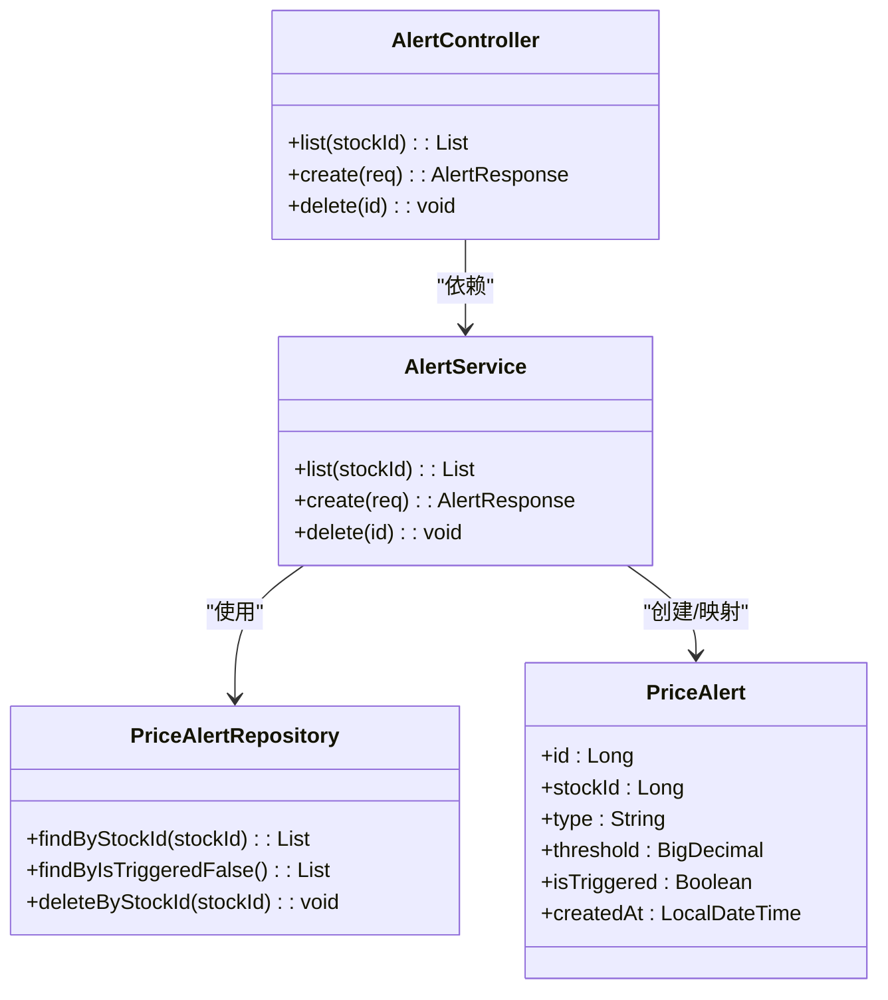
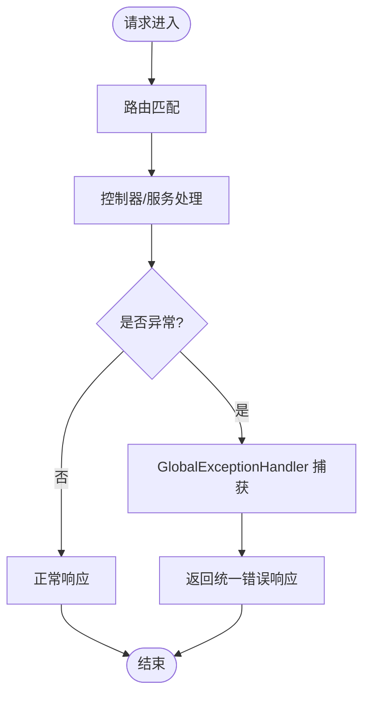
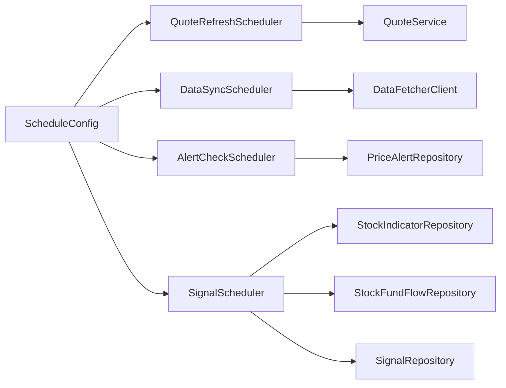

# 监控告警

<cite>
**本文引用的文件**
- [application.yml](file://backend/src/main/resources/application.yml)
- [AlertCheckScheduler.java](file://backend/src/main/java/com/stock/scheduler/AlertCheckScheduler.java)
- [DataSyncScheduler.java](file://backend/src/main/java/com/stock/scheduler/DataSyncScheduler.java)
- [QuoteRefreshScheduler.java](file://backend/src/main/java/com/stock/scheduler/QuoteRefreshScheduler.java)
- [SignalScheduler.java](file://backend/src/main/java/com/stock/scheduler/SignalScheduler.java)
- [AlertController.java](file://backend/src/main/java/com/stock/controller/AlertController.java)
- [AlertService.java](file://backend/src/main/java/com/stock/service/AlertService.java)
- [PriceAlert.java](file://backend/src/main/java/com/stock/entity/PriceAlert.java)
- [PriceAlertRepository.java](file://backend/src/main/java/com/stock/repository/PriceAlertRepository.java)
- [GlobalExceptionHandler.java](file://backend/src/main/java/com/stock/exception/GlobalExceptionHandler.java)
- [ErrorResponse.java](file://backend/src/main/java/com/stock/exception/ErrorResponse.java)
- [WebConfig.java](file://backend/src/main/java/com/stock/config/WebConfig.java)
- [RestTemplateConfig.java](file://backend/src/main/java/com/stock/config/RestTemplateConfig.java)
- [ScheduleConfig.java](file://backend/src/main/java/com/stock/config/ScheduleConfig.java)
- [app.py](file://data-fetcher/app.py)
- [requirements.txt](file://data-fetcher/requirements.txt)
- [AlertControllerTest.java](file://backend/src/test/java/com/stock/controller/AlertControllerTest.java)
</cite>

## 目录
1. [简介](#简介)
2. [项目结构](#项目结构)
3. [核心组件](#核心组件)
4. [架构总览](#架构总览)
5. [详细组件分析](#详细组件分析)
6. [依赖分析](#依赖分析)
7. [性能考虑](#性能考虑)
8. [故障排查指南](#故障排查指南)
9. [结论](#结论)
10. [附录](#附录)

## 简介
本方案围绕股票交易系统构建一套完整的系统监控与告警体系，覆盖应用性能监控指标（CPU、内存、数据库连接、API 响应时间）、定时任务监控（数据同步、报价刷新、预警检查、信号检测）、告警规则与通知渠道建议、日志聚合与分析（ELK 或类似方案）以及故障自愈与自动恢复策略。当前代码库已具备基础的定时任务与告警实体，可作为监控与告警的起点，后续可通过引入 Micrometer/Prometheus、Grafana、ELK、告警平台（如 AlertManager/钉钉/企业微信）进行扩展。

## 项目结构
后端采用 Spring Boot，定时任务通过注解驱动；前端为 Vue 应用；数据抓取服务采用 FastAPI。监控与告警涉及的关键模块如下：
- 定时任务：报价刷新、数据同步、预警检查、信号检测
- 告警实体与接口：价格预警的创建、查询、删除
- 异常处理：统一错误响应
- 配置：CORS、定时任务开关、HTTP 客户端超时
- 数据抓取服务：健康检查端点

**图表来源**
- [application.yml:1-28](file://backend/src/main/resources/application.yml#L1-L28)
- [AlertCheckScheduler.java:1-52](file://backend/src/main/java/com/stock/scheduler/AlertCheckScheduler.java#L1-L52)
- [DataSyncScheduler.java:1-238](file://backend/src/main/java/com/stock/scheduler/DataSyncScheduler.java#L1-L238)
- [QuoteRefreshScheduler.java:1-35](file://backend/src/main/java/com/stock/scheduler/QuoteRefreshScheduler.java#L1-L35)
- [SignalScheduler.java:1-125](file://backend/src/main/java/com/stock/scheduler/SignalScheduler.java#L1-L125)
- [AlertController.java:1-40](file://backend/src/main/java/com/stock/controller/AlertController.java#L1-L40)
- [AlertService.java:1-63](file://backend/src/main/java/com/stock/service/AlertService.java#L1-L63)
- [PriceAlert.java:1-37](file://backend/src/main/java/com/stock/entity/PriceAlert.java#L1-L37)
- [PriceAlertRepository.java:1-17](file://backend/src/main/java/com/stock/repository/PriceAlertRepository.java#L1-L17)
- [GlobalExceptionHandler.java:1-33](file://backend/src/main/java/com/stock/exception/GlobalExceptionHandler.java#L1-L33)
- [WebConfig.java](file://backend/src/main/java/com/stock/config/WebConfig.java)
- [RestTemplateConfig.java](file://backend/src/main/java/com/stock/config/RestTemplateConfig.java)
- [ScheduleConfig.java](file://backend/src/main/java/com/stock/config/ScheduleConfig.java)
- [app.py:1-31](file://data-fetcher/app.py#L1-L31)

**章节来源**
- [application.yml:1-28](file://backend/src/main/resources/application.yml#L1-L28)
- [WebConfig.java](file://backend/src/main/java/com/stock/config/WebConfig.java)
- [RestTemplateConfig.java](file://backend/src/main/java/com/stock/config/RestTemplateConfig.java)
- [ScheduleConfig.java](file://backend/src/main/java/com/stock/config/ScheduleConfig.java)
- [app.py:1-31](file://data-fetcher/app.py#L1-L31)

## 核心组件
- 定时任务调度器
  - 报价刷新：按配置的 Cron 表达式周期性刷新所有股票报价
  - 数据同步：工作日定时拉取 K 线、资金流、估值与研报、周频财务与股东数据，并计算技术指标
  - 预警检查：按配置的 Cron 表达式扫描未触发的价格预警并标记触发
  - 信号检测：基于技术指标与主力净量识别买卖信号
- 告警实体与接口
  - 实体：价格预警记录，包含股票标识、类型（高于/低于）、阈值、是否已触发、创建时间
  - 控制器：列出、创建、删除价格预警
  - 服务：查询与创建预警，关联股票最新价格
  - 仓储：按股票与触发状态查询
- 异常处理
  - 统一返回错误码与消息，便于监控侧识别异常
- 配置
  - 定时任务 Cron 表达式集中于配置文件
  - CORS、HTTP 客户端超时、定时任务开关

**章节来源**
- [QuoteRefreshScheduler.java:1-35](file://backend/src/main/java/com/stock/scheduler/QuoteRefreshScheduler.java#L1-L35)
- [DataSyncScheduler.java:1-238](file://backend/src/main/java/com/stock/scheduler/DataSyncScheduler.java#L1-L238)
- [AlertCheckScheduler.java:1-52](file://backend/src/main/java/com/stock/scheduler/AlertCheckScheduler.java#L1-L52)
- [SignalScheduler.java:1-125](file://backend/src/main/java/com/stock/scheduler/SignalScheduler.java#L1-L125)
- [AlertController.java:1-40](file://backend/src/main/java/com/stock/controller/AlertController.java#L1-L40)
- [AlertService.java:1-63](file://backend/src/main/java/com/stock/service/AlertService.java#L1-L63)
- [PriceAlert.java:1-37](file://backend/src/main/java/com/stock/entity/PriceAlert.java#L1-L37)
- [PriceAlertRepository.java:1-17](file://backend/src/main/java/com/stock/repository/PriceAlertRepository.java#L1-L17)
- [GlobalExceptionHandler.java:1-33](file://backend/src/main/java/com/stock/exception/GlobalExceptionHandler.java#L1-L33)
- [ErrorResponse.java:1-8](file://backend/src/main/java/com/stock/exception/ErrorResponse.java#L1-L8)
- [application.yml:19-28](file://backend/src/main/resources/application.yml#L19-L28)

## 架构总览
下图展示监控与告警在系统中的位置与交互：

**图表来源**
- [application.yml:1-28](file://backend/src/main/resources/application.yml#L1-L28)
- [app.py:1-31](file://data-fetcher/app.py#L1-L31)

## 详细组件分析

### 定时任务监控
- 报价刷新
  - 触发时机：由配置的 Cron 表达式驱动
  - 执行流程：调用报价服务刷新全部股票，记录更新与失败数量
  - 监控要点：任务耗时、成功/失败计数、异常日志
- 数据同步
  - 触发时机：工作日定时拉取多类数据，计算技术指标
  - 执行流程：按股票循环，计算起始日期，调用数据抓取服务，入库并记录条数
  - 监控要点：每类数据同步的记录数、失败重试、去重逻辑
- 预警检查
  - 触发时机：按配置的 Cron 表达式扫描未触发的预警
  - 执行流程：遍历未触发预警，比对股票最新价格与阈值，标记触发
  - 监控要点：触发数量、阈值类型、异常处理
- 信号检测
  - 触发时机：工作日定时检测买卖信号
  - 执行流程：基于均线与 RSI、主力净量识别信号并去重保存
  - 监控要点：新信号数量、指标窗口大小、异常处理

**图表来源**
- [QuoteRefreshScheduler.java:24-33](file://backend/src/main/java/com/stock/scheduler/QuoteRefreshScheduler.java#L24-L33)

**章节来源**
- [QuoteRefreshScheduler.java:1-35](file://backend/src/main/java/com/stock/scheduler/QuoteRefreshScheduler.java#L1-L35)
- [DataSyncScheduler.java:54-161](file://backend/src/main/java/com/stock/scheduler/DataSyncScheduler.java#L54-L161)
- [AlertCheckScheduler.java:26-50](file://backend/src/main/java/com/stock/scheduler/AlertCheckScheduler.java#L26-L50)
- [SignalScheduler.java:39-108](file://backend/src/main/java/com/stock/scheduler/SignalScheduler.java#L39-L108)

### 告警实体与接口
- 实体与仓储
  - 实体包含股票标识、类型、阈值、触发状态、创建时间
  - 仓储支持按股票与触发状态查询
- 控制器与服务
  - 控制器提供列表、创建、删除接口
  - 服务负责校验股票存在性、组装响应、关联最新价格
- 测试验证
  - 单元测试覆盖列表、创建（201）、删除（204）

**图表来源**
- [PriceAlert.java:1-37](file://backend/src/main/java/com/stock/entity/PriceAlert.java#L1-L37)
- [PriceAlertRepository.java:1-17](file://backend/src/main/java/com/stock/repository/PriceAlertRepository.java#L1-L17)
- [AlertController.java:1-40](file://backend/src/main/java/com/stock/controller/AlertController.java#L1-L40)
- [AlertService.java:1-63](file://backend/src/main/java/com/stock/service/AlertService.java#L1-L63)

**章节来源**
- [PriceAlert.java:1-37](file://backend/src/main/java/com/stock/entity/PriceAlert.java#L1-L37)
- [PriceAlertRepository.java:1-17](file://backend/src/main/java/com/stock/repository/PriceAlertRepository.java#L1-L17)
- [AlertController.java:1-40](file://backend/src/main/java/com/stock/controller/AlertController.java#L1-L40)
- [AlertService.java:1-63](file://backend/src/main/java/com/stock/service/AlertService.java#L1-L63)
- [AlertControllerTest.java:43-72](file://backend/src/test/java/com/stock/controller/AlertControllerTest.java#L43-L72)

### 异常处理与健康检查
- 异常处理
  - 统一返回错误码与消息，便于监控与告警识别
- 健康检查
  - 数据抓取服务提供 /health 健康检查端点，可用于 Prometheus 抓取

**图表来源**
- [GlobalExceptionHandler.java:7-32](file://backend/src/main/java/com/stock/exception/GlobalExceptionHandler.java#L7-L32)
- [ErrorResponse.java:1-8](file://backend/src/main/java/com/stock/exception/ErrorResponse.java#L1-L8)
- [app.py:23-25](file://data-fetcher/app.py#L23-L25)

**章节来源**
- [GlobalExceptionHandler.java:1-33](file://backend/src/main/java/com/stock/exception/GlobalExceptionHandler.java#L1-L33)
- [ErrorResponse.java:1-8](file://backend/src/main/java/com/stock/exception/ErrorResponse.java#L1-L8)
- [app.py:23-25](file://data-fetcher/app.py#L23-L25)

## 依赖分析
- 定时任务依赖
  - 调度器依赖服务与仓储，服务依赖仓储与实体
  - 配置类启用定时任务并提供 HTTP 客户端超时
- 外部依赖
  - 数据抓取服务通过 REST 接口提供数据
  - Prometheus/Grafana 用于指标与可视化
  - 告警平台用于通知
  - ELK 用于日志聚合

**图表来源**
- [ScheduleConfig.java](file://backend/src/main/java/com/stock/config/ScheduleConfig.java)
- [QuoteRefreshScheduler.java:1-35](file://backend/src/main/java/com/stock/scheduler/QuoteRefreshScheduler.java#L1-L35)
- [DataSyncScheduler.java:1-52](file://backend/src/main/java/com/stock/scheduler/DataSyncScheduler.java#L1-L52)
- [AlertCheckScheduler.java:1-24](file://backend/src/main/java/com/stock/scheduler/AlertCheckScheduler.java#L1-L24)
- [SignalScheduler.java:1-37](file://backend/src/main/java/com/stock/scheduler/SignalScheduler.java#L1-L37)

**章节来源**
- [ScheduleConfig.java](file://backend/src/main/java/com/stock/config/ScheduleConfig.java)
- [RestTemplateConfig.java](file://backend/src/main/java/com/stock/config/RestTemplateConfig.java)
- [WebConfig.java](file://backend/src/main/java/com/stock/config/WebConfig.java)

## 性能考虑
- 定时任务
  - 使用事务包裹批处理，避免部分写入导致的数据不一致
  - 对外部接口调用增加线程休眠，控制速率，避免被限流
  - 失败捕获并记录警告日志，避免中断整个批次
- API 响应时间
  - HTTP 客户端超时配置需结合外部服务性能调整
  - 控制器与服务层尽量减少 N+1 查询，使用批量操作
- 数据库连接
  - 合理设置连接池参数，避免高并发下的连接争用
- 日志
  - 使用结构化日志，便于 ELK 分析与检索

[本节为通用指导，无需特定文件来源]

## 故障排查指南
- 定时任务未执行
  - 检查定时任务开关配置与 Cron 表达式
  - 查看任务日志中“开始/完成”记录与异常信息
- 报价刷新失败
  - 检查报价服务可用性与网络连通性
  - 关注日志中的“失败计数”与异常堆栈
- 数据同步中断
  - 核查外部数据源接口可用性与返回格式
  - 关注“失败记录”的具体股票与日期范围
- 预警未触发
  - 确认预警阈值与股票最新价格对比逻辑
  - 检查未触发预警集合是否为空或股票不存在
- 信号检测异常
  - 检查指标窗口长度与主力净量阈值
  - 关注重复信号过滤逻辑
- 健康检查
  - 数据抓取服务 /health 返回 ok 表示服务可用

**章节来源**
- [application.yml:19-28](file://backend/src/main/resources/application.yml#L19-L28)
- [QuoteRefreshScheduler.java:24-33](file://backend/src/main/java/com/stock/scheduler/QuoteRefreshScheduler.java#L24-L33)
- [DataSyncScheduler.java:54-161](file://backend/src/main/java/com/stock/scheduler/DataSyncScheduler.java#L54-L161)
- [AlertCheckScheduler.java:26-50](file://backend/src/main/java/com/stock/scheduler/AlertCheckScheduler.java#L26-L50)
- [SignalScheduler.java:39-108](file://backend/src/main/java/com/stock/scheduler/SignalScheduler.java#L39-L108)
- [app.py:23-25](file://data-fetcher/app.py#L23-L25)

## 结论
当前系统已具备完善的定时任务与告警实体基础，可作为监控与告警体系的起点。建议下一步引入 Micrometer/Prometheus 指标导出、Grafana 可视化、告警平台与 ELK 日志栈，形成闭环的可观测性体系，并结合业务场景完善告警规则与通知策略。

[本节为总结，无需特定文件来源]

## 附录

### 应用性能监控指标建议
- CPU 使用率：通过操作系统或容器监控采集
- 内存占用：堆外/堆内内存、GC 次数与耗时
- 数据库连接数：活跃连接、空闲连接、等待队列
- API 响应时间：P50/P95/P99、错误率、吞吐量
- 定时任务执行时长与失败次数：每个任务独立指标
- 外部依赖健康状态：数据抓取服务 /health

[本节为通用指导，无需特定文件来源]

### Prometheus 监控配置与 Grafana 仪表板设置
- 导出指标
  - 引入 Micrometer 与 Prometheus 依赖，暴露 /actuator/prometheus
- 告警规则
  - 任务超时、失败率、健康检查失败、数据库连接不足等
- 仪表板
  - 展示 CPU/内存/连接数/API 响应时间/定时任务状态

[本节为通用指导，无需特定文件来源]

### 告警规则配置与通知渠道
- 阈值设置
  - 任务失败率 > 5%、响应时间 P99 > Xms、健康检查失败持续 Y 分钟
- 告警级别
  - 严重（S0）、警告（S1）、提示（S2）
- 通知渠道
  - 邮件、短信、企业微信机器人

[本节为通用指导，无需特定文件来源]

### 日志聚合与分析方案（ELK）
- 收集
  - Spring Boot 输出结构化日志（JSON），由 Logstash/Fluentd 收集
- 存储与索引
  - Elasticsearch 存储，按天索引
- 可视化
  - Kibana 构建仪表板与告警规则

[本节为通用指导，无需特定文件来源]

### 故障自愈与自动恢复策略
- 自动重启
  - 容器编排层面设置重启策略
- 降级与熔断
  - 外部依赖超时/失败时快速失败并降级
- 回滚与灰度
  - 版本回滚与灰度发布配合监控指标

[本节为通用指导，无需特定文件来源]