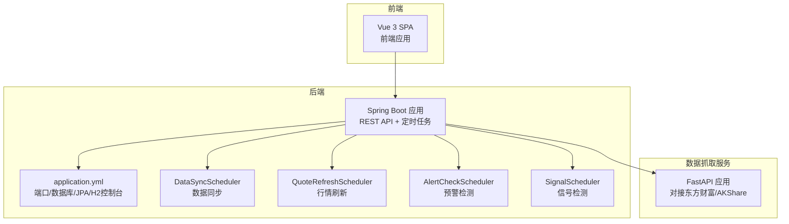
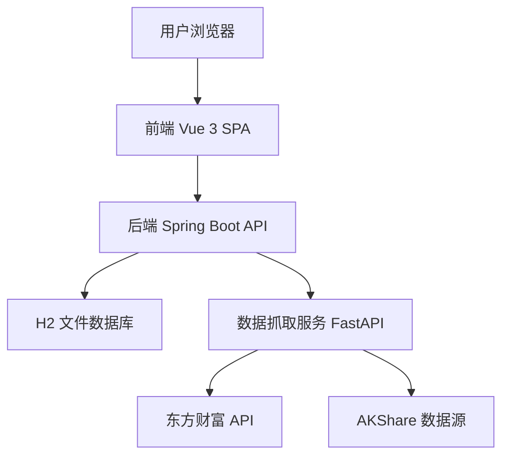
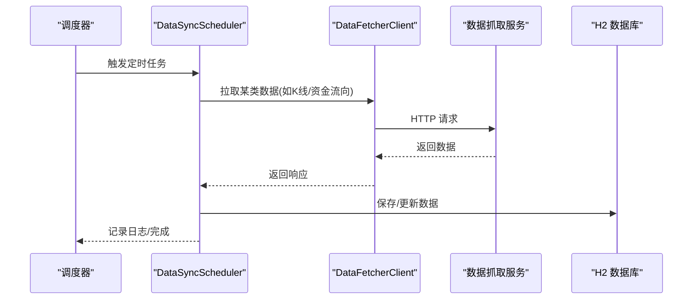
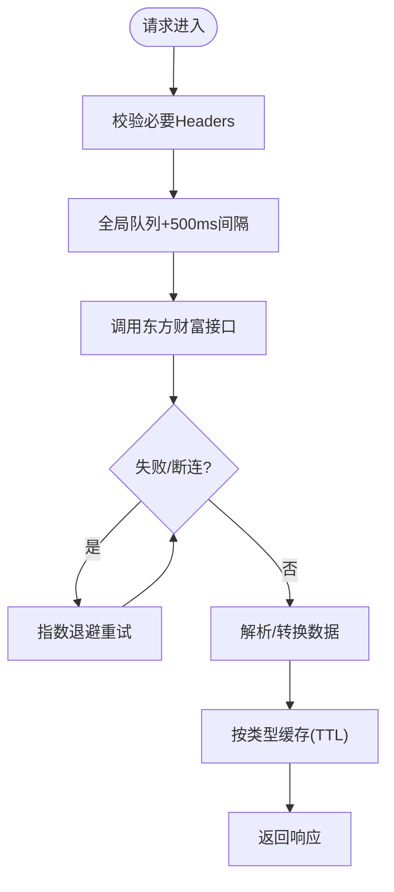
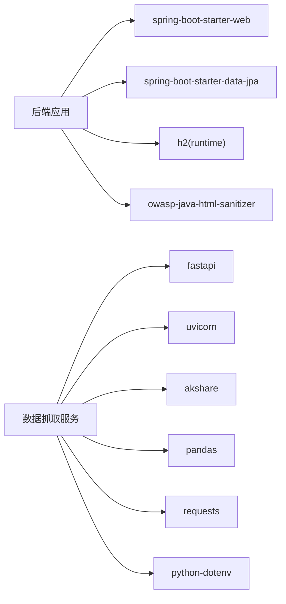

# 维护运维

<cite>
**本文引用的文件**
- [application.yml](file://backend/src/main/resources/application.yml)
- [StockApplication.java](file://backend/src/main/java/com/stock/StockApplication.java)
- [DataSyncScheduler.java](file://backend/src/main/java/com/stock/scheduler/DataSyncScheduler.java)
- [QuoteRefreshScheduler.java](file://backend/src/main/java/com/stock/scheduler/QuoteRefreshScheduler.java)
- [AlertCheckScheduler.java](file://backend/src/main/java/com/stock/scheduler/AlertCheckScheduler.java)
- [SignalScheduler.java](file://backend/src/main/java/com/stock/scheduler/SignalScheduler.java)
- [app.py](file://data-fetcher/app.py)
- [requirements.txt](file://data-fetcher/requirements.txt)
- [pom.xml](file://backend/pom.xml)
- [SKILL.md（系统规划）](file://system-planner/SKILL.md)
- [data-fetcher.md](file://system-planner/data-fetcher.md)
- [SKILL.md（开发流程）](file://dev-workflow/SKILL.md)
</cite>

## 目录
1. [简介](#简介)
2. [项目结构](#项目结构)
3. [核心组件](#核心组件)
4. [架构总览](#架构总览)
5. [详细组件分析](#详细组件分析)
6. [依赖分析](#依赖分析)
7. [性能考量](#性能考量)
8. [故障排查手册](#故障排查手册)
9. [容量规划与扩容策略](#容量规划与扩容策略)
10. [安全运维实践](#安全运维实践)
11. [运维自动化与工具推荐](#运维自动化与工具推荐)
12. [结论](#结论)

## 简介
本指南面向系统维护与运维团队，围绕日常维护、系统升级、故障排查、容量规划与安全运维等方面，结合代码库中的配置与调度实现，提供可落地的操作建议与最佳实践。系统采用“Spring Boot 后端 + H2 数据库 + Python 数据抓取服务”的架构，定时任务驱动数据同步与信号检测，具备良好的可维护性与可观测性。

## 项目结构
- 后端（Spring Boot）：负责 REST API、定时任务、数据同步、信号检测、异常处理与全局配置。
- 数据抓取服务（FastAPI + uvicorn）：对接东方财富与 AKShare，提供统一数据入口。
- 前端（Vue 3 + Vite）：用户界面，通过后端 API 获取数据。
- 系统规划与开发流程文档：定义了限流、缓存、安全、启动顺序与测试策略等运维相关要点。

图表来源
- [application.yml:1-28](file://backend/src/main/resources/application.yml#L1-L28)
- [StockApplication.java:1-16](file://backend/src/main/java/com/stock/StockApplication.java#L1-L16)
- [DataSyncScheduler.java:1-238](file://backend/src/main/java/com/stock/scheduler/DataSyncScheduler.java#L1-L238)
- [QuoteRefreshScheduler.java:1-34](file://backend/src/main/java/com/stock/scheduler/QuoteRefreshScheduler.java#L1-L34)
- [AlertCheckScheduler.java:1-52](file://backend/src/main/java/com/stock/scheduler/AlertCheckScheduler.java#L1-L52)
- [SignalScheduler.java:1-125](file://backend/src/main/java/com/stock/scheduler/SignalScheduler.java#L1-L125)
- [app.py:1-31](file://data-fetcher/app.py#L1-L31)

章节来源
- [application.yml:1-28](file://backend/src/main/resources/application.yml#L1-L28)
- [StockApplication.java:1-16](file://backend/src/main/java/com/stock/StockApplication.java#L1-L16)
- [app.py:1-31](file://data-fetcher/app.py#L1-L31)

## 核心组件
- 后端应用与定时任务
  - 启用调度与异步：后端主类启用调度与异步，便于定时任务与异步初始化。
  - 定时任务：数据同步、行情刷新、预警检测、信号检测。
- 数据抓取服务
  - FastAPI + uvicorn，统一接入东方财富与 AKShare，提供健康检查端点。
- 配置与数据库
  - H2 文件数据库，JPA 自动建模，H2 控制台便于调试。

章节来源
- [StockApplication.java:1-16](file://backend/src/main/java/com/stock/StockApplication.java#L1-L16)
- [DataSyncScheduler.java:1-238](file://backend/src/main/java/com/stock/scheduler/DataSyncScheduler.java#L1-L238)
- [QuoteRefreshScheduler.java:1-34](file://backend/src/main/java/com/stock/scheduler/QuoteRefreshScheduler.java#L1-L34)
- [AlertCheckScheduler.java:1-52](file://backend/src/main/java/com/stock/scheduler/AlertCheckScheduler.java#L1-L52)
- [SignalScheduler.java:1-125](file://backend/src/main/java/com/stock/scheduler/SignalScheduler.java#L1-L125)
- [application.yml:1-28](file://backend/src/main/resources/application.yml#L1-L28)
- [app.py:1-31](file://data-fetcher/app.py#L1-L31)

## 架构总览
系统采用本地化部署模式，服务绑定 127.0.0.1，避免公网暴露；后端通过 HTTP 调用数据抓取服务，定时任务驱动数据同步与计算，H2 文件数据库提供持久化存储。

图表来源
- [SKILL.md（系统规划）:468-475](file://system-planner/SKILL.md#L468-L475)
- [data-fetcher.md:1-350](file://system-planner/data-fetcher.md#L1-L350)
- [application.yml:1-28](file://backend/src/main/resources/application.yml#L1-L28)

## 详细组件分析

### 数据同步与定时任务
- 数据同步（DataSyncScheduler）
  - 按频率同步 K 线、资金流向、日频数据（估值/研报/龙虎榜）、周频数据（利润表/财务摘要/股东）。
  - 使用事务保证每只股票同步过程原子性；对异常进行日志记录与继续处理。
  - 同步前计算最大日期，执行增量同步；部分数据采用全量对比后入库。
- 行情刷新（QuoteRefreshScheduler）
  - 每交易时段按配置周期刷新所有活跃股票的行情字段。
- 预警检测（AlertCheckScheduler）
  - 检查未触发价格预警，根据阈值与最新股价更新触发状态。
- 信号检测（SignalScheduler）
  - 基于技术指标与资金流向检测金叉/死叉、RSI 超买超卖、主力大额流入/流出等信号。

图表来源
- [DataSyncScheduler.java:54-161](file://backend/src/main/java/com/stock/scheduler/DataSyncScheduler.java#L54-L161)
- [application.yml:23-27](file://backend/src/main/resources/application.yml#L23-L27)

章节来源
- [DataSyncScheduler.java:1-238](file://backend/src/main/java/com/stock/scheduler/DataSyncScheduler.java#L1-L238)
- [QuoteRefreshScheduler.java:1-34](file://backend/src/main/java/com/stock/scheduler/QuoteRefreshScheduler.java#L1-L34)
- [AlertCheckScheduler.java:1-52](file://backend/src/main/java/com/stock/scheduler/AlertCheckScheduler.java#L1-L52)
- [SignalScheduler.java:1-125](file://backend/src/main/java/com/stock/scheduler/SignalScheduler.java#L1-L125)
- [application.yml:23-27](file://backend/src/main/resources/application.yml#L23-L27)

### 数据抓取服务（Python）
- FastAPI 应用，统一接入东方财富与 AKShare，提供健康检查端点。
- 限流与容错：全局请求队列、500ms 间隔、超时重试、断连指数退避、批量上限。
- 缓存策略：针对不同数据类型设置 TTL，减少对外部接口压力。

图表来源
- [data-fetcher.md:24-322](file://system-planner/data-fetcher.md#L24-L322)
- [app.py:1-31](file://data-fetcher/app.py#L1-L31)

章节来源
- [app.py:1-31](file://data-fetcher/app.py#L1-L31)
- [requirements.txt:1-7](file://data-fetcher/requirements.txt#L1-L7)
- [data-fetcher.md:1-350](file://system-planner/data-fetcher.md#L1-L350)

### 启动与运行顺序
- 先启动数据抓取服务，等待就绪后再启动后端，最后启动前端。
- 后端端口、数据库 URL、H2 控制台路径在配置文件中定义。

章节来源
- [SKILL.md（系统规划）:483-510](file://system-planner/SKILL.md#L483-L510)
- [application.yml:1-28](file://backend/src/main/resources/application.yml#L1-L28)

## 依赖分析
- 后端依赖
  - Spring Boot Web、Data JPA、H2、OWASP HTML Sanitizer、测试依赖。
- 数据抓取服务依赖
  - FastAPI、uvicorn、akshare、pandas、requests、python-dotenv。
- 构建与打包
  - Maven 插件配置、Surefire Byte-Buddy 注入、Spring Boot 插件。

图表来源
- [pom.xml:23-56](file://backend/pom.xml#L23-L56)
- [requirements.txt:1-7](file://data-fetcher/requirements.txt#L1-L7)

章节来源
- [pom.xml:1-103](file://backend/pom.xml#L1-L103)
- [requirements.txt:1-7](file://data-fetcher/requirements.txt#L1-L7)

## 性能考量
- 定时任务频率与数据量
  - K 线与资金流向按交易日同步，技术指标在 K 线同步后重算，避免重复计算。
- 数据库性能
  - H2 文件存储在百万级以内性能稳定；查询通过索引字段（如按日期区间）优化。
- 外部接口限流
  - Python 侧 500ms 间隔与队列串行，降低被限流与断连风险。
- 前端渲染
  - K 线大数据量建议降采样，默认展示 1 年数据，5 年数据需考虑降采样策略。

章节来源
- [SKILL.md（系统规划）:646-655](file://system-planner/SKILL.md#L646-L655)
- [data-fetcher.md:24-32](file://system-planner/data-fetcher.md#L24-L32)

## 故障排查手册

### 常见问题诊断
- 数据抓取服务不可达
  - 检查服务是否在 5001 端口运行，健康检查端点是否返回正常。
  - 查看 Python 依赖安装与 uvicorn 启动命令。
- 后端无法连接数据抓取服务
  - 校验配置文件中的数据抓取服务地址与超时设置。
- 定时任务未执行或异常
  - 检查后端是否启用调度；查看任务日志中 warn/error 级别记录。
- H2 控制台无法访问
  - 确认 H2 控制台开关与路径配置。

章节来源
- [app.py:23-25](file://data-fetcher/app.py#L23-L25)
- [application.yml:4-17](file://backend/src/main/resources/application.yml#L4-L17)
- [DataSyncScheduler.java:56-82](file://backend/src/main/java/com/stock/scheduler/DataSyncScheduler.java#L56-L82)

### 日志分析方法
- 后端日志
  - 定时任务执行记录使用 INFO；接口调用失败使用 WARN。
- Python 服务日志
  - 每次外部接口调用记录 URL、耗时与状态。
- 前端日志
  - API 调用失败在浏览器控制台记录。

章节来源
- [SKILL.md（系统规划）:512-519](file://system-planner/SKILL.md#L512-L519)

### 性能瓶颈定位
- 外部接口限流
  - Python 侧 500ms 间隔与批量上限 20 只/轮；若频繁超时，适当降低并发或增加退避。
- 数据库查询
  - 检查按日期区间查询的索引使用情况；关注大表（如 K 线）的范围查询。
- 前端渲染
  - 5 年 K 线建议降采样；Canvas/WebGL 渲染优化。

章节来源
- [data-fetcher.md:24-32](file://system-planner/data-fetcher.md#L24-L32)
- [SKILL.md（系统规划）:646-655](file://system-planner/SKILL.md#L646-L655)

## 容量规划与扩容策略
- 水平扩展
  - 当前为单实例部署；若需水平扩展，建议引入反向代理与多实例后端，共享 H2 文件存储或迁移到外部数据库。
- 垂直扩展
  - 增加后端与 Python 服务的 CPU/内存资源，提升并发处理能力。
- 负载均衡
  - 前端通过 Nginx 或反向代理分发至多个后端实例；Python 服务可多进程/多实例配合 uvicorn。
- 数据库迁移
  - H2 适合开发/测试；生产建议迁移到 MySQL/PostgreSQL，以获得更好的并发与可靠性。

章节来源
- [SKILL.md（系统规划）:483-510](file://system-planner/SKILL.md#L483-L510)

## 安全运维实践
- 网络与协议
  - 所有服务绑定 127.0.0.1，避免公网暴露；本地 HTTP 即可满足需求。
- 输入过滤与 XSS 防护
  - 使用 OWASP HTML Sanitizer 作为额外防线；富文本存储为纯文本，减少攻击面。
- 数据库安全
  - H2 文件权限建议设置为 600，防止未授权访问。
- 认证与授权
  - 当前为本地部署，无需认证；若需公网访问，建议引入网关与鉴权机制。

章节来源
- [SKILL.md（系统规划）:468-475](file://system-planner/SKILL.md#L468-L475)

## 运维自动化与工具推荐
- 启动与停止脚本
  - 编写 Bash/PowerShell 脚本，按顺序启动/停止 Python 数据抓取服务、后端、前端。
- 健康检查
  - 使用 curl 检查数据抓取服务健康端点与后端 API 健康端点。
- 备份与恢复
  - 定期复制 H2 数据库文件目录（文件系统级备份）。
- 监控与告警
  - Prometheus + Grafana 监控后端与 Python 服务指标；日志聚合（ELK/Fluentd）收集日志。
- 容器化与编排
  - Docker 化部署，Kubernetes 编排；Secrets 管理敏感配置。

章节来源
- [app.py:23-25](file://data-fetcher/app.py#L23-L25)
- [application.yml:1-28](file://backend/src/main/resources/application.yml#L1-L28)

## 升级流程与回滚策略

### 版本发布与构建
- 后端
  - 使用 Maven 构建，Spring Boot 插件打包；可生成可执行 JAR。
- 数据抓取服务
  - pip 安装依赖后运行 uvicorn；可容器化部署。
- 前端
  - npm 安装依赖后构建静态资源，部署至 Nginx。

章节来源
- [pom.xml:58-101](file://backend/pom.xml#L58-L101)
- [requirements.txt:1-7](file://data-fetcher/requirements.txt#L1-L7)
- [SKILL.md（系统规划）:483-510](file://system-planner/SKILL.md#L483-L510)

### 数据库迁移
- 当前使用 H2 文件存储，无需迁移；若迁移到外部数据库，需制定迁移脚本与停机窗口。
- 迁移前备份数据库文件，迁移后验证数据一致性。

章节来源
- [application.yml:5-10](file://backend/src/main/resources/application.yml#L5-L10)

### 配置变更
- 后端配置
  - 修改 application.yml 中的端口、数据库 URL、定时任务表达式等。
- 数据抓取服务
  - 通过环境变量调整超时、重试、延迟等参数。
- 生效方式
  - 后端通过重启生效；Python 服务通过重启 uvicorn 生效。

章节来源
- [application.yml:1-28](file://backend/src/main/resources/application.yml#L1-L28)
- [data-fetcher.md:463-471](file://system-planner/data-fetcher.md#L463-L471)

### 回滚策略
- 快速回滚
  - 回滚到上一个版本的可执行包或镜像；恢复 H2 数据库文件。
- 配置回滚
  - 恢复旧版 application.yml 与环境变量。
- 逐步回滚
  - 先回滚后端，再回滚 Python 服务，最后回滚前端；每步验证健康检查。

章节来源
- [SKILL.md（开发流程）:124-131](file://dev-workflow/SKILL.md#L124-L131)

## 日常维护任务

### 数据备份策略
- H2 文件系统级备份
  - 备份 ~/stock-trading/db 目录下的数据库文件；建议每日全量+增量组合策略。
- 备份验证
  - 定期抽样恢复验证备份文件可用性。

章节来源
- [application.yml](file://backend/src/main/resources/application.yml#L6)

### 数据库清理
- 增量同步为主，避免全量删除；如需清理历史冗余数据，建议在非交易时段执行。
- 清理前做好备份与变更记录。

章节来源
- [DataSyncScheduler.java:61-76](file://backend/src/main/java/com/stock/scheduler/DataSyncScheduler.java#L61-L76)

### 缓存清理
- Python 侧缓存（TTL）会自动过期；如需强制清理，重启数据抓取服务。
- 后端无应用层缓存，直接查询 H2 数据库。

章节来源
- [data-fetcher.md:323-338](file://system-planner/data-fetcher.md#L323-L338)
- [SKILL.md（系统规划）:453-466](file://system-planner/SKILL.md#L453-L466)

### 临时文件清理
- 项目根目录下存在 pytest 与 Python 缓存目录，定期清理可释放磁盘空间。
- 建议在 CI/CD 中加入清理步骤。

章节来源
- [data-fetcher/app.py:1-31](file://data-fetcher/app.py#L1-L31)

## 结论
本指南基于代码库中的配置与调度实现，提供了从日常维护、升级回滚、故障排查到容量规划与安全运维的完整操作指引。建议在生产环境中引入容器化、监控与告警体系，并将 H2 迁移至企业级数据库以满足更高可靠性与并发需求。