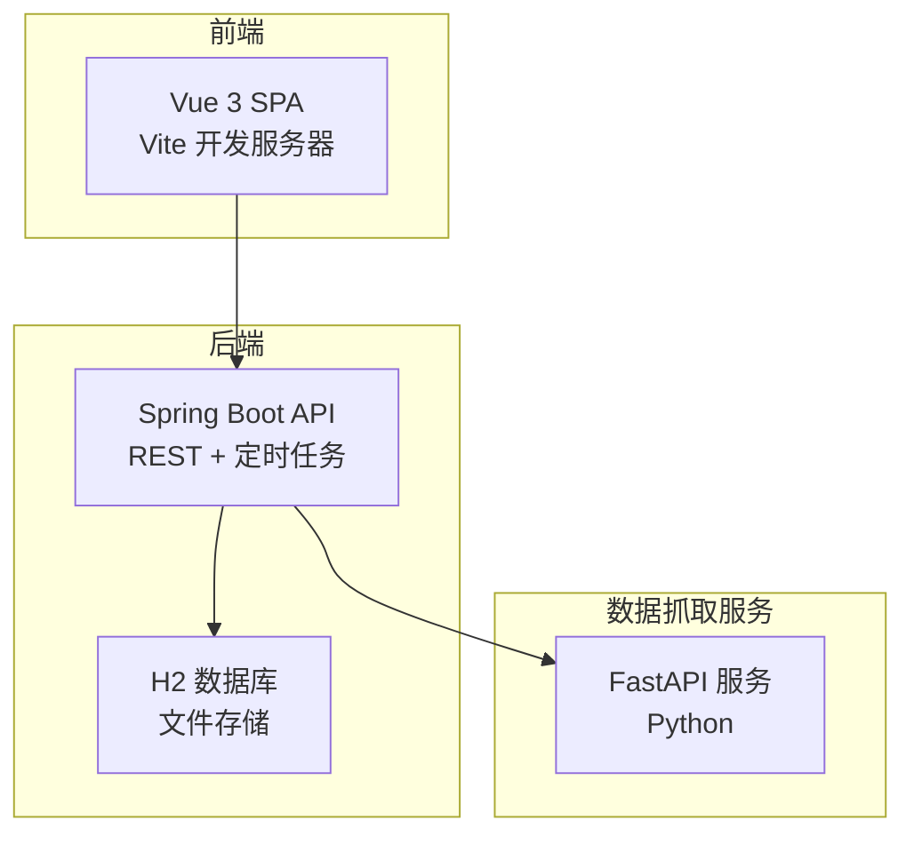
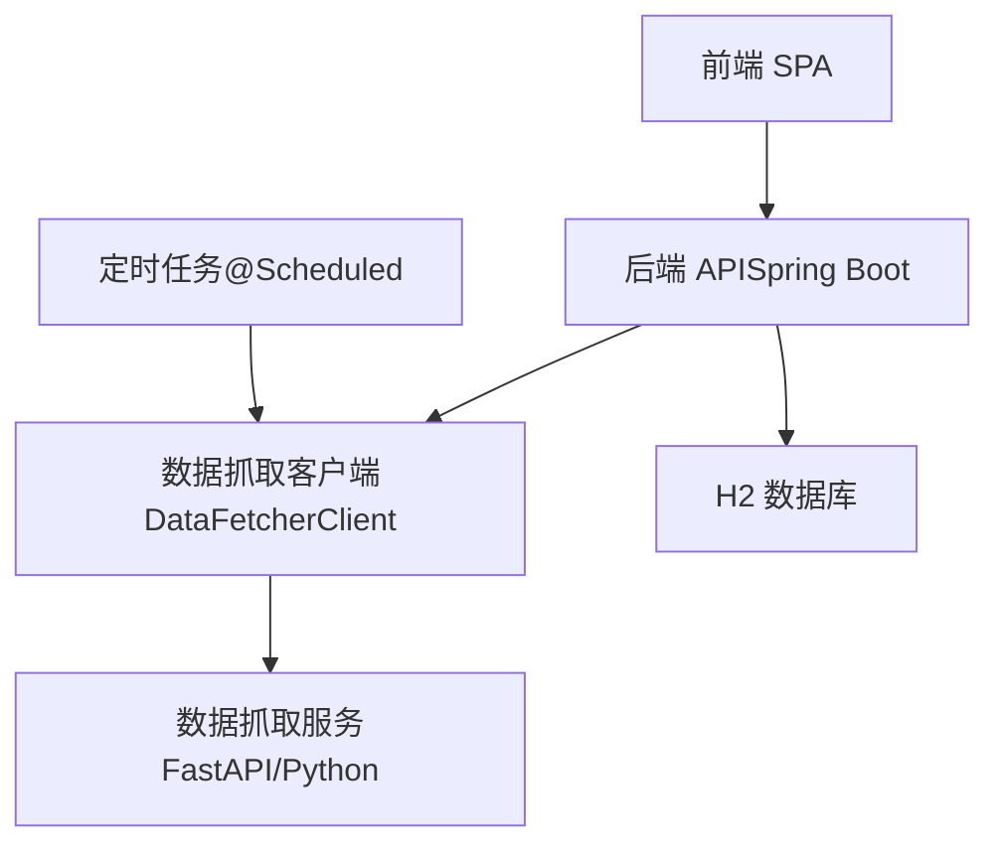
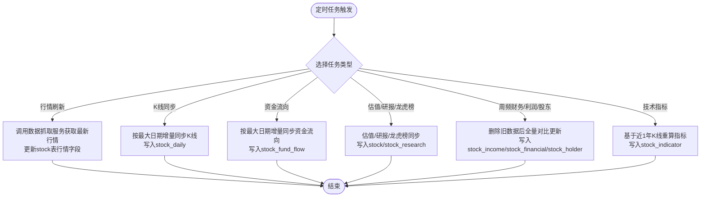
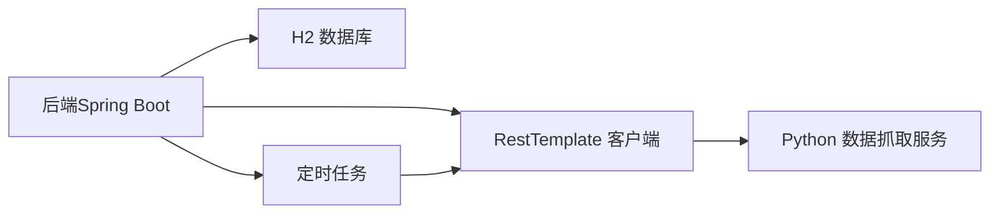

# 部署与运维

<cite>
**本文引用的文件**
- [application.yml](file://backend/src/main/resources/application.yml)
- [pom.xml](file://backend/pom.xml)
- [app.py](file://data-fetcher/app.py)
- [config.py](file://data-fetcher/core/config.py)
- [requirements.txt](file://data-fetcher/requirements.txt)
- [DataSyncScheduler.java](file://backend/src/main/java/com/stock/scheduler/DataSyncScheduler.java)
- [GlobalExceptionHandler.java](file://backend/src/main/java/com/stock/exception/GlobalExceptionHandler.java)
- [DataFetcherClient.java](file://backend/src/main/java/com/stock/client/DataFetcherClient.java)
- [SKILL.md](file://system-planner/SKILL.md)
- [high-level-design.md](file://system-planner/high-level-design.md)
- [detailed-design.md](file://system-planner/detailed-design.md)
</cite>

## 目录
1. [简介](#简介)
2. [项目结构](#项目结构)
3. [核心组件](#核心组件)
4. [架构总览](#架构总览)
5. [详细组件分析](#详细组件分析)
6. [依赖分析](#依赖分析)
7. [性能考量](#性能考量)
8. [故障排查指南](#故障排查指南)
9. [结论](#结论)
10. [附录](#附录)

## 简介
本指南面向生产环境部署与运维，围绕股票交易分析系统的后端（Spring Boot）、数据抓取服务（FastAPI/Python）与前端（Vue 3）给出从配置、容器化、负载均衡到监控告警、日志管理、性能监控、故障排查、备份恢复与升级更新的完整方案。系统采用“后端API + H2数据库 + Python数据抓取服务”的分层架构，定时任务驱动数据同步，具备完善的异常处理与可观测性设计。

## 项目结构
系统由三部分组成：
- 后端（Spring Boot）：提供REST API、定时任务、JPA持久化、全局异常处理与CORS配置。
- 数据抓取服务（FastAPI/Python）：封装东方财富与AKShare接口，提供限流、缓存与健康检查。
- 前端（Vue 3 + Vite）：SPA应用，通过REST API与后端交互。

**图示来源**
- [high-level-design.md:1-68](file://system-planner/high-level-design.md#L1-L68)
- [SKILL.md:22-36](file://system-planner/SKILL.md#L22-L36)

**章节来源**
- [high-level-design.md:1-68](file://system-planner/high-level-design.md#L1-L68)
- [SKILL.md:8-21](file://system-planner/SKILL.md#L8-L21)

## 核心组件
- 后端配置与启动
  - 服务器端口、数据库连接、JPA配置、H2控制台、数据抓取服务地址与定时任务表达式。
- 数据抓取服务
  - FastAPI入口、CORS跨域、路由聚合、健康检查端点、限流与重试策略。
- 定时任务
  - K线、资金流向、日频/周频财务与研报、技术指标重算等，按工作日与频率调度。
- 异常处理
  - 全局异常捕获与统一错误响应格式。
- 数据抓取客户端
  - 对接Python数据服务的RestTemplate封装，统一调用与错误转换。

**章节来源**
- [application.yml:1-28](file://backend/src/main/resources/application.yml#L1-L28)
- [app.py:1-31](file://data-fetcher/app.py#L1-L31)
- [DataSyncScheduler.java:1-238](file://backend/src/main/java/com/stock/scheduler/DataSyncScheduler.java#L1-L238)
- [GlobalExceptionHandler.java:1-33](file://backend/src/main/java/com/stock/exception/GlobalExceptionHandler.java#L1-L33)
- [DataFetcherClient.java:1-126](file://backend/src/main/java/com/stock/client/DataFetcherClient.java#L1-L126)

## 架构总览
系统采用“前端—后端—数据库—数据抓取服务”的分层架构，后端通过定时任务与数据抓取服务协同，实现自动数据拉取与本地存储；前端通过REST API消费数据并展示。

**图示来源**
- [high-level-design.md:19-67](file://system-planner/high-level-design.md#L19-L67)
- [detailed-design.md:519-602](file://system-planner/detailed-design.md#L519-L602)

## 详细组件分析

### 后端配置与启动
- 环境变量与配置文件
  - server.port：API监听端口。
  - spring.datasource.*：H2文件数据库连接（文件路径位于用户目录下）。
  - spring.jpa.hibernate.ddl-auto：开发期自动更新。
  - h2.console.enabled：H2控制台开关。
  - stock.data-fetcher.url：Python数据服务地址。
  - stock.scheduler.*：定时任务Cron表达式。
- 启动顺序与依赖
  - 后端依赖数据抓取服务；数据抓取服务依赖Python运行时与第三方库。
- 构建与打包
  - 使用Maven构建，Java 17+，Spring Boot插件打包。

**章节来源**
- [application.yml:1-28](file://backend/src/main/resources/application.yml#L1-L28)
- [pom.xml:1-103](file://backend/pom.xml#L1-L103)
- [SKILL.md:483-510](file://system-planner/SKILL.md#L483-L510)

### 数据抓取服务（FastAPI/Python）
- 服务特性
  - CORS允许任意来源，便于前后端联调。
  - 聚合多个路由模块（股票、资金、财务、股东、研究、龙虎榜、行业）。
  - 健康检查端点用于容器探针。
- 配置与依赖
  - 依赖FastAPI、Uvicorn、Requests、Pandas、AKShare、python-dotenv。
  - 通过配置模块定义请求头、限流、重试与数据转换工具。
- 限流与稳定性
  - 全局请求锁与最小请求间隔，避免触发东方财富限流。
  - 对常见网络异常进行指数退避重试。

**章节来源**
- [app.py:1-31](file://data-fetcher/app.py#L1-L31)
- [config.py:1-121](file://data-fetcher/core/config.py#L1-L121)
- [requirements.txt:1-7](file://data-fetcher/requirements.txt#L1-L7)

### 定时任务与数据同步
- 任务清单
  - 行情刷新：交易时段每5分钟。
  - K线同步：交易日15:30。
  - 资金流向同步：交易日16:00。
  - 估值/研报/龙虎榜同步：交易日18:00。
  - 周频财务/利润表/股东同步：周日凌晨2:00。
  - 预警检测：交易时段每1分钟。
  - 技术指标重算：交易日15:45。
- 同步策略
  - 增量同步为主，按最大日期推进；部分数据（如利润表、财务摘要、股东）采用全量对比后更新。
- 并发与可靠性
  - 每只股票循环同步，失败记录日志并继续；技术指标重算在K线同步后触发。

**图示来源**
- [DataSyncScheduler.java:54-236](file://backend/src/main/java/com/stock/scheduler/DataSyncScheduler.java#L54-L236)

**章节来源**
- [DataSyncScheduler.java:1-238](file://backend/src/main/java/com/stock/scheduler/DataSyncScheduler.java#L1-L238)
- [SKILL.md:375-401](file://system-planner/SKILL.md#L375-L401)

### 异常处理与统一错误响应
- 全局异常捕获
  - 对业务异常（股票不存在、重复、非法代码、数据抓取失败）返回相应HTTP状态码与统一错误体。
- 错误响应格式
  - 包含code、message、timestamp，便于前端统一处理。

**章节来源**
- [GlobalExceptionHandler.java:1-33](file://backend/src/main/java/com/stock/exception/GlobalExceptionHandler.java#L1-L33)
- [detailed-design.md:72-109](file://system-planner/detailed-design.md#L72-L109)

### 数据抓取客户端（DataFetcherClient）
- 设计要点
  - 通过@Value注入数据抓取服务地址，封装RestTemplate调用。
  - 统一封装调用与异常转换，避免上层直接感知网络异常。
- 并发安全
  - 通过单线程执行器串行化请求，避免并发冲突。

**章节来源**
- [DataFetcherClient.java:1-126](file://backend/src/main/java/com/stock/client/DataFetcherClient.java#L1-L126)
- [detailed-design.md:521-602](file://system-planner/detailed-design.md#L521-L602)

## 依赖分析
- 组件耦合
  - 后端通过DataFetcherClient依赖Python数据抓取服务；定时任务与数据抓取服务之间存在调用链。
- 外部依赖
  - 东方财富API（push2/push2his/datacenter-web）与AKShare（财务摘要、研报）。
- 配置与契约
  - 后端配置文件定义数据抓取服务地址与定时任务表达式；模块契约文档定义前后端API与后端与Python服务的接口映射。

**图示来源**
- [detailed-design.md:519-602](file://system-planner/detailed-design.md#L519-L602)
- [high-level-design.md:239-271](file://system-planner/high-level-design.md#L239-L271)

**章节来源**
- [detailed-design.md:1-70](file://system-planner/detailed-design.md#L1-L70)
- [high-level-design.md:185-271](file://system-planner/high-level-design.md#L185-L271)

## 性能考量
- 数据库与查询
  - H2文件存储适合中小规模数据，已为高频查询字段建立索引；建议在生产环境使用更高规格磁盘与IO。
- 定时任务频率
  - 交易时段高频任务（行情刷新、预警检测）与日频/周频任务分离，降低峰值压力。
- 外部接口限流
  - Python侧全局请求锁与最小间隔，不同域名请求可并行，提高吞吐。
- 前端渲染
  - K线大数据量建议降采样，默认展示1年数据，避免卡顿。

**章节来源**
- [high-level-design.md:439-490](file://system-planner/high-level-design.md#L439-L490)
- [SKILL.md:646-655](file://system-planner/SKILL.md#L646-L655)

## 故障排查指南
- 常见问题与定位
  - 数据抓取服务不可达：检查Python服务健康端点与网络连通性；确认CORS配置允许前端访问。
  - 外部接口超时/限流：查看Python服务日志与重试策略；关注指数退避与最小请求间隔。
  - 后端异常：检查全局异常处理器返回的统一错误体；核对业务异常类型与HTTP状态码。
  - 数据缺失或过期：确认定时任务执行记录与数据初始化状态；检查增量同步起始日期。
- 日志与可观测性
  - Spring Boot：INFO级别控制台与文件日志；定时任务与接口调用失败记录WARN。
  - Python：每次外部调用记录URL、耗时与状态；便于定位慢请求与失败原因。
  - 前端：API调用失败在浏览器控制台记录；网络断开时显示全局提示。

**章节来源**
- [GlobalExceptionHandler.java:1-33](file://backend/src/main/java/com/stock/exception/GlobalExceptionHandler.java#L1-L33)
- [high-level-design.md:477-490](file://system-planner/high-level-design.md#L477-L490)
- [SKILL.md:512-519](file://system-planner/SKILL.md#L512-L519)

## 结论
本指南提供了从部署配置、容器化、负载均衡到监控告警、日志管理、性能监控、故障排查、备份恢复与升级更新的完整方案。生产环境建议结合容器编排平台实现高可用与弹性扩展，并根据业务规模调整数据库与任务频率策略。

## 附录

### 环境变量与配置清单
- 后端配置（application.yml）
  - server.port：API监听端口。
  - spring.datasource.url：H2文件数据库URL（用户目录下）。
  - spring.jpa.hibernate.ddl-auto：开发期自动更新。
  - h2.console.enabled：H2控制台开关。
  - stock.data-fetcher.url：Python数据服务地址。
  - stock.scheduler.*：定时任务Cron表达式。
- Python数据服务配置（环境变量或.env）
  - DATA_FETCHER_PORT：数据服务端口。
  - EASTMONEY_TIMEOUT/EASTMONEY_RETRY/EASTMONEY_DELAY：东方财富接口超时、重试次数与请求间隔。
  - AKSHARE_TIMEOUT：AKShare接口超时。

**章节来源**
- [application.yml:1-28](file://backend/src/main/resources/application.yml#L1-L28)
- [SKILL.md:463-471](file://system-planner/SKILL.md#L463-L471)

### Docker 容器化部署方案
- 镜像构建
  - 后端镜像：基于OpenJDK 17，复制并构建Maven工程，暴露API端口。
  - Python数据抓取服务镜像：基于Python 3.9+，安装依赖，暴露数据服务端口。
- 容器编排
  - 使用Compose编排后端、数据抓取服务与H2数据库卷；设置健康检查与重启策略。
- 网络与安全
  - 服务绑定127.0.0.1，不暴露公网；生产环境通过反向代理与防火墙限制访问。

**章节来源**
- [pom.xml:1-103](file://backend/pom.xml#L1-L103)
- [requirements.txt:1-7](file://data-fetcher/requirements.txt#L1-L7)
- [SKILL.md:473-481](file://system-planner/SKILL.md#L473-L481)

### Kubernetes 集群部署方案
- 资源对象
  - Deployment：后端与数据抓取服务副本集，设置资源请求与限制。
  - Service：ClusterIP暴露后端与数据抓取服务，前端通过Ingress访问。
  - ConfigMap：存放后端配置（如数据抓取服务地址、定时任务表达式）。
  - Secret：敏感配置（如数据库凭证）。
  - PersistentVolumeClaim：挂载H2数据库文件。
- 健康检查
  - 使用HTTP探针检查后端与数据抓取服务健康端点。
- 横向扩展
  - 后端可多副本；数据抓取服务单实例（受限流约束），必要时拆分域名以利用限流独立性。

**章节来源**
- [app.py:23-25](file://data-fetcher/app.py#L23-L25)
- [SKILL.md:473-481](file://system-planner/SKILL.md#L473-L481)

### 监控告警与日志管理
- 监控指标
  - 定时任务执行记录、外部API调用统计（成功/失败/超时）、预警触发记录。
  - 前端API调用失败与网络断开提示。
- 日志策略
  - Spring Boot：INFO级别控制台与文件；Python：每次外部调用记录URL、耗时与状态。
- 告警策略
  - 定时任务失败、外部接口持续超时、数据库连接异常、健康检查失败触发告警。

**章节来源**
- [high-level-design.md:477-490](file://system-planner/high-level-design.md#L477-L490)
- [SKILL.md:512-519](file://system-planner/SKILL.md#L512-L519)

### 备份恢复流程
- 数据备份
  - H2数据库文件定期备份至安全位置；建议使用快照或归档。
- 恢复流程
  - 停止服务 → 恢复数据库文件 → 启动服务 → 验证数据完整性与定时任务状态。
- 灾难恢复
  - 重建容器/Pod → 挂载备份卷 → 恢复数据 → 重新初始化未完成的任务。

**章节来源**
- [high-level-design.md:477-490](file://system-planner/high-level-design.md#L477-L490)

### 升级更新策略
- 后端升级
  - 滚动更新：新版本镜像部署 → 健康检查通过 → 切换流量。
  - 数据迁移：如需Schema变更，使用迁移脚本并在维护窗口执行。
- Python服务升级
  - 依赖更新与功能迭代；确保限流与重试策略不变。
- 前端升级
  - 静态资源版本化；灰度发布验证API兼容性。

**章节来源**
- [pom.xml:1-103](file://backend/pom.xml#L1-L103)
- [SKILL.md:483-510](file://system-planner/SKILL.md#L483-L510)