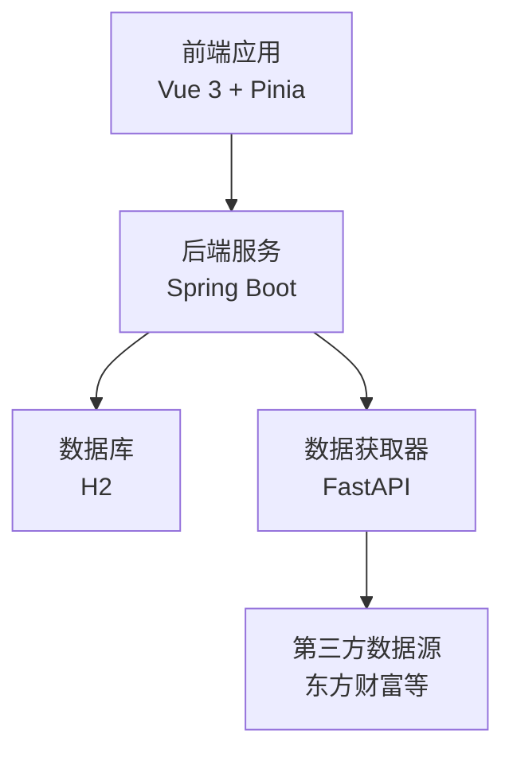
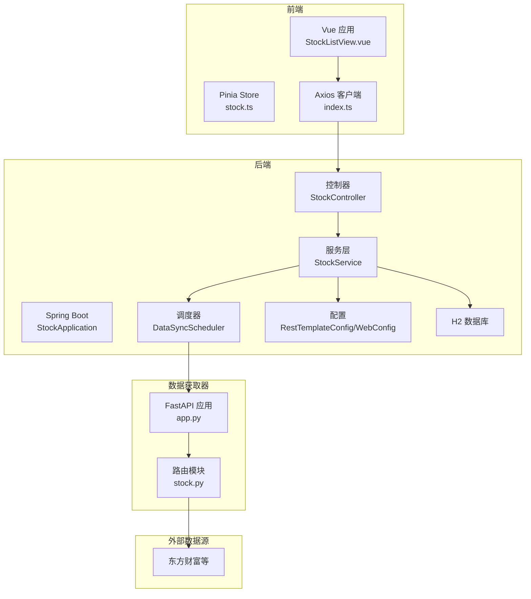
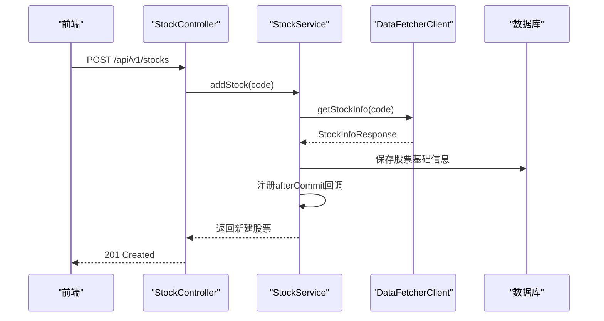
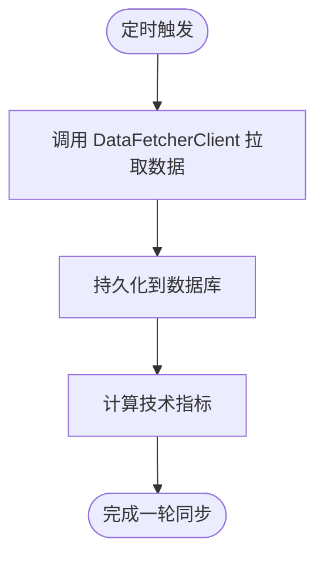
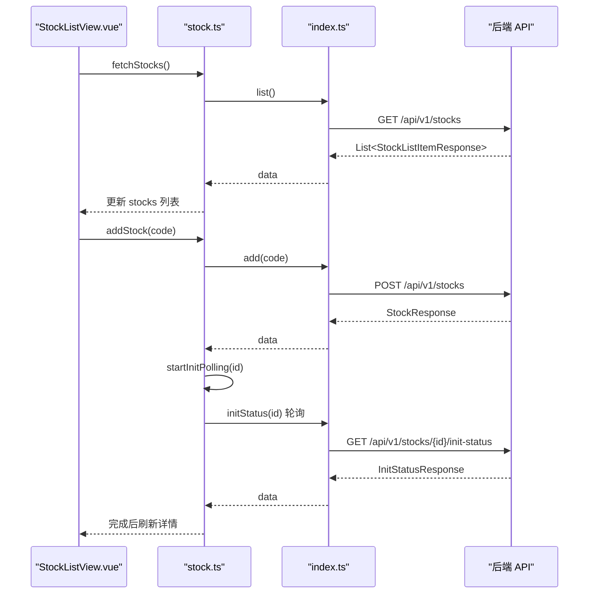
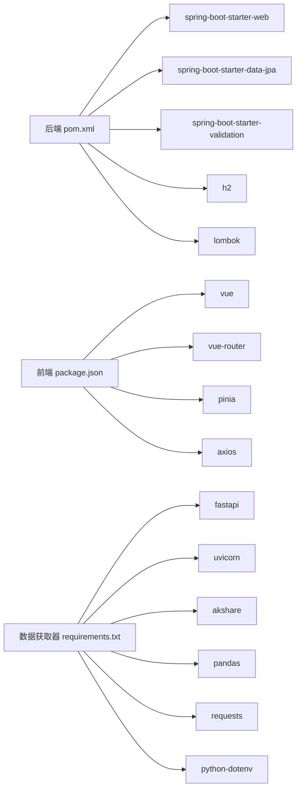

# 项目概述

<cite>
**本文档引用的文件**
- [StockApplication.java](file://backend/src/main/java/com/stock/StockApplication.java)
- [application.yml](file://backend/src/main/resources/application.yml)
- [StockController.java](file://backend/src/main/java/com/stock/controller/StockController.java)
- [StockService.java](file://backend/src/main/java/com/stock/service/StockService.java)
- [DataFetcherClient.java](file://backend/src/main/java/com/stock/client/DataFetcherClient.java)
- [DataSyncScheduler.java](file://backend/src/main/java/com/stock/scheduler/DataSyncScheduler.java)
- [RestTemplateConfig.java](file://backend/src/main/java/com/stock/config/RestTemplateConfig.java)
- [WebConfig.java](file://backend/src/main/java/com/stock/config/WebConfig.java)
- [pom.xml](file://backend/pom.xml)
- [app.py](file://data-fetcher/app.py)
- [stock.py](file://data-fetcher/routers/stock.py)
- [requirements.txt](file://data-fetcher/requirements.txt)
- [main.ts](file://frontend/src/main.ts)
- [index.ts](file://frontend/src/api/index.ts)
- [StockListView.vue](file://frontend/src/views/StockListView.vue)
- [stock.ts](file://frontend/src/stores/stock.ts)
- [package.json](file://frontend/package.json)
</cite>

## 目录
1. [简介](#简介)
2. [项目结构](#项目结构)
3. [核心组件](#核心组件)
4. [架构总览](#架构总览)
5. [详细组件分析](#详细组件分析)
6. [依赖关系分析](#依赖关系分析)
7. [性能考虑](#性能考虑)
8. [故障排除指南](#故障排除指南)
9. [结论](#结论)

## 简介
本项目是一个基于前后端分离架构的股票交易分析系统，旨在提供从数据采集、存储、计算到前端展示的全链路能力。系统通过 Spring Boot 后端提供 REST API 与数据库交互，使用 Python FastAPI 数据获取器对接第三方行情与财务数据源，前端采用 Vue 3 + Pinia 构建交互式可视化界面。系统支持股票管理（增删查）、实时与历史行情获取、资金流、财务与股东数据同步、技术指标计算与展示，并通过定时任务实现数据的自动化更新。

## 项目结构
项目采用三层分离设计：
- 后端（Spring Boot）：提供 REST 接口、业务逻辑、数据持久化与定时任务调度。
- 数据获取器（Python FastAPI）：封装第三方数据源接口，统一返回标准化数据。
- 前端（Vue 3）：通过 Axios 访问后端 API，使用 Pinia 状态管理，提供股票列表、详情与分析视图。

图表来源
- [main.ts:1-11](file://frontend/src/main.ts#L1-L11)
- [index.ts:1-18](file://frontend/src/api/index.ts#L1-L18)
- [StockApplication.java:1-16](file://backend/src/main/java/com/stock/StockApplication.java#L1-L16)
- [app.py:1-31](file://data-fetcher/app.py#L1-L31)

章节来源
- [main.ts:1-11](file://frontend/src/main.ts#L1-L11)
- [index.ts:1-18](file://frontend/src/api/index.ts#L1-L18)
- [StockApplication.java:1-16](file://backend/src/main/java/com/stock/StockApplication.java#L1-L16)
- [app.py:1-31](file://data-fetcher/app.py#L1-L31)

## 核心组件
- 后端入口与配置
  - 应用启动类启用调度与异步，配置跨域策略，定义数据源与 JPA 行为。
  - 配置文件定义后端端口、数据库路径、数据获取器地址、定时任务表达式等。
- 控制器层
  - 股票控制器提供增删改查与初始化状态查询接口，作为前端与业务层的桥梁。
- 服务层
  - 股票服务负责股票实体的新增、删除、列表与详情查询；在新增时调用数据获取器并触发异步初始化。
- 客户端层
  - 数据获取客户端封装对 Python 获取器的 REST 调用，统一异常处理。
- 调度层
  - 数据同步调度器按工作日与周期自动拉取 K 线、资金流、财务、股东、研究等数据，并计算技术指标。
- 前端
  - 通过 Axios 创建带超时与拦截器的 API 客户端，Pinia Store 管理股票列表、当前股票与初始化轮询状态，视图组件负责渲染与交互。

章节来源
- [StockApplication.java:1-16](file://backend/src/main/java/com/stock/StockApplication.java#L1-L16)
- [application.yml:1-28](file://backend/src/main/resources/application.yml#L1-L28)
- [StockController.java:1-57](file://backend/src/main/java/com/stock/controller/StockController.java#L1-L57)
- [StockService.java:1-243](file://backend/src/main/java/com/stock/service/StockService.java#L1-L243)
- [DataFetcherClient.java:1-126](file://backend/src/main/java/com/stock/client/DataFetcherClient.java#L1-L126)
- [DataSyncScheduler.java:1-238](file://backend/src/main/java/com/stock/scheduler/DataSyncScheduler.java#L1-L238)
- [RestTemplateConfig.java:1-18](file://backend/src/main/java/com/stock/config/RestTemplateConfig.java#L1-L18)
- [WebConfig.java:1-15](file://backend/src/main/java/com/stock/config/WebConfig.java#L1-L15)
- [StockListView.vue:1-102](file://frontend/src/views/StockListView.vue#L1-L102)
- [stock.ts:1-80](file://frontend/src/stores/stock.ts#L1-L80)
- [index.ts:1-18](file://frontend/src/api/index.ts#L1-L18)

## 架构总览
系统采用“前端渲染 + 后端服务 + 数据获取器”的三层架构。前端通过 Axios 发起请求到后端，后端通过 RestTemplate 调用 Python 数据获取器，获取器再访问第三方数据源。后端将标准化后的数据持久化至 H2 数据库，并通过定时任务进行增量同步与指标重算。

图表来源
- [main.ts:1-11](file://frontend/src/main.ts#L1-L11)
- [StockListView.vue:1-102](file://frontend/src/views/StockListView.vue#L1-L102)
- [stock.ts:1-80](file://frontend/src/stores/stock.ts#L1-L80)
- [index.ts:1-18](file://frontend/src/api/index.ts#L1-L18)
- [StockApplication.java:1-16](file://backend/src/main/java/com/stock/StockApplication.java#L1-L16)
- [StockController.java:1-57](file://backend/src/main/java/com/stock/controller/StockController.java#L1-L57)
- [StockService.java:1-243](file://backend/src/main/java/com/stock/service/StockService.java#L1-L243)
- [DataSyncScheduler.java:1-238](file://backend/src/main/java/com/stock/scheduler/DataSyncScheduler.java#L1-L238)
- [RestTemplateConfig.java:1-18](file://backend/src/main/java/com/stock/config/RestTemplateConfig.java#L1-L18)
- [WebConfig.java:1-15](file://backend/src/main/java/com/stock/config/WebConfig.java#L1-L15)
- [app.py:1-31](file://data-fetcher/app.py#L1-L31)
- [stock.py:1-246](file://data-fetcher/routers/stock.py#L1-L246)

## 详细组件分析

### 后端应用与配置
- 启动类启用调度与异步，确保定时任务与异步初始化可用。
- application.yml 定义后端端口、H2 数据库路径与控制台访问、数据获取器地址、定时任务表达式等。
- WebConfig 允许前端本地开发地址跨域访问后端 API。
- RestTemplateConfig 设置连接与读取超时，保障数据获取稳定性。

章节来源
- [StockApplication.java:1-16](file://backend/src/main/java/com/stock/StockApplication.java#L1-L16)
- [application.yml:1-28](file://backend/src/main/resources/application.yml#L1-L28)
- [WebConfig.java:1-15](file://backend/src/main/java/com/stock/config/WebConfig.java#L1-L15)
- [RestTemplateConfig.java:1-18](file://backend/src/main/java/com/stock/config/RestTemplateConfig.java#L1-L18)

### 股票控制器与服务
- 股票控制器提供新增、删除、列表、详情与初始化状态查询接口，简化前端调用。
- 股票服务在新增股票时：
  - 校验代码格式与唯一性；
  - 调用数据获取器获取基础信息与估值；
  - 将股票写入数据库；
  - 注册事务提交后的回调，触发异步初始化流程。

图表来源
- [StockController.java:29-34](file://backend/src/main/java/com/stock/controller/StockController.java#L29-L34)
- [StockService.java:94-163](file://backend/src/main/java/com/stock/service/StockService.java#L94-L163)
- [DataFetcherClient.java:26-29](file://backend/src/main/java/com/stock/client/DataFetcherClient.java#L26-L29)

章节来源
- [StockController.java:1-57](file://backend/src/main/java/com/stock/controller/StockController.java#L1-L57)
- [StockService.java:1-243](file://backend/src/main/java/com/stock/service/StockService.java#L1-L243)
- [DataFetcherClient.java:1-126](file://backend/src/main/java/com/stock/client/DataFetcherClient.java#L1-L126)

### 数据获取客户端与调度器
- DataFetcherClient 统一封装对 Python 获取器的 REST 调用，包括个股信息、K 线、分时、报价、批量报价、资金流、财务、股东、研究、估值与行业板块信息等。
- DataSyncScheduler 按工作日与周期执行：
  - 日线数据同步（每日收盘后）；
  - 资金流数据同步（每日收盘后）；
  - 日常数据同步（估值、研究报告）；
  - 周期性财务与股东数据同步；
  - 技术指标重算（工作日盘后）。

图表来源
- [DataSyncScheduler.java:54-82](file://backend/src/main/java/com/stock/scheduler/DataSyncScheduler.java#L54-L82)
- [DataSyncScheduler.java:84-117](file://backend/src/main/java/com/stock/scheduler/DataSyncScheduler.java#L84-L117)
- [DataSyncScheduler.java:119-161](file://backend/src/main/java/com/stock/scheduler/DataSyncScheduler.java#L119-L161)
- [DataSyncScheduler.java:163-214](file://backend/src/main/java/com/stock/scheduler/DataSyncScheduler.java#L163-L214)
- [DataSyncScheduler.java:216-236](file://backend/src/main/java/com/stock/scheduler/DataSyncScheduler.java#L216-L236)

章节来源
- [DataFetcherClient.java:1-126](file://backend/src/main/java/com/stock/client/DataFetcherClient.java#L1-L126)
- [DataSyncScheduler.java:1-238](file://backend/src/main/java/com/stock/scheduler/DataSyncScheduler.java#L1-L238)

### Python 数据获取器
- FastAPI 应用启用 CORS，注册多个路由模块（股票、基金、财务、股东、研报、龙虎榜、行业）。
- 路由模块封装对第三方数据源的请求，统一返回标准化数据结构，包含基础信息、K 线、分时、实时报价、批量报价等。

章节来源
- [app.py:1-31](file://data-fetcher/app.py#L1-L31)
- [stock.py:1-246](file://data-fetcher/routers/stock.py#L1-L246)

### 前端应用与状态管理
- main.ts 初始化 Vue 应用、Pinia 与路由。
- index.ts 创建 Axios 实例，设置基础 URL 与超时，并添加响应拦截器统一处理错误。
- StockListView.vue 展示股票列表，支持添加与删除，点击跳转详情。
- stock.ts Pinia Store 管理股票列表、当前股票、初始化状态轮询与加载状态。

图表来源
- [StockListView.vue:60-62](file://frontend/src/views/StockListView.vue#L60-L62)
- [stock.ts:12-28](file://frontend/src/stores/stock.ts#L12-L28)
- [stock.ts:43-58](file://frontend/src/stores/stock.ts#L43-L58)
- [index.ts:1-18](file://frontend/src/api/index.ts#L1-L18)
- [StockController.java:52-55](file://backend/src/main/java/com/stock/controller/StockController.java#L52-L55)

章节来源
- [main.ts:1-11](file://frontend/src/main.ts#L1-L11)
- [index.ts:1-18](file://frontend/src/api/index.ts#L1-L18)
- [StockListView.vue:1-102](file://frontend/src/views/StockListView.vue#L1-L102)
- [stock.ts:1-80](file://frontend/src/stores/stock.ts#L1-L80)

## 依赖关系分析
- 后端依赖
  - Spring Boot Web、Data JPA、Validation、H2、Lombok、HTML Sanitizer、测试框架。
  - Maven 插件配置 Java 版本与测试代理参数。
- 前端依赖
  - Vue 3、Vue Router、Pinia、Axios、Vite、TypeScript。
- 数据获取器依赖
  - FastAPI、Uvicorn、AkShare、Pandas、Requests、python-dotenv。

图表来源
- [pom.xml:23-55](file://backend/pom.xml#L23-L55)
- [package.json:11-25](file://frontend/package.json#L11-L25)
- [requirements.txt:1-7](file://data-fetcher/requirements.txt#L1-L7)

章节来源
- [pom.xml:1-103](file://backend/pom.xml#L1-L103)
- [package.json:1-27](file://frontend/package.json#L1-L27)
- [requirements.txt:1-7](file://data-fetcher/requirements.txt#L1-L7)

## 性能考虑
- 异步初始化：新增股票后通过事务提交回调触发初始化，避免阻塞主流程。
- 调度策略：根据市场交易时间安排定时任务，减少非交易时段的资源占用。
- 批量与限流：Python 获取器对批量报价限制数量，后端调度器在每次请求间加入延迟，降低第三方接口压力。
- 超时配置：后端 RestTemplate 设置连接与读取超时，提升稳定性。
- 前端轮询：初始化完成后停止轮询，避免不必要的请求。

## 故障排除指南
- 跨域问题：确认后端 WebConfig 对前端开发地址放行，或调整前端 Axios baseURL。
- 数据获取失败：检查数据获取器是否正常运行、网络连通性与第三方接口可用性。
- 定时任务未执行：确认后端已启用调度注解，检查 cron 表达式与服务器时区。
- 数据为空：核对股票代码格式与唯一性校验，确认数据获取器返回结构与字段映射一致。
- 前端错误提示：Axios 拦截器会输出响应数据或消息，便于定位问题。

章节来源
- [WebConfig.java:1-15](file://backend/src/main/java/com/stock/config/WebConfig.java#L1-L15)
- [index.ts:8-15](file://frontend/src/api/index.ts#L8-L15)
- [DataSyncScheduler.java:54-82](file://backend/src/main/java/com/stock/scheduler/DataSyncScheduler.java#L54-L82)
- [DataFetcherClient.java:112-124](file://backend/src/main/java/com/stock/client/DataFetcherClient.java#L112-L124)

## 结论
本项目通过清晰的前后端分离架构实现了从数据采集、存储、计算到展示的完整闭环。Spring Boot 提供稳定的服务与调度能力，Python 获取器负责对接第三方数据源，Vue 前端提供直观的交互体验。系统具备良好的扩展性与可维护性，适合进一步引入更多分析维度与可视化组件。